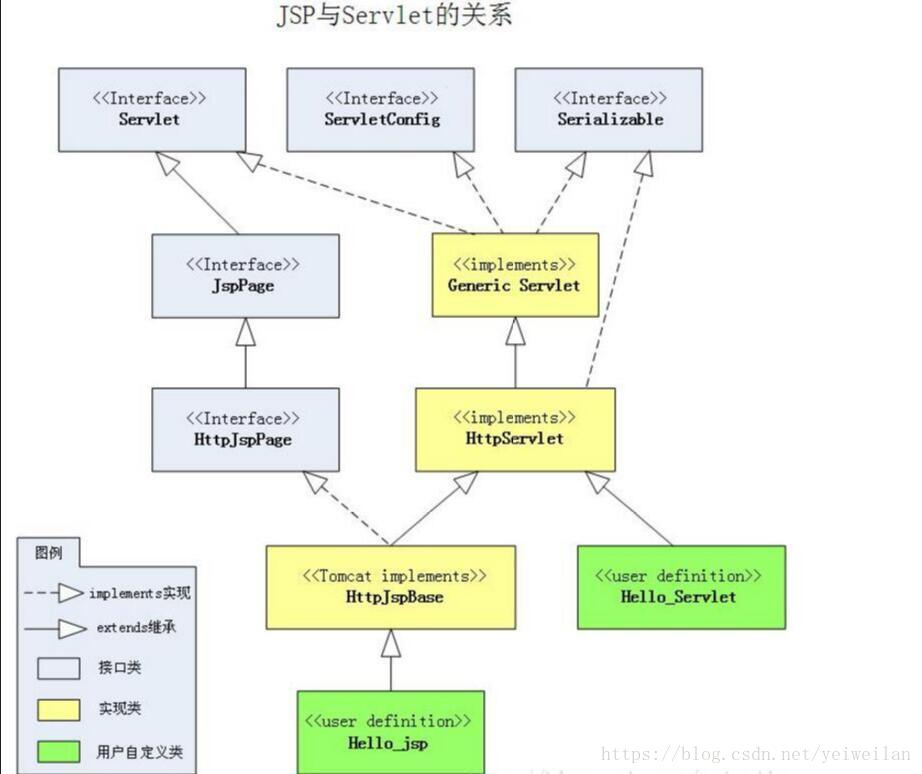

> jsp学习记录
2021/10/21 9:09:44 
#序章 JSP简介
##0.1 什么是JSP

1. JSP全称Java Server Pages，是一种动态网页开发技术。它使用JSP标签在HTML网页中插入Java代码。标签通常以<%开头以%>结尾

1. JSP是一种Java servlet，主要用于实现Java web应用程序的用户界面部分。网页开发者们通过结合HTML代码、XHTML代码、XML元素以及嵌入JSP操作和命令来编写JSP

1. JSP通过网页表单获取用户输入数据、访问数据库及其他数据源，然后动态地创建网页

1. JSP标签有多种功能，比如访问数据库、记录用户选择信息、访问JavaBeans组件等，还可以在不同的网页中传递控制信息和共享信息

##0.2 为什么使用JSP？
JSP程序与CGI程序有着相似的功能，但和CGI程序相比，JSP程序有如下优势：

1. 性能更加优越，因为JSP可以直接在HTML网页中动态嵌入元素而不需要单独引用CGI文件。

1. 服务器调用的是已经编译好的JSP文件，而不像CGI/Perl那样必须先载入解释器和目标脚本。

1. JSP 基于Java Servlet API，因此，JSP拥有各种强大的企业级Java API，包括JDBC，JNDI，EJB，JAXP等等。

1. JSP页面可以与处理业务逻辑的 Servlet 一起使用，这种模式被Java servlet 模板引擎所支持。

1. 最后，JSP是Java EE不可或缺的一部分，是一个完整的企业级应用平台。这意味着JSP可以用最简单的方式来实现最复杂的应用

##0.3 JSP的优势
以下列出了使用JSP带来的其他好处：

1. 与ASP相比：JSP有两大优势。首先，动态部分用Java编写，而不是VB或其他MS专用语言，所以更加强大与易用。第二点就是JSP易于移植到非MS平台上。

1. 与纯 Servlet 相比：JSP可以很方便的编写或者修改HTML网页而不用去面对大量的println语句。

1. 与SSI相比：SSI无法使用表单数据、无法进行数据库链接。

1. 与JavaScript相比：虽然JavaScript可以在客户端动态生成HTML，但是很难与服务器交互，因此不能提供复杂的服务，比如访问数据库和图像处理等等。

1. 与静态HTML相比：静态HTML不包含动态信息

##0.4 JSP与Servlet的关系

----------

#第一章 JSP结构

----------

1. 网络服务器需要一个 JSP 引擎，也就是一个容器来处理 JSP 页面。容器负责截获对 JSP 页面的请求。使用内嵌 JSP 容器的 Apache 来支持 JSP 开发。

1. JSP 容器与 Web 服务器协同合作，为JSP的正常运行提供必要的运行环境和其他服务，并且能够正确识别专属于 JSP 网页的特殊元素。

1. 下图显示了 JSP 容器和 JSP 文件在 Web 应用中所处的位置

##1.1 JSP处理

1.  就像其他普通的网页一样，您的浏览器发送一个 HTTP 请求给服务器。

1. Web 服务器识别出这是一个对 JSP 网页的请求，并且将该请求传递给 JSP 引擎。通过使用 URL或者 .jsp 文件来完成。

1. JSP 引擎从磁盘中载入 JSP 文件，然后将它们转化为 Servlet。这种转化只是简单地将所有模板文本改用 println() 语句，并且将所有的 JSP 元素转化成 Java 代码。

1. JSP 引擎将 Servlet 编译成可执行类，并且将原始请求传递给 Servlet 引擎。

1. Web 服务器的某组件将会调用 Servlet 引擎，然后载入并执行 Servlet 类。在执行过程中，Servlet 产生 HTML 格式的输出并将其内嵌于 HTTP response 中上交给 Web 服务器。

1. Web 服务器以静态 HTML 网页的形式将 HTTP response 返回到您的浏览器中。

1. 最终，Web 浏览器处理 HTTP response 中动态产生的HTML网页，就好像在处理静态网页一样。

1. 一般情况下，JSP 引擎会检查 JSP 文件对应的 Servlet 是否已经存在，并且检查 JSP 文件的修改日期是否早于 Servlet。如果 JSP 文件的修改日期早于对应的 Servlet，那么容器就可以确定 JSP 文件没有被修改过并且 Servlet 有效。这使得整个流程与其他脚本语言（比如 PHP）相比要高效快捷一些。

总的来说，JSP 网页就是用另一种方式来编写 Servlet 而不用成为 Java 编程高手。

除了解释阶段外，JSP 网页几乎可以被当成一个普通的 Servlet 来对待。

Tomcat会先将jsp文件转为java文件，然后再把java文件编译为class文件，最终执行的是class文件

##1.2 JSP 运行原理

1. 只有当客户端第一次请求JSP时，才需要将其转换、编译（所以第二次浏览同样的网页时，速度会更快）

1. Web服务器在遇到访问JSP网页的请求时，首先执行其中的程序片段，然后将执行结果以HTML格式返回给客户。

1. 程序片段可以操作数据库、重新定向网页以及发送email等等，这就是建立动态网站所需要的功能

1. 所有程序操作都在服务器端执行，网络上传送给客户端的仅是得到的结果，对客户浏览器的要求最低

###1.2.1 web服务器如何调用、执行一个JSP页面

1. 服务器首先将JSP翻译为一个Servlet，翻译过后的Servlet可以在\tomcat主目录\work\Catalina\localhost\工程名\org\apache\jsp目录下查看，这是服务器的工作目录

1. 打开相应的Servlet可以看到，翻译过后的servlet继承了org.apache.jasper.runtime.HttpJspBase，而HttpJspBase继承了HttpSerrvlet。其实JSP就是一个Servlet，访问jsp即访问一个Servlet。

###1.2.2 html排版标签是如何被发送
 
1. 继续浏览JSP翻译过后的Servlet，里面有个service方法_jspService(request, response)

1. JSP中的所有内容都会翻译到service方法中，html代码会通过out输出，同在Servlet中用out输出html语句一样，java部分代码会原封不动的搬到service方法中

###1.2.3 web服务器提供对象

1. web服务器在将JSP翻译成Servlet时，会在service方法中提供web开发所有的对象，这样在JSP页面中，我们就可以直接使用这些对象了，而不用再去获得。web服务器所提供的对象有：

        final javax.servlet.jsp.PageContext pageContext;         //pageContext对象
        javax.servlet.http.HttpSession session = null;           //session对象
        final javax.servlet.ServletContext application;          //application对象
        final javax.servlet.ServletConfig config;                //config对象
        javax.servlet.jsp.JspWriter out = null;                  //out对象
        final java.lang.Object page = this;                      //page对象
        javax.servlet.jsp.JspWriter _jspx_out = null;            
        javax.servlet.jsp.PageContext _jspx_page_context = null;

##1.3 JSP生命周期

JSP生命周期就是从创建到销毁的整个过程，类似于servlet生命周期，区别在于JSP生命周期还包括将JSP文件编译成servlet。

以下是JSP生命周期中所走过的几个阶段：

1. 编译阶段：

    servlet容器编译servlet源文件，生成servlet类

1. 初始化阶段：

    加载与JSP对应的servlet类，创建其实例，并调用它的初始化方法

1. 执行阶段：

    调用与JSP对应的servlet实例的服务方法

1. 销毁阶段：

    调用与JSP对应的servlet实例的销毁方法，然后销毁servlet实例

