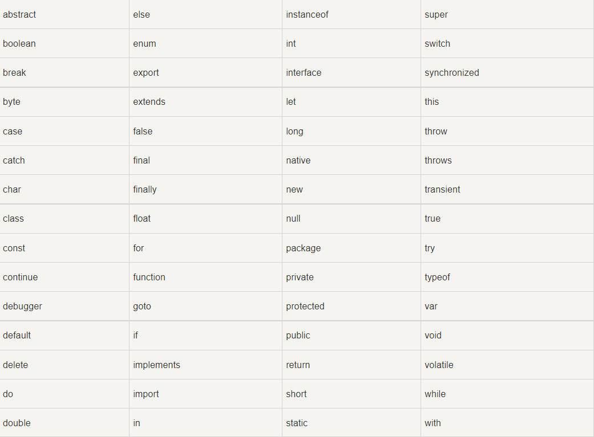
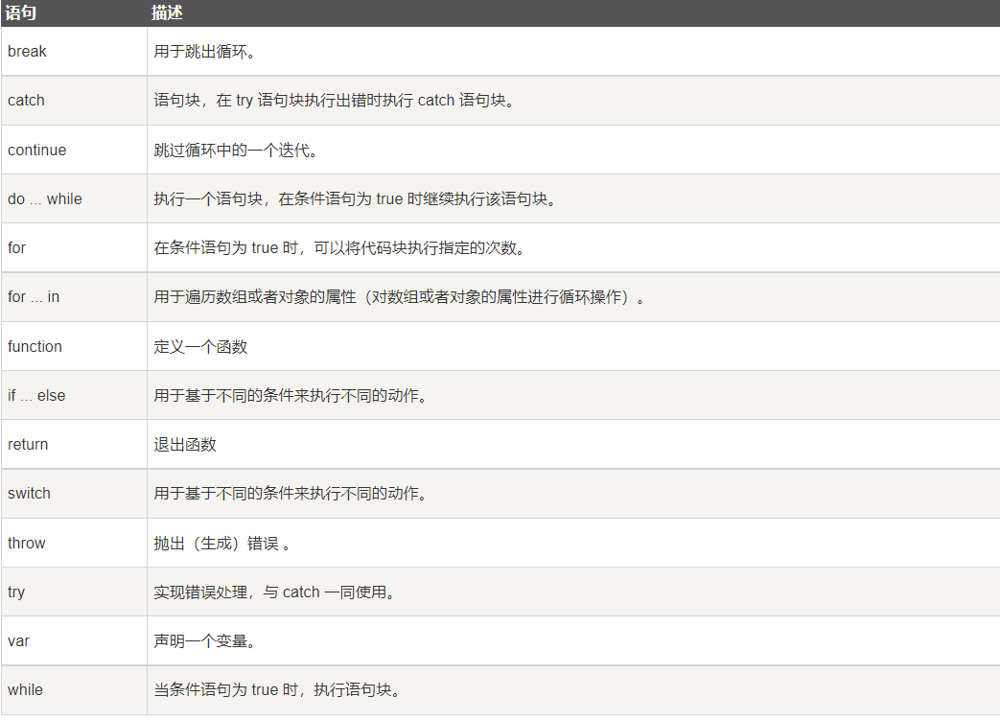

> JavaScript学习笔记 2021/10/18 10:39:46 
#序章 JavaScript入门介绍
##0.1 背景
>具体参照https://zhuanlan.zhihu.com/p/260479244

1. JavaScript 和 Java 是完全不同的语言，不论是概念还是设计。

1. JavaScript 在 1995 年由 Brendan Eich 发明，并于 1997 年成为一部 ECMA 标准。

1. ECMA-262 是其官方名称。ECMAScript 6 （发布于 2015 年）是最新的 JavaScript 版本。

##0.2 为何学习 JavaScript

1. JavaScript 是 web 开发者必学的三种语言之一

1. HTML 定义网页的内容

1. CSS 规定网页的布局

1. JavaScript 对网页行为进行编程

##0.3 JavaScript 是脚本语言

1. JavaScript 是一种轻量级的编程语言。

1. JavaScript 是可插入 HTML 页面的编程代码。

1. JavaScript 插入 HTML 页面后，可由所有的现代浏览器执行。

----------

#第一章 JavaScript基本语法

----------

##1.1 JavaScript的使用

1. HTML 中的脚本必须位于 `` 标签之间

1. 脚本可被放置在 HTML 页面的` <body>` 和 `<head>` 部分中

###1.1.1 `` 会告诉 JavaScript 在何处开始和结束

1. ` `之间的代码行包含了 JavaScript

1. 那些老旧的实例可能会在 `
        .
        .
        </body>
        </html>

###1.1.3 JavaScript 函数和事件

1. 上面例子中的 JavaScript 语句，会在页面加载时执行

1. 通常，我们需要在某个事件发生时执行代码，比如当用户点击按钮时

1. 如果我们把 JavaScript 代码放入函数中，就可以在事件发生时调用该函数

###1.1.4 在` <head> `或者 `<body>` 的JavaScript

1. 可以在 HTML 文档中放入不限数量的脚本

1. 脚本可位于 HTML 的` <body>` 或 `<head>` 部分中，或者同时存在于两个部分中

1. 通常的做法是把函数放入 `<head>` 部分中，或者放在页面底部。这样就可以把它们安置到同一处位置，不会干扰页面的内容。

####1.1.4.1 `<head>` 中的 JavaScript 函数
   例子：把一个 JavaScript 函数放置到 HTML 页面的 `<head>` 部分,该函数会在点击按钮时被调用：

        <!DOCTYPE html>
        <html>
        <head>
        
        </head>
        <body>
        <h1>我的 Web 页面</h1>
        
一个段落

        <button type="button" onclick="myFunction()">尝试一下</button>
        </body>
        </html>

####1.1.4.2 <body> 中的 JavaScript 函数

例子：我们把一个 JavaScript 函数放置到 HTML 页面的` <body> `部分，该函数会在点击按钮时被调用：

    <!DOCTYPE html>
    <html>
    <body>
    <h1>我的 Web 页面</h1>
    
一个段落

    <button type="button" onclick="myFunction()">尝试一下</button>
    
    </body>
    </html>

###1.1.5 外部的 JavaScript

1. 可以把脚本保存到外部文件中。外部文件通常包含被多个网页使用的代码

1. 外部 JavaScript 文件的文件扩展名是 .js

1. 使用外部文件，请在` 
        </body>
        </html>

##1.2 JavaScript 输出
###1.2.1 JavaScript 显示方案
JavaScript 能够以不同方式“显示”数据：

1. 使用 window.alert() 写入警告框

1. 使用 document.write() 写入 HTML 输出

1. 使用 innerHTML 写入 HTML 元素

1. 使用 console.log() 写入浏览器控制台

####1.2.1.1 使用 window.alert()
        <!DOCTYPE html>
        <html>
        <body>
        
        <h1>我的第一张网页</h1>
        
        
我的第一个段落

        
        
        
        </body>
        </html> 

####1.2.1.2 使用 document.write()
一般，出于测试目的，使用 document.write() 比较方便：

        实例
        <!DOCTYPE html>
        <html>
        <body>
        
        <h1>我的第一张网页</h1>
        
        
我的第一个段落

        
        
        
        </body>
        </html> 

注意：在 HTML 文档完全加载后使用 document.write() 将删除所有已有的 HTML 
####1.2.1.3 使用 innerHTML

1. 如需访问 HTML 元素，JavaScript 可使用 document.getElementById(id) 方法。

1. id 属性定义 HTML 元素。innerHTML 属性定义 HTML 内容：

        <!DOCTYPE html>
        <html>
        <body>
        
        <h1>我的第一张网页</h1>
        
        
我的第一个段落

        
        

        
        
        
        </body>
        </html> 

####1.2.1.4 使用 console.log()

- 在浏览器中，您可使用 console.log() 方法来显示数据。

- 请通过 F12 来激活浏览器控制台，并在菜单中选择“控制台”。

        <!DOCTYPE html>
        <html>
        <body>
        
        <h1>我的第一张网页</h1>
        
        
我的第一个段落

        
        
        
        </body>
        </html>

##1.3 JavaScript 语法
###1.3.1 JavaScript 字面量

在编程语言中，一般固定值称为字面量，如 3.14

1. 数字（Number）字面量 可以是整数或者是小数，或者是科学计数(e)

1. 字符串（String）字面量 可以使用单引号或双引号

1. 表达式字面量 用于计算：5 + 6

1. 数组（Array）字面量 定义一个数组：[40, 100, 1, 5, 25, 10]

1. 对象（Object）字面量 定义一个对象：{firstName:"John", lastName:"Doe", age:50, eyeColor:"blue"}

1. 函数（Function）字面量 定义一个函数：function myFunction(a, b) { return a * b;}

###1.3.2 JavaScript 变量
在编程语言中，变量用于存储数据值。

JavaScript 使用关键字 var或者let 、const来定义变量， 使用等号来为变量赋值

###1.3.3 JavaScript 操作符
JavaScript语言有多种类型的运算符：

|----|----|----|
|类型	|实例|	描述
|赋值，算术和位运算符	|=  +  -  *  /|	在 JS 运算符中描述
|条件，比较及逻辑运算符	|==  != <  > |	在 JS 比较运算符中描述

###1.3.4 JavaScript 关键字

###1.3.5 JavaScript 数据类型
JavaScript 有多种数据类型：数字，字符串，数组，对象等等：

|----|----|
|var length = 16|                    Number 通过数字字面量赋值
|var points = x * 10|                             Number 通过表达式字面量赋值
|var lastName = "Johnson"|                         String 通过字符串字面量赋值
|var cars = ["Saab", "Volvo", "BMW"]| Array  通过数组字面量赋值
|var person = {firstName:"John", lastName:"Doe"}|Object 通过对象字面量赋值

###1.3.6 JavaScript 函数
JavaScript 语句可以写在函数内，函数可以重复引用：

引用一个函数 = 调用函数(执行函数内的语句)

        function myFunction(a, b) {
            return a * b;                                // 返回 a 乘以 b 的结果
        }

###1.3.7 JavaScript 字母大小写

1. JavaScript 对大小写是敏感的。

1. 当编写 JavaScript 语句时，请留意是否关闭大小写切换键。

1. 函数 getElementById 与 getElementbyID 是不同的。

1. 同样，变量 myVariable 与 MyVariable 也是不同的

##1.4 JavaScript 语句
###1.4.1 分号 

-  分号用于分隔 JavaScript 语句。

- 通常我们在每条可执行的语句结尾添加分号。

- 使用分号的另一用处是在一行中编写多条语句

- 在 JavaScript 中，用分号来结束语句是可选的。

###1.4.2 JavaScript 代码块

- JavaScript 可以分批地组合起来。

- 代码块以左花括号开始，以右花括号结束。

- 代码块的作用是一并地执行语句序列。

###1.4.3 JavaScript 语句标识符
JavaScript 语句通常以一个 语句标识符 为开始，并执行该语句。

语句标识符是保留关键字不能作为变量名使用。

下表列出了 JavaScript 语句标识符 (关键字) ：

###1.4.4 空格
JavaScript 会忽略多余的空格。您可以向脚本添加空格，来提高其可读性

###1.4.5 对代码行进行折行
您可以在文本字符串中使用反斜杠对代码行进行换行。下面的例子会正确地显示：
        
        实例
        document.write("你好 \
        世界!");
        
        不过，您不能像这样折行：
        
        document.write \ 
        ("你好世界!");

----------
#第二章 变量与数据类型
----------
##2.1 JavaScript 变量

- 与代数一样，JavaScript 变量可用于存放值（比如 x=5）和表达式（比如 z=x+y）。

- 变量可以使用短名称（比如 x 和 y），也可以使用描述性更好的名称（比如 age, sum, totalvolume）。

- 变量必须以字母开头

- 变量也能以 $ 和 _ 符号开头（不过我们不推荐这么做）

- 变量名称对大小写敏感（y 和 Y 是不同的变量）

##2.2 JavaScript 数据类型
JavaScript 变量还能保存其他数据类型，比如文本值 (name="Bill Gates")。

在 JavaScript 中，类似 "Bill Gates" 这样一条文本被称为字符串。

###2.2.1 JavaScript 数据类型

- 值类型(基本类型)：字符串（String）、数字(Number)、布尔(Boolean)、对空（Null）、未定义（Undefined）、Symbol。

- 引用数据类型：对象(Object)、数组(Array)、函数(Function)

###2.2.2 JavaScript 拥有动态类型
JavaScript 拥有动态类型。这意味着相同的变量可用作不同的类型：

        var x;               // x 为 undefined
        var x = 5;           // 现在 x 为数字
        var x = "John";      // 现在 x 为字符串

###2.2.3 JavaScript 数字
JavaScript 只有一种数字类型。数字可以带小数点，也可以不带：

    var x1=34.00;      //使用小数点来写
    var x2=34;         //不使用小数点来写

###2.2.4 JavaScript 数组
下面的代码创建名为 cars 的数组：

        var cars=new Array();
        cars[0]="Saab";
        cars[1]="Volvo";
        cars[2]="BMW";
或者 (condensed array):

        var cars=new Array("Saab","Volvo","BMW");
###2.2.5 JavaScript 对象
对象由花括号分隔。在括号内部，对象的属性以名称和值对的形式 (name : value) 来定义。

属性由逗号分隔：

    var person={firstname:"John", lastname:"Doe", id:5566};

上面例子中的对象 (person) 有三个属性：firstname、lastname 以及 id

空格和折行无关紧要。声明可横跨多行：

        var person={
        firstname : "John",
        lastname  : "Doe",
        id        :  5566
        };
对象属性有两种寻址方式：

        name=person.lastname;
        name=person["lastname"];
##2.3 声明（创建） JavaScript 变量
在 JavaScript 中创建变量通常称为"声明"变量。

我们使用 var 关键词来声明变量：
    
    var carname;
 变量声明之后，该变量是空的（它没有值）。
    
  如需向变量赋值，请使用等号：
    
    carname="Volvo";
  不过，您也可以在声明变量时对其赋值：
    
    var carname="Volvo";

##2.4 Value = undefined
在计算机程序中，经常会声明无值的变量。未使用值来声明的变量，其值实际上是 undefined

在执行过以下语句后，变量 carname 的值将是 undefined：
    
    var carname; 

##2.5 var和let以及const无类型定义
> https://blog.csdn.net/weixin_51963144/article/details/120857164
###2.5.1 var与let的区别

1. var 声明的变量会挂载在 window 对象上，而 let 和 const 声明的变量不会

1. var 的这一特性，会造成 window 全局变量的污染。举例如下：

    var innerHeight = 100;
    console.log(window.innerHeight); // 打印结果：永远都是100  ==> 会覆盖 window 自带的 innerHeight 属性

1.  var 声明的变量存在变量提升，let 和 const 声明的变量不存在变量提升

1. var 声明不存在块级作用域，let 和 const 声明存在块级作用域

1. 同一作用域下，var 可以重复声明变量，let 和 const 不能重复声明变量

###2.5.2 const
1. const：一旦声明必须赋值；声明后不能再修改

1. 如果用 const 声明基本数据类型，则无法被修改；

1. 如果用 const 声明引用数据类型（即“对象”），这里的“无法被修改”指的是不能改变内存地址的引用；但对象里的内容是可以被修改的。

##2.6 undefined与NULL 
> https://zhuanlan.zhihu.com/p/382733928
###2.6.1 相同之处

- undefined与null是JavaScript的基本数据类型。

- JavaScript中基本数据类型就是存储简单的数据段，包括：underdifined，null，boolean，number和string。

- 引用类型就是可能由多个值构成的对象，包括：对象，数组，Map，Set等。

-  二者的布尔值均为false

###2.6.2 不同之处

####2.6.2.1 概念
undefined代表了不存在的值（nonexistence of value），null代表了无值（no value）

        let a;
        console.log(a);
        // undefined
        
        let b = null;
        console.log(b);

由上面的代码得知，undefined表示变量已经声明，但是没有赋值。因为它的值是不存在的，所以为undefined。

null表示变量已经声明，且变量赋值为null（为空），所以为结果为null

####2.6.2.2 比较
        null == 0
        //false
        null == ""
        //false
        null == false
        //false
        undefined == 0
        //false
        undefined == ""
        //false
        undefined == false
        //false
        undefined == null  //注意！注意！注意！
        //true
        undefined === null  //注意！注意！注意！
        //false

1. 区分（一）

        检查变量是否为空`age === null`
        检查变量是否未定义`age === undefined`
        在两种情况下`if( !age ){ ...do something...}`

1. 区分（二）

检查变量是否为空
        let age = null;
        typeof age;
        //object
        检查变量是否未定义
        let age;
        typeof age;
        //undefined

null是一个对象吗，为什么typeof age输出为null？

- null不是一个对象，尽管typeof age输出的是 Object

- 这是一个历史遗留问题，JS 的最初版本中使用的是 32 位系统

- 为了性能考虑使用低位存储变量的类型信息

- 000 开头代表是对象，null表示为全零，所以将它错误的判断为 Object 

###2.6.3 总结

1. 上面只是说了它们的表现。其实完全可以把 null 和 undefined分别看做独立的单个空集合。因为空集合没有任何元素属于它们本身，所以它们没有元素，并且永远没有元素和其相等，因此始终为false。

1. js 的null 和 undefined 相当于一个全集中有了两个子空集合，这是不正确的。但是，为了理解清楚，只能把 undefined 当做 null 的别名。空集合不等于空集合，所以 undefined 不等于 null

----------
#第三章 JavaScript 对象
----------
##3.1 JavaScript 对象

1. 在 JavaScript中，几乎所有的事物都是对象。

1. 对象也是一个变量，但对象可以包含多个值（多个变量），每个值以 name:value 对呈现。

##3.2 对象定义
你可以使用字符来定义和创建 JavaScript 对象:

    var person = {firstName:"John", lastName:"Doe", age:50, eyeColor:"blue"};

##3.3 对象属性

可以说 "JavaScript 对象是变量的容器"。

1. 但是，我们通常认为 "JavaScript 对象是键值对的容器"。

1. 键值对通常写法为 name : value (键与值以冒号分割)。

1. 键值对在 JavaScript 对象通常称为 对象属性。

1. JavaScript 对象是属性变量的容器。

对象键值对的写法类似于：

- PHP 中的关联数组

- Python 中的字典

- C 语言中的哈希表

- Java 中的哈希映射

- Ruby 和 Perl 中的哈希表

----------
#第四章 JavaScript 函数
----------

##4.1 函数定义
函数是由事件驱动的或者当它被调用时执行的可重复使用的代码块

##4.2 JavaScript 函数语法
函数就是包裹在花括号中的代码块，前面使用了关键词 function：

        function functionname()
        {
            // 执行代码
        }
当调用该函数时，会执行函数内的代码。

可以在某事件发生时直接调用函数（比如当用户点击按钮时），并且可由 JavaScript 在任何位置进行调用

##4.3 局部 JavaScript 变量
在 JavaScript 函数内部声明的变量（使用 var）是局部变量，所以只能在函数内部访问它。（该变量的作用域是局部的）。

您可以在不同的函数中使用名称相同的局部变量，因为只有声明过该变量的函数才能识别出该变量。

只要函数运行完毕，本地变量就会被删除。

##4.4 全局 JavaScript 变量

在函数外声明的变量是全局变量，网页上的所有脚本和函数都能访问它。

##4.5 JavaScript 变量的生存期
JavaScript 变量的生命期从它们被声明的时间开始。

局部变量会在函数运行以后被删除。

全局变量会在页面关闭后被删除。

##4.6 向未声明的 JavaScript 变量分配值
如果您把值赋给尚未声明的变量，该变量将被自动作为 window 的一个属性。

这条语句：

    carname="Volvo";
将声明 window 的一个属性 carname。

非严格模式下给未声明变量赋值创建的全局变量，是全局对象的可配置属性，可以删除

##4.7 JavaScript IIFE
###4.7.1 IIFE定义
IIFE: Immediately Invoked Function Expression，意为立即调用的函数表达式，也就是说，声明函数的同时立即调用这个函数。
对比一下，这是不采用IIFE时的函数声明和函数调用：

        
        function foo(){
          var a = 10;
          console.log(a);
        }
        foo();

下面是IIFE形式的函数调用：

        (function foo(){
          var a = 10;
          console.log(a);
        })();

函数的声明和IIFE的区别在于，在函数的声明中，我们首先看到的是function关键字，而IIFE我们首先看到的是左边的（。也就是说，使用一对（）将函数的声明括起来，使得JS编译器不再认为这是一个函数声明，而是一个IIFE，即需要立刻执行声明的函数。
两者达到的目的是相同的，都是声明了一个函数foo并且随后调用函数foo。

###4.7.2 为什么需要IIFE？

1. 如果只是为了立即执行一个函数，显然IIFE所带来的好处有限。

1. 实际上，IIFE的出现是为了弥补JS在scope方面的缺陷：JS只有全局作用域（global scope）、函数作用域（function scope），从ES6开始才有块级作用域（block scope）。

1. 那么如何实现作用域的隔离呢？在JS中，只有function，只有function，只有function才能实现作用域隔离，因此如果要将一段代码中的变量、函数等的定义隔离出来，只能将这段代码封装到一个函数中。

1. JS迫于作用域控制手段的贫乏，我们也经常看到只使用一次的函数：这通常的目的是为了隔离作用域了！既然只使用一次，那么立即执行好了！既然只使用一次，函数的名字也省掉了！这就是IIFE的由来。

###4.7.3 IIFE的常见形式
根据最后表示函数执行的一对（）位置的不同，常见的IIFE写法有两种，示例如下：

1. IIFE写法一

        (function foo(){
          var a = 10;
          console.log(a);
        })();

1. IIFE写法二

        (function foo(){
          var a = 10;
          console.log(a);
        }());

这两种写法效果完全一样，使用哪种写法取决于你的风格，貌似第一种写法比较常见。
其实，IIFE不限于（）的表现形式，但是还是遵守约定俗成的习惯比较好。

###4.7.4 IIFE的函数名和参数

- 根据《You Don’t Know JS:Scope & Clouses》的说法，尽量避免使用匿名函数。

- 但是IIFE确实只执行一次，给IIFE起个名字有些画蛇添足了。如果非要给IIFE起个名字，干脆就叫IIFE好了。

- IIFE可以带（多个）参数，比如下面的形式：

        var a = 2;
        (function IIFE(global){
            var a = 3;
            console.log(a); // 3
            console.log(global.a); 
        })(window);

        console.log(a); // 25 IIFE构造单例模式

###4.7.5小结
IIFE的目的是为了隔离作用域，防止污染全局命名空间，严格来讲，IIFE并不是闭包，因为它并不满足函数成为闭包的三个条件。但一般地，人们认为IIFE就是闭包，毕竟闭包有多个定义。本文将详细介绍IIFE的实现和用途

ES6以后也许有更好的访问控制手段（模块？类？），有待研究

----------

#第五章  JavaScript 类型转换

----------
##5.1 JavaScript 数据类型

1. 在 JavaScript 中有 6 种不同的数据类型：
        
        string
        number
        boolean
        object
        function
        symbol

1. 3 种对象类型：

        Object
        Date
        Array

1. 2 个不包含任何值的数据类型：

        null
        undefined

##5.2 typeof 操作符
你可以使用 typeof 操作符来查看 JavaScript 变量的数据类型

        typeof "John"                 // 返回 string
        typeof 3.14                   // 返回 number
        typeof NaN                    // 返回 number
        typeof false                  // 返回 boolean
        typeof [1,2,3,4]              // 返回 object
        typeof {name:'John', age:34}  // 返回 object
        typeof new Date()             // 返回 object
        typeof function () {}         // 返回 function
        typeof myCar                  // 返回 undefined (如果 myCar 没有声明)
        typeof null                   // 返回 object

请注意：

- NaN 的数据类型是 number

- 数组(Array)的数据类型是 object

- 日期(Date)的数据类型为 object

- null 的数据类型是 object

- 未定义变量的数据类型为 undefined

- 如果对象是 JavaScript Array 或 JavaScript Date ，我们就无法通过 typeof 来判断他们的类型，因为都是返回 object

##5.3 constructor 属性
constructor 属性返回所有 JavaScript 变量的构造函数：

        "John".constructor                 // 返回函数 String()  { [native code] }
        (3.14).constructor                 // 返回函数 Number()  { [native code] }
        false.constructor                  // 返回函数 Boolean() { [native code] }
        [1,2,3,4].constructor              // 返回函数 Array()   { [native code] }
        {name:'John', age:34}.constructor  // 返回函数 Object()  { [native code] }
        new Date().constructor             // 返回函数 Date()    { [native code] }
        function () {}.constructor         // 返回函数 Function(){ [native code] }

##5.4 JavaScript 类型转换
JavaScript 变量可以转换为新变量或其他数据类型：

1. 通过使用 JavaScript 函数

1. 通过 JavaScript 自身自动转换

###5.4.1 将数字转换为字符串

1. 全局方法 String() 可以将数字转换为字符串。

1. 该方法可用于任何类型的数字，字母，变量，表达式：

1. Number 方法 toString() 也是有同样的效果。

        x.toString()
        (123).toString()
        (100 + 23).toString()

----------

#第六章 JavaScript 正则表达式

----------
##6.1 什么是正则表达式？ 

1. 正则表达式（英语：Regular Expression，在代码中常简写为regex、regexp或RE）使用单个字符串来描述、匹配一系列符合某个句法规则的字符串搜索模式。

1. 搜索模式可用于文本搜索和文本替换。

1. 正则表达式是由一个字符序列形成的搜索模式。

1. 正则表达式可用于所有文本搜索和文本替换的操作

##6.2 语法
        /正则表达式主体/修饰符(可选)
其中修饰符是可选的。

        var patt = /runoob/i
解析：

- /runoob/i  是一个正则表达式。

- runoob  是一个正则表达式主体 (用于检索)。

- i  是一个修饰符 (搜索不区分大小写)

##6.3 使用字符串方法
在 JavaScript 中，正则表达式通常用于两个字符串方法 : search() 和 replace()。

- search() 方法 用于检索字符串中指定的子字符串，或检索与正则表达式相匹配的子字符串，并返回子串的起始位置。

- replace() 方法 用于在字符串中用一些字符替换另一些字符，或替换一个与正则表达式匹配的子串

##6.4 正则表达式修饰符
修饰符 可以在全局搜索中不区分大小写:

|----|----|
|修饰符|	描述
|i|	执行对大小写不敏感的匹配
|g|	执行全局匹配（查找所有匹配而非在找到第一个匹配后停止）
|m|	执行多行匹配|

##6.5 正则表达式模式
方括号用于查找某个范围内的字符：

|----|----|
|表达式|	描述
|[abc]|	查找方括号之间的任何字符。
|[0-9]|	查找任何从 0 至 9 的数字。
    (x|y)	查找任何以 | 分隔的选项

##6.6元字符是拥有特殊含义的字符：
|----|----|
|元字符|	描述
|\d	|查找数字
|\s|	查找空白字符
|\b|	匹配单词边界
|\uxxxx	|查找以十六进制数 xxxx 规定的 Unicode 字符

##6.7 量词:
|----|----|
|量词|	描述
|n+|	匹配任何包含至少一个 n 的字符串
|n*	|匹配任何包含零个或多个 n 的字符串
|n?|	匹配任何包含零个或一个 n 的字符串

##6.8 使用 RegExp 对象

1. 在 JavaScript 中，RegExp 对象是一个预定义了属性和方法的正则表达式对象。

1. 使用 test():  test() 方法是一个正则表达式方法。

1. test() 方法用于检测一个字符串是否匹配某个模式，如果字符串中含有匹配的文本，则返回 true，否则返回 false。

##6.9 使用 exec()

1. exec() 方法是一个正则表达式方法。

1. exec() 方法用于检索字符串中的正则表达式的匹配。

1. 该函数返回一个数组，其中存放匹配的结果。如果未找到匹配，则返回值为 null

----------
#第七章 JavaScript 严格模式(use strict)

----------

##7.1 JavaScript 严格模式（strict mode）
 

1. JavaScript 严格模式（strict mode）即在严格的条件下运行。

1. 使用 "use strict" 指令

1. "use strict" 指令在 JavaScript 1.8.5 (ECMAScript5) 中新增。

1. 它不是一条语句，但是是一个字面量表达式，在 JavaScript 旧版本中会被忽略。

1. "use strict" 的目的是指定代码在严格条件下执行。

1. 严格模式下你不能使用未声明的变量

##7.2 为什么使用严格模式:

- 消除Javascript语法的一些不合理、不严谨之处，减少一些怪异行为;

- 消除代码运行的一些不安全之处，保证代码运行的安全；

- 提高编译器效率，增加运行速度；

- 为未来新版本的Javascript做好铺垫。

- "严格模式"体现了Javascript更合理、更安全、更严谨的发展方向

##7.3 保留关键字
为了向将来Javascript的新版本过渡，严格模式新增了一些保留关键字：

        implements
        interface
        let
        package
        private
        protected
        public
        static
        yield

----------
#第八章 this 

----------
##8.1  JavaScript 中 this 的概念

JavaScript 中 this 不是固定不变的，它会随着执行环境的改变而改变。

- 在方法中，this 表示该方法所属的对象。

- 如果单独使用，this 表示全局对象。

- 在函数中，this 表示全局对象。

- 在函数中，在严格模式下，this 是未定义的(undefined)。

- 在事件中，this 表示接收事件的元素。

- 类似 call() 和 apply() 方法可以将 this 引用到任何对象。

- 面向对象语言中 this 表示当前对象的一个引用。

##8.2 方法中的 this

1. 在对象方法中， this 指向调用它所在方法的对象。

1. 在上面一个实例中，this 表示 person 对象。

1. fullName 方法所属的对象就是 person

##8.3 事件中的 this
在 HTML 事件句柄中，this 指向了接收事件的 HTML 元素

##8.4 显式函数绑定

1. 在 JavaScript 中函数也是对象，对象则有方法，apply 和 call 就是函数对象的方法。

1. 这两个方法异常强大，他们允许切换函数执行的上下文环境（context），即 this 绑定的对象

----------
#第九章 void
----------
##9.1 javascript:void(0) 含义

1. javascript:void(0) 中最关键的是 void 关键字
 

1. void 是 JavaScript 中非常重要的关键字

1. 该操作符指定要计算一个表达式但是不返回值

##9.2 href="#"与href="javascript:void(0)"的区别

- 包含了一个位置信息，默认的锚是#top 也就是网页的上端。

- 而javascript:void(0), 仅仅表示一个死链接。

- 在页面很长的时候会使用 # 来定位页面的具体位置，格式为：# + id

- 如果你要定义一个死链接请使用 javascript:void(0) 

----------

#第十章 JavaScript 异步编程

----------
##10.1 同步和异步的概念

1. 异步（Asynchronous, async）是与同步（Synchronous, sync）相对的概念。

1. 程序的运行是同步的（同步不意味着所有步骤同时运行，而是指步骤在一个控制流序列中按顺序执行）

1. 异步的概念则是不保证同步的概念，也就是说，一个异步过程的执行将不再与原有的序列有顺序关系

1. 同步按你的代码顺序执行，异步不按照代码顺序执行，异步的执行效率更高。

1. 异步就是从主线程发射一个子线程来完成任务

##10.2 什么时候用异步编程

1. 当一个事件没有结束时，界面将无法处理其他请求。

1. 读取一个大文件或者发出一个网络请求。因为子线程独立于主线程，所以即使出现阻塞也不会影响主线程的运行。

2. 但是子线程有一个局限：一旦发射了以后就会与主线程失去同步，我们无法确定它的结束，

4. 如果结束之后需要处理一些事情，比如处理来自服务器的信息，我们是无法将它合并到主线程中去的。

为了解决这个问题，JavaScript 中的异步操作函数往往通过回调函数来实现异步任务的结果处理。

##10.3 回调函数

- 回调函数就是一个函数，它是在我们启动一个异步任务的时候就告诉它：

- 等你完成了这个任务之后要干什么。

- 这样一来主线程几乎不用关心异步任务的状态了，他自己会善始善终

例子：

        function print() {
            document.getElementById("demo").innerHTML="RUNOOB!";
        }
        setTimeout(print, 3000);

- 这段程序中的 setTimeout 就是一个消耗时间较长（3 秒）的过程，

- 它的第一个参数是个回调函数，

- 第二个参数是毫秒数，

- 这个函数执行之后会产生一个子线程，子线程会等待 3 秒，然后执行回调函数 "print"，在命令行输出 "Time out"。

##10.4  异步 AJAX

1. 除了 setTimeout 函数以外，异步回调广泛应用于 AJAX 编程

1. XMLHttpRequest 常常用于请求来自远程服务器上的 XML 或 JSON 数据。一个标准的 XMLHttpRequest 对象往往包含多个回调

----------

#第十一章 闭包

----------

##10.1 古老定义

1. 闭包(closure)，是指函数变量可以保存在函数作用域内，因此看起来是函数将变量“包裹”了起来

1. 那这样说来，包含变量的函数就是闭包
        
        //按照古老定义，包含变量n的函数foo就是闭包
        function foo() {
            var n = 0;
        }
        console.log(n)//Uncaught ReferenceError: n is not defined

##10.2 计数器困境

1. 设想下如果你想统计一些数值，且该计数器在所有函数中都是可用的。

1. 你可以使用全局变量，函数设置计数器递增：

        var counter = 0;
         
        function add() {
           return counter += 1;
        }
         
        add();
        add();
        add();
         
        // 计数器现在为 3

##10.3 JavaScript 内嵌函数

1. 所有函数都能访问全局变量。  

1. 实际上，在 JavaScript 中，所有函数都能访问它们上一层的作用域。

1. JavaScript 支持嵌套函数。嵌套函数可以访问上一层的函数变量。

1. 该实例中，内嵌函数 plus() 可以访问父函数的 counter 变量：

        function add() {
            var counter = 0;
            function plus() {counter += 1;}
            plus();    
            return counter; 
        }
       add();
        add();
        add();

1. 如果我们能在外部访问 plus() 函数，这样就能解决计数器的困境。

1. 我们同样需要确保 counter = 0 只执行一次。

1. 我们需要闭包
