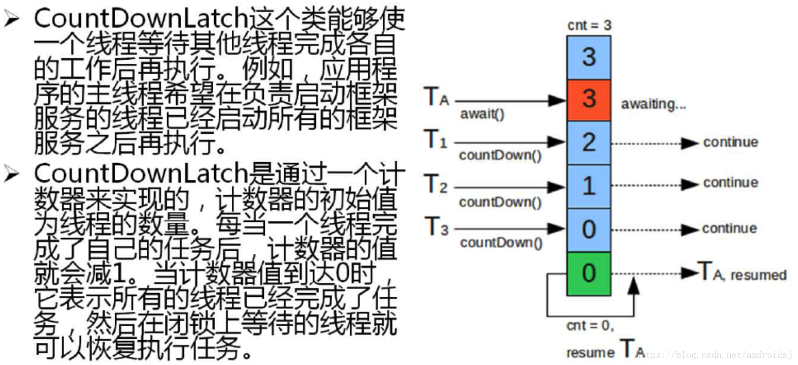

>Java.util.Concurrent包学习

>https://github.com/MrJian8/ThreadDemo

>https://www.bilibili.com/video/BV1zb411M7NQ

#序章 JUC 简介

1. java.util.concurrent开发包:

    
    -  传统线程编程模型之中为防止死锁等现象的出现(wait()、notify()、
       synchronized)时往往会考虑性能、公平性、资源管理等问题，这样加重了程序开发人员的负担；
    
    
    - Java5.0添加了一个新的java.util.concurrent开发包(简称JUC)。
       利用此包进行的多线程编程将有效的减少竞争条件(race conditions)和死锁线程。

1.  java.util.concurrent核心类:

    
    
    1. Executor：具有Runnable任务的执行者。
    
    
    1. ExecutorService：一个线程池管理者，其实现类有多种，我会介绍一部分，我们能把Runnable,Callable提交到池中让其调度。
    
    
    1. Semaphore：一个计数信号量。
    
    
    1. ReentrantLock：一个可重入的互斥锁定Lock，功能类似synchronized，但要强大的多。
    
    
    1. Future：是与Runnable,Callable进行交互的接口，比如一个线程执行结束后取返回的结果等，还提供了cancel终止线程,可以表示异步计算的结果。
    
    
    1. BlockingQueue：阻塞队列。
    
    
    1. CompletionService：ExecutorService的扩展，可以获得线程执行结果的。
    
    
    1. CountDownLatch：一个同步辅助类，在完成一组正在其他线程中执行的操作之前，它允许一个或多个线程一直等待。
    
    
    1. CyclicBarrier：一个同步辅助类，它允许一组线程互相等待，直到到达某个公共屏障点。
    
    
    1. ScheduldExecutorService：一个ExecutorService，可安排在给定的延迟后运行或定期执行的命令。

##0.1 进程与线程

- 进程（Process） 是计算机中的程序关于某数据集合上的一次运行活动，是系统进行资源分配和调度的基本单位，是操作系统结构的基础。 在当代面向线程设计的计算机结构中，进程是线程的容器。程序是指令、数据及其组织形式的描述，进程是程序的实体。

- 线程（thread） 是操作系统能够进行运算调度的最小单位。它被包含在进程之中，是进程中的实际运作单位。一条线程指的是进程中一个单一顺序的控制流，一个进程中可以并发多个线程，每条线程并行执行不同的任务。

总结来说:

- 进程：指在系统中正在运行的一个应用程序；程序一旦运行就是进程；进程——资源分配的最小单位。

- 线程：系统分配处理器时间资源的基本单元，或者说进程之内独立执行的一个单元执行流。线程——程序执行的最小单位。

###0.1.1 创建线程的方式

1. 继承 Thread
    首先是继承 Thread，创建线程最经典的方法:

        public class MyThread extends Thread {
        
            @Override
            public void run() {
                System.out.println("通过集成 Thread 类实现线程");
            }
        
        }
        
        // 如何使用
        new MyThread().start()

1. 实现 Runnable

        public class MyRunnable implements Runnable {
        
            @Override
            public void run() {
                System.out.println("通过实现 Runnable 方式实现线程");
            }
        
        }
        
        // 使用
        // 1、创建MyRunnable实例
        MyRunnable runnable = new MyRunnable();
        //2.创建Thread对象
        //3.将MyRunnable放入Thread实例中
        Thread thread = new Thread(runnable);
        //4.通过线程对象操作线程(运行、停止)
        thread.start();

1. Callable接口和Future接口的使用
    
        public class CreateThreadTest {
        public static void main(String[] args) {
            CallableTest callableTest = new CallableTest();
            FutureTask<Integer> futureTask = new FutureTask<>(callableTest);
            new Thread(futureTask).start();
            try {
                System.out.println("子线程的返回值: " + futureTask.get());
            } catch (InterruptedException e) {
                e.printStackTrace();
            } catch (ExecutionException e) {
                e.printStackTrace();
            }
        }
         }
    
        class CallableTest implements Callable{
        
            @Override
            public Integer call() throws Exception {
                int sum = 0;
                for (int i = 1; i < 101; i++) {
                    sum += i;
                }
                System.out.println(Thread.currentThread().getName() + " is running: " + sum);
                return sum;
            }
        }

1. 线程池创建线程

        // 10 是核心线程数量
        ExecutorService service = Executors.newFixedThreadPool(10);
    点进去 newFixedThreadPool 源码，在 IDEA 中调试，可以发现它的调用链是这样的：
        
        Executors.newFixedThreadPool(10) --> new ThreadPoolExecutor(一堆参数) --> Executors.defaultThreadFactory()

    可以发现最终还是调用了 Executors.defaultThreadFactory() 方法，而这个方法的源码是这样的：

            static class DefaultThreadFactory implements ThreadFactory {
                // 线程池序号
                static final AtomicInteger poolNumber = new AtomicInteger(1);
                // 线程序号
                final AtomicInteger threadNumber = new AtomicInteger(1);
                // 线程组
                final ThreadGroup group;
                // 线程池前缀
                final String namePrefix;
            
                DefaultThreadFactory() {
                    SecurityManager s = System.getSecurityManager();
                    group = (s != null) ? s.getThreadGroup() :
                            Thread.currentThread().getThreadGroup();
                    namePrefix = "pool-" +
                            poolNumber.getAndIncrement() +
                            "-thread-";
                }
            
                /**
                 * 重点方法
                 * @param r
                 * @return
                 */
                @Override
                public Thread newThread(Runnable r) {
                    Thread t = new Thread(group, r,
                            namePrefix + threadNumber.getAndIncrement(),
                            0);
                    // 是否是守护线程
                    if (t.isDaemon()) {
                        t.setDaemon(false);
                    }
                    // 设置优先级
                    if (t.getPriority() != Thread.NORM_PRIORITY) {
                        t.setPriority(Thread.NORM_PRIORITY);
                    }
                    return t;
                }
            }

1. Timer 创建

        public class MyTimer {
        
            public static void main(String[] args) {
                timer();
            }
        
            /**
             * 指定时间 time 执行 schedule(TimerTask task, Date time)
             */
            public static void timer() {
                Timer timer = new Timer();
                // 设定指定的时间time,此处为2000毫秒
                timer.schedule(new TimerTask() {
                    public void run() {
                        System.out.println("执行定时任务");
                    }
                }, 2000);
            }
        
        }

        如代码所示，Timer 定时器在两秒之后执行一些任务，它也确实创建了线程，但是深入源码：

        private final TimerThread thread = new TimerThread(queue);
        
        public Timer() {
            this("Timer-" + serialNumber());
        }
        
        public Timer(String name) {
            thread.setName(name);
            thread.start();
        }
        
        class TimerThread extends Thread {
            // 省略内部方法
        }
        注意到 TimerThread ，它还是继承于 Thread ，所以 Timer 创建线程最后又绕回到最开始说的两种方式了。

###0.1.2 创建线程的三种方式的对比

1. 实现Runnable/Callable接口相比继承Thread类的优势

    - 适合多个线程进行资源共享
    - 可以避免java中单继承的限制
    - 增加程序的健壮性，代码和数据独立

1. Callable和Runnable的区别
    - Callable重写的是call()方法，Runnable重写的方法是run()方法
    - call()方法执行后可以有返回值，run()方法没有返回值
    - call()方法可以抛出异常，run()方法不可以
     - 运行Callable任务可以拿到一个Future对象，表示异步计算的结果 。通过Future对象可以了解任务执行情况，可取消任务的执行，还可获取执行结果

##0.2 线程的状态
##0.2.1 线程状态枚举类
Thread.State

     public enum State{
         //新建状态
         NEW;
         //就绪状态
         RUNNABLE;
         //阻塞状态
         BLOCKED;
         //等待状态
         WAITING;
         //超时等待
         TIME_WAITING;
         //终止状态
         TERMINATED;
    
     }

1. NEW（新建）： 调用 new() 创建一个线程后，处于新建状态。此时该线程仅有 Java 虚拟机为其分配内存并初始化其成员变量，还没有表现出任何线程的动态特征。

1. RUNNABLE（就绪）： 当线程对象调用 start() 后，线程处于就绪状态。Java 虚拟机为其创建方法调用栈和程序计数器，等待JVM里的线程调度器调度。一旦获得 cup，则执行 run() 方法中的执行体。

1. BLOCKED（阻塞）： 线程执行过程中被中断，等待某个监视器锁的线程。当发生如下情况时，线程会进入阻塞状态：
    >线程调用了 sleep() 方法主动放弃占用的cpu资源；
    >
    >线程调用了一个阻塞式 IO 方法，在该方法返回之前，该线程被阻塞；
    >
    >线程试图获取一个同步监视器，但该同步监视器正被其他线程使用；
    >
    >线程正在等待某一个通知；
    >
    >程序调用了线程 susoend() 方法将该线程挂起。该方法容易造成死锁，不推荐使用
1. WAITING（等待）： 一个正在等待另一个线程执行的某一个操作的线程处于这一状态。

1. TIME_WAITING（超时等待）： 一个正在限时等待另一个线程执行某一动作的线程处于这一状态。

1. TERMINATED（终止）： 线程完成执行进入终止状态。

**线程5种状态转换关系如下图所示：**

##0.2.2 wait/sleep 的区别  

1. sleep 是 Thread 的静态方法，wait 是 Object 的方法，任何对象实例都能调用。

1. sleep 不会释放锁，它也不需要占用锁。wait 会释放锁，但调用它的前提是当前线程占有锁(即代码要在 synchronized 中),并需要通过 notify() / notifyAll() 重新获取锁。

2. sleep() 可以在任何地方调用，而 wait() 只能在同步方法或同步代码块中调用。

1. 它们都可以被 interrupted 方法中断。

1. wait放开手去睡,放开手里的锁；wait是Object类中的方法

1. sleep握紧手去睡,醒了手里还有锁 ;sleep是Thread中的方法

##0.3 并发与并行
###0.3.1 串行模式

- 串行表示所有任务都一一按先后顺序进行。串行意味着必须先装完一车柴才能运送这车柴，只有运送到了，才能卸下这车柴，并且只有完成了这整个三个步骤，才能进行下一个步骤。

- 串行是一次只能取得一个任务，并执行这个任务。

###0.3.2 并行模式

- 并行意味着可以同时取得多个任务，并同时去执行所取得的这些任务。

- 并行模式相当于将长长的一条队列，划分成了多条短队列，所以并行缩短了任务队列的长度。

- 并行的效率从代码层次上强依赖于多进程/多线程代码，从硬件角度上则依赖于多核 CPU。

###0.3.3 并发

- 并发(concurrent)指的是多个程序可以同时运行的现象，更细化的是多进程可以同时运行或者多指令可以同时运行。

- 并发的重点在于它是一种现象, 并发描述的是多进程同时运行的现象。但实际上，对于单核心 CPU 来说，同一时刻只能运行一个线程。所以，这里的"同时运行"表示的不是真的同一时刻有多个线程运行的现象，这是并行的概念，而是提供一种功能让用户看来多个程序同时运行起来了，但实际上这些程序中的进程不是一直霸占 CPU 的，而是执行一会停一会。

- 要解决大并发问题，通常是将大任务分解成多个小任务, 由于操作系统对进程的调度是随机的，所以切分成多个小任务后，可能会从任一小任务处执行。

这可能会出现一些现象：

- 可能出现一个小任务执行了多次，还没开始下个任务的情况。这时一般会采用队列或类似的数据结构来存放各个小任务的成果。

- 可能出现还没准备好第一步就执行第二步的可能。这时，一般采用多路复用或异步的方式，比如只有准备好产生了事件通知才执行某个任务。

- 可以多进程/多线程的方式并行执行这些小任务。也可以单进程/单线程执行这些小任务，这时很可能要配合多路复用才能达到较高的效率。

###0.3.4 小结(重点)

- 并发：同一时刻多个线程在访问同一个资源，多个线程对一个点
例子：春运抢票 电商秒杀…

- 并行：多项工作一起执行，之后再汇总
例子：泡方便面，电水壶烧水，一边撕调料倒入桶中

- 并行就是两个任务同时运行,就是甲任务进行的同时,乙任务也在进行(需要多核CPU)

- 并发是指两个任务都请求运行,而处理器只能接收一个任务,就是把这两个任务安排轮流进行,由于时间间隔较短,使人感觉两个任务都在运行(12306抢票的案例)

##0.4 管程

- 管程(monitor)是保证了同一时刻只有一个进程在管程内活动，即管程内定义的操作在同一时刻只被一个进程调用(由编译器实现)。但是这样并不能保证进程以设计的顺序执行。

- JVM 中同步是基于进入和退出管程(monitor)对象实现的，每个对象都会有一个管程(monitor)对象，管程(monitor)会随着 java 对象一同创建和销毁。

- 执行线程首先要持有管程对象，然后才能执行方法，当方法完成之后会释放管程，方法在执行时候会持有管程，其他线程无法再获取同一个管程。

##0.5 用户线程和守护线程

- 用户线程：平时用到的普通线程,自定义线程

- 守护线程：运行在后台,是一种特殊的线程,比如垃圾回收

- 当主线程结束后，用户线程还在运行，JVM 存活

- 如果没有用户线程，都是守护线程，JVM 结束

##0.6 atomic包

- atomic包里面存放的是支持原子操作的、处理基本数据类型的类

- 该包下大量使用到了CAS技术

##0.7 locks包

- locks里面存放的是实现处理并发的类

- 该包下大量使用到了AQS技术

##0.8 JUC涉及到的所有技术

----------
#第一章 volatile
----------
**volatile 关键字**: `Package java.util.concurrent`---> `AtomicInteger` `Lock` `ReadWriteLock`

1. 当多个线程进行操作共享数据时,可以保证内存中的数据是可见的;相较于 synchronized 是一种
较为轻量级的同步策略;

1. volatile 不具备"互斥性"， 不能保证变量的"原子性";

1. volatile禁止指令重排

##1.1 内存可见性

1. 内存可见性（Memory Visibility）是指当某个线程正在使用对象状态而另一个线程在同时修改该状态，需要确保当一个线程修改了对象状态后，其他线程能够看到发生的状态变化。

1. 可见性错误是指当读操作与写操作在不同的线程中执行时，我们无法确保执行读操作的线程能适时地看到其他线程写入的值，有时甚至是根本不可能的事情。

我们可以通过同步来保证对象被安全地发布。除此之外我们也可以使用一种更加轻量级的 volatile 变量。

   例子： 

        public class TestVolatile {
            public static void main(String[] args){
                ThreadDemo td=new ThreadDemo();
                new Thread(td).start();
                while(true){
                    if(td.isFlag()){
                        System.out.println("-----------");
                        break;
                    }
                }
            }
        
        }
        class ThreadDemo implements Runnable{
            private volatile boolean flag=false;
            public void run() {
                try {
                    Thread.sleep(200);
                } catch (InterruptedException e) {
                    e.printStackTrace();
                }
                flag=true;
                System.out.println("flag="+isFlag());
            }
            public boolean isFlag(){
                return flag;
            }
            public void setFlag(boolean flag){
                this.flag=flag;
            }
        }

运行结果：

    -----------
    flag=true
    1
    2
如果不加 volatile 关键字，只会输出它，且程序死循环 ：

    flag=true
    1

如图：

volatile 关键字保证了flag变量对所有线程内存课件，所以当flag变量 值变化后，主线程 while 循环中检测到，打印后 程序执行完成，退出；

如果 flag 不加 volatile 关键字，主线程将一直while 死循环 ，不退出。

##1.2 不保证原子性

Java 提供了一种稍弱的同步机制，即 volatile 变量，用来确保将变量的更新操作通知到其他线程，可以保证内存中的数据可见。可以将 volatile 看做一个轻量级的锁，但是又与锁有些不同：

- 原子性指的是某个线程正在做某个具体业务时，中间不可以被加塞或者被分割，需要整体完整，要么同时成功，要么同时失败

- 对于多线程，不是一种互斥关系

验证示例（变量添加volatile关键字，方法不添加synchronized）：
    
    import java.util.concurrent.TimeUnit;
    import java.util.concurrent.atomic.AtomicInteger;
    
    /**
     * 1验证volatile的可见性
     *  1.1 如果int num = 0，number变量没有添加volatile关键字修饰
     * 1.2 添加了volatile，可以解决可见性
     *
     * 2.验证volatile不保证原子性
     *  2.1 原子性指的是什么
     *      不可分割、完整性，即某个线程正在做某个具体业务时，中间不可以被加塞或者被分割，需要整体完整，要么同时成功，要么同时失败
     */
    public class VolatileDemo {
    
        public static void main(String[] args) {
    //        visibilityByVolatile();//验证volatile的可见性
            atomicByVolatile();//验证volatile不保证原子性
        }
        
        /**
         * volatile可以保证可见性，及时通知其他线程，主物理内存的值已经被修改
         */
    	//public static void visibilityByVolatile(){}
        
        /**
         * volatile不保证原子性
         * 以及使用Atomic保证原子性
         */
        public static void atomicByVolatile(){
            MyData myData = new MyData();
            for(int i = 1; i <= 20; i++){
                new Thread(() ->{
                    for(int j = 1; j <= 1000; j++){
                        myData.addSelf();
                        myData.atomicAddSelf();
                    }
                },"Thread "+i).start();
            }
            //等待上面的线程都计算完成后，再用main线程取得最终结果值
            try {
                TimeUnit.SECONDS.sleep(4);
            } catch (InterruptedException e) {
                e.printStackTrace();
            }
            while (Thread.activeCount()>2){
                Thread.yield();
            }
            System.out.println(Thread.currentThread().getName()+"\t finally num value is "+myData.num);
            System.out.println(Thread.currentThread().getName()+"\t finally atomicnum value is "+myData.atomicInteger);
        }
    }
    
    class MyData {
        //    int num = 0;
        volatile int num = 0;
    
        public void addToSixty() {
            this.num = 60;
        }
    
        public void addSelf(){
            num++;
        }
        
        AtomicInteger atomicInteger = new AtomicInteger();
        public void atomicAddSelf(){
            atomicInteger.getAndIncrement();
        }
    }

执行三次结果为：

    //1.
    main	 finally num value is 19580	
    main	 finally atomicnum value is 20000
    //2.
    main	 finally num value is 19999
    main	 finally atomicnum value is 20000
    //3.
    main	 finally num value is 18375
    main	 finally atomicnum value is 20000
    //num并没有达到20000

##1.2.1 i++ 的原子性问题

- i++的操作实际上分为三个步骤: "读-改-写";

- 原子性: 就是"i++"的"读-改-写"是不可分割的三个步骤，实际上三步分离执行

- 原子变量: JDK1.5 以后,` java.util.concurrent.atomic`包下,提供了常用的原子变量;

    1. 原子变量中的值,使用 volatile 修饰,保证了内存可见性;

    1. CAS(Compare-And-Swap) 算法保证数据的原子性;

##1.3 禁止指令重排
###1.3.1 有序性

1. 有序性：在计算机执行程序时，为了提高性能，编译器和处理器常常会对**==指令做重拍==**，一般分以下三种：
    
    	源代码 --> id1["编译器优化的重排"]
    	id1 --> id2[指令并行的重排]
    	id2 --> id3[内存系统的重排]
        id3 --> 最终执行的指令

1. 单线程环境里面确保程序最终执行结果和代码顺序执行的结果一致。

1. 处理器在进行重排顺序是必须要考虑指令之间的**==数据依赖性==**

1. 多线程环境中线程交替执行，由于编译器优化重排的存在，两个线程中使用的变量能否保证一致性时无法确定的，结果无法预测

1. 重排代码实例：

声明变量：int a,b,x,y=0

|----|---|
|线程1|	线程2|
|x = a;|	y = b;|
|b = 1;|	a = 2;
|结 果|	x = 0 y=0

如果编译器对这段程序代码执行重排优化后，可能出现如下情况：

|----|----|
|线程1|	线程2|
|b = 1;|	a = 2;
|x= a;|	y = b;
|结 果	|x = 2 y=1
这个结果说明在多线程环境下，由于编译器优化重排的存在，两个线程中使用的变量能否保证一致性是无法确定的

volatile实现禁止指令重排，从而避免了多线程环境下程序出现乱序执行的现象

##1.3.2 内存屏障
**内存屏障**（Memory Barrier）又称内存栅栏，是一个CPU指令，他的作用有两个：

1. 保证特定操作的执行顺序

1. 保证某些变量的内存可见性（利用该特性实现volatile的内存可见性）

由于编译器和处理器都能执行指令重排优化。如果在指令之前插入Memory Barrier则会告诉编译器和CPU，不管什么指令都不能和这条Memory Barrier指令重排顺序，也就是说通过**插入内存屏障禁止在内存屏障前后的指令执行重排序优化**。

内存屏障另外一个作用是强制刷出各种CPU的缓存数据，因此任何CPU上的线程都能读取到这些数据的最新版本。

##1.3.3 JMM（java内存模型）
JMM（Java Memory Model）本身是一种抽象的概念，并不真实存在，他描述的时一组规则或规范，通过这组规范定义了程序中各个变量（包括实例字段，静态字段和构成数组对象的元素）的访问方式。

JMM关于同步的规定：

1. 线程解锁前，必须把共享变量的值刷新回主内存

1. 线程加锁前，必须读取主内存的最新值到自己的工作内存

1. 加锁解锁时同一把锁

由于JVM运行程序的实体是线程，而每个线程创建时JVM都会为其创建一个工作内存（有的成为栈空间），工作内存是每个线程的私有数据区域，而java内存模型中规定所有变量都存储在**==主内存==，主内存是共享内存区域，所有线程都可以访问，==但线程对变量的操作（读取赋值等）必须在工作内存中进行，首先要将变量从主内存拷贝到自己的工作内存空间，然后对变量进行操作，操作完成后再将变量写回主内存，==不能直接操作主内存中的变量，各个线程中的工作内存中存储着主内存的==变量副本拷贝==**，因此不同的线程件无法访问对方的工作内存，线程间的通信（传值）必须通过主内存来完成

##1.4 你在那些地方用过volatile
当普通单例模式在多线程情况下：

    public class SingletonDemo {
        private static SingletonDemo instance = null;
    
        private SingletonDemo() {
            System.out.println(Thread.currentThread().getName() + "\t 构造方法SingletonDemo（）");
        }
    
        public static SingletonDemo getInstance() {
            if (instance == null) {
                instance = new SingletonDemo();
            }
            return instance;
        }
    
        public static void main(String[] args) {
            //构造方法只会被执行一次
    //        System.out.println(getInstance() == getInstance());
    //        System.out.println(getInstance() == getInstance());
    //        System.out.println(getInstance() == getInstance());
    
            //并发多线程后，构造方法会在一些情况下执行多次
            for (int i = 0; i < 10; i++) {
                new Thread(() -> {
                    SingletonDemo.getInstance();
                }, "Thread " + i).start();
            }
        }
    }

其构造方法在一些情况下会被执行多次

解决方式：

1. 单例模式DCL代码

    DCL （Double Check Lock双端检锁机制）在加锁前和加锁后都进行一次判断
    
        public static SingletonDemo getInstance() {
            if (instance == null) {
                synchronized (SingletonDemo.class) {
                    if (instance == null) {
                        instance = new SingletonDemo();
                    }
                }
            }
            return instance;
        }
    
    大部分运行结果构造方法只会被执行一次，但指令重排机制会让程序很小的几率出现构造方法被执行多次
    
    ==DCL（双端检锁）机制不一定线程安全==，原因时有指令重排的存在，加入volatile可以禁止指令重排
    
    原因是在某一个线程执行到第一次检测，读取到instance不为null时，instance的引用对象可能==没有完成初始化==。instance=new SingleDemo();可以被分为一下三步（伪代码）：
    
        memory = allocate();//1.分配对象内存空间
        instance(memory);	//2.初始化对象
        instance = memory;	//3.设置instance执行刚分配的内存地址，此时instance!=null
    
    步骤2和步骤3不存在数据依赖关系，而且无论重排前还是重排后程序的执行结果在单线程中并没有改变，因此这种重排优化时允许的，如果3步骤提前于步骤2，但是instance还没有初始化完成
    
    但是指令重排只会保证串行语义的执行的一致性（单线程），但并不关心多线程间的语义一致性。
    
    **==所以当一条线程访问instance不为null时，由于instance示例未必已初始化完成，也就造成了线程安全问题。==**

1. 单例模式volatile代码

    为解决以上问题，可以将SingletongDemo实例上加上volatile

        private static volatile SingletonDemo instance = null;

----------
#第二章 原子变量(atom)类型与CAS算法
----------
##2.1 原子变量：

1. jdk1.5 后 java.util.concurrent.atomic 类的小工具包，支持在单个变量上解除锁的线程安全编程，包下提供了常用的原子变量：

    - 基本类型：AtomicInteger, AtomicLong, AtomicBoolean.
    
    
    - 数组类型：AtomicIntegerArray, AtomicLongArray.
    
    
    - 引用类型：AtomicReference, AtomicStampedRerence.
    
    
    - 对象的属性修改类型：AtomicIntegerFieldUpdater, AtomicLongFieldUpdater, AtomicReferenceFieldUpdater.

1. 类中的变量都是volatile类型：保证内存可见性

1. 使用CAS算法：保证数据的原子性

##2.2 CAS算法

- CAS (Compare-And-Swap) 是一种硬件对并发的支持，针对多处理器操作而设计的处理器中的一种特殊指令，用于管理对共享数据的并发访问

- CAS 是一种无锁的非阻塞算法的实现。

- CAS包含三个操作数：

    
    1. 内存值 V
    
    
    1. 预估值 A
    
    
    1. 更新值 B
    
###2.2.1 CAS底层原理

比较当前工作内存中的值和主内存中的值，如果相同则执行规定操作，否则继续比较知道主内存和工作内存中的值一直为止

1.  atomicInteger.getAndIncrement();

        public final int getAndIncrement() {
            return unsafe.getAndAddInt(this, valueOffset, 1);
        }

1. Unsafe类

    
    - 是CAS核心类，由于Java方法无法直接访问地层系统，需要通过本地（native）方法来访问，Unsafe相当于一个后门，基于该类可以直接操作特定内存数据。Unsafe类存在于sun.misc包中，其内部方法操作可以像C的指针一样直接操作内存，因为Java中CAS操作的执行依赖于Unsafe类的方法。
    
    
    
    - Unsafe类中的所有方法都是native修饰的，也就是说Unsafe类中的方法都直接调用操作系统底层资源执行相应任务
    
    
    
    - 变量valueOffset，表示该变量值在内存中的偏移地址，因为Unsafe就是根据内存便宜地址获取数据的
    
    
    
    - 变量value用volatile修饰，保证多线程之间的可见性

1. CAS是什么

- CAS全称呼Compare-And-Swap，它是一条CPU并发原语

- 他的功能是判断内存某个位置的值是否为预期值，如果是则更改为新的值，这个过程是原子的。

- CAS并发原语体现在JAVA语言中就是sun.misc.Unsafe类中各个方法。调用Unsafe类中的CAS方法，JVM会帮我们实现CAS汇编指令。这是一种完全依赖于硬件的功能，通过他实现了原子操作。由于CAS是一种系统原语，原语属于操作系统用语范畴，是由若干条指令组成的，用于完成某个功能的一个过程，并且原语的执行必须是连续的，在执行过程中不允许被中断，也就是说CAS是一条CPU的原子指令，不会造成数据不一致问题。

###2.2.2 CAS缺点

1. **循环时间长，开销大**

    例如getAndAddInt方法执行，有个do while循环，如果CAS失败，一直会进行尝试，如果CAS长时间不成功，可能会给CPU带来很大的开销

1. 只能保证一个共享变量的原子操作

    对多个共享变量操作时，循环CAS就无法保证操作的原子性，这个时候就可以用锁来保证原子性

1. ABA问题

##2.3 原子类的ABA问题
###2.3.1 ABA如何产生

- CAS算法实现一个重要前提需要去除内存中某个时刻的数据并在当下时刻比较并替换，那么在这个时间差类会导致数据的变化。

- 比如线程1从内存位置V取出A，线程2同时也从内存取出A，并且线程2进行一些操作将值改为B，然后线程2又将V位置数据改成A，这时候线程1进行CAS操作发现内存中的值依然时A，然后线程1操作成功。

-  尽管线程1的CAS操作成功，但是不代表这个过程没有问题,存在某些业务诉求

###2.3.2 ABA问题的解决

使用应用类型原子类，例如AtomicReference, AtomicStampedRerence，可以解决ABA问题

    1.时间戳的原子引用
    2.新增机制，修改版本号
    
    package com.jian8.juc.cas;
    
    import java.util.concurrent.TimeUnit;
    import java.util.concurrent.atomic.AtomicReference;
    import java.util.concurrent.atomic.AtomicStampedReference;
    
    /**
     * ABA问题解决
     * AtomicStampedReference
     */
    public class ABADemo {
        static AtomicReference<Integer> atomicReference = new AtomicReference<>(100);
        static AtomicStampedReference<Integer> atomicStampedReference = new AtomicStampedReference<>(100, 1);
    
        public static void main(String[] args) {
            System.out.println("=====以下时ABA问题的产生=====");
            new Thread(() -> {
                atomicReference.compareAndSet(100, 101);
                atomicReference.compareAndSet(101, 100);
            }, "Thread 1").start();
    
            new Thread(() -> {
                try {
                    //保证线程1完成一次ABA操作
                    TimeUnit.SECONDS.sleep(1);
                } catch (InterruptedException e) {
                    e.printStackTrace();
                }
                System.out.println(atomicReference.compareAndSet(100, 2019) + "\t" + atomicReference.get());
            }, "Thread 2").start();
            try {
                TimeUnit.SECONDS.sleep(2);
            } catch (InterruptedException e) {
                e.printStackTrace();
            }
            System.out.println("=====以下时ABA问题的解决=====");
    
            new Thread(() -> {
                int stamp = atomicStampedReference.getStamp();
                System.out.println(Thread.currentThread().getName() + "\t第1次版本号" + stamp);
                try {
                    TimeUnit.SECONDS.sleep(2);
                } catch (InterruptedException e) {
                    e.printStackTrace();
                }
                atomicStampedReference.compareAndSet(100, 101, atomicStampedReference.getStamp(), atomicStampedReference.getStamp() + 1);
                System.out.println(Thread.currentThread().getName() + "\t第2次版本号" + atomicStampedReference.getStamp());
                atomicStampedReference.compareAndSet(101, 100, atomicStampedReference.getStamp(), atomicStampedReference.getStamp() + 1);
                System.out.println(Thread.currentThread().getName() + "\t第3次版本号" + atomicStampedReference.getStamp());
            }, "Thread 3").start();
    
            new Thread(() -> {
                int stamp = atomicStampedReference.getStamp();
                System.out.println(Thread.currentThread().getName() + "\t第1次版本号" + stamp);
                try {
                    TimeUnit.SECONDS.sleep(4);
                } catch (InterruptedException e) {
                    e.printStackTrace();
                }
                boolean result = atomicStampedReference.compareAndSet(100, 2019, stamp, stamp + 1);
    
                System.out.println(Thread.currentThread().getName() + "\t修改是否成功" + result + "\t当前最新实际版本号：" + atomicStampedReference.getStamp());
                System.out.println(Thread.currentThread().getName() + "\t当前最新实际值：" + atomicStampedReference.getReference());
            }, "Thread 4").start();
        }
    }

----------
#第三章 并发集合支持类
----------

- 如果要进行多个数据对象保存，一定首选类集(List、Set、Queue、Map),许多的集合的子类都具有同步与异步的差别，但是如果真的要在多线程之中去使用这些类，是否真的可以用呢？

    范例：观察一下类集的问题
        
        import java.util.ArrayList;  import java.util.List;
        public class MLDNTestDemo {
            public static void main(String[] args) throws Exception {
                // 异步处理
                List<String> all = new ArrayList<String>() ;
                for (int x = 0; x < 20; x++) {
                    int temp = x ;
                    new Thread(()->{
                        for (int y = 0; y < 30; y++) {
                            all.add(Thread.currentThread().getName() 
                                    + " - " + temp + " - " + y) ;
                            System.out.println(all);
                        }
                    }).start();  ;
                }   }  }
    
    运行时产生ConcurrentModificationExceptiontion异常，该异常主要是因为**保存的容量个数**和**实际操作数**可能不匹配的时候就会出现此异常。

- 并发集合工具类

    为了更好的实现集合的高并发访问处理，创建了一组新的集合工具类。
   

    - List和Set集合：
        

        -  CopyOnWriteArrayList相当于线程安全的ArrayList，实现了List接口。
        
            CopyOnWriteArrayList是支持高并发的；

        - CopyOnWriteArraySet相当于线程安全的HashSet，它继承了AbstractSet类，
        
            CopyOnWriteArraySet内部包含一个CopyOnWriteArrayList对象，

            它是通过CopyOnWriteArrayList实现的。
   

    - Map集合：
    
        - ConcurrentHashMap是线程安全的哈希表（相当于线程安全的HashMap）；

            它继承于AbstractMap类，并且实现ConcurrentMap接口。

            ConcurrentHashMap是通过“锁分段”来实现的，它支持并发；

        - ConcurrentSkipListMap是线程安全的有序的哈希表（相当于线程安全的TreeMap）；

            它继承于AbstactMap类，并且实现ConcurrentNavigableMap接口。

            ConcurrentSkipListMap是通过“跳表”来实现的，它支持并发；

        - ConcurrentSkipListSet是线程安全的有序的集合（相当于线程安全的TreeSet）;

            它继承于AbstractSet，并实现了NavigableSet接口。

            ConcurrentSkipListSet是通过ConcurrentSkipListMap实现的，它也支持并发；

    -  Queue队列：
 
       - ArrayBlockingQueue是数组实现的线程安全的有界的阻塞队列；
       
       - LinkedBlockingQueue是单向链表实现的（指定大小）阻塞队列
       
            该队列按FIFO（先进先出）排序元素；
       
       - LinkedBlockingDeque是双向链表实现的（指定大小）双向并发阻塞队列
  
             该阻塞队列同时支持FIFO和FILO两种操作方式；

       - ConcurrentLinkedQueue是单向链表实现的无界队列

            该队列按FIFO（先进先出）排序元素。

       - ConcurrentLinkedDeque是双向链表实现的无界队列

             该队列同时支持FIFO和FILO两种操作方式。

##3.1 线程不安全示例与解决方案

我们知道ArrayList是线程不安全的，编写一个不安全的案例并给出解决方案：

1. 线程不安全
        package com.jian8.juc.collection;
        
        import java.util.ArrayList;
        import java.util.List;
        import java.util.UUID;
        
        /**
         * 集合类不安全问题
         * ArrayList
         */
        public class ContainerNotSafeDemo {
            public static void main(String[] args) {
                notSafe();
            }
        
            /**
             * 故障现象
             * java.util.ConcurrentModificationException
             */
            public static void notSafe() {
                List<String> list = new ArrayList<>();
                for (int i = 1; i <= 30; i++) {
                    new Thread(() -> {
                        list.add(UUID.randomUUID().toString().substring(0, 8));
                        System.out.println(list);
                    }, "Thread " + i).start();
                }
            }
        }
    报错：

        Exception in thread "Thread 10" java.util.ConcurrentModificationException

1. 导致原因

    - 并发正常修改导致

    - 一个正在写入，另一个来抢夺，导致数据不一致，并发修改异常

1. 解决方法：**CopyOnWriteArrayList**

        List<String> list = new Vector<>();//Vector线程安全
        List<String> list = Collections.synchronizedList(new ArrayList<>());//使用辅助类
        List<String> list = new CopyOnWriteArrayList<>();//写时复制，读写分离
        
        Map<String, String> map = new ConcurrentHashMap<>();
        Map<String, String> map = Collections.synchronizedMap(new HashMap<>());

    CopyOnWriteArrayList.add方法：

    	public boolean add(E e) {
            final ReentrantLock lock = this.lock;
            lock.lock();
            try {
                Object[] elements = getArray();
                int len = elements.length;
                Object[] newElements = Arrays.copyOf(elements, len + 1);
                newElements[len] = e;
                setArray(newElements);
                return true;
            } finally {
                lock.unlock();
            }
        }

    CopyOnWrite容器即写时复制，往一个元素添加容器的时候，不直接往当前容器Object[]添加，而是先将当前容器Object[]进行copy，复制出一个新的容器Object[] newElements，让后新的容器添加元素，添加完元素之后，再将原容器的引用指向新的容器setArray(newElements),这样做可以对CopyOnWrite容器进行并发的读，而不需要加锁，因为当前容器不会添加任何元素，所以CopyOnWrite容器也是一种**读写分离**的思想，读和写不同的容器

----------
#第四章 Lock类
----------

1. juc的开发架构解决的核心问题是并发访问与数据安全操作问题，当进行并发访问的时候如果对于锁的控制不当，就会造成死锁这样的阻塞问题，为了解决这样的缺陷，juc里面重新针对锁的概念进行了设计

1. Synchronized 关键字回顾

    synchronized 是 Java 中的关键字，是一种同步锁。它修饰的对象有以下几种：

    - 修饰一个代码块，被修饰的代码块称为同步语句块，其作用的范围是大括号{}。括起来的代码，作用的对象是调用这个代码块的对象；
    
    - 修饰一个方法，被修饰的方法称为同步方法，其作用的范围是整个方法，作用的对象是调用这个方法的对象；
     
        - 虽然可以使用 synchronized 来定义方法，但 synchronized 并不属于方法定义的一部分，因此，synchronized 关键字不能被继承。
    
        - 如果在父类中的某个方法使用了 synchronized 关键字，而在子类中覆盖了这个方法，在子类中的这个方法默认情况下并不是同步的，而必须显式地在子类的这个方法中加上synchronized 关键字才可以。
        
        - 还可以在子类方法中调用父类中相应的方法，这样虽然子类中的方法不是同步的，但子类调用了父类的同步方法，因此，子类的方法也就相当于同步了
        
    - 修改一个静态的方法，其作用的范围是整个静态方法，作用的对象是这个类的所有对象；
    - 修改一个类，其作用的范围是 synchronized 后面括号括起来的部分，作用主的对象是这个类的所有对象。

##4.1 JUC锁机制

JUC锁机制包括有如下组成部分：

   - 核心接口：Lock、ReadWriteLock；
   
   - AQS抽象类：

    - AbstractOwnableSynchronizer(排它锁) ;
 

    - AbstractQueuedSynchronizer(为实现依赖于先进先出FIFO等待队列的阻塞锁和相关同步器<信号量、事件，等>提供一个框架) ;
    - AbstractQueuedLongSynchronizer(64位同步器)

   - 工具类：
    - ReentrantLock互斥锁
    
    - ReadWriteLock读写锁

    - Condition控制队列

    - LockSupport阻塞原语
 
    - Semaphore信号量

    - CountDownLatch闭锁

    - CyclicBarrier栅栏
    
    - Exchanger交换机
    
    - CompletableFuture线程回掉；

之所以在juc里面要重新提供有一系列的锁的处理工具类，其根本的原因在于，java原始的锁机制（synchronized）虽然可以提供有数据的安全访问机制，但是其缺点也是非常明显的，所有的线程对象只能够共享一把锁

##4.2 锁的种类
###4.2.1 公平锁与非公平锁

1. 是什么

    公平锁就是先来后到、非公平锁就是允许加塞，Lock lock = new ReentrantLock(Boolean fair); 默认非公平。

    - **公平锁**是指多个线程按照申请锁的顺序来获取锁，类似排队打饭。

    - **非公平锁**是指多个线程获取锁的顺序并不是按照申请锁的顺序，有可能后申请的线程优先获取锁，在高并发的情况下，有可能会造成优先级反转或者饥饿现象。

1. 两者区别

    - 公平锁：Threads acquire a fair lock in the order in which they requested it

    - 公平锁，就是很公平，在并发环境中，每个线程在获取锁时，会先查看此锁维护的等待队列，如果为空，或者当前线程就是等待队列的第一个，就占有锁，否则就会加入到等待队列中，以后会按照FIFO的规则从队列中取到自己。

    - 非公平锁：a nonfair lock permits barging: threads requesting a lock can jump ahead of the queue of waiting threads if the lock happens to be available when it is requested.

    - 非公平锁比较粗鲁，上来就直接尝试占有额，如果尝试失败，就再采用类似公平锁那种方式。

1. other

    - 对 ReentrantLock而言，通过构造函数指定该锁是否公平，默认是非公平锁，非公平锁的优点在于吞吐量比公平锁大

    - 对Synchronized而言，是一种非公平锁

###4.2.2 可重入所（递归锁）

1. 递归锁是什么

    - 指的时同一线程外层函数获得锁之后，内层递归函数仍然能获取该锁的代码，在同一个线程在外层方法获取锁的时候，在进入内层方法会自动获取锁，也就是说，==线程可以进入任何一个它已经拥有的锁所同步着的代码块==

    - ReentrantLock/Synchronized 就是一个典型的可重入锁

    - 可重入锁最大的作用是避免死锁

    - 代码示例
            
            ####
                public static void main(String[] args) {
                    Phone phone = new Phone();
                    new Thread(() -> {
                        try {
                            phone.sendSMS();
                        } catch (Exception e) {
                            e.printStackTrace();
                        }
                    }, "Thread 1").start();
                    new Thread(() -> {
                        try {
                            phone.sendSMS();
                        } catch (Exception e) {
                            e.printStackTrace();
                        }
                    }, "Thread 2").start();
                }
            }

            class Phone{
                public synchronized void sendSMS()throws Exception{
                    System.out.println(Thread.currentThread().getName()+"\t -----invoked sendSMS()");
                    Thread.sleep(3000);
                    sendEmail();
                }
            
                public synchronized void sendEmail() throws Exception{
                    System.out.println(Thread.currentThread().getName()+"\t +++++invoked sendEmail()");
                }
            }
         
      
            import java.util.concurrent.locks.Lock;
            import java.util.concurrent.locks.ReentrantLock;
            
            public class ReentrantLockDemo {
                public static void main(String[] args) {
                    Mobile mobile = new Mobile();
                    new Thread(mobile).start();
                    new Thread(mobile).start();
                }
            }
            class Mobile implements Runnable{
                Lock lock = new ReentrantLock();
                @Override
                public void run() {
                    get();
                }
            
                public void get() {
                    lock.lock();
                    try {
                        System.out.println(Thread.currentThread().getName()+"\t invoked get()");
                        set();
                    }finally {
                        lock.unlock();
                    }
                }
                public void set(){
                    lock.lock();
                    try{
                        System.out.println(Thread.currentThread().getName()+"\t invoked set()");
                    }finally {
                        lock.unlock();
                    }
                }
            }

###4.2.3 独占锁(写锁)/共享锁(读锁)/互斥锁

- 独占锁：指该锁一次只能被一个线程所持有，对ReentrantLock和Synchronized而言都是独占锁

- 共享锁：指该锁可被多个线程所持有

- ReentrantReadWriteLock其读锁是共享锁，写锁是独占锁

- 互斥锁：读锁的共享锁可以保证并发读是非常高效的，读写、写读、写写的过程是互斥的 

- 代码示例:

        import java.util.HashMap;
        import java.util.Map;
        import java.util.concurrent.TimeUnit;
        import java.util.concurrent.locks.Lock;
        import java.util.concurrent.locks.ReentrantReadWriteLock;
        
        /**
         * 多个线程同时读一个资源类没有任何问题，所以为了满足并发量，读取共享资源应该可以同时进行。
         * 但是
         * 如果有一个线程象取写共享资源来，就不应该自由其他线程可以对资源进行读或写
         * 总结
         * 读读能共存
         * 读写不能共存
         * 写写不能共存
         */
        public class ReadWriteLockDemo {
            public static void main(String[] args) {
                MyCache myCache = new MyCache();
                for (int i = 1; i <= 5; i++) {
                    final int tempInt = i;
                    new Thread(() -> {
                        myCache.put(tempInt + "", tempInt + "");
                    }, "Thread " + i).start();
                }
                for (int i = 1; i <= 5; i++) {
                    final int tempInt = i;
                    new Thread(() -> {
                        myCache.get(tempInt + "");
                    }, "Thread " + i).start();
                }
            }
        }
        
        class MyCache {
            private volatile Map<String, Object> map = new HashMap<>();
            private ReentrantReadWriteLock rwLock = new ReentrantReadWriteLock();
        
            /**
             * 写操作：原子+独占
             * 整个过程必须是一个完整的统一体，中间不许被分割，不许被打断
             *
             * @param key
             * @param value
             */
            public void put(String key, Object value) {
                rwLock.writeLock().lock();
                try {
                    System.out.println(Thread.currentThread().getName() + "\t正在写入：" + key);
                    TimeUnit.MILLISECONDS.sleep(300);
                    map.put(key, value);
                    System.out.println(Thread.currentThread().getName() + "\t写入完成");
                } catch (Exception e) {
                    e.printStackTrace();
                } finally {
                    rwLock.writeLock().unlock();
                }
        
            }
        
            public void get(String key) {
                rwLock.readLock().lock();
                try {
                    System.out.println(Thread.currentThread().getName() + "\t正在读取：" + key);
                    TimeUnit.MILLISECONDS.sleep(300);
                    Object result = map.get(key);
                    System.out.println(Thread.currentThread().getName() + "\t读取完成: " + result);
                } catch (Exception e) {
                    e.printStackTrace();
                } finally {
                    rwLock.readLock().unlock();
                }
        
            }
        
            public void clear() {
                map.clear();
            }
        }

####4.2.3.1 独占锁ReentrantLock 
- ReentrantLock是一个可重入的互斥锁，又被称为”独占锁”。
- ReentrantLock锁在同一个时间点只能被一个线程锁持有；
   而可重入的意思是，ReentrantLock锁，可以被单个线程多次获取。
- ReentrantLock分为”公平锁”和“非公平锁”。它们的区别体现在获取锁的机制
  上是否公平以及执行速度上。
-  ReentrantLock是通过一个FIFO的等待队列来管理获取该锁所有线程的。
- ReentrantLock是一个独占锁，在获取锁的之后其所有的操作是线程独享的，其它的线程在没有获取到锁之前都需要进行等待。

- ReentrantLock之中分为公平锁与非公平锁，而这两种锁的启用也是非常容易控制的，因为在这个类上提供的构造方法：
    - 无参构造（非公平锁, NonfairSync）：public ReentrantLock();
    - 有参构造：public ReentrantLock(Boolean fair);
       - fair = true; 表示公平锁, FairSync ;
       - fair = false; 表示非公平锁,NonfairSync ;

####4.2.3.2 读写锁ReadWriteLock 

1. 所谓的读写锁指的是有两把锁，在进行数据写入的时候有一把”写锁”，而在进行数据读取的时候有一把”读锁”，很明显写锁一定会实现线程安全同步处理操作，而读锁可以被多个对象读取获得。

    - 分为读锁和写锁，多个读锁不互斥（共享锁），读锁与写锁互斥，这是由jvm自己控制的，开发者只要上好相应的锁即可；
    
    - ReentrantReadWriteLock会使用两把锁来解决问题，一个读锁（多个线程可以同时读），一个写锁（单个线程写）。
    
    - ReadLock可以被多个线程持有并且在作用时排斥任何的WriteLock，而WriteLock则是完全的互斥，这一特性最为重要，因为对于高读取频率而相对较低写入的数据结构，使用此类锁同步机制则可以提高并发量；

    

1. 在ReadWriteLock接口里面可以发现有如下两个方法可以获得锁：

     

    - 获得写锁：public Lock writeLock();
         
    
    - 获得读锁：public Lock readLock();

 

1. 独占锁处理的速度慢，但是可以保证线程数据的安全性，而共享锁处理速度快，是对多个线程进行的锁处理机制，而这个读写的处理关系可是重要的类集ConcurrentHashMap的核心实现思想。

###4.2.4 自旋锁SpinLock

SpinLock是指尝试获取锁的线程不会立即阻塞，而是**采用循环的方式去尝试获取锁**，这样的好处是减少线程上下文切换的消耗，缺点是循环会消耗CPU

    public final int getAndAddInt(Object var1, long var2, int var4) {
        int var5;
        do {
            var5 = this.getIntVolatile(var1, var2);
        } while(!this.compareAndSwapInt(var1, var2, var5, var5 + var4));
        return var5;
    }

- 手写自旋锁：
        
        import java.util.concurrent.TimeUnit;
        import java.util.concurrent.atomic.AtomicReference;
        
        /**
         * 实现自旋锁
         * 自旋锁好处，循环比较获取知道成功位置，没有类似wait的阻塞
         *
         * 通过CAS操作完成自旋锁，A线程先进来调用mylock方法自己持有锁5秒钟，B随后进来发现当前有线程持有锁，不是null，所以只能通过自旋等待，知道A释放锁后B随后抢到
         */
        public class SpinLockDemo {
            public static void main(String[] args) {
                SpinLockDemo spinLockDemo = new SpinLockDemo();
                new Thread(() -> {
                    spinLockDemo.mylock();
                    try {
                        TimeUnit.SECONDS.sleep(3);
                    }catch (Exception e){
                        e.printStackTrace();
                    }
                    spinLockDemo.myUnlock();
                }, "Thread 1").start();
        
                try {
                    TimeUnit.SECONDS.sleep(3);
                }catch (Exception e){
                    e.printStackTrace();
                }
        
                new Thread(() -> {
                    spinLockDemo.mylock();
                    spinLockDemo.myUnlock();
                }, "Thread 2").start();
            }
        
            //原子引用线程
            AtomicReference<Thread> atomicReference = new AtomicReference<>();
        
            public void mylock() {
                Thread thread = Thread.currentThread();
                System.out.println(Thread.currentThread().getName() + "\t come in");
                while (!atomicReference.compareAndSet(null, thread)) {
        
                }
            }
        
            public void myUnlock() {
                Thread thread = Thread.currentThread();
                atomicReference.compareAndSet(thread, null);
                System.out.println(Thread.currentThread().getName()+"\t invoked myunlock()");
            }
        }

----------
#第五章 线程同步辅助工具类
----------

#5.1 闭锁CountDownLatch

- CountDownLatch主要有以下几个方法:
       
    
    1. 构造方法：public CountDownLatch(int count),要设置一个等待的线程个数；
           
    
    1. 减少等待个数：public void countdown();
    
    
    1. 等待countDownLatch为0：public void await() throws InterruptedException;

- 当一个或多个线程调用await()方法时，调用线程会被阻塞。

- 其他线程调用countDown()方法会将计数器减1，当计数器的值变为0时，因调用await()方法被阻塞的线程才会被唤醒，继续执行

- 代码示例：
        
        import java.util.concurrent.CountDownLatch;
        import java.util.concurrent.TimeUnit;
        
        public class CountDownLatchDemo {
            public static void main(String[] args) throws InterruptedException {
        //        general();
                countDownLatchTest();
            }
        
            public static void general(){
                for (int i = 1; i <= 6; i++) {
                    new Thread(() -> {
                        System.out.println(Thread.currentThread().getName()+"\t上完自习，离开教室");
                    }, "Thread-->"+i).start();
                }
                while (Thread.activeCount()>2){
                    try { TimeUnit.SECONDS.sleep(2); } catch (InterruptedException e) { e.printStackTrace(); }
                }
                System.out.println(Thread.currentThread().getName()+"\t=====班长最后关门走人");
            }
        
            public static void countDownLatchTest() throws InterruptedException {
                CountDownLatch countDownLatch = new CountDownLatch(6);
                for (int i = 1; i <= 6; i++) {
                    new Thread(() -> {
                        System.out.println(Thread.currentThread().getName()+"\t被灭");
                        countDownLatch.countDown();
                    }, CountryEnum.forEach_CountryEnum(i).getRetMessage()).start();
                }
                countDownLatch.await();
                System.out.println(Thread.currentThread().getName()+"\t=====秦统一");
            }
        }

#5.2 栅栏CyclicBarrier

- CyclicBarrier和CountDownLatch是非常相似的，CyclicBarrier核心的概念是在于设置一个等待线程的数量边界，到达了此边界之后进行执行。

    

- CyclicBarrier类的主要方法如下：
     

    - 构造方法：public CyclicBarrier(int parties), 设置等待的边界；
         
    
    - 傻傻等待其它线程：public int await() throws InterruptedException, BrokenBarrierException;
         
    
    - 等待其它线程：public int await(long timeout, TimeUnit unit) throws InterruptedException,      BrokenBarrierException, TimeoutException。
   
    
    -  重置等待线程个数：public void reset()。

- 代码示例：

    
        import java.util.concurrent.BrokenBarrierException;
        import java.util.concurrent.CyclicBarrier;
        
        public class CyclicBarrierDemo {
            public static void main(String[] args) {
                cyclicBarrierTest();
            }
        
            public static void cyclicBarrierTest() {
                CyclicBarrier cyclicBarrier = new CyclicBarrier(7, () -> {
                    System.out.println("====召唤神龙=====");
                });
                for (int i = 1; i <= 7; i++) {
                    final int tempInt = i;
                    new Thread(() -> {
                        System.out.println(Thread.currentThread().getName() + "\t收集到第" + tempInt + "颗龙珠");
                        try {
                            cyclicBarrier.await();
                        } catch (InterruptedException e) {
                            e.printStackTrace();
                        } catch (BrokenBarrierException e) {
                            e.printStackTrace();
                        }
                    }, "" + i).start();
                }
            }
        }

- 面试题：CountDownLatch与CyclicBarrier区别？

    - CountDownLatch：最大特征是进行一个数据减法的操作等待，所有的统计操作一旦开始之中就必须一直执行countDown()方法， 如果等待个数不是0将被一直等待，并且无法重置；
    
    
    - CyclicBarrier：设置一个等待的临界点，并且可以有多个等待线程出现，只要满足了临界点触发了线程的执行代码后将重新开始进行计数处理操作，也可以直接利用reset()方法执行重置操作。

#5.3 信号量Semaphore

可以代替Synchronize和Lock

1. 信号量主要用于两个目的，一个是用于多个共享资源的互斥作用，另一个用于并发线程数的控制

1. Semaphore类中定义的方法有如下几个：
     - 构造方法：public Semaphore(int permits)设置服务的信号数量。
     - 构造方法：public Semaphore(int permits, Boolean fair)是否为公平锁。
     - 等待执行：public void acquireUninteruptibly(int permits)
        - 设置的信号量上如果有阻塞的线程对象存在，那么讲一直持续阻塞状态；
     - 释放线程的阻塞状态：public void release(int permits);
     - 返回可用的资源个数：public int availablePermits();

1. 代码示例：

    抢车位示例：

        
        import java.util.concurrent.Semaphore;
        import java.util.concurrent.TimeUnit;
        
        public class SemaphoreDemo {
            public static void main(String[] args) {
                Semaphore semaphore = new Semaphore(3);//模拟三个停车位
                for (int i = 1; i <= 6; i++) {//模拟6部汽车
                    new Thread(() -> {
                        try {
                            semaphore.acquire();
                            System.out.println(Thread.currentThread().getName() + "\t抢到车位");
                            try {
                                TimeUnit.SECONDS.sleep(3);//停车3s
                            } catch (InterruptedException e) {
                                e.printStackTrace();
                            }
                            System.out.println(Thread.currentThread().getName() + "\t停车3s后离开车位");
                        } catch (InterruptedException e) {
                            e.printStackTrace();
                        } finally {
                            semaphore.release();
                        }
                    }, "Car " + i).start();
                }
            }
        }

##5.4  交换空间Exchanger
  如果说现在有两个线程，一个线程负责生产数据，另外一个线程负责消费数据，那么这两个线程之间一定会存在有一个公共的区域，那么这个公共区域的实现在juc包之中就成为Exchanger。

1. java.util.concurrent.Exchanger类表示一种两个线程可以进行互相交换对象的汇合点

    

1. Exchanger类中的定义的方法如下：
      - 构造方法：public Exchanger(),创建了一个对象；

     - 设置与获得：public V exchange(V x) throws InterruptedException
     
1. 范例：使用Exchanger实现交换处理:

        import java.util.concurrent.Exchanger;
        import java.util.concurrent.TimeUnit;
         
        public class MLDNTestDemo {
            public static void main(String[] args) throws Exception {
                // 准备出一个交换空间
                Exchanger<String> exc = new Exchanger<String>();
                for (int x = 0; x < 3; x++) {
                    new Thread(() -> {
                        while (true) {
                            try {
                                String data = exc.exchange(null) ;
                                TimeUnit.SECONDS.sleep(2);
                                // 现在取得了生产者的数据
                                if (data != null) {
                                    System.out.println("【" +
                           Thread.currentThread().getName() + "】" + data);
                                }
                            } catch (InterruptedException e) {
                                e.printStackTrace();
                            }
                        }
                    }, "消费者-" + x).start();
                }
                // 准备定义两个生产者
                for (int x = 0; x < 2; x++) {
                    int temp = x;
                    new Thread(() -> {
                        // 一共生产四个数据
                        for (int y = 0; y < 2; y++) {
                            String data = "MLDN - " + temp + " - " + y;
                            try {
                                // 让生产者放慢节奏
                                TimeUnit.SECONDS.sleep(2);
                                // 将生产的数据保存在交换空间
                                exc.exchange(data);
                                System.out.println("【" + 
        Thread.currentThread().getName() 
        + "】生产了数据：" + data);
                            } catch (InterruptedException e) {
                                e.printStackTrace();
                            }
                        }
                    }, "生产者-" + x).start();
                }
            }
        }

##5.5 线程回调CompletableFuture 

所有的执行线程在接收到命令之前都要进入到阻塞状态之中，一直到接收到具体命令之后才会执行下一步的操作处理。

1. CompletableFuture是java8中添加的一个类，该类主要的作用就是提供了新的方式来完成异步处理，包括合成和组合事件的非阻塞方式。

    

1. CompletableFuture类之中提供有如下的方法：

      - 构造方法：public CompletableFuture();  
      
     - 获取命令：public T get() throws InterruptedException, ExecutionException;

1. 范例：使用CompletableFuture实现一个打炮操作

        import java.util.concurrent.CompletableFuture;
        import java.util.concurrent.TimeUnit;
         
        public class MLDNTestDemo {
            public static void main(String[] args) throws Exception {
                // 是直接利用构造方法来进行类的对象创建
                CompletableFuture<String> future = 
                               new CompletableFuture<String>() ;
                for (int x = 0; x < 10; x++) {
                    new Thread(() -> {
                        System.out.println("BEFORE【"
                                +Thread.currentThread().getName()
                                +"】进入炮兵阵地，等待命令，准备开火。");
                        try {
                            String cmd = future.get() ;    // 接收命令
                            if ("fire".equalsIgnoreCase(cmd)) {
                                System.out.println("AFTER【"
                                    +Thread.currentThread().getName()
                                   +"】接收到命令，立刻开火，干死那个死胖子。。" );
                            }
                            if ("cancel".equalsIgnoreCase(cmd)) {
                                System.out.println("AFTER【"
                                        +Thread.currentThread().getName()
                                        +"】收到撤退指令，回家睡觉。" );
                            }
                        } catch (Exception e) {
                            e.printStackTrace();
                        }
                    },"炮兵-" + x).start();
                }
                TimeUnit.SECONDS.sleep(3); // 等待3秒钟
                future.complete("cancel") ; // 给出了执行命令
            }
        }

     该操作的处理主要是建立在Future线程模型的基础上的实现操作。

1. 对于本类而言，除了以上的使用方式之外还可以采用异步的线程执行方式处理。

    在创建CompletableFuture类对象的时候还可以使用这个类之中所提供的一个静态方法：`public static CompletableFuture<Void> runAsync(Runnable runnable)`

1. 范例：更换实现形式

        import java.util.concurrent.CompletableFuture;
        import java.util.concurrent.TimeUnit;
         
        public class MLDNTestDemo {
            public static void main(String[] args) throws Exception {
         // 如果使用Runnable接口对象，那么泛型的类型必须为Void，表示没有返回值
                // 此线程执行完毕后开火
                CompletableFuture<Void> future = 
                           CompletableFuture.runAsync(() -> {
                    System.out.println("
                         【FUTURE】将军正在温柔乡里美梦呢，等着将军醒开炮。");
                    try {
                        TimeUnit.SECONDS.sleep(3);
                    } catch (InterruptedException e) {
                        e.printStackTrace();
                    }
                    System.out.println("【FUTURE】睡醒了，开始干活了。");
                });
                for (int x = 0; x < 10; x++) {
                    new Thread(() -> {
                        System.out.println("BEFORE【"
                                +Thread.currentThread().getName()
                                +"】进入炮兵阵地，等待命令，准备开火。");
                        try {
                            System.out.println("AFTER【"
                                    +Thread.currentThread().getName()
                                    +"】接收到命令，立刻开火，干死那个死胖子。。"
                                    + future.get());
                        } catch (Exception e) {
                            e.printStackTrace();
                        }
                    },"炮兵-" + x).start();
                }    }  }

     这个类的最大好处是提供所有等待线程的执行触发点。

##5.6 synchronized和lock的区别
###5.6.1 原始组成

1. synchronized时关键字属于jvm

    - monitorenter，底层是通过monitor对象来完成，其实wait/notify等方法也依赖于monitor对象只有在同步或方法中才能掉wait/notify等方法

    - monitorexit

1. Lock是具体类，是api层面的锁（java.util.）

###5.6.2 使用方法

1. sychronized不需要用户取手动释放锁，当synchronized代码执行完后系统会自动让线程释放对锁的占用

1. ReentrantLock则需要用户去手动释放锁若没有主动释放锁，就有可能导致出现死锁现象，需要lock()和unlock()方法配合try/finally语句块来完成

###5.6.3 等待是否可中断

1. synchronized不可中断，除非抛出异常或者正常运行完成

1. ReentrantLock可中断，设置超时方法tryLock(long timeout, TimeUnit unit)，或者lockInterruptibly()放代码块中，调用interrupt()方法可中断。

###5.6.4 加锁是否公平

1. synchronized非公平锁

1. ReentrantLock两者都可以，默认公平锁，构造方法可以传入boolean值，true为公平锁，false为非公平锁

###5.6.5 锁绑定多个条件Condition

1. synchronized没有

1. ReentrantLock用来实现分组唤醒需要要唤醒的线程们，可以精确唤醒，而不是像synchronized要么随机唤醒一个线程要么唤醒全部线程。

###5.6.6 案例
    
    import java.util.concurrent.locks.Condition;
    import java.util.concurrent.locks.Lock;
    import java.util.concurrent.locks.ReentrantLock;
    
    /**
     * synchronized和lock区别
     * <p===lock可绑定多个条件===
     * 对线程之间按顺序调用，实现A>B>C三个线程启动，要求如下：
     * AA打印5次，BB打印10次，CC打印15次
     * 紧接着
     * AA打印5次，BB打印10次，CC打印15次
     * 。。。。
     * 来十轮
     */
    public class SyncAndReentrantLockDemo {
        public static void main(String[] args) {
            ShareData shareData = new ShareData();
            new Thread(() -> {
                for (int i = 1; i <= 10; i++) {
                    shareData.print5();
                }
            }, "A").start();
            new Thread(() -> {
                for (int i = 1; i <= 10; i++) {
                    shareData.print10();
                }
            }, "B").start();
            new Thread(() -> {
                for (int i = 1; i <= 10; i++) {
                    shareData.print15();
                }
            }, "C").start();
        }
    
    }
    
    class ShareData {
        private int number = 1;//A:1 B:2 C:3
        private Lock lock = new ReentrantLock();
        private Condition condition1 = lock.newCondition();
        private Condition condition2 = lock.newCondition();
        private Condition condition3 = lock.newCondition();
    
        public void print5() {
            lock.lock();
            try {
                //判断
                while (number != 1) {
                    condition1.await();
                }
                //干活
                for (int i = 1; i <= 5; i++) {
                    System.out.println(Thread.currentThread().getName() + "\t" + i);
                }
                //通知
                number = 2;
                condition2.signal();
    
            } catch (Exception e) {
                e.printStackTrace();
            } finally {
                lock.unlock();
            }
        }
        public void print10() {
            lock.lock();
            try {
                //判断
                while (number != 2) {
                    condition2.await();
                }
                //干活
                for (int i = 1; i <= 10; i++) {
                    System.out.println(Thread.currentThread().getName() + "\t" + i);
                }
                //通知
                number = 3;
                condition3.signal();
    
            } catch (Exception e) {
                e.printStackTrace();
            } finally {
                lock.unlock();
            }
        }
        public void print15() {
            lock.lock();
            try {
                //判断
                while (number != 3) {
                    condition3.await();
                }
                //干活
                for (int i = 1; i <= 15; i++) {
                    System.out.println(Thread.currentThread().getName() + "\t" + i);
                }
                //通知
                number = 1;
                condition1.signal();
    
            } catch (Exception e) {
                e.printStackTrace();
            } finally {
                lock.unlock();
            }
        }
    }
----------
#第六章 阻塞队列
----------

1. Queue是一个队列，特征是FIFO，如果要实现生产者与消费者模式，
    
    可以采用队列来进行中间的缓冲处理，好处:生产者可以一直不停歇的生产数据。
 
    BlockingQueue是Queue子接口。所以它实现有队列的基本特征：

    `Public interface BlockingQueue<E> extends Queue<E>`

    在最初利用Queue实现生产者与消费者模型时发现一个问题:
     -   所有的消费者可能不是一个个轮流操作，
    而是有可能某一个消费者会长期进行消费处理。

1. 阻塞队列 

    

    - BlockingQueue通常用于一个线程生产对象，而另外一个线程消费这些对象的场景。
    
    

    

    - 一个线程将会持续生产新对象并将其插入到队列之中，直到队列达到它所能容纳的临界
   点。也就是说，它是有限的。

    

    - 如果该阻塞队列达到了其临界点，负责生产的线程将会在往里边插入新对象时发生阻塞。

    

    - 它会一直处于阻塞之中，直到负责消费的线程从队列中拿走一个对象。

1. BlockingQueue基础子类

     BlockingQueue也是一个处理接口，如果要想操作BlockingQueue也需要使用它的一系列子类。

    

    - **ArrayBlockingQueue**是一个基于数组结构的有界阻塞队列，此队列按FIFO原则对元素进行排序
   
    - **LinkedBlockingQueue**是一个基于链表结构的阻塞队列，此队列按FIFO排序元素，吞吐量通常要高于ArrayBlockingQueue
    
    - **SynchronousQueue**是一个不存储元素的阻塞队列，灭个插入操作必须等到另一个线程调用移除操作，否则插入操作一直处于阻塞状态，吞吐量通常要高于

##6.1 队列和阻塞队列

- 当阻塞队列是空是，从队列中**获取**元素的操作会被阻塞

- 当阻塞队列是满时，从队列中**添加**元素的操作会被阻塞

- 试图从空的阻塞队列中获取元素的线程将会被阻塞，直到其他的线程往空的队列插入新的元素。

- 试图往已满的阻塞队列中添加新元素的线程同样会被阻塞，直到其他的线程从队列中移除一个或者多个元素或者完全清空队列后使队列重新变得空闲起来并后续新增

###6.1.1 阻塞队列的好处

1. 为什么用？有什么好处？

    在多线程领域：所谓阻塞，在某些情况下会挂起线程，一旦满足条件，被挂起的线程又会自动被唤醒

1. 为什么需要BlockingQueue

    - 好处时我们不需要关心什么时候需要阻塞线程，什么时候需要唤醒线程，因为这一切BlockingQueue都给你一手包办了

    - 在concurrent包发布以前，在多线程环境下，==我们每个程序员都必须自己控制这些细节，尤其还要兼顾效率和线程安全==，而这回给我们程序带来不小的复杂度

###6.1.2 种类分析
    
- ArrayBlockingQueue:由数据结构组成的有界阻塞队列。

- LinkedBlockingQueue:由链表结构组成的有界（但大小默认值为Integer.MAX_VALUE)阻塞队列。

- PriorityBlockingQueue:支持优先级排序的无界阻塞队列。

- DelayQueue:使用优先级队列实现的延迟无界阻塞队列。

- SychronousQueue:不存储元素的阻塞队列，也即单个元素的队列。

- LinkedTransferQueue:由链表结构组成的无界阻塞队列。

- LinkedBlockingDeque:由历览表结构组成的双向阻塞队列。

##6.2  BlockingQueue的核心方法
|----|----|----|----|
|方法类型|	抛出异常|	特殊值|	阻塞|	超时|
|插入	|add(e)|	offer(e)|put(e)	|offer(e,time,unit)|
|移除	|remove()	|poll()	|take()	|poll(time,unit)
|检索	|element()	|peek()	|不可用	|不可用

|----|----|
|方法类型|	status|
|抛出异常	|当阻塞队列满时，再往队列中add会抛`IllegalStateException: Queue full`当阻塞队列空时，在网队列里remove会抛`NoSuchElementException`
|特殊值|	插入方法，成功true失败false；移除方法，成功返回出队列的元素，队列里没有就返回null
|一直阻塞|	当阻塞队列满时，生产者线程继续往队列里put元素，队列会一直阻塞线程知道put数据或响应中断退出;当阻塞队列空时，消费者线程试图从队列take元素，队列会一直阻塞消费者线程知道队列可用
|超时退出|  当阻塞队列满时，队列会阻塞生产者线程一定时间，超过限时后生产者线程会退出

##6.3 同步队列SychronousQueue

- 理论：SynchronousQueue没有容量，与其他BlockingQueue不同，SychronousQueue是一个不存储元素的BlockingQueue，每一个put操作必须要等待一个take操作，否则不能继续添加元素，反之亦然。

- 范例：
    
        import java.util.concurrent.BlockingQueue;
        import java.util.concurrent.SynchronousQueue;
        import java.util.concurrent.TimeUnit;
        
        /**
         * ArrayBlockingQueue是一个基于数组结构的有界阻塞队列，此队列按FIFO原则对元素进行排序
         * LinkedBlockingQueue是一个基于链表结构的阻塞队列，此队列按FIFO排序元素，吞吐量通常要高于ArrayBlockingQueue
         * SynchronousQueue是一个不存储元素的阻塞队列，灭个插入操作必须等到另一个线程调用移除操作，否则插入操作一直处于阻塞状态，吞吐量通常要高于
         * 1.队列
         * 2.阻塞队列
         * 2.1 阻塞队列有没有好的一面
         * 2.2 不得不阻塞，你如何管理
         */
        public class SynchronousQueueDemo {
            public static void main(String[] args) throws InterruptedException {
                BlockingQueue<String> blockingQueue = new SynchronousQueue<>();
                new Thread(() -> {
                    try {
                        System.out.println(Thread.currentThread().getName() + "\t put 1");
                        blockingQueue.put("1");
                        System.out.println(Thread.currentThread().getName() + "\t put 2");
                        blockingQueue.put("2");
                        System.out.println(Thread.currentThread().getName() + "\t put 3");
                        blockingQueue.put("3");
                    } catch (InterruptedException e) {
                        e.printStackTrace();
                    }
                }, "AAA").start();
                new Thread(() -> {
                    try {
                        TimeUnit.SECONDS.sleep(5);
                        System.out.println(Thread.currentThread().getName() + "\ttake " + blockingQueue.take());
                        TimeUnit.SECONDS.sleep(5);
                        System.out.println(Thread.currentThread().getName() + "\ttake " + blockingQueue.take());
                        TimeUnit.SECONDS.sleep(5);
                        System.out.println(Thread.currentThread().getName() + "\ttake " + blockingQueue.take());
                    } catch (InterruptedException e) {
                        e.printStackTrace();
                    }
                }, "BBB").start();
            }
        }

##6.4  双端阻塞队列BlockingDeque

 BlockingQueue主要特征是只能够从一方面获取数据，也就是说它按照了一个队列的形式采用了FIFO的处理完成，
但是现在有些操作者希望可以按照前后各自处理操作。

-  一个BlockingDeque线程在双端队列的两端都可以插入和提取元素。

- 如果双端队列已满， 插入线程将被阻塞，直到一个移除线程从该队列中移除了一个元素。

- 如果双端队列为空，移除线程将被阻塞，直到一个插入线程向该队列插入了一个新元素。

    public class MLDNTestDemo {
        public static void main(String[] args) throws Exception {
            BlockingDeque<String> deque = 
                           new LinkedBlockingDeque<String>();
            for (int x = 0; x < 3; x++) {
                new Thread(() -> {
                    for (int y = 0; y < 5; y++) {
                        try {
                            TimeUnit.SECONDS.sleep(1);
                            String str = null ;
                            if (y % 2 == 0) {
                                str = "【[FIRST]生产数据｛"
                              + Thread.currentThread().getName()
                                        + "｝】y = " + y ;
                                deque.addFirst(str);
                            } else {
                                str = "【[LAST]生产数据｛"
                               + Thread.currentThread().getName()
                                        + "｝】y = " + y ;
                                deque.addLast(str);
                            }
                            // System.out.println(str);
                        } catch (InterruptedException e) {
                            e.printStackTrace();
                        }
                    }
                }, "生产者-" + x).start();
            }
            new Thread(() -> {
                while (true) {
                    try {
                        TimeUnit.SECONDS.sleep(2);
                        System.out.println("【FIRST-消费数据｛"
                                + Thread.currentThread().getName()
                                + "｝】" + deque.takeFirst());
                    } catch (InterruptedException e) {
                        e.printStackTrace();
                    }
                }
            }, "消费者FIRST").start();
            new Thread(() -> {
                while (true) {
                    try {
                        TimeUnit.SECONDS.sleep(2);
                        System.out.println("【LAST-消费数据｛"
                                + Thread.currentThread().getName()
                                + "｝】" + deque.takeLast());
                    } catch (InterruptedException e) {
                        e.printStackTrace();
                    }
                }
            }, "消费者LAST").start();
        }
    }

----------
#第七章 线程池
----------

- 线程池，是一种线程的使用模式，它为了降低线程使用中频繁的创建和销毁所带来的资源消耗与代价。

- 通过创建一定数量的线程，让他们时刻准备就绪等待新任务的到达，而任务执行结束之后再重新回来继续待命。

- 线程池最核心的设计思路，「复用线程，平摊线程的创建与销毁的开销代价」。

##7.1  为什么使用线程池

1. 线程池做的工作主要是控制运行的线程的数量，处理过程中将任务放入队列，然后在线程创建后启动给这些任务，如果线程数量超过了最大数量，超出数量的线程排队等候，等其他线程执行完毕，再从队列中取出任务来执行

1. 主要特点

    线程复用、控制最大并发数、管理线程

    - 降低资源消耗，通过重复利用已创建的线程降低线程创建和销毁造成的消耗
    - 提高响应速度。当任务到达时，任务可以不需要等到线程创建就能立即执行
    - 提高线程的客观理想。线程是稀缺资源，如果无限制的创建，不仅会消耗系统资源，还会降低系统的稳定性，使用线程池可以进行统一的分配，调优和监控

##7.2 线程池如何使用
###7.2.1 线程池的分类
Java中的线程池是通过Executor框架实现的，该框架中用到了Executor,Executors,ExecutorService,ThreadPoolExecutor

- 实现有五种，Executors.newScheduledThreadPool()是带时间调度的，java8新推出Executors.newWorkStealingPool(int),使用目前机器上可用的处理器作为他的并行级别

    其中重点有三种:

    - Executors.newFixedThreadPool(int)
        
        执行长期的任务，性能好很多
        
        创建一个定长线程池，可控制线程最大并发数，炒出的线程回在队列中等待。
        
        newFixedThreadPool创建的线程池corePoolSize和maximumPoolSize值是相等的，他使用的是LinkedBlockingQueue

    - Executors.newSingleThreadExecutor()

        一个任务一个任务执行的场景
        
        创建一个单线程话的线程池，他只会用唯一的工作线程来执行任务，保证所有任务按照指定顺序执行
        
        newSingleThreadExecutor将corePoolSize和maximumPoolSize都设置为1，使用LinkedBlockingQueue

    - Executors.newCachedThreadPool()

        执行很多短期异步的小程序或负载较轻的服务器
        
        创建一个可缓存线程池，如果线程池长度超过处理需要，可灵活回收空闲线程，若无可回收，则新建线程。
        
        newCachedThreadPool将corePoolSize设置为0，将maximumPoolSize设置为Integer.MAX_VALUE,使用的SynchronousQueue,也就是说来了任务就创建线程运行，当线程空闲超过60s，就销毁线程

##7.3 ThreadPoolExecutor以及几个重要参数介绍

    public ThreadPoolExecutor(int corePoolSize,
                              int maximumPoolSize,
                              long keepAliveTime,
                              TimeUnit unit,
                              BlockingQueue<Runnable> workQueue,
                              ThreadFactory threadFactory,
                              RejectedExecutionHandler handler)

1. ==corePoolSize==：线程池中常驻核心线程数
    - 在创建了线程池后，当有请求任务来之后，就会安排池中的线程去执行请求任务
    - 当线程池的线程数达到corePoolSize后，就会把到达的任务放到缓存队列当中

1. ==maximumPoolSize==：线程池能够容纳同时执行的最大线程数，必须大于等于1

1. ==keepAliveTime==：多余的空闲线程的存活时间

    - 当前线程池数量超过corePoolSize时，档口空闲时间达到keepAliveTime值时，多余空闲线程会被销毁到只剩下corePoolSize个线程为止

1. ==unit==：keepAliveTime的单位

1. ==workQueue==：任务队列，被提交但尚未被执行的任务

1. ==threadFactory==：表示生成线程池中工作线程的线程工厂，用于创建线程一般用默认的即可

1. ==handler==：拒绝策略，表示当队列满了并且工作线程大于等于线程池的最大线程数（maximumPoolSize）时如何来拒绝请求执行的runable的策略

##7.4 线程池的底层工作原理

1. 在创建了线程池之后，等待提交过来的任务请求。

1. 当调用execute()方法添加一个请求任务时，线程池会做出如下判断

    - 如果正在运行的线程数量小于corePoolSize，那么马上创建核心线程运行这个任务；

    - 如果正在运行的线程数量大于或等于corePoolSize，那么将这个任务放入队列；

    - 如果此时队列满了且运行的线程数小于maximumPoolSize，那么还是要创建非核心线程立刻运行此任务

    - 如果队列满了且正在运行的线程数量大于或等于maxmumPoolSize，那么启动饱和拒绝策略来执行

1. 当一个线程完成任务时，他会从队列中取出下一个任务来执行

1. 当一个线程无事可做超过一定的时间（keepAliveTime）时，线程池会判断：

    如果当前运行的线程数大于corePoolSize，那么这个线程会被停掉；所以线程池的所有任务完成后他最大会收缩到corePoolSize的大小

##7.5 线程池用过吗？生产上你如何设置合理参数
###7.5.1 线程池的拒绝策略

1. 什么是线程策略
    
    等待队列也已经排满了，再也塞不下新任务了，同时线程池中的max线程也达到了，无法继续为新任务服务。这时我们就需要拒绝策略机制合理的处理这个问题。

1. JDK内置的拒绝策略

    - AbortPolicy(默认)

        直接抛出RejectedExecutionException异常阻止系统正常运行

    - CallerRunsPolicy

        ”调用者运行“一种调节机制，该策略既不会抛弃任务，也不会抛出异常，而是将某些任务回退到调用者，从而降低新任务的流量

    - DiscardOldestPolicy

        抛弃队列中等待最久的任务，然后把当前任务加入队列中尝试再次提交当前任务

    - DiscardPolicy

    直接丢弃任务，不予任何处理也不抛异常。如果允许任务丢失，这是最好的一种方案

1. 均实现了RejectedExecutionHandler接口

###7.5.2 你在工作中单一的/固定数的/可变的三种创建线程池的方法，用哪个多?

==一个都不用，我们生产上只能使用自定义的！！！！==

为什么？

线程池不允许使用Executors创建，试试通过ThreadPoolExecutor的方式，规避资源耗尽风险

FixedThreadPool和SingleThreadPool允许请求队列长度为Integer.MAX_VALUE，可能会堆积大量请求；

CachedThreadPool和ScheduledThreadPool允许的创建线程数量为Integer.MAX_VALUE，可能会创建大量线程，导致OOM

###7.5.3 你在工作中时如何使用线程池的，是否自定义过线程池使用
    
    import java.util.concurrent.*;
    
    /**
     * 第四种获得java多线程的方式--线程池
     */
    public class MyThreadPoolDemo {
        public static void main(String[] args) {
            ExecutorService threadPool = new ThreadPoolExecutor(3, 5, 1L,
                    							TimeUnit.SECONDS,
                    							new LinkedBlockingDeque<>(3),
                                                Executors.defaultThreadFactory(), 
                                                new ThreadPoolExecutor.DiscardPolicy());
    //new ThreadPoolExecutor.AbortPolicy();
    //new ThreadPoolExecutor.CallerRunsPolicy();
    //new ThreadPoolExecutor.DiscardOldestPolicy();
    //new ThreadPoolExecutor.DiscardPolicy();
            try {
                for (int i = 1; i <= 10; i++) {
                    threadPool.execute(() -> {
                        System.out.println(Thread.currentThread().getName() + "\t办理业务");
                    });
                }
            } catch (Exception e) {
                e.printStackTrace();
            } finally {
                threadPool.shutdown();
            }
        }
    }

###7.5.4 合理配置线程池你是如何考虑的？

1. CPU密集型

    CPU密集的意思是该任务需要大量的运算，而没有阻塞，CPU一直全速运行
    
    CPU密集任务只有在真正多核CPU上才可能得到加速（通过多线程）
    
    而在单核CPU上，无论你开几个模拟的多线程该任务都不可能得到加速，因为CPU总的运算能力就那些
    
    CPU密集型任务配置尽可能少的线程数量：
    
    ==一般公式：CPU核数+1个线程的线程池==

1. IO密集型

    - 由于IO密集型任务线程并不是一直在执行任务，则应配置经可能多的线程，如CPU核数 * 2
    
    - IO密集型，即该任务需要大量的IO，即大量的阻塞。
        
        在单线程上运行IO密集型的任务会导致浪费大量的 CPU运算能力浪费在等待。
        
        所以在IO密集型任务中使用多线程可以大大的加速程序运行，即使在单核CPU上，这种加速主要就是利用了被浪费掉的阻塞时间。
        
        IO密集型时，大部分线程都阻塞，故需要多配置线程数：
        
        参考公式：==CPU核数/（1-阻塞系数） 阻塞系数在0.8~0.9之间==
        
        八核CPU：8/（1-0，9）=80

----------
#第八章 死锁
----------
##8.1 死锁是什么

- 死锁是指两个或两个以上的进程在执行过程中，因争夺资源而造成的一种互相等待的现象，若无外力干涉那他们都将无法推进下去

- 如果系统资源充足，进程的资源请求都能够得到满足，死锁出现的可能性就很低，否则就会因争夺有限的资源而陷入死锁。

##8.2 产生死锁的主要原因

1. 系统资源的竞争

    通常系统中拥有的不可剥夺资源，其数量不足以满足多个进程运行的需要，使得进程在运行过程中，会因争夺资源而陷入僵局，如磁带机、打印机等。只有对不可剥夺资源的竞争才可能产生死锁，对可剥夺资源的竞争是不会引起死锁的。

1. 进程推进顺序非法

    进程在运行过程中，请求和释放资源的顺序不当，也同样会导致死锁。例如，并发进程 P1、P2分别保持了资源R1、R2，而进程P1申请资源R2，进程P2申请资源R1时，两者都会因为所需资源被占用而阻塞。

    

##8.3 死锁产生的必要条件

产生死锁必须同时满足以下四个条件，只要其中任一条件不成立，死锁就不会发生。

1. 互斥条件：进程要求对所分配的资源（如打印机）进行排他性控制，即在一段时间内某资源仅为一个进程所占有。此时若有其他进程请求该资源，则请求进程只能等待。

1. 不剥夺条件：进程所获得的资源在未使用完毕之前，不能被其他进程强行夺走，即只能由获得该资源的进程自己来释放（只能是主动释放)。

1. 请求和保持条件：进程已经保持了至少一个资源，但又提出了新的资源请求，而该资源已被其他进程占有，此时请求进程被阻塞，但对自己已获得的资源保持不放。

1. 循环等待条件：存在一种进程资源的循环等待链，链中每一个进程已获得的资源同时被链中下一个进程所请求。即存在一个处于等待状态的进程集合{Pl, P2, ..., pn}，其中Pi等 待的资源被P(i+1)占有（i=0, 1, ..., n-1)，Pn等待的资源被P0占有，如图1所示。

##8.4 如何避免死锁

在有些情况下死锁是可以避免的。下面介绍三种用于避免死锁的技术：

1. 加锁顺序（线程按照一定的顺序加锁）

1. 加锁时限（线程尝试获取锁的时候加上一定的时限，超过时限则放弃对该锁的请求，并释放自己占有的锁）

1. 死锁检测