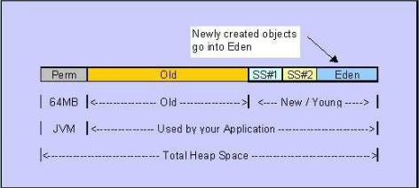
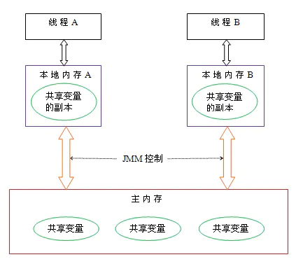

>https://github.com/cosen1024/Java-Interview/blob/main/JVM/JVM.md

>https://github.com/MrJian8/ThreadDemo/blob/master/src/main/resources/JVM.md

#第一章 JVM
##1.1 JVM是什么

JVM是Java Virtual Machine的缩写。它是一种基于计算设备的规范，是一台虚拟机，即虚构的计算机。

JVM屏蔽了具体操作系统平台的信息（显然，就像是我们在电脑上开了个虚拟机一样），当然，JVM执行字节码时实际上还是要解释成具体操作平台的机器指令的。

通过JVM，Java实现了平台无关性，Java语言在不同平台运行时不需要重新编译，只需要在该平台上部署JVM就可以了。因而能实现一次编译多处运行。(就像是你的虚拟机也可以在任何安了VMWare的系统上运行)

##1.2 什么是JVM内存结构

jvm将虚拟机分为5大区域，程序计数器、虚拟机栈、本地方法栈、java堆、方法区；

- 程序计数器：线程私有的，是一块很小的内存空间，作为当前线程的行号指示器，用于记录当前虚拟机正在执行的线程指令地址；
- 虚拟机栈：线程私有的，每个方法执行的时候都会创建一个栈帧，用于存储局部变量表、操作数、动态链接和方法返回等信息，当线程请求的栈深度超过了虚拟机允许的最大深度时，就会抛出StackOverFlowError；
- 本地方法栈：线程私有的，保存的是native方法的信息，当一个jvm创建的线程调用native方法后，jvm不会在虚拟机栈中为该线程创建栈帧，而是简单的动态链接并直接调用该方法；
- 堆：java堆是所有线程共享的一块内存，几乎所有对象的实例和数组都要在堆上分配内存，因此该区域经常发生垃圾回收的操作；
- 方法区：存放已被加载的类信息、常量、静态变量、即时编译器编译后的代码数据。即永久代，在jdk1.8中不存在方法区了，被元数据区替代了，原方法区被分成两部分；1：加载的类信息，2：运行时常量池；加载的类信息被保存在元数据区中，运行时常量池保存在堆中；

##1.3 程序计数器(PC, Program Counter)

1. 是一个寄存器，可以看作是代码行号指示器，类似于实际计算机里的PC，用于指示，跳转下一条需要执行的命令。Java的基础操作以及异常处理等都十分依赖PC

1. JVM多线程是通过线程轮流切换并分配处理器执行时间的方式来实现的。在一个确定的时刻，一个处理器（或者说多核处理器的一个内核）只会执行一条线程中的命令。因此，为了正常的切换线程，每个线程都会有一个独立的PC，各线程的PC不会互相影响。这个私有的PC所占的这块内存即是线程的“私有内存"。

1. 如果线程在执行的是Java方法，那么PC记录的是正在执行的虚拟机字节码指令的地址。如果正在执行的不是Java方法即Native方法，那么PC的值为undefined。

1. PC的内存区域是唯一的没有规定任何OutOfMemoryError的Java虚拟机规范中的区域。

##1.4 Java虚拟机栈(Stack，Java Virtual Machine Stacks)

1. 同PC一样(从工作流程图里我们可以看到，实际上，PC也是存在于JVM Stack上的)，也是线程私有的，生命周期与线程相同。虚拟机栈描述Java方法执行的内存模型，每个方法被执行时都会创建一个栈帧(Stack Frame)，栈帧会利用局部变量数组存储局部变量(Local Variables)，操作栈(Operand Stack)，方法出口(Return Value)，动态连接(Current Class Constant Pool Reference)等信息。

1. 局部变量数组存储了编译可知的八个基本类型(int, boolean, char, short, byte, long, float, double)，对象引用(根据不同的虚拟机实现可能是引用地址的指针或者一个handle)，returnAddress类型。64位的long和double会占用两个Slot，其余类型会占用一个Slot。在编译期间，局部变量所需的空间就会完成分配，动态运行期间不会改变所需的空间。

1. 操作栈在执行字节码指令时会被用到，这种方式类似于原生的CPU寄存器，大部分JVM把时间花费在操作栈的花费上，操作栈和局部变量数组会频繁的交换数据。

1. 动态连接控制着运行时常量池和栈帧的连接。所有方法和类的引用都会被当作符号的引用存在常量池中。符号引用是实际上并不指向物理内存地址的逻辑引用。JVM 可以选择符号引用解析的时机，一种是当类文件加载并校验通过后，这种解析方式被称为饥饿方式。另外一种是符号引用在第一次使用的时候被解析，这种解析方式称为惰性方式。无论如何 ，JVM 必须要在第一次使用符号引用时完成解析并抛出可能发生的解析错误。绑定是将对象域、方法、类的符号引用替换为直接引用的过程。绑定只会发生一次。一旦绑定，符号引用会被完全替换。如果一个类的符号引用还没有被解析，那么就会载入这个类。每个直接引用都被存储为相对于存储结构（与运行时变量或方法的位置相关联的）偏移量。

1. 对Java虚拟机栈这个区域，Java虚拟机规范规定了两种异常：

    1.  线程请求的栈深度大于虚拟机所允许的深度，抛出StackOverFlow异常。
    

    1. 对于支持动态扩展的虚拟机，当扩展无法申请到足够的内存时会抛出OutOfMemory异常。

##1.5 本地方法栈(Native Stack)

本地方法栈如其名字，和Java Virtual Machine Stack其实极为类似，只是执行的是Native方法，为Native方法服务。

##1.6  Java 堆(Heap, Garbage Collection Heap)

1. Java堆是被所有线程共享的一块区域，在虚拟机启动时创建。此内存区域的唯一目的就是存放对象实例，几乎所有的对象实例都在这里分配内存(随着技术的发展，已不绝对)。

1. Java堆是垃圾收集器管理的主要区域，因而也被称为GC堆。收集器采用分代回收法，GC堆可以分为新生代(Yong Generation)和老生代(Old Generation)。新生代包括Eden Space和Survivor Space。但无论哪个区域，如何划分，存储的都是Java对象实例，进一步的划分是为了更好的回收内存或快速的分配内存。

1. 根据Java虚拟机规范，堆所在的物理内存区间可以是不连续的，只要逻辑连续就可以。实现时既可以是固定大小，也可以是可扩展的。如果堆无法扩展时，就会抛出OutOfMemoryError。

##1.7 方法区(Method Area)

1. 方法区和Java堆类似，也属于各线程共享的内存区域。用于存储已被虚拟机加载的类信息，常量，静态变量，即时编译器编译后的代码数据等。它属于非堆区(Non Heap)，和Java堆区分开。对于存在永久代(Permanent)概念的虚拟机(HotSpot)而言，方法区存在于永久代。Java虚拟机规范对方法区的规定很宽松，甚至可以不实现GC。不过并非进入方法区的数据就会永久存在了，这块区域的内存回收主要为常量池的回收和类型的卸载。这个区域的回收处理不善也会导致严重的内存泄漏。

1. 当方法区无法满足内存分配需求时也会抛出OutOfMemoryError。

##1.8 运行时常量池(Run-Time Constant Pool)

1. 运行时常量池是方法区的一部分。Class文件中有类的版本，字段，方法，接口等描述信息和用于存放编译期生成的各种字面量和符号引用。这部分内容将在类加载后存放到方法区的运行时常量池中。Java虚拟机规范对Class的细节有着严苛的要求而对运行时常量池的实现不做要求。一般来说除了翻译的Class,翻译出来的直接引用也会存在运行时常量池中。

1. 运行时常量池具备动态性，即运行时也可将新的常量放入池中。比如String类的intern()方法。

1. 常量池无法申请到足够的内存分配时也会抛出OutOfMemoryError。

##1.9 Java垃圾回收

1. 将内存中不再被使用的对象进行回收，GC中用于回收的方法称为收集器，由于GC需要消耗一些资源和时间，Java在对对象的生命周期特征进行分析后，按照新生代、旧生代的方式来对对象进行收集，以尽可能的缩短GC对应用造成的暂停。

1. 不同的对象引用类型， GC会采用不同的方法进行回收，JVM对象的引用分为了四种类型：

    - 强引用：默认情况下，对象采用的均为强引用（这个对象的实例没有其他对象引用，GC时才会被回收）。
    - 软引用：软引用是Java中提供的一种比较适合于缓存场景的应用（只有在内存不够用的情况下才会被GC）。
    - 弱引用：在GC时一定会被GC回收。
    - 虚引用：由于虚引用只是用来得知对象是否被GC。

##1.10 JVM线程与原生线程的关系

1. JVM允许一个程序使用多个并发线程，Hotspot JVM中Java的线程与原生操作系统的线程是直接映射关系。

1. 当线程本地存储、缓冲区分配、同步对象、栈、程序计数器等准备好以后，就会创建一个操作系统原生线程。

1. Java 线程结束，原生线程随之被回收。

1. 操作系统负责调度所有线程，并把它们分配到任何可用的 CPU 上。

1. 当原生线程初始化完毕，就会调用 Java 线程的 run() 方法。

1. run() 返回时，被处理未捕获异常，原生线程将确认由于它的结束是否要终止 JVM 进程（比如这个线程是最后一个非守护线程）。

1. 当线程结束时，会释放原生线程和 Java 线程的所有资源。

----------
#第二章 什么是JVM内存模型
----------

1. Java **内存模型**（下文简称 JMM）就是在底层处理器内存模型的基础上，定义自己的多线程语义。它明确指定了一组排序规则，来保证线程间的可见性。

1. 这一组规则被称为 **Happens-Before**, JMM 规定，要想保证 B 操作能够看到 A 操作的结果（无论它们是否在同一个线程），那么 A 和 B 之间必须满足 Happens-Before 关系：

    - 单线程规则：一个线程中的每个动作都 happens-before 该线程中后续的每个动作
    - 监视器锁定规则：监听器的解锁动作 happens-before 后续对这个监听器的锁定动作
    - volatile 变量规则：对 volatile 字段的写入动作 happens-before 后续对这个字段的每个读取动作
    - 线程 start 规则：线程 start() 方法的执行 happens-before 一个启动线程内的任意动作
    - 线程 join 规则：一个线程内的所有动作 happens-before 任意其他线程在该线程 join() 成功返回之前
    - 传递性：如果 A happens-before B, 且 B happens-before C, 那么 A happens-before C

怎么理解 happens-before 呢？如果按字面意思，比如第二个规则，线程（不管是不是同一个）的解锁动作发生在锁定之前？这明显不对。happens-before 也是为了保证可见性，比如那个解锁和加锁的动作，可以这样理解，线程1释放锁退出同步块，线程2加锁进入同步块，那么线程2就能看见线程1对共享对象修改的结果。

