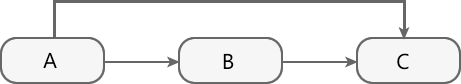
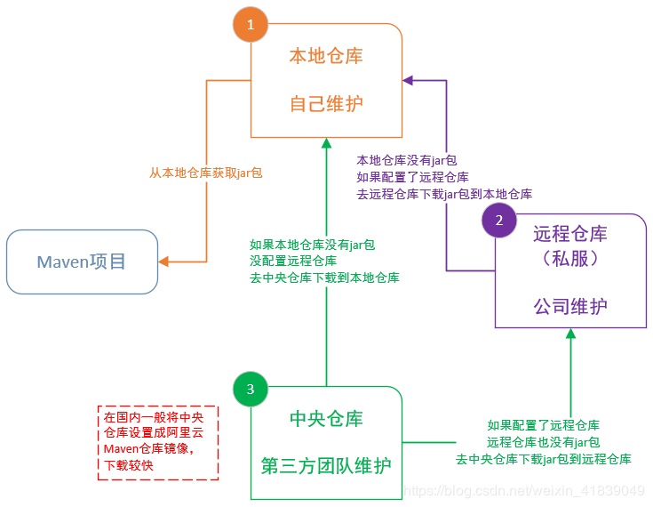

> Maven学习笔记

> 2021/11/19 9:54:34 

#序章
##构建工具的来源
###1 什么是构建工具
构建工具是一个把**源代码**生成**可执行应用程序**的**过程自动化**的程序（例如Android app生成apk）

构建包括编译、连接跟把代码打包成可用的或可执行的形式

基本上构建的自动化是编写或使一大部分任务自动执行的一个动作，而这些任务则是软件开发者的日常，像是：

1. 下载依赖

1. 将源代码编译成二进制代码

1. 打包生成的二进制代码

1. 进行单元测试

1. 部署到生产系统

###2 为什么要使用构建工具或构建自动化

1. 在小型项目中，开发者往往手动调用构建过程

1. 在大型的项目中很不实用，在构建过程中难以跟踪什么需要被构建、按照什么顺序构建以及项目中存在哪些依赖

1. 使用自动化工具会使构建过程更为连续

###3 各种现有构建工具

1. For java - Ant,Maven,Gradle.

1. For .NET framework - NAnt

1. c# - MsBuild.

##构建工具的发展
###Maven

1. 在linux上，有一个工具叫make，我们可以通过编写Makefile来执行工程的构建

1. windows上相应的工具是nmake。这个工具写起来比较罗嗦

1. 所以Java的构建就没有选择它们，而是新建了一个叫做ant的工具
2. ant的思想和makefile比较像。定义一个任务，规定它的依赖，然后就可以通过ant来执行这个任务了。下面列出一个ant工具所使用的build.xml:
    
        <?xml version="1.0" encoding="UTF-8" ?>  
        <project name="HelloWorld" default="run" basedir=".">  
        <property name="src" value="src"/>  
        <property name="dest" value="classes"/>  
        <property name="jarfile" value="hello.jar"/>  
        <target name="init">  
           <mkdir dir="${dest}"/>  
        </target>  
        <target name="compile" depends="init">  
           <javac srcdir="${src}" destdir="${dest}"/>  
        </target>  
        <target name="build" depends="compile">  
           <jar jarfile="${jarfile}" basedir="${dest}"/>  
        </target>  
        <target name="test" depends="build">  
           <java classname="test.ant.HelloWorld" classpath="${hello_jar}"/>  
        </target>  
        <target name="clean">  
           <delete dir="${dest}" />  
           <delete file="${hello_jar}" />  
        </target>  
        </project>  

###Gradle(task)

maven已经很好了，可以满足绝大多数工程的构建。那为什么我们还需要新的构建工具呢？

1. maven是使用xml进行配置的，语法不简洁

2. 最关键的，maven在约定优于配置这条路上走太远了。

3. 就是说，maven不鼓励你自己定义任务，它要求用户在maven的生命周期中使用插件的方式去工作。这有点像设计模式中的模板方法模式。

4. 就是我使用maven的话，想灵活地定义自己的任务是不行的。基于这个原因，gradle做了很多改进。

1. gradle并不是另起炉灶，它充分地使用了maven的现有资源。继承了maven中仓库，坐标，依赖这些核心概念。

1. 文件的布局也和maven相同。但同时，它又继承了ant中target的概念，我们又可以重新定义自己的任务了。

##与IDE的整合

1. 在Java的开发中，我们不可能脱离集成开发环境(Integrated Develop Environment)

1. 因为IDE提供了代码补全和方便的代码跳转，这是普通的文本编辑软件（比如vim）很难做到的

1. 以前在ide里使用spring的时候，我们要手动下载spring的包

1. 如果spring依赖了其他的第三方的库，我们还要去下载那个库并且添加到IDE中去

1. 现在，只需要在build.gradle里定义好依赖，然后更新它，IDE就可以自动帮我们把包导进来

----------
#第一章 Maven入门
----------

1. Maven 翻译为"专家"、"内行"，是 Apache 下的一个纯 Java 开发的开源项目

1. 基于项目对象模型（缩写：POM）概念，Maven利用一个中央信息片断能管理一个项目的构建、报告和文档等步骤。

1. Maven 是一个项目管理工具，可以对 Java 项目进行构建、依赖管理

1. Maven 也可被用于构建和管理各种项目，例如 C#，Ruby，Scala 和其他语言编写的项目
2. 
2. Maven 曾是 Jakarta 项目的子项目，现为由 Apache 软件基金会主持的独立 Apache 项目

##1.1 功能

1. 构建

1. 文档生成

1. 报告

1. 依赖

1. SCMs

1. 发布

1. 分发

1. 邮件列表

##1.2 约定配置
Maven 提倡使用一个共同的标准目录结构，Maven 使用**约定优于配置**的原则，大家尽可能的遵守这样的目录结构

|----|----|
|目录|	目的
|${basedir}|	存放pom.xml和所有的子目录
|${basedir}/src/main/java|	项目的java源代码
|${basedir}/src/main/resources|	项目的资源，比如说property文件，springmvc.xml
|${basedir}/src/test/java|	项目的测试类，比如说Junit代码
|${basedir}/src/test/resources	|测试用的资源
|${basedir}/src/main/webapp/WEB-INF|	web应用文件目录，web项目的信息，比如存放web.xml、本地图片、jsp视图页面
|${basedir}/target|	打包输出目录
|${basedir}/target/classes|	编译输出目录
|${basedir}/target/test-classes	|测试编译输出目录
|Test.java	|Maven只会自动运行符合该命名规则的测试类
|~/.m2/repository	|Maven默认的本地仓库目录位置

##1.3 POM

1. POM( Project Object Model，项目对象模型 ) 是 Maven 工程的基本工作单元

1. 是一个XML文件，包含了项目的基本信息，用于描述项目如何构建，声明项目依赖，等等

1. 执行任务或目标时，Maven 会在当前目录中查找 POM。它读取 POM，获取所需的配置信息，然后执行目标

所有 POM 文件都需要 project 元素和三个必需字段：groupId，artifactId，version

|----|----|
|节点|	描述|
|project|	工程的根标签。
|modelVersion	|模型版本需要设置为 4.0
|groupId	|这是工程组的标识。它在一个组织或者项目中通常是唯一的
|artifactId|	这是工程的标识。它通常是工程的名称
|version |这是工程的版本号。在 artifact 的仓库中，它用来区分不同的版本

            <project xmlns="http://maven.apache.org/POM/4.0.0" xmlns:xsi="http://www.w3.org/2001/XMLSchema-instance"
                xsi:schemaLocation="http://maven.apache.org/POM/4.0.0http://maven.apache.org/maven-v4_0_0.xsd">
                <!--父项目的坐标。如果项目中没有规定某个元素的值，那么父项目中的对应值即为项目的默认值。 坐标包括group ID，artifact ID和 
                    version。 -->
                <parent>
                    <!--被继承的父项目的构件标识符 -->
                    <artifactId />
                    <!--被继承的父项目的全球唯一标识符 -->
                    <groupId />
                    <!--被继承的父项目的版本 -->
                    <version />
                    <!-- 父项目的pom.xml文件的相对路径。相对路径允许你选择一个不同的路径。默认值是../pom.xml。Maven首先在构建当前项目的地方寻找父项 
                        目的pom，其次在文件系统的这个位置（relativePath位置），然后在本地仓库，最后在远程仓库寻找父项目的pom。 -->
                    <relativePath />
                </parent>
                <!--声明项目描述符遵循哪一个POM模型版本。模型本身的版本很少改变，虽然如此，但它仍然是必不可少的，这是为了当Maven引入了新的特性或者其他模型变更的时候，确保稳定性。 -->
                <modelVersion>4.0.0</modelVersion>
                <!--项目的全球唯一标识符，通常使用全限定的包名区分该项目和其他项目。并且构建时生成的路径也是由此生成， 如com.mycompany.app生成的相对路径为：/com/mycompany/app -->
                <groupId>asia.banseon</groupId>
                <!-- 构件的标识符，它和group ID一起唯一标识一个构件。换句话说，你不能有两个不同的项目拥有同样的artifact ID和groupID；在某个 
                    特定的group ID下，artifact ID也必须是唯一的。构件是项目产生的或使用的一个东西，Maven为项目产生的构件包括：JARs，源 码，二进制发布和WARs等。 -->
                <artifactId>banseon-maven2</artifactId>
                <!--项目产生的构件类型，例如jar、war、ear、pom。插件可以创建他们自己的构件类型，所以前面列的不是全部构件类型 -->
                <packaging>jar</packaging>
                <!--项目当前版本，格式为:主版本.次版本.增量版本-限定版本号 -->
                <version>1.0-SNAPSHOT</version>
                <!--项目的名称, Maven产生的文档用 -->
                <name>banseon-maven</name>
                <!--项目主页的URL, Maven产生的文档用 -->
                <url>http://www.baidu.com/banseon</url>
                <!-- 项目的详细描述, Maven 产生的文档用。 当这个元素能够用HTML格式描述时（例如，CDATA中的文本会被解析器忽略，就可以包含HTML标 
                    签）， 不鼓励使用纯文本描述。如果你需要修改产生的web站点的索引页面，你应该修改你自己的索引页文件，而不是调整这里的文档。 -->
                <description>A maven project to study maven.</description>
                <!--描述了这个项目构建环境中的前提条件。 -->
                <prerequisites>
                    <!--构建该项目或使用该插件所需要的Maven的最低版本 -->
                    <maven />
                </prerequisites>
                <!--项目的问题管理系统(Bugzilla, Jira, Scarab,或任何你喜欢的问题管理系统)的名称和URL，本例为 jira -->
                <issueManagement>
                    <!--问题管理系统（例如jira）的名字， -->
                    <system>jira</system>
                    <!--该项目使用的问题管理系统的URL -->
                    <url>http://jira.baidu.com/banseon</url>
                </issueManagement>
                <!--项目持续集成信息 -->
                <ciManagement>
                    <!--持续集成系统的名字，例如continuum -->
                    <system />
                    <!--该项目使用的持续集成系统的URL（如果持续集成系统有web接口的话）。 -->
                    <url />
                    <!--构建完成时，需要通知的开发者/用户的配置项。包括被通知者信息和通知条件（错误，失败，成功，警告） -->
                    <notifiers>
                        <!--配置一种方式，当构建中断时，以该方式通知用户/开发者 -->
                        <notifier>
                            <!--传送通知的途径 -->
                            <type />
                            <!--发生错误时是否通知 -->
                            <sendOnError />
                            <!--构建失败时是否通知 -->
                            <sendOnFailure />
                            <!--构建成功时是否通知 -->
                            <sendOnSuccess />
                            <!--发生警告时是否通知 -->
                            <sendOnWarning />
                            <!--不赞成使用。通知发送到哪里 -->
                            <address />
                            <!--扩展配置项 -->
                            <configuration />
                        </notifier>
                    </notifiers>
                </ciManagement>
                <!--项目创建年份，4位数字。当产生版权信息时需要使用这个值。 -->
                <inceptionYear />
                <!--项目相关邮件列表信息 -->
                <mailingLists>
                    <!--该元素描述了项目相关的所有邮件列表。自动产生的网站引用这些信息。 -->
                    <mailingList>
                        <!--邮件的名称 -->
                        <name>Demo</name>
                        <!--发送邮件的地址或链接，如果是邮件地址，创建文档时，mailto: 链接会被自动创建 -->
                        <post>banseon@126.com</post>
                        <!--订阅邮件的地址或链接，如果是邮件地址，创建文档时，mailto: 链接会被自动创建 -->
                        <subscribe>banseon@126.com</subscribe>
                        <!--取消订阅邮件的地址或链接，如果是邮件地址，创建文档时，mailto: 链接会被自动创建 -->
                        <unsubscribe>banseon@126.com</unsubscribe>
                        <!--你可以浏览邮件信息的URL -->
                        <archive>http:/hi.baidu.com/banseon/demo/dev/</archive>
                    </mailingList>
                </mailingLists>
                <!--项目开发者列表 -->
                <developers>
                    <!--某个项目开发者的信息 -->
                    <developer>
                        <!--SCM里项目开发者的唯一标识符 -->
                        <id>HELLO WORLD</id>
                        <!--项目开发者的全名 -->
                        <name>banseon</name>
                        <!--项目开发者的email -->
                        <email>banseon@126.com</email>
                        <!--项目开发者的主页的URL -->
                        <url />
                        <!--项目开发者在项目中扮演的角色，角色元素描述了各种角色 -->
                        <roles>
                            <role>Project Manager</role>
                            <role>Architect</role>
                        </roles>
                        <!--项目开发者所属组织 -->
                        <organization>demo</organization>
                        <!--项目开发者所属组织的URL -->
                        <organizationUrl>http://hi.baidu.com/banseon</organizationUrl>
                        <!--项目开发者属性，如即时消息如何处理等 -->
                        <properties>
                            <dept>No</dept>
                        </properties>
                        <!--项目开发者所在时区， -11到12范围内的整数。 -->
                        <timezone>-5</timezone>
                    </developer>
                </developers>
                <!--项目的其他贡献者列表 -->
                <contributors>
                    <!--项目的其他贡献者。参见developers/developer元素 -->
                    <contributor>
                        <name />
                        <email />
                        <url />
                        <organization />
                        <organizationUrl />
                        <roles />
                        <timezone />
                        <properties />
                    </contributor>
                </contributors>
                <!--该元素描述了项目所有License列表。 应该只列出该项目的license列表，不要列出依赖项目的 license列表。如果列出多个license，用户可以选择它们中的一个而不是接受所有license。 -->
                <licenses>
                    <!--描述了项目的license，用于生成项目的web站点的license页面，其他一些报表和validation也会用到该元素。 -->
                    <license>
                        <!--license用于法律上的名称 -->
                        <name>Apache 2</name>
                        <!--官方的license正文页面的URL -->
                        <url>http://www.baidu.com/banseon/LICENSE-2.0.txt</url>
                        <!--项目分发的主要方式： repo，可以从Maven库下载 manual， 用户必须手动下载和安装依赖 -->
                        <distribution>repo</distribution>
                        <!--关于license的补充信息 -->
                        <comments>A business-friendly OSS license</comments>
                    </license>
                </licenses>
                <!--SCM(Source Control Management)标签允许你配置你的代码库，供Maven web站点和其它插件使用。 -->
                <scm>
                    <!--SCM的URL,该URL描述了版本库和如何连接到版本库。欲知详情，请看SCMs提供的URL格式和列表。该连接只读。 -->
                    <connection>
                        scm:svn:http://svn.baidu.com/banseon/maven/banseon/banseon-maven2-trunk(dao-trunk)
                    </connection>
                    <!--给开发者使用的，类似connection元素。即该连接不仅仅只读 -->
                    <developerConnection>
                        scm:svn:http://svn.baidu.com/banseon/maven/banseon/dao-trunk
                    </developerConnection>
                    <!--当前代码的标签，在开发阶段默认为HEAD -->
                    <tag />
                    <!--指向项目的可浏览SCM库（例如ViewVC或者Fisheye）的URL。 -->
                    <url>http://svn.baidu.com/banseon</url>
                </scm>
                <!--描述项目所属组织的各种属性。Maven产生的文档用 -->
                <organization>
                    <!--组织的全名 -->
                    <name>demo</name>
                    <!--组织主页的URL -->
                    <url>http://www.baidu.com/banseon</url>
                </organization>
                <!--构建项目需要的信息 -->
                <build>
                    <!--该元素设置了项目源码目录，当构建项目的时候，构建系统会编译目录里的源码。该路径是相对于pom.xml的相对路径。 -->
                    <sourceDirectory />
                    <!--该元素设置了项目脚本源码目录，该目录和源码目录不同：绝大多数情况下，该目录下的内容 会被拷贝到输出目录(因为脚本是被解释的，而不是被编译的)。 -->
                    <scriptSourceDirectory />
                    <!--该元素设置了项目单元测试使用的源码目录，当测试项目的时候，构建系统会编译目录里的源码。该路径是相对于pom.xml的相对路径。 -->
                    <testSourceDirectory />
                    <!--被编译过的应用程序class文件存放的目录。 -->
                    <outputDirectory />
                    <!--被编译过的测试class文件存放的目录。 -->
                    <testOutputDirectory />
                    <!--使用来自该项目的一系列构建扩展 -->
                    <extensions>
                        <!--描述使用到的构建扩展。 -->
                        <extension>
                            <!--构建扩展的groupId -->
                            <groupId />
                            <!--构建扩展的artifactId -->
                            <artifactId />
                            <!--构建扩展的版本 -->
                            <version />
                        </extension>
                    </extensions>
                    <!--当项目没有规定目标（Maven2 叫做阶段）时的默认值 -->
                    <defaultGoal />
                    <!--这个元素描述了项目相关的所有资源路径列表，例如和项目相关的属性文件，这些资源被包含在最终的打包文件里。 -->
                    <resources>
                        <!--这个元素描述了项目相关或测试相关的所有资源路径 -->
                        <resource>
                            <!-- 描述了资源的目标路径。该路径相对target/classes目录（例如${project.build.outputDirectory}）。举个例 
                                子，如果你想资源在特定的包里(org.apache.maven.messages)，你就必须该元素设置为org/apache/maven /messages。然而，如果你只是想把资源放到源码目录结构里，就不需要该配置。 -->
                            <targetPath />
                            <!--是否使用参数值代替参数名。参数值取自properties元素或者文件里配置的属性，文件在filters元素里列出。 -->
                            <filtering />
                            <!--描述存放资源的目录，该路径相对POM路径 -->
                            <directory />
                            <!--包含的模式列表，例如**/*.xml. -->
                            <includes />
                            <!--排除的模式列表，例如**/*.xml -->
                            <excludes />
                        </resource>
                    </resources>
                    <!--这个元素描述了单元测试相关的所有资源路径，例如和单元测试相关的属性文件。 -->
                    <testResources>
                        <!--这个元素描述了测试相关的所有资源路径，参见build/resources/resource元素的说明 -->
                        <testResource>
                            <targetPath />
                            <filtering />
                            <directory />
                            <includes />
                            <excludes />
                        </testResource>
                    </testResources>
                    <!--构建产生的所有文件存放的目录 -->
                    <directory />
                    <!--产生的构件的文件名，默认值是${artifactId}-${version}。 -->
                    <finalName />
                    <!--当filtering开关打开时，使用到的过滤器属性文件列表 -->
                    <filters />
                    <!--子项目可以引用的默认插件信息。该插件配置项直到被引用时才会被解析或绑定到生命周期。给定插件的任何本地配置都会覆盖这里的配置 -->
                    <pluginManagement>
                        <!--使用的插件列表 。 -->
                        <plugins>
                            <!--plugin元素包含描述插件所需要的信息。 -->
                            <plugin>
                                <!--插件在仓库里的group ID -->
                                <groupId />
                                <!--插件在仓库里的artifact ID -->
                                <artifactId />
                                <!--被使用的插件的版本（或版本范围） -->
                                <version />
                                <!--是否从该插件下载Maven扩展（例如打包和类型处理器），由于性能原因，只有在真需要下载时，该元素才被设置成enabled。 -->
                                <extensions />
                                <!--在构建生命周期中执行一组目标的配置。每个目标可能有不同的配置。 -->
                                <executions>
                                    <!--execution元素包含了插件执行需要的信息 -->
                                    <execution>
                                        <!--执行目标的标识符，用于标识构建过程中的目标，或者匹配继承过程中需要合并的执行目标 -->
                                        <id />
                                        <!--绑定了目标的构建生命周期阶段，如果省略，目标会被绑定到源数据里配置的默认阶段 -->
                                        <phase />
                                        <!--配置的执行目标 -->
                                        <goals />
                                        <!--配置是否被传播到子POM -->
                                        <inherited />
                                        <!--作为DOM对象的配置 -->
                                        <configuration />
                                    </execution>
                                </executions>
                                <!--项目引入插件所需要的额外依赖 -->
                                <dependencies>
                                    <!--参见dependencies/dependency元素 -->
                                    <dependency>
                                        ......
                                    </dependency>
                                </dependencies>
                                <!--任何配置是否被传播到子项目 -->
                                <inherited />
                                <!--作为DOM对象的配置 -->
                                <configuration />
                            </plugin>
                        </plugins>
                    </pluginManagement>
                    <!--使用的插件列表 -->
                    <plugins>
                        <!--参见build/pluginManagement/plugins/plugin元素 -->
                        <plugin>
                            <groupId />
                            <artifactId />
                            <version />
                            <extensions />
                            <executions>
                                <execution>
                                    <id />
                                    <phase />
                                    <goals />
                                    <inherited />
                                    <configuration />
                                </execution>
                            </executions>
                            <dependencies>
                                <!--参见dependencies/dependency元素 -->
                                <dependency>
                                    ......
                                </dependency>
                            </dependencies>
                            <goals />
                            <inherited />
                            <configuration />
                        </plugin>
                    </plugins>
                </build>
                <!--在列的项目构建profile，如果被激活，会修改构建处理 -->
                <profiles>
                    <!--根据环境参数或命令行参数激活某个构建处理 -->
                    <profile>
                        <!--构建配置的唯一标识符。即用于命令行激活，也用于在继承时合并具有相同标识符的profile。 -->
                        <id />
                        <!--自动触发profile的条件逻辑。Activation是profile的开启钥匙。profile的力量来自于它 能够在某些特定的环境中自动使用某些特定的值；这些环境通过activation元素指定。activation元素并不是激活profile的唯一方式。 -->
                        <activation>
                            <!--profile默认是否激活的标志 -->
                            <activeByDefault />
                            <!--当匹配的jdk被检测到，profile被激活。例如，1.4激活JDK1.4，1.4.0_2，而!1.4激活所有版本不是以1.4开头的JDK。 -->
                            <jdk />
                            <!--当匹配的操作系统属性被检测到，profile被激活。os元素可以定义一些操作系统相关的属性。 -->
                            <os>
                                <!--激活profile的操作系统的名字 -->
                                <name>Windows XP</name>
                                <!--激活profile的操作系统所属家族(如 'windows') -->
                                <family>Windows</family>
                                <!--激活profile的操作系统体系结构 -->
                                <arch>x86</arch>
                                <!--激活profile的操作系统版本 -->
                                <version>5.1.2600</version>
                            </os>
                            <!--如果Maven检测到某一个属性（其值可以在POM中通过${名称}引用），其拥有对应的名称和值，Profile就会被激活。如果值 字段是空的，那么存在属性名称字段就会激活profile，否则按区分大小写方式匹配属性值字段 -->
                            <property>
                                <!--激活profile的属性的名称 -->
                                <name>mavenVersion</name>
                                <!--激活profile的属性的值 -->
                                <value>2.0.3</value>
                            </property>
                            <!--提供一个文件名，通过检测该文件的存在或不存在来激活profile。missing检查文件是否存在，如果不存在则激活 profile。另一方面，exists则会检查文件是否存在，如果存在则激活profile。 -->
                            <file>
                                <!--如果指定的文件存在，则激活profile。 -->
                                <exists>/usr/local/hudson/hudson-home/jobs/maven-guide-zh-to-production/workspace/
                                </exists>
                                <!--如果指定的文件不存在，则激活profile。 -->
                                <missing>/usr/local/hudson/hudson-home/jobs/maven-guide-zh-to-production/workspace/
                                </missing>
                            </file>
                        </activation>
                        <!--构建项目所需要的信息。参见build元素 -->
                        <build>
                            <defaultGoal />
                            <resources>
                                <resource>
                                    <targetPath />
                                    <filtering />
                                    <directory />
                                    <includes />
                                    <excludes />
                                </resource>
                            </resources>
                            <testResources>
                                <testResource>
                                    <targetPath />
                                    <filtering />
                                    <directory />
                                    <includes />
                                    <excludes />
                                </testResource>
                            </testResources>
                            <directory />
                            <finalName />
                            <filters />
                            <pluginManagement>
                                <plugins>
                                    <!--参见build/pluginManagement/plugins/plugin元素 -->
                                    <plugin>
                                        <groupId />
                                        <artifactId />
                                        <version />
                                        <extensions />
                                        <executions>
                                            <execution>
                                                <id />
                                                <phase />
                                                <goals />
                                                <inherited />
                                                <configuration />
                                            </execution>
                                        </executions>
                                        <dependencies>
                                            <!--参见dependencies/dependency元素 -->
                                            <dependency>
                                                ......
                                            </dependency>
                                        </dependencies>
                                        <goals />
                                        <inherited />
                                        <configuration />
                                    </plugin>
                                </plugins>
                            </pluginManagement>
                            <plugins>
                                <!--参见build/pluginManagement/plugins/plugin元素 -->
                                <plugin>
                                    <groupId />
                                    <artifactId />
                                    <version />
                                    <extensions />
                                    <executions>
                                        <execution>
                                            <id />
                                            <phase />
                                            <goals />
                                            <inherited />
                                            <configuration />
                                        </execution>
                                    </executions>
                                    <dependencies>
                                        <!--参见dependencies/dependency元素 -->
                                        <dependency>
                                            ......
                                        </dependency>
                                    </dependencies>
                                    <goals />
                                    <inherited />
                                    <configuration />
                                </plugin>
                            </plugins>
                        </build>
                        <!--模块（有时称作子项目） 被构建成项目的一部分。列出的每个模块元素是指向该模块的目录的相对路径 -->
                        <modules />
                        <!--发现依赖和扩展的远程仓库列表。 -->
                        <repositories>
                            <!--参见repositories/repository元素 -->
                            <repository>
                                <releases>
                                    <enabled />
                                    <updatePolicy />
                                    <checksumPolicy />
                                </releases>
                                <snapshots>
                                    <enabled />
                                    <updatePolicy />
                                    <checksumPolicy />
                                </snapshots>
                                <id />
                                <name />
                                <url />
                                <layout />
                            </repository>
                        </repositories>
                        <!--发现插件的远程仓库列表，这些插件用于构建和报表 -->
                        <pluginRepositories>
                            <!--包含需要连接到远程插件仓库的信息.参见repositories/repository元素 -->
                            <pluginRepository>
                                <releases>
                                    <enabled />
                                    <updatePolicy />
                                    <checksumPolicy />
                                </releases>
                                <snapshots>
                                    <enabled />
                                    <updatePolicy />
                                    <checksumPolicy />
                                </snapshots>
                                <id />
                                <name />
                                <url />
                                <layout />
                            </pluginRepository>
                        </pluginRepositories>
                        <!--该元素描述了项目相关的所有依赖。 这些依赖组成了项目构建过程中的一个个环节。它们自动从项目定义的仓库中下载。要获取更多信息，请看项目依赖机制。 -->
                        <dependencies>
                            <!--参见dependencies/dependency元素 -->
                            <dependency>
                                ......
                            </dependency>
                        </dependencies>
                        <!--不赞成使用. 现在Maven忽略该元素. -->
                        <reports />
                        <!--该元素包括使用报表插件产生报表的规范。当用户执行"mvn site"，这些报表就会运行。 在页面导航栏能看到所有报表的链接。参见reporting元素 -->
                        <reporting>
                            ......
                        </reporting>
                        <!--参见dependencyManagement元素 -->
                        <dependencyManagement>
                            <dependencies>
                                <!--参见dependencies/dependency元素 -->
                                <dependency>
                                    ......
                                </dependency>
                            </dependencies>
                        </dependencyManagement>
                        <!--参见distributionManagement元素 -->
                        <distributionManagement>
                            ......
                        </distributionManagement>
                        <!--参见properties元素 -->
                        <properties />
                    </profile>
                </profiles>
                <!--模块（有时称作子项目） 被构建成项目的一部分。列出的每个模块元素是指向该模块的目录的相对路径 -->
                <modules />
                <!--发现依赖和扩展的远程仓库列表。 -->
                <repositories>
                    <!--包含需要连接到远程仓库的信息 -->
                    <repository>
                        <!--如何处理远程仓库里发布版本的下载 -->
                        <releases>
                            <!--true或者false表示该仓库是否为下载某种类型构件（发布版，快照版）开启。 -->
                            <enabled />
                            <!--该元素指定更新发生的频率。Maven会比较本地POM和远程POM的时间戳。这里的选项是：always（一直），daily（默认，每日），interval：X（这里X是以分钟为单位的时间间隔），或者never（从不）。 -->
                            <updatePolicy />
                            <!--当Maven验证构件校验文件失败时该怎么做：ignore（忽略），fail（失败），或者warn（警告）。 -->
                            <checksumPolicy />
                        </releases>
                        <!-- 如何处理远程仓库里快照版本的下载。有了releases和snapshots这两组配置，POM就可以在每个单独的仓库中，为每种类型的构件采取不同的 
                            策略。例如，可能有人会决定只为开发目的开启对快照版本下载的支持。参见repositories/repository/releases元素 -->
                        <snapshots>
                            <enabled />
                            <updatePolicy />
                            <checksumPolicy />
                        </snapshots>
                        <!--远程仓库唯一标识符。可以用来匹配在settings.xml文件里配置的远程仓库 -->
                        <id>banseon-repository-proxy</id>
                        <!--远程仓库名称 -->
                        <name>banseon-repository-proxy</name>
                        <!--远程仓库URL，按protocol://hostname/path形式 -->
                        <url>http://192.168.1.169:9999/repository/</url>
                        <!-- 用于定位和排序构件的仓库布局类型-可以是default（默认）或者legacy（遗留）。Maven 2为其仓库提供了一个默认的布局；然 
                            而，Maven 1.x有一种不同的布局。我们可以使用该元素指定布局是default（默认）还是legacy（遗留）。 -->
                        <layout>default</layout>
                    </repository>
                </repositories>
                <!--发现插件的远程仓库列表，这些插件用于构建和报表 -->
                <pluginRepositories>
                    <!--包含需要连接到远程插件仓库的信息.参见repositories/repository元素 -->
                    <pluginRepository>
                        ......
                    </pluginRepository>
                </pluginRepositories>
             
             
                <!--该元素描述了项目相关的所有依赖。 这些依赖组成了项目构建过程中的一个个环节。它们自动从项目定义的仓库中下载。要获取更多信息，请看项目依赖机制。 -->
                <dependencies>
                    <dependency>
                        <!--依赖的group ID -->
                        <groupId>org.apache.maven</groupId>
                        <!--依赖的artifact ID -->
                        <artifactId>maven-artifact</artifactId>
                        <!--依赖的版本号。 在Maven 2里, 也可以配置成版本号的范围。 -->
                        <version>3.8.1</version>
                        <!-- 依赖类型，默认类型是jar。它通常表示依赖的文件的扩展名，但也有例外。一个类型可以被映射成另外一个扩展名或分类器。类型经常和使用的打包方式对应， 
                            尽管这也有例外。一些类型的例子：jar，war，ejb-client和test-jar。如果设置extensions为 true，就可以在 plugin里定义新的类型。所以前面的类型的例子不完整。 -->
                        <type>jar</type>
                        <!-- 依赖的分类器。分类器可以区分属于同一个POM，但不同构建方式的构件。分类器名被附加到文件名的版本号后面。例如，如果你想要构建两个单独的构件成 
                            JAR，一个使用Java 1.4编译器，另一个使用Java 6编译器，你就可以使用分类器来生成两个单独的JAR构件。 -->
                        <classifier></classifier>
                        <!--依赖范围。在项目发布过程中，帮助决定哪些构件被包括进来。欲知详情请参考依赖机制。 - compile ：默认范围，用于编译 - provided：类似于编译，但支持你期待jdk或者容器提供，类似于classpath 
                            - runtime: 在执行时需要使用 - test: 用于test任务时使用 - system: 需要外在提供相应的元素。通过systemPath来取得 
                            - systemPath: 仅用于范围为system。提供相应的路径 - optional: 当项目自身被依赖时，标注依赖是否传递。用于连续依赖时使用 -->
                        <scope>test</scope>
                        <!--仅供system范围使用。注意，不鼓励使用这个元素，并且在新的版本中该元素可能被覆盖掉。该元素为依赖规定了文件系统上的路径。需要绝对路径而不是相对路径。推荐使用属性匹配绝对路径，例如${java.home}。 -->
                        <systemPath></systemPath>
                        <!--当计算传递依赖时， 从依赖构件列表里，列出被排除的依赖构件集。即告诉maven你只依赖指定的项目，不依赖项目的依赖。此元素主要用于解决版本冲突问题 -->
                        <exclusions>
                            <exclusion>
                                <artifactId>spring-core</artifactId>
                                <groupId>org.springframework</groupId>
                            </exclusion>
                        </exclusions>
                        <!--可选依赖，如果你在项目B中把C依赖声明为可选，你就需要在依赖于B的项目（例如项目A）中显式的引用对C的依赖。可选依赖阻断依赖的传递性。 -->
                        <optional>true</optional>
                    </dependency>
                </dependencies>
                <!--不赞成使用. 现在Maven忽略该元素. -->
                <reports></reports>
                <!--该元素描述使用报表插件产生报表的规范。当用户执行"mvn site"，这些报表就会运行。 在页面导航栏能看到所有报表的链接。 -->
                <reporting>
                    <!--true，则，网站不包括默认的报表。这包括"项目信息"菜单中的报表。 -->
                    <excludeDefaults />
                    <!--所有产生的报表存放到哪里。默认值是${project.build.directory}/site。 -->
                    <outputDirectory />
                    <!--使用的报表插件和他们的配置。 -->
                    <plugins>
                        <!--plugin元素包含描述报表插件需要的信息 -->
                        <plugin>
                            <!--报表插件在仓库里的group ID -->
                            <groupId />
                            <!--报表插件在仓库里的artifact ID -->
                            <artifactId />
                            <!--被使用的报表插件的版本（或版本范围） -->
                            <version />
                            <!--任何配置是否被传播到子项目 -->
                            <inherited />
                            <!--报表插件的配置 -->
                            <configuration />
                            <!--一组报表的多重规范，每个规范可能有不同的配置。一个规范（报表集）对应一个执行目标 。例如，有1，2，3，4，5，6，7，8，9个报表。1，2，5构成A报表集，对应一个执行目标。2，5，8构成B报表集，对应另一个执行目标 -->
                            <reportSets>
                                <!--表示报表的一个集合，以及产生该集合的配置 -->
                                <reportSet>
                                    <!--报表集合的唯一标识符，POM继承时用到 -->
                                    <id />
                                    <!--产生报表集合时，被使用的报表的配置 -->
                                    <configuration />
                                    <!--配置是否被继承到子POMs -->
                                    <inherited />
                                    <!--这个集合里使用到哪些报表 -->
                                    <reports />
                                </reportSet>
                            </reportSets>
                        </plugin>
                    </plugins>
                </reporting>
                <!-- 继承自该项目的所有子项目的默认依赖信息。这部分的依赖信息不会被立即解析,而是当子项目声明一个依赖（必须描述group ID和 artifact 
                    ID信息），如果group ID和artifact ID以外的一些信息没有描述，则通过group ID和artifact ID 匹配到这里的依赖，并使用这里的依赖信息。 -->
                <dependencyManagement>
                    <dependencies>
                        <!--参见dependencies/dependency元素 -->
                        <dependency>
                            ......
                        </dependency>
                    </dependencies>
                </dependencyManagement>
                <!--项目分发信息，在执行mvn deploy后表示要发布的位置。有了这些信息就可以把网站部署到远程服务器或者把构件部署到远程仓库。 -->
                <distributionManagement>
                    <!--部署项目产生的构件到远程仓库需要的信息 -->
                    <repository>
                        <!--是分配给快照一个唯一的版本号（由时间戳和构建流水号）？还是每次都使用相同的版本号？参见repositories/repository元素 -->
                        <uniqueVersion />
                        <id>banseon-maven2</id>
                        <name>banseon maven2</name>
                        <url>file://${basedir}/target/deploy</url>
                        <layout />
                    </repository>
                    <!--构件的快照部署到哪里？如果没有配置该元素，默认部署到repository元素配置的仓库，参见distributionManagement/repository元素 -->
                    <snapshotRepository>
                        <uniqueVersion />
                        <id>banseon-maven2</id>
                        <name>Banseon-maven2 Snapshot Repository</name>
                        <url>scp://svn.baidu.com/banseon:/usr/local/maven-snapshot</url>
                        <layout />
                    </snapshotRepository>
                    <!--部署项目的网站需要的信息 -->
                    <site>
                        <!--部署位置的唯一标识符，用来匹配站点和settings.xml文件里的配置 -->
                        <id>banseon-site</id>
                        <!--部署位置的名称 -->
                        <name>business api website</name>
                        <!--部署位置的URL，按protocol://hostname/path形式 -->
                        <url>
                            scp://svn.baidu.com/banseon:/var/www/localhost/banseon-web
                        </url>
                    </site>
                    <!--项目下载页面的URL。如果没有该元素，用户应该参考主页。使用该元素的原因是：帮助定位那些不在仓库里的构件（由于license限制）。 -->
                    <downloadUrl />
                    <!--如果构件有了新的group ID和artifact ID（构件移到了新的位置），这里列出构件的重定位信息。 -->
                    <relocation>
                        <!--构件新的group ID -->
                        <groupId />
                        <!--构件新的artifact ID -->
                        <artifactId />
                        <!--构件新的版本号 -->
                        <version />
                        <!--显示给用户的，关于移动的额外信息，例如原因。 -->
                        <message />
                    </relocation>
                    <!-- 给出该构件在远程仓库的状态。不得在本地项目中设置该元素，因为这是工具自动更新的。有效的值有：none（默认），converted（仓库管理员从 
                        Maven 1 POM转换过来），partner（直接从伙伴Maven 2仓库同步过来），deployed（从Maven 2实例部 署），verified（被核实时正确的和最终的）。 -->
                    <status />
                </distributionManagement>
                <!--以值替代名称，Properties可以在整个POM中使用，也可以作为触发条件（见settings.xml配置文件里activation元素的说明）。格式是<name>value</name>。 -->
                <properties />
            </project>

----------

#第二章 构建生命周期

----------

|----|----|----|
|阶段|	处理|	描述
|验证 validate	|验证项目|	验证项目是否正确且所有必须信息是可用的
|编译 compile|	执行编译|	源代码编译在此阶段完成
|测试 Test|	测试|	使用适当的单元测试框架（例如JUnit）运行测试。
|包装 package|	打包	|创建JAR/WAR包如在 pom.xml 中定义提及的包
|检查 verify|	检查|	对集成测试的结果进行检查，以保证质量达标
|安装 install	|安装|	安装打包的项目到本地仓库，以供其他项目使用
|部署 deploy|部署|拷贝最终的工程包到远程仓库中，以共享给其他开发人员和工程

##2.1 Clean 生命周期
当我们执行 mvn post-clean 命令时，Maven 调用 clean 生命周期，它包含以下阶段：

1. pre-clean：执行一些需要在clean之前完成的工作

1. clean：移除所有上一次构建生成的文件

1. post-clean：执行一些需要在clean之后立刻完成的工作

##2.2 Site 生命周期
Maven Site 插件一般用来创建新的报告文档、部署站点等

1. pre-site：执行一些需要在生成站点文档之前完成的工作

1. site：生成项目的站点文档

1. post-site： 执行一些需要在生成站点文档之后完成的工作，并且为部署做准备

1. site-deploy：将生成的站点文档部署到特定的服务器上

----------
#第三章  Maven 仓库
----------

1. 在 Maven 的术语中，仓库是一个位置（place）。

1. Maven 仓库是项目中依赖的第三方库，这个库所在的位置叫做仓库。

1. 在 Maven 中，任何一个依赖、插件或者项目构建的输出，都可以称之为构件。

1. Maven 仓库能帮助我们管理构件（主要是JAR），它就是放置所有JAR文件（WAR，ZIP，POM等等）的地方。

1. Maven 仓库有三种类型：

        本地（local）
        
        中央（central）
        
        远程（remote）

##3.1 本地仓库

- Maven 的本地仓库，在安装 Maven 后并不会创建，它是在第一次执行 maven 命令的时候才被创建。

- 运行 Maven 的时候，Maven 所需要的任何构件都是直接从本地仓库获取的。如果本地仓库没有，它会首先尝试从远程仓库下载构件至本地仓库，然后再使用本地仓库的构件。

- 默认情况下，不管Linux还是 Windows，每个用户在自己的用户目录下都有一个路径名为 .m2/repository/ 的仓库目录。

- Maven 本地仓库默认被创建在 %USER_HOME% 目录下。要修改默认位置，在 %M2_HOME%\conf 目录中的 Maven 的 settings.xml 文件中定义另一个路径

        <settings xmlns="http://maven.apache.org/SETTINGS/1.0.0"
           xmlns:xsi="http://www.w3.org/2001/XMLSchema-instance"
           xsi:schemaLocation="http://maven.apache.org/SETTINGS/1.0.0 
           http://maven.apache.org/xsd/settings-1.0.0.xsd">
              <localRepository>C:/MyLocalRepository</localRepository>
        </settings>

##3.2 中央仓库

1. Maven 中央仓库是由 Maven 社区提供的仓库，其中包含了大量常用的库。

1. 中央仓库包含了绝大多数流行的开源Java构件，以及源码、作者信息、SCM、信息、许可证信息等。一般来说，简单的Java项目依赖的构件都可以在这里下载到

#3.3 远程仓库

1. 如果 Maven 在中央仓库中也找不到依赖的文件，它会停止构建过程并输出错误信息到控制台。

1. 为避免这种情况，Maven 提供了远程仓库的概念，它是开发人员自己定制仓库，包含了所需要的代码库或者其他工程中用到的 jar 文件。

##3.4 Maven 依赖搜索顺序
当我们执行 Maven 构建命令时，Maven 开始按照以下顺序查找依赖的库：

1.  在本地仓库中搜索，如果找不到，执行步骤 2，如果找到了则执行其他操作。

1.  在中央仓库中搜索，如果找不到，并且有一个或多个远程仓库已经设置，则执行步骤 4，如果找到了则下载到本地仓库中以备将来引用。

1. 如果远程仓库没有被设置，Maven 将简单的停滞处理并抛出错误（无法找到依赖的文件）。

1.  在一个或多个远程仓库中搜索依赖的文件，如果找到则下载到本地仓库以备将来引用，否则 Maven 将停止处理并抛出错误（无法找到依赖的文件）

----------
#第四章 其他项目概念
----------
##4.1   项目模板(archetype)

1. archetype 也就是原型，是一个 Maven 插件，准确说是一个项目模板

1. 它的任务是根据模板创建一个项目结构。我们将使用 quickstart 原型插件创建一个简单的 java 应用程序

##4.2 Maven 快照(SNAPSHOT)

一个大型的软件应用通常包含多个模块，并且通常的场景是多个团队开发同一应用的不同模块，现在可能出现的情况是开发 data-service 的团队正在进行快节奏的 bug 修复或者项目改进，并且他们几乎每隔一天就要发布库到远程仓库。 现在如果 data-service 团队每隔一天上传一个新版本，那么将会出现下面的问题：

1. data-service 团队每次发布更新的代码时都要告知 app-ui 团队

1. app-ui 团队需要经常地更新他们 pom.xml 文件到最新版本

##4.2.1 什么是快照

1. 快照是一种特殊的版本，指定了某个当前的开发进度的副本。

1. 不同于常规的版本，Maven 每次构建都会在远程仓库中检查新的快照。
 

1. 现在 data-service 团队会每次发布更新代码的快照到仓库中，比如说 data-service:1.0-SNAPSHOT 来替代旧的快照 jar 包。

默认情况下对于快照本本的构件，Maven 会每天从仓库中获取一次更新，用户也可以在任何 Maven 命令中使用 -U 参数强制 Maven 检查更新。命令如下：

    mvn clean package -U

###4.2.2 SNAPSHOT 版本 VS RELEASE 版本 

- Maven 仓库分为两种，Snapshot 快照仓库和 Release 发行仓库。Snapshot 快照仓库用于保存开发过程中的不稳定 SNAPSHOT 版本，Release 发行仓库则用来保存稳定的 RELEASE 版本。

- Maven 会根据模块的版本号（pom.xml 文件中的 version 元素）中是否带有 -SNAPSHOT 来判断是 SNAPSHOT 版本还是正式 RELEASE 版本。带有 -SNAPSHOT 是SNAPSHOT（快照）版本，不带 -SNAPSHOT 的就是正式 RELEASE（发布）版本。

SNAPSHOT 版本和 RELEASE 版本区别如下表：

|----|----|----|
|区别|	SNAPSHOT 版本	|RELEASE 版本|
|定义|	版本号中带有 -SNAPSHOT 	|版本号中不带有 -SNAPSHOT| 
|发布仓库	|Snapshot 快照仓库	| Release 发行仓库|
|是否从远程仓库自动获取更新	|在不更改版本号的前提下，直接编译打包时，Maven 会自动从远程仓库上下载最新的快照版本。	|在不更改版本号的前提下，直接编译打包时，如果本地仓库已经存在该版本的模块，则 Maven 不会主动去远程仓库下载。
|稳定性	|快照版本往往对应了大量带有时间戳的构件，具有不稳定性|	发布版本只对应了唯一的构件，具有稳定性
|使用场景	|快照版本只应该在组织内部的项目中依赖使用|	Maven 项目使用的组织外的依赖项都应该时发布版本的，不应该使用任何的快照版本依赖，否则会造成潜在的风险
|发布前是否需要修改	|当项目经过完善的测试后，需要上线时，应该将项目从快照版本更改为发布版本|	不需要修改|

----------
第五章 Maven自动化构建
----------
Maven 的自动化构建主要通过如下两种方案实现：

- 使用 maven-invoker-plugin 插件。

- 使用持续集成（CI）服务器自动管理构建自动化，例如 Jenkins 

##5.1 使用 maven-invoker-plugin 插件

Maven 社区提供了一个名为 maven-invoker-plugin 的插件，该插件能够用来在一组项目上执行构建工作，并检查每个项目是否构建成功，通过它就可以实现 Maven 的自动化构建

            <dependencies>
                <dependency>
                    <groupId>junit</groupId>
                    <artifactId>junit</artifactId>
                    <version>3.8.1</version>
                    <scope>test</scope>
                </dependency>
            </dependencies>
            <build>
                <plugins>
                    <!-- 添加invoker 插件 -->
                    <plugin>
                        <groupId>org.apache.maven.plugins</groupId>
                        <artifactId>maven-invoker-plugin</artifactId>
                        <version>3.2.2</version>
                        <configuration>
                            <debug>true</debug>
                            <!--设置 invkoer插件 添加的 pom 文件所在的文件夹  -->
                            <projectsDirectory>D:\maven</projectsDirectory>
                            <!-- 设置 invkoer插件 添加的 pom 文件 -->
                            <pomIncludes>
                                <pomInclude>secondMaven\pom.xml</pomInclude>
                                <pomInclude>thirdMaven\pom.xml</pomInclude>
                            </pomIncludes>
                        </configuration>
                        <executions>
                            <execution>
                                <id>id-integration-test</id>
                                <!-- 执行的目标 -->
                                <goals>
                                    <goal>run</goal>
                                </goals>
                            </execution>
                        </executions>
                    </plugin>
                </plugins>
            </build>
 
以上配置中，在 build 的 plugins 子元素中使用了一个 plugin 元素声明了一个构建期的插件 maven-invoker-

- plugin，该插件配置中各元素含义如下：

- groupId：插件的项目组 id;

- artifactId：插件的项目或模块 id；

- version：插件的版本；

- projectsDirectory：需要构建项目的目录，该元素可单独使用，表示该目录下的所有 Maven 项目都会在当前项目构建完成后开始构建；

- pomIncludes：该元素内可以声明一个或多个 pomInclude 元素，需与 projectDirectory 元素配合使用，共同指定需要构建项目的 pom.xml

secondMaven 项目依赖于 helloMaven ，其 pom.xml 配置如下：
    
     <build>
            <plugins>
                <plugin>
                    <groupId>org.apache.maven.plugins</groupId>
                    <artifactId>maven-site-plugin</artifactId>
                    <version>3.7.1</version>
                </plugin>
                <plugin>
                    <groupId>org.apache.maven.plugins</groupId>
                    <artifactId>maven-project-info-reports-plugin</artifactId>
                    <version>3.0.0</version>
                </plugin>
            </plugins>
        </build>
        <dependencies>
            <dependency>
                <groupId>junit</groupId>
                <artifactId>junit</artifactId>
                <version>3.8.1</version>
                <scope>test</scope>
            </dependency>
            <dependency>
                <groupId>net.biancheng.www</groupId>
                <artifactId>helloMaven</artifactId>
                <scope>system</scope>
                <version>1.0-SNAPSHOT</version>
                <systemPath>D:\maven\helloMaven\target\helloMaven-1.0-SNAPSHOT.jar</systemPath>
            </dependency>
        </dependencies>

thirdMaven 项目依赖于 helloMaven ，其 pom.xml 配置如下：

    <dependencies>
        <dependency>
            <groupId>junit</groupId>
            <artifactId>junit</artifactId>
            <version>4.11</version>
            <scope>test</scope>
        </dependency>
        <dependency>
            <groupId>net.biancheng.www</groupId>
            <artifactId>helloMaven</artifactId>
            <version>1.0-SNAPSHOT</version>
        </dependency>
    </dependencies>
    <build>
        <pluginManagement>
            <plugins>
                <plugin>
                    <artifactId>maven-clean-plugin</artifactId>
                    <version>3.1.0</version>
                </plugin>
                <plugin>
                    <artifactId>maven-resources-plugin</artifactId>
                    <version>3.0.2</version>
                </plugin>
                <plugin>
                    <artifactId>maven-compiler-plugin</artifactId>
                    <version>3.8.0</version>
                </plugin>
                <plugin>
                    <artifactId>maven-surefire-plugin</artifactId>
                    <version>2.22.1</version>
                </plugin>
                <plugin>
                    <artifactId>maven-jar-plugin</artifactId>
                    <version>3.0.2</version>
                </plugin>
                <plugin>
                    <artifactId>maven-install-plugin</artifactId>
                    <version>2.5.2</version>
                </plugin>
                <plugin>
                    <artifactId>maven-deploy-plugin</artifactId>
                    <version>2.8.2</version>
                </plugin>
                <plugin>
                    <artifactId>maven-site-plugin</artifactId>
                    <version>3.7.1</version>
                </plugin>
                <plugin>
                    <artifactId>maven-project-info-reports-plugin</artifactId>
                    <version>3.0.0</version>
                </plugin>
            </plugins>
        </pluginManagement>
    </build>

----------
#第六章 Maven依赖传递
----------
Maven 依赖传递是 Maven 的核心机制之一，它能够一定程度上简化 Maven 的依赖配置

##6.1 依赖传递
如下图所示，项目 A 依赖于项目 B，B 又依赖于项目 C，此时 B 是 A 的直接依赖，C 是 A 的间接依赖。
                                    

Maven 的依赖传递机制是指：POM 中都只需要定义其直接依赖，不必定义任何间接依赖，Maven 会动读取当前项目各个直接依赖的 POM，将那些必要的间接依赖以传递性依赖的形式引入到当前项目中

基于 A、B、C  三者的依赖关系，根据 Maven 的依赖传递机制，我们只需要在项目 A 的 POM 中定义其直接依赖 B，在项目 B 的 POM 中定义其直接依赖 C，Maven 会解析 A 的直接依赖 B的 POM ，将间接依赖 C 以传递性依赖的形式引入到项目 A 中。

通过这种依赖传递关系，可以使依赖关系树迅速增长到一个很大的量级，很有可能会出现依赖重复，依赖冲突等情况，Maven 针对这些情况提供了如下功能进行处理。

- 依赖范围（Dependency scope）

- 依赖调解（Dependency mediation）

- 可选依赖（Optional dependencies）

- 排除依赖（Excluded dependencies）

- 依赖管理（Dependency management）

##6.2 依赖范围
 Maven 在对项目进行编译、测试和运行时，会分别使用三套不同的 classpath

Maven 具有以下 6 中常见的依赖范围，如下表所示:

|----|----|
|依赖范围|	描述|
|compile|	编译依赖范围，scope 元素的缺省值。使用此依赖范围的 Maven 依赖，对于三种 classpath 均有效，即该 Maven 依赖在上述三种 classpath 均会被引入。例如，log4j 在编译、测试、运行过程都是必须的。
|test|	测试依赖范围。使用此依赖范围的 Maven 依赖，只对测试 classpath 有效。例如，Junit 依赖只有在测试阶段才需要。
|provided| 	已提供依赖范围。使用此依赖范围的 Maven 依赖，只对编译 classpath 和测试 classpath 有效。例如，servlet-api 依赖对于编译、测试阶段而言是需要的，但是运行阶段，由于外部容器已经提供，故不需要 Maven 重复引入该依赖。
|runtime| 	运行时依赖范围。使用此依赖范围的 Maven 依赖，只对测试 classpath、运行 classpath 有效。例如，JDBC 驱动实现依赖，其在编译时只需 JDK 提供的 JDBC 接口即可，只有测试、运行阶段才需要实现了 JDBC 接口的驱动。
|system|	系统依赖范围，其效果与 provided 的依赖范围一致。其用于添加非 Maven 仓库的本地依赖，通过依赖元素 dependency 中的 systemPath 元素指定本地依赖的路径。鉴于使用其会导致项目的可移植性降低，一般不推荐使用。
|import|	导入依赖范围，该依赖范围只能与 dependencyManagement 元素配合使用，其功能是将目标 pom.xml 文件中 dependencyManagement 的配置导入合并到当前 pom.xml 的 dependencyManagement 中。

依赖范围与三种 classpath 的关系一览表，如下所示：

|----|----|----|----|
|依赖范围|	编译 classpath|	测试 classpath|	运行 classpath|	例子|
|compile|	√	|√|	√|	log4j
|test	|-	|√|	-|	junit
|provided|	√	|√|	-|	servlet-api
|runtime	|-|	√|	√	|JDBC-driver
|system	|√	|√	|-|	非 Maven 仓库的本地依赖

##6.2.1 依赖范围对传递依赖的影响
项目 A 依赖于项目 B，B 又依赖于项目 C，此时我们可以将 A 对于 B 的依赖称之为第一直接依赖，B 对于 C 的依赖称之为第二直接依赖。

B 是 A 的直接依赖，C 是 A 的间接依赖，根据 Maven 的依赖传递机制，间接依赖 C 会以传递性依赖的形式引入到 A 中，但这种引入并不是无条件的，它会受到依赖范围的影响。

传递性依赖的依赖范围受第一直接依赖和第二直接依赖的范围影响，如下表所示。

|----|----|----|----|----|
| 	|compile|	test|	provided|	runtime
|compile|	compile|	-|	-|	runtime
|test|	test|	-	|-|	test|
|provided|	provided|	-	|provided	|provided
|runtime	|runtime	|-	|-	|runtime|

注：上表中，左边第一列表示第一直接依赖的依赖范围，上边第一行表示第二直接依赖的依赖范围。交叉部分的单元格的取值为传递性依赖的依赖范围，若交叉单元格取值为“-”，则表示该传递性依赖不能被传递。

通过上表，可以总结出以下规律：

- 当第二直接依赖的范围是 compile 时，传递性依赖的范围与第一直接依赖的范围一致；

- 当第二直接依赖的范围是 test 时，传递性依赖不会被传递；

- 当第二直接依赖的范围是 provided 时，只传递第一直接依赖的范围也为 provided 的依赖，且传递性依赖的范围也为 provided；

- 当第二直接依赖的范围是 runtime 时，传递性依赖的范围与第一直接依赖的范围一致，但 compile 例外，此时传递性依赖的范围为 runtime。

##6.3 依赖调节

- Maven 的依赖传递机制可以简化依赖的声明，用户只需要关心项目的直接依赖，而不必关心这些直接依赖会引入哪些间接依赖。

- 但当一个间接依赖存在多条引入路径时，为了避免出现依赖重复的问题，Maven 通过依赖调节来确定间接依赖的引入路径。

依赖调节遵循以下两条原则：

- 引入路径短者优先

- 先声明者优先

###6.3.1 引入路径短者优先

引入路径短者优先，顾名思义，当一个间接依赖存在多条引入路径时，引入路径短的会被解析使用。

例如，A 存在这样的依赖关系：

- A->B->C->D(1.0)

- A->X->D(2.0)

D 是 A 的间接依赖，但两条引入路径上有两个不同的版本，很显然不能同时引入，否则造成重复依赖的问题。根据 Maven 依赖调节的第一个原则：引入路径短者优先，D（1.0）的路径长度为 3，D（2.0）的路径长度为 2，因此间接依赖 D（2.0）将从 A->X->D(2.0) 路径引入到 A 中。

###6.3.2 先声明者优先
先声明者优先，顾名思义，在引入路径长度相同的前提下，POM 文件中依赖声明的顺序决定了间接依赖会不会被解析使用，顺序靠前的优先使用。

例如，A 存在以下依赖关系：

- A->B->D(1.0)

- A->X->D(2.0)

D 是 A 的间接依赖，其两条引入路径的长度都是 2，此时 Maven 依赖调节的第一原则已经无法解决，需要使用第二原则：先声明者优先,1.0优先

----------
#第七章 Maven排除依赖和可选依赖
----------
 
Maven 依赖具有传递性，例如 A 依赖于 B，B 依赖于 C，在不考虑依赖范围等因素的情况下，Maven 会根据依赖传递机制，将间接依赖 C 引入到 A 中。

 但如果 A 出于某种原因，希望将间接依赖 C 排除，那该怎么办呢？Maven 为用户提供了两种解决方式：

- 排除依赖（Dependency Exclusions）

- 可选依赖（Optional Dependencies）

##7.1 排除依赖

假设存在这样的依赖关系，A 依赖于 B，B 依赖于 X，B 又依赖于 Y。B 实现了两个特性，其中一个特性依赖于 X，另一个特性依赖于 Y，且两个特性是互斥的关系，用户无法同时使用两个特性，所以 A 需要排除 X，此时就可以在 A 中将间接依赖 X 排除。
    
            <dependency>
                <groupId>net.biancheng.www</groupId>
                <artifactId>B</artifactId>
                <version>1.0-SNAPSHOT</version>
                <exclusions>
                    <!-- 设置排除 -->
                    <!-- 排除依赖必须基于直接依赖中的间接依赖设置为可以依赖为 false -->
                    <!-- 设置当前依赖中是否使用间接依赖 -->
                    <exclusion>
                        <!--设置具体排除-->
                        <groupId>net.biancheng.www</groupId>
                        <artifactId>X</artifactId>
                    </exclusion>
                </exclusions>
            </dependency>

关于 exclusions 元素及排除依赖说明如下：

- 排除依赖是控制当前项目是否使用其直接依赖传递下来的接间依赖；

- exclusions 元素下可以包含若干个 exclusion 子元素，用于排除若干个间接依赖；

- exclusion 元素用来设置具体排除的间接依赖，该元素包含两个子元素：groupId 和 artifactId，用来确定需要排除的间接依赖的坐标信息；

- exclusion 元素中只需要设置 groupId 和 artifactId 就可以确定需要排除的依赖，无需指定版本 version。

##7.2 可选依赖(终止依赖的传递)

与上文的应用场景相同，也是 A 希望排除间接依赖 X，除了在 B 中设置可选依赖外，我们还可以在 B 中将 X 设置为可选依赖。
    
      <dependencies>
            <dependency>
                <groupId>net.biancheng.www</groupId>
                <artifactId>X</artifactId>
                <version>1.0-SNAPSHOT</version>
                <!--设置可选依赖  -->
                <optional>true</optional>
            </dependency>
        </dependencies>

关于 optional 元素及可选依赖说明如下：

可选依赖用来控制当前依赖是否向下传递成为间接依赖；

- optional 默认值为 false，表示可以向下传递称为间接依赖；

    
- 若 optional 元素取值为 true，则表示当前依赖不能向下传递成为间接依赖

##7.3 排除依赖 VS 可选依赖 
排除依赖和可选依赖都能在项目中将间接依赖排除在外，但两者实现机制却完全不一样：

- 排除依赖是控制当前项目是否使用其直接依赖传递下来的接间依赖；

- 可选依赖是控制当前项目的依赖是否向下传递；

- 可选依赖的优先级高于排除依赖；

- 若对于同一个间接依赖同时使用排除依赖和可选依赖进行设置，那么可选依赖的取值必须为 false，否则排除依赖无法生效。

----------
第八章 Maven继承
----------

##8.1 继承

- Maven 在设计时，借鉴了 Java 面向对象中的继承思想，提出了 POM 继承思想。

- 当一个项目包含多个模块时，可以在该项目中再创建一个父模块，并在其 POM 中声明依赖，其他模块的 POM 可通过继承父模块的 POM 来获得对相关依赖的声明。

- 对于父模块而言，其目的是为了消除子模块 POM 中的重复配置，其中不包含有任何实际代码，因此父模块 POM 的打包类型（packaging）必须是 pom。

如图所示，一个项目中存在如下多个模块:

如上图所示：

- App-UI-WAR 依赖于 App-Core-lib 和 App-Data-lib。

- Root 是 App-Core-lib 和 App-Data-lib 的父模块。

- Root 在它的依赖部分定义了 junit 4.9、mysql-connector-java 5.1.18 以及 c3p0 0.9.1 作为其依赖

         <!--定义的父类 POM 打包类型使pom  -->
            <packaging>pom</packaging>

在子模块 App-Core-lib 和 App-Data-lib 的 pom.xml 中，使用 parent 元素声明父模块，其子元素如下表：

|----|----|----|
|元素|	描述|	是否必需|
|groupId|	父模块的项目组 id|	是|
|artifactId	|父模块 id|	是|
|version|	父模块版本|	是|
|relativePath|	父模块 POM 的相对路径，默认值为 ../pom.xml。项目构建时，Maven 会先根据 relativePath 查找父模块 POM，如果找不到，再从本地仓库或远程仓库中查|	否|

子模块的 POM 中，当前模块的 groupId 和 version 元素可以省略，但这并不意味着当前模块没有 groupId 和 version，子模块会隐式的从父模块中继承这两个元素，即由父模块控制子模块的公司组织 id 以及版本，这样可以简化 POM 的配置。

##8.2 查看继承依赖项

如何验证子模块是否继承了父模块 POM 中声明的依赖项呢？

需要用到一个插件：maven-dependency-plugin，它可以帮助我们分析项目依赖，其插件目标 dependency:list 能够列出项目最终解析到的依赖列表

    dependency:tree 

能够进一步的描绘项目依赖树。

##8.3 可继承的 POM 元素
除了这 groupId、artifactId 以及项目的依赖配置 dependencies 之外，还有哪些元素可以被继承？

Maven 可通过继承获得 POM 元素，如下表

|----|----|
|元素|	描述|
|groupId|	项目组 ID，项目坐标的核心元素|
|version|	项目版本，项目坐标的核心元素
|description|	项目的描述信息
|organization|	项目的组织信息
|inceptionYear|	项目的创始年份
|url|	项目的URL地址
|developers|	项目的开发者信息
|contributors|	项目的贡献者信息
|distributionManagement|	项目的部署配置
|issueManagement|	项目的缺陷跟踪系统信息
|ciManagement|	项目的持续集成系统信息
|scm	|项目的版本控制系统信息
|mailingLists|	项目的邮件列表信息
|properties|	自定义的Maven属性
|dependencies|	项目的依赖配置
|dependencyManagement|	项目的依赖管理配置
|repositories|	项目的仓库配置
|build|	包括项目的源码目录配置、输出目录配置、插件配置、插件管理配置等
|reporting|	包括项目的报告输出目录配置、报告插件配置等

----------
#第九章 dependencyManagement：管理Maven依赖
----------

- 子模块可以通过继承获得父模块中声明的全部依赖，这样虽然避免了在各个子模块 POM 中重复进行依赖声明，但也极有可能造成子模块中引入一些不必要的依赖

- 为此 Maven 引入了 dependencyManagement 来对依赖进行管理

##9.1 依赖管理

Maven 可以通过 dependencyManagement 元素对依赖进行管理，它具有以下 2 大特性：

- 在该元素下声明的依赖不会实际引入到模块中，只有在 dependencies 元素下同样声明了该依赖，才会引入到模块中。

- 该元素能够约束 dependencies 下依赖的使用，即 dependencies 声明的依赖若未指定版本，则使用 dependencyManagement 中指定的版本，否则将覆盖 dependencyManagement 中的版本。

        <project xmlns="http://maven.apache.org/POM/4.0.0"
                 xmlns:xsi="http://www.w3.org/2001/XMLSchema-instance"
                 xsi:schemaLocation="http://maven.apache.org/POM/4.0.0 https://maven.apache.org/xsd/maven-4.0.0.xsd">
            <modelVersion>4.0.0</modelVersion>
            <!--由于不是继承，所以必须重新添加 groupId 和 version-->
            <groupId>net.biancheng.www</groupId>
            <artifactId>App-Data-lib</artifactId>
            <version>1.0</version>
            <!--dependencyManagement 标签用于控制子模块的依赖版本等信息 -->
            <!-- 该标签只用来控制版本，不能将依赖引入 -->
            <dependencyManagement>
                <dependencies>
                    <dependency>
                        <groupId>log4j</groupId>
                        <artifactId>log4j</artifactId>
                        <!--引用的properties标签中定义的属性 -->
                        <version>1.2.17</version>
                    </dependency>
                    <dependency>
                        <groupId>junit</groupId>
                        <artifactId>junit</artifactId>
                        <!--引用的properties标签中定义的属性 -->
                        <version>4.9</version>
                        <!-- <scope>test</scope> -->
                    </dependency>
                    <dependency>
                        <groupId>mysql</groupId>
                        <artifactId>mysql-connector-java</artifactId>
                        <!--引用的properties标签中定义的属性 -->
                        <version>5.1.18</version>
                        <scope>runtime</scope>
                    </dependency>
                    <dependency>
                        <groupId>c3p0</groupId>
                        <artifactId>c3p0</artifactId>
                        <!--引用的properties标签中定义的属性 -->
                        <version>0.9.1</version>
                    </dependency>
                </dependencies>
            </dependencyManagement>
            <!--声明依赖-->
            <dependencies>
                <dependency>
                    <groupId>junit</groupId>
                    <artifactId>junit</artifactId>
                </dependency>
            </dependencies>
        </project>

在以上配置中，由于 dependencyManagement 元素中已经定义完整的依赖声明，所以在 dependencies 元素中声明的依赖只配置了 groupId 和 artifactId，省略了 version 和 scope。

在实际的开发过程中，dependencyManagement 很少会单独使用，通常它需要与 Maven 继承或依赖范围 import 配合使用才能展现它的优势。

##9.2 继承依赖管理

 由于 dependencyManagement 元素是可以被继承的，因此我们可以在父模块 POM 中使用 dependencyManagement 元素声明所有子模块的依赖，在各个子模块 POM 使用 dependencies 元素声明实际用到的依赖即可。这样既可以让子模块能够继承父模块的依赖配置，还能避免将不必要的依赖引入到子模块中。

1. 修改父模块 Root 的 pom.xml 如下:

        <project xmlns="http://maven.apache.org/POM/4.0.0"
                 xmlns:xsi="http://www.w3.org/2001/XMLSchema-instance"
                 xsi:schemaLocation="http://maven.apache.org/POM/4.0.0 https://maven.apache.org/xsd/maven-4.0.0.xsd">
            <modelVersion>4.0.0</modelVersion>
            <groupId>net.biancheng.www</groupId>
            <artifactId>Root</artifactId>
            <version>1.0</version>
            <!--定义的父类pom.xml 打包类型使pom -->
            <packaging>pom</packaging>
            <properties>
                <!-- 定义一些 maven 变量 -->
                <project.build.sourceEncoding>UTF-8</project.build.sourceEncoding>
                <log4j.version>1.2.17</log4j.version>
                <junit.version>4.9</junit.version>
                <system.version>1.0</system.version>
                <mysql.connector.version>5.1.18</mysql.connector.version>
                <c3p0.version>0.9.1</c3p0.version>
            </properties>
            <!--dependencyManagement 标签用于控制子模块的依赖版本等信息 -->
            <!-- 该标签只用来控制版本，不能将依赖引入 -->
            <dependencyManagement>
                <dependencies>
                    <dependency>
                        <groupId>log4j</groupId>
                        <artifactId>log4j</artifactId>
                        <!--引用的properties标签中定义的变量 -->
                        <version>${log4j.version}</version>
                    </dependency>
                    <dependency>
                        <groupId>junit</groupId>
                        <artifactId>junit</artifactId>
                        <!--引用的properties标签中定义的变量 -->
                        <version>${junit.version}</version>
                        <!-- <scope>test</scope> -->
                    </dependency>
                    <dependency>
                        <groupId>mysql</groupId>
                        <artifactId>mysql-connector-java</artifactId>
                        <!--引用的properties标签中定义的变量 -->
                        <version>${mysql.connector.version}</version>
                        <scope>runtime</scope>
                    </dependency>
                    <dependency>
                        <groupId>c3p0</groupId>
                        <artifactId>c3p0</artifactId>
                        <!--引用的properties标签中定义的变量 -->
                        <version>${c3p0.version}</version>
                    </dependency>
                </dependencies>
            </dependencyManagement>
        </project>

1.  修改子模块 App-Core-lib 的 pom.xml 如下:

        <project xmlns="http://maven.apache.org/POM/4.0.0"
                 xmlns:xsi="http://www.w3.org/2001/XMLSchema-instance"
                 xsi:schemaLocation="http://maven.apache.org/POM/4.0.0 https://maven.apache.org/xsd/maven-4.0.0.xsd">
            <modelVersion>4.0.0</modelVersion>
            <artifactId>App-Core-lib</artifactId>
            <parent>
                <groupId>net.biancheng.www</groupId>
                <artifactId>Root</artifactId>
                <version>1.0</version>
                <relativePath>../Root</relativePath>
            </parent>
            <dependencies>
                <dependency>
                    <groupId>log4j</groupId>
                    <artifactId>log4j</artifactId>
                </dependency>
                <dependency>
                    <groupId>junit</groupId>
                    <artifactId>junit</artifactId>
                </dependency>
                <dependency>
                    <groupId>mysql</groupId>
                    <artifactId>mysql-connector-java</artifactId>
                </dependency>
                <dependency>
                    <groupId>c3p0</groupId>
                    <artifactId>c3p0</artifactId>
                </dependency>
            </dependencies>
            <distributionManagement>
                <repository>
                    <id>bianchengbang_Release_hosted</id>
                    <url>http://localhost:8082/nexus/content/repositories/bianchengbang_Release_hosted/</url>
                </repository>
                <snapshotRepository>
                    <id>Snapshot</id>
                    <url>http://localhost:8082/nexus/content/repositories/bianchengbang_Snapshot_hosted/</url>
                </snapshotRepository>
            </distributionManagement>
        </project>

之所以能够省略这些信息，是因为它们继承了父模块 Root 中 dependencyManagement 的配置，其完整的依赖声明已经包含在父模块的 POM 中，子模块只需要配置 groupId 和 artifactId 就能获得相应的依赖信息，从而引入正确的依赖。

使用这种依赖管理机制似乎并不能减少太多 POM 配置，但我们仍然推荐使用这种方式，其原因主要有 2 个：

1. 在父模块中使用 dependencyManagement 声明依赖能够统一项目内依赖的版本，子模块无须声明版本，也就不会出现多个子模块使用同一依赖项版本不一致的情况，降低依赖冲突的几率。

1. dependencyManagement 声明的依赖不会被实际引入，子模块需要什么依赖就自己引入，增加了灵活性，避免引入一些不必要的依赖。

----------
第十章 Maven聚合
----------
在实际的开发过程中，我们所接触的项目一般都由多个模块组成。在构建项目时，如果每次都按模块一个一个地进行构建会十分得麻烦，Maven 的聚合功能很好的解决了这个问题

##10.1 聚合

1. 使用 Maven 聚合功能对项目进行构建时，需要在该项目中额外创建一个的聚合模块，然后通过这个模块构建整个项目的所有模块。

1. 聚合模块仅仅是帮助聚合其他模块的工具，其本身并无任何实质内容，因此聚合模块中只有一个 POM 文件，不像其他的模块一样包含 src/main/java、src/test/java 等多个目录。

1. 与父模块相似，聚合模块的打包方式（packaging）也是 pom，用户可以在其 POM 中通过 modules 下的 module 子元素来添加需要聚合的模块的目录路径。

修改 Root 模块 POM 的配置如下:

        <project xmlns="http://maven.apache.org/POM/4.0.0"
                 xmlns:xsi="http://www.w3.org/2001/XMLSchema-instance"
                 xsi:schemaLocation="http://maven.apache.org/POM/4.0.0 https://maven.apache.org/xsd/maven-4.0.0.xsd">
            <modelVersion>4.0.0</modelVersion>
            <groupId>net.biancheng.www</groupId>
            <artifactId>Root</artifactId>
            <version>1.0</version>
            <!--定义的父类pom.xml 打包类型使pom -->
            <packaging>pom</packaging>
            <properties>
                <!-- 定义一些属性 -->
                <project.build.sourceEncoding>UTF-8</project.build.sourceEncoding>
                <log4j.version>1.2.17</log4j.version>
                <junit.version>4.9</junit.version>
                <system.version>1.0</system.version>
                <mysql.connector.version>5.1.18</mysql.connector.version>
                <c3p0.version>0.9.1</c3p0.version>
            </properties>
            <!--dependencyManagement 标签用于控制子模块的依赖版本等信息 -->
            <!-- 该标签只用来控制版本，不能将依赖引入 -->
            <dependencyManagement>
                <dependencies>
                    <dependency>
                        <groupId>log4j</groupId>
                        <artifactId>log4j</artifactId>
                        <!--引用的properties标签中定义的属性 -->
                        <version>${log4j.version}</version>
                    </dependency>
                    <dependency>
                        <groupId>junit</groupId>
                        <artifactId>junit</artifactId>
                        <!--引用的properties标签中定义的属性 -->
                        <version>${junit.version}</version>
                        <!-- <scope>test</scope> -->
                    </dependency>
                    <dependency>
                        <groupId>mysql</groupId>
                        <artifactId>mysql-connector-java</artifactId>
                        <!--引用的properties标签中定义的属性 -->
                        <version>${mysql.connector.version}</version>
                        <scope>runtime</scope>
                    </dependency>
                    <dependency>
                        <groupId>c3p0</groupId>
                        <artifactId>c3p0</artifactId>
                        <!--引用的properties标签中定义的属性 -->
                        <version>${c3p0.version}</version>
                    </dependency>
                </dependencies>
            </dependencyManagement>
            <!--添加需要聚合的模块-->
            <modules>
                <module>../App-Core-lib</module>
                <module>../App-Data-lib</module>
                <module>../App-UI-WAR</module>
            </modules>
        </project>

##10.2 继承和聚合的关系
在实际的项目中，一个模块往往既是聚合模块又是其他项目的父模块，那么 Maven 的继承和聚合的关系是如何的呢？

- Maven 的继承和聚合的目的不同，继承的目的是为了消除 POM 中的重复配置，聚合的目的是为了方便快速的构建项目。

- 对于继承中的父模块来说，它跟本不知道那些模块继承了它，但子模块都知道自己的父模块是谁。

- 对于聚合模块来说，它知道哪些模块被聚合了，但那些被聚合的模块根本不知道聚合模块的存在。

两者在结构和形式上还是有一定的共同点的，最直观的就是两者的打包方式都是 pom，两者除了 POM 外都没有实际的代码内容。

----------
#附录A：Maven访问仓库顺序
----------
##A.1 maven项目仓库有几种方式：

- 中央仓库，这是默认的仓库

- 镜像仓库，通过 sttings.xml 中的 settings.mirrors.mirror 配置

- 全局profile仓库，通过 settings.xml 中的 settings.repositories.repository 配置

- 项目仓库，通过 pom.xml 中的 project.repositories.repository 配置

- 项目profile仓库，通过 pom.xml 中的 project.profiles.profile.repositories.repository 配置

- 本地仓库

##A.2 maven项目仓库的搜索顺序：

local_repo > settings_profile_repo > pom_profile_repo > pom_repositories > settings_mirror > central

##A.3 查询顺序

1. 首先在本地资源库中查找依赖，若不存在，则进入下一步，否则，退出；

1. 然后在 远程仓库（私服） 中查找依赖，若不存在，则进入下一步，否则，退出；

1. 最后在 中央仓库 中查找依赖，若不存在，则提示错误信息，退出。

##A.4 maven的仓库分类：

1.本地仓库

2.远程仓库，在远程仓库中又分成了3种：

- 中央仓库

- 私服

- 其它公共库

----------
#附录B Maven 配置使用私服（下载依赖）
----------
##B.1 基本说明

1. Maven 配置私服下载有两种方式：

    setting.xml：该文件配置的是全局模式

    pom.xml：该文件的配置的是项目独享模式

    注意：若 pom.xml 和 setting.xml 同时配置了，以 pom.xml 为准。

1. 当我们在 maven 使用 maven-public 仓库地址的时候，会按照如下顺序访问：

    本地仓库 --> 私服 maven-releases --> 私服 maven-snapshots --> 远程maven 仓库 --> 远程中央仓库。 

##B.2 通过 setting.xml 文件配置

1. setting.xml 文件配置样例如下。配置后不需要再配置 pom.xml 文件，即可通过私服下载 jar 依赖包。

        <mirrors>
            <mirror>
                <!--该镜像的唯一标识符。id用来区分不同的mirror元素。 -->
                <id>maven-public</id>
                <!--镜像名称 -->
                <name>maven-public</name>
                <!--*指的是访问任何仓库都使用我们的私服-->
                <mirrorOf>*</mirrorOf>
                <!--该镜像的URL。构建系统会优先考虑使用该URL，而非使用默认的服务器URL。 -->
                <url>http://192.168.60.133:8081/repository/maven-public/</url>     
            </mirror>
        </mirrors>

1. 如果我们并没有搭建私服，属于个人开发，那么也可以直接配置使用阿里 云maven 仓库：

        <mirror>
          <id>nexus-aliyun</id>
          <name>Nexus aliyun</name>
          <mirrorOf>*</mirrorOf>
          <url>http://maven.aliyun.com/nexus/content/groups/public</url>
        </mirror>

##B.3 通过 pom.xml 文件配置

1. pom.xml 文件配置样例如下。如果我们配置了 pom.xml，则以 pom.xml 为准。

        <repositories>
            <repository>
                <id>maven-nexus</id>
                <name>maven-nexus</name>
                <url>http://192.168.60.133:8081/repository/maven-public/</url>
                <releases>
                    <enabled>true</enabled>
                </releases>
                <snapshots>
                    <enabled>true</enabled>
                </snapshots>
            </repository>
        </repositories>

1. 如果没有私服，我们同样也可以配置阿里云 maven 仓库：

        <repositories>
           <repository>
              <id>maven-aliyun</id>
              <url>http://maven.aliyun.com/nexus/content/groups/public/</url>
              <releases>
                 <enabled>true</enabled>
              </releases>
              <snapshots>
                 <enabled>true</enabled>
                 <updatePolicy>always</updatePolicy>
                 <checksumPolicy>fail</checksumPolicy>
              </snapshots>
           </repository>
        </repositories>

----------
#附录C  Maven 配置使用私服（下载插件）
----------

下面是一个使用 pom.xml 配置样例：

        <pluginRepositories>
            <pluginRepository>
                <id>maven-nexus</id>
                <name>maven-nexus</name>
                <url>http://10.172.0.201:8081/nexus/repository/maven-public/</url>
                <releases>
                    <enabled>true</enabled>
                </releases>
                <snapshots>
                    <enabled>true</enabled>
                </snapshots>
            </pluginRepository>
        </pluginRepositories>

----------
#附录D  Maven 配置使用私服（发布依赖）
----------

1. 首先修改 setting.xml 文件，指定 releases 和 snapshots server 的用户名和密码：

    <servers>
        <server>
            <id>releases</id>
            <username>admin</username>
            <password>123</password>
        </server>
        <server>
            <id>snapshots</id>
            <username>admin</username>
            <password>123</password>
        </server>
    </servers>

1. 接着在项目的 pom.xml 文件中加入 distributionManagement 节点：
注意：repository 里的 id 需要和上一步里的 server id 名称保持一致。

        <distributionManagement>
            <repository>
                <id>releases</id>
                <name>Releases</name>
                <url>http://192.168.60.133:8081/repository/maven-releases/</url>
            </repository>
            <snapshotRepository>
                <id>snapshots</id>
                <name>Snapshot</name>
                <url>http://192.168.60.133:8081/repository/maven-snapshots/</url>
            </snapshotRepository>
        </distributionManagement>

1. 执行 mvn deploy 命令发布：

1. 登录 Nexus，查看对应的仓库已经有相关的依赖包了。
    
     发布到的仓库说明：

    若项目版本号末尾带有 -SNAPSHOT，则会发布到 snapshots 快照版本仓库

    若项目版本号末尾带有 -RELEASES 或什么都不带，则会发布到 releases 正式版本仓库
