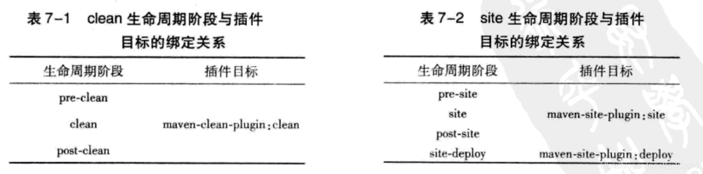
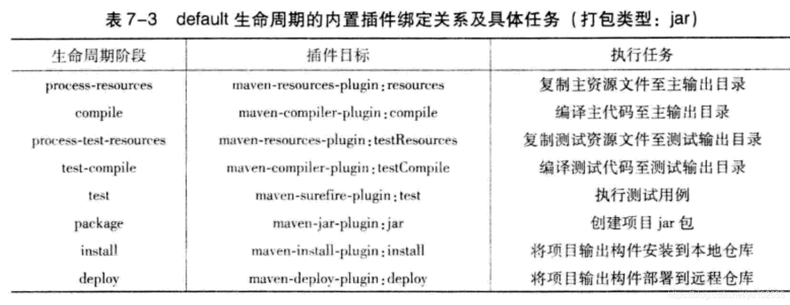
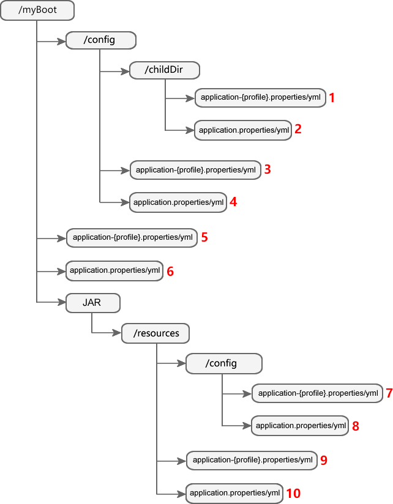

>Spring Boot学习笔记

>2021/12/28 14:55:52 

> https://www.bookstack.cn/read/springboot/spilt.1.pages-getting-started.md
> 
> https://blog.csdn.net/yu102655/article/details/112317985

#序章 Spring Boot背景   
##0.1  SpringBoot产生背景

1. Spring项目需要过多的xml文件配置，因此陷入了配置地狱
 
2.  Pivotal 团队在 Spring 的基础上提供的一套全新的开源框架，其目的是为了简化 Spring 应用的搭建和开发过程

3.  Spring Boot 去除了大量的 XML 配置文件，简化了复杂的依赖管理

##0.2 SpringBoot的优点

-  独立运行的 Spring 项目

Spring Boot 可以以 jar 包的形式独立运行，Spring Boot 项目只需通过命令“ java–jar xx.jar” 即可运行。

- 内嵌 Servlet 容器

Spring Boot 使用嵌入式的 Servlet 容器（例如 Tomcat、Jetty 或者 Undertow 等），应用无需打成 WAR 包 。

- 提供 starter 简化 Maven 配置

Spring Boot 提供了一系列的“starter”项目对象模型（POMS）来简化 Maven 配置。

- 提供了大量的自动配置

Spring Boot 提供了大量的默认自动配置，来简化项目的开发，开发人员也通过配置文件修改默认配置。

- 自带应用监控

Spring Boot 可以对正在运行的项目提供监控。

-  无代码生成和 xml 配置

Spring Boot 不需要任何 xml 配置即可实现 Spring 的所有配置。

----------
#第一章 创建Spring Boot项目
----------
##1.1 配置开发环境
Spring Boot 可以与经典的 Java 开发工具一起使用或者作为命令行工具安装。无论如何，您将需要 JDK 1.8 或者更高版本。在开始之前您应该检查 Java 的安装情况：

    $ java -version

如果您是 Java 开发新手，或者您只想尝试使用 Spring Boot，您可能需要首先尝试使用 Spring Boot CLI，否则请阅读经典的安装说明。

下列为推荐环境：

        Spring Boot	2.x
        JDK	8.0 及以上版本
        Maven 	3.x
        IntelliJ IDEA	14.0 以上

##1.2 创建 Spring Boot 项目
 Intellij IDEA 一般可以通过两种方式创建 Spring Boot 项目：

- 使用 Maven 创建

- 使用 Spring Initializr 创建

###1.2.1 使用 Maven 创建
1. 使用 IntelliJ IDEA 创建一个名称为 helloworld 的 Maven 项目

2. 在该 Maven 项目的 pom.xml 中添加以下配置，导入 Spring Boot 相关的依赖

        <project>
            ...
          <parent>
                <groupId>org.springframework.boot</groupId>
                <artifactId>spring-boot-starter-parent</artifactId>
                <version>2.4.5</version>
                <relativePath/> <!-- lookup parent from repository -->
            </parent>
          
            <dependencies>
                <dependency>
                    <groupId>org.springframework.boot</groupId>
                    <artifactId>spring-boot-starter-web</artifactId>
                </dependency>
                <dependency>
                    <groupId>org.springframework.boot</groupId>
                    <artifactId>spring-boot-starter-test</artifactId>
                    <scope>test</scope>
                </dependency>
            </dependencies>
        ...
        </project>

1. 在包下，创建一个名为 helloWorldApplication 主程序，用来启动 Spring Boot 应用，代码如下

        package net.biancheng.www;
        import org.springframework.boot.SpringApplication;
        import org.springframework.boot.autoconfigure.SpringBootApplication;

        @SpringBootApplication
        public class helloWorldApplication {
            public static void main(String[] args) {
                SpringApplication.run(helloWorldApplication.class, args);
            }
        }

>注意：由于 application.properties 和 application.yml 文件接受 Spring 风格的占位符（${​...}），因此 Maven 过滤改为使用 @..@ 占位符（您可以使用 Maven 的 resource.delimiter 属性重写它）
####1.2.1.1 Maven生命周期
1. Maven从大量项目和构建工具（Maven之前也是有构建工具的）中学习和反思，对所有的构建过程进行抽象和统一，总结出现在Maven的生命周期。这个生命周期包含了项目的清理、初始化、编译、测试、打包、集成测试、验证、部署和站点生成等几乎所有项目构建步骤

1. Maven的生命周期是抽象的，就好比Java中的抽象方法，只声明生命周期和阶段，但本身不做任何实际的工作，实际工作都交由插件来完成；相当于Maven定义算法的整体结构，各个插件来实现实际的行为，保证了可扩展性的同时，又严格控制了生命周期结构

1. Maven有三套独立的生命周期，分别为clean（清理项目）、default（构建项目）、site（建立项目站点）。每个项目周期又分为不同的阶段，比如clean生命周期下的阶段依次为：pre-clean->clean->post-clean，用户通过命令行也好，IDE提供的帮助也罢，执行Maven任务的最主要方式就是调用这些生命周期的阶段。这些生命周期的阶段是有顺序的，并且后面阶段的执行依赖于前面阶段。还是拿clean生命周期举例子：当我们调用post-clean阶段时，由于这个阶段前面存在pre-clean和clean两个阶段，最终pre-clean、clean和post-clean会得以顺序执行。其实这个现象开发过程中常见，比如我们在通过package打包springboot项目时，编译、测试、打包都得以执行。由于每个生命周期，特别是default，包含了多个阶段，在此就不一一列举了，只需要把每个生命周期的起止边界记清楚就可以了。

1. 需要注意的是同一个生命周期的阶段调用是顺序执行，但不同生命周期间的阶段是独立的，这也就是为什么我们会用mvn clean package 这个命令对项目打包的原因了，因为clean和package分属于不同生命周期阶段

####1.2.1.2 Maven插件与插件绑定

1. Maven的核心仅仅是定义了抽象的生命周期以及具体任务分发个具体插件执行

2. 对于一个插件本身而言，它往往能够完成多个任务，一般来说不太可能一个任务对应一个插件。每个可以完成的任务（或者叫做插件的功能）咱们把它称作一个插件目标（goal），像spring-boot-maven-plugin插件有六个目标（goal）。每个goal的名称有英文冒号分隔，黄色框内的叫做插件前缀，绿色框内的称为插件goal。通常spring-boot:repackage就代指spring-boot-maven-plugin插件的repackage功能

1. 插件绑定指的是Maven的生命周期和插件绑定，具体指的是Maven生命周期的阶段与插件的目标进行绑定，以完成某个构建任务。比如default生命周期中的install阶段就是与maven-install-plugin的install（install:install）目标进行绑定来完成安装包到本地仓库的任务。

1. 内置绑定：为了让用户几乎不做任何配置就能构建Maven项目，Maven核心中就默认为一些主要的生命周期阶段绑定了很多插件的目标。内置绑定大致如下，大家简单看下即可，如果英文好一些，根据名称就可以大致了解的：

1. 插件的目标在实现时已经定义了默认绑定阶段，我们可以通过以下命令查看，其中会发现默认绑定的配置:

        mvn help:describe -Dplugin=org.springframework.boot:spring-boot-maven-plugin:2.2.1.RELEASE -Ddetail

##1.2.2 使用 Spring Initializr 创建
1.  在新建工程界面左侧，选择 Spring Initializr，选择项目的 SDK 为 1.8，选择 starter service URL 为 http://start.spring.io（默认）

1. IDEA 会连接网络，并根据 starter service URL 查询 Spring Boot 的当前可用版本和组件列表

1. 在 Spring Initializr Project Settings 中，输入项目的 GroupId、ArtifactId 等内容，注意 Type 为 Maven，packaging 为 jar，Java version 切换为 8（默认为 11）

1. 在 dependencise 界面中，选择 Spring Boot 的版本及所依赖的 Spring Boot 组件（例如 Spring Boot 的版本为 2.4.5， Spring Boot 组件为 Web），然后点击下方的 Next 按钮

1. 根据需要修改项目名称及项目存储位置等信息，最后点击 Finish 按钮，完成 Spring Boot 项目的创建

1. 返回 IDEA 工作区，可以看到 Spring Boot 项目 helloworld 已经创建完成。该项目不但具有完整的目录结构，还有完整的 Maven 配置，并默认生成了一个名为 HelloworldApplication 的主启动程序

----------
#第二章 Spring Boot starter入门
----------
传统的 Spring 项目想要运行，不仅需要导入各种依赖，还要对各种 XML 配置文件进行配置，十分繁琐，

Spring Boot 项目在创建完成后，即使不编写任何代码，不进行任何配置也能够直接运行，这都要归功于 Spring Boot 的 starter 机制。

##2.1 starter

1. Spring Boot 将日常企业应用研发中的各种场景都抽取出来，做成一个个的 starter（启动器）

1. Starter 中整合了各种可能用到的依赖，用户只需要在 Maven 中引入 starter 依赖，SpringBoot 就能自动扫描到要加载的信息并启动相应的默认配置

1. Starter 都遵循着约定成俗的默认配置，并允许用户调整这些配置，即遵循“约定大于配置”的原则

1. Starter 是一组惯例依赖描述资源，可以包含在应用中。从 starter 中，您可以获得所需的所有 Spring 和相关技术的一站式支持，无须通过示例代码和复制粘贴来获取依赖。

> 并不是所有的 starter 都是由 Spring Boot 官方提供的，也有部分 starter 是第三方技术厂商提供的

>例如 druid-spring-boot-starter 和 mybatis-spring-boot-starter 等等。当然也存在个别第三方技术，Spring Boot 官方没提供 starter，第三方技术厂商也没有提供 starter

在 pom.xml 中引入 spring-boot-starter-web，示例代码如下:
        
        <?xml version="1.0" encoding="UTF-8"?>
        <project xmlns="http://maven.apache.org/POM/4.0.0" xmlns:xsi="http://www.w3.org/2001/XMLSchema-instance"
                 xsi:schemaLocation="http://maven.apache.org/POM/4.0.0 https://maven.apache.org/xsd/maven-4.0.0.xsd">
            <modelVersion>4.0.0</modelVersion>
            <!--SpringBoot父项目依赖管理-->
            <parent>
                <groupId>org.springframework.boot</groupId>
                <artifactId>spring-boot-starter-parent</artifactId>
                <version>2.4.5</version>
                <relativePath/>
            </parent>
            ....
            <dependencies>
                <!--导入 spring-boot-starter-web-->
                <dependency>
                    <groupId>org.springframework.boot</groupId>
                    <artifactId>spring-boot-starter-web</artifactId>
                </dependency>
                ...
            </dependencies>
            ...
        </project>

在该项目中执行以下 mvn 命令查看器依赖树

    mvn dependency:tree

您可能会发现一个问题，即在以上 pom.xml 的配置中，引入依赖 spring-boot-starter-web 时，并没有指明其版本（version），但在依赖树中，我们却看到所有的依赖都具有版本信息，这些版本信息是由 spring-boot-starter-parent（版本仲裁中心） 统一控制的

###2.1.1 命名含义

- 官方的所有 starter 都遵循类似的命名规则：spring-boot-starter-*，其中 * 是特定类型的应用。这个命名结构旨在帮助您找到 starter

- 第三方的 starter 命名不应该以 spring-boot 开头，因为它是官方 Spring Boot 构件所保留的规则。例如，有一个第三方 starter 项目叫做 thirdpartyproject，它通常会命名为 thirdpartyproject-spring-boot-starter

Spring Boot 在 `org.springframework.boot group` 下提供了以下应用 starter：

|----|----|
|名称|	描述	|
|spring-boot-starter|	核心 starter，包含自动配置支持、日志和 YAML
|spring-boot-starter-activemq|	提供 JMS 消息支持，使用 Apache ActiveMQ
|spring-boot-starter-amqp|	提供 Spring AMQP 与 Rabbit MQ 支持
|spring-boot-starter-aop	|提供 Spring AOP 与 AspectJ 面向切面编程支持	
|spring-boot-starter-artemis|	提供 JMS 消息服务支持，使用 Apache Artemis	
|spring-boot-starter-batch	|提供 Spring Batch 支持
|spring-boot-starter-cache	|提供 Spring Framework 缓存支持	
|spring-boot-starter-cloud-connectors	|使用 Spring Cloud Connectors 简单连接到类似 Cloud Foundry 和 Heroku 等云平台	
|spring-boot-starter-data-cassandra	|提供对 Cassandra 分布式数据库和 Spring Data Cassandra 的支持	
|spring-boot-starter-data-cassandra-reactive	|提供对 Cassandra 分布式数据库和 Spring Data Cassandra Reactive 的支持	
|spring-boot-starter-data-couchbase	提供对 |Couchbase 面向文档数据库和 Spring Data Couchbase 的支持	
|spring-boot-starter-data-couchbase-reactive|	提供对 Couchbase 面向文档数据库和 Spring Data Couchbase Reactive 的支持	
|spring-boot-starter-data-elasticsearch	|提供对 Elasticseach 搜索与分析引擎和 Spring Data Elasticsearch 的支持	
|spring-boot-starter-data-jpa|	提供 Spring Data JPA 与 Hibernate 的支持
|spring-boot-starter-data-ldap|	提供对 Spring Data LDAP 的支持	
|spring-boot-starter-data-mongodb|	提供对 MongoDB 面向文档数据库和 Spring Data MongoDB 的支持	
|spring-boot-starter-data-mongodb-reactive|	提供对 MongoDB 面向文档数据库和 Spring Data MongoDB Reactive 的支持	
|spring-boot-starter-data-neo4j	|提供对 Neo4j 图数据库与 SPring Data Neo4j 的支持	
|spring-boot-starter-data-redis	|提供对 Redis 键值数据存储、Spring Data Redis 和 Lettuce 客户端的支持	
|spring-boot-starter-data-redis-reactive|	提供对 Redis 键值数据存储、Spring Data Redis Reactive 和 Lettuce 客户端的支持	
|spring-boot-starter-data-rest|	提供使用 Spring Data REST 通过 REST 暴露 Spring Data 资源库的支持	
|spring-boot-starter-data-solr|	提供对 Apache Solr 搜索平台与 Spring Data Solr 的支持	
|spring-boot-starter-freemarker|	提供使用 Freemakrer 视图构建 MVC web 应用的支持	
|spring-boot-starter-groovy-templates|	提供使用 Groovy 模板视图构建 MVC web 应用的支持	
|spring-boot-starter-hateoas	|提供使用 Spring MVC 与Spring HATEOAS 构建基于超媒体的 RESTful web 应用的支持	
|spring-boot-starter-integration|	提供对 Spring Integration 的支持	
|spring-boot-starter-jdbc|	提供 JDBC 与 Tomcat JDBC 连接池的支持	
|spring-boot-starter-jersey|	提供对使用 JAX-RS 与 Jersey 构建 RESTful web 应用的支持。spring-boot-starter-web 的替代方案	
|spring-boot-starter-jooq|	提供对使用 JOOQ 访问 SQL 数据库的支持。spring-boot-starter-data-jpa 或 spring-boot-starter-jdbc 的替代方案	
|spring-boot-starter-json|	提供了读写 json 的支持	
|spring-boot-starter-jta-atomikos|	提供 Atomikos JTA 事务支持	
|spring-boot-starter-jta-bitronix|	提供 Bitronix JTA 事务支持	
|spring-boot-starter-jta-narayana|	提供 Narayana JTA 支持	
|spring-boot-starter-mail|	提供使用　Java Mail 与 Spring Framework 的邮件发送支持	
|spring-boot-starter-mustache|	提供使用 Mustache 视图构建 web 应用的支持	
|spring-boot-starter-quartz	|Quartz 支持	
|spring-boot-starter-security	|Spring Security 支持	
|spring-boot-starter-test	|提供包含了 JUnit、Hamcrest 与 Mockito 类库的 Spring Boot 单元测试支持	
|spring-boot-starter-thymeleaf|	提供使用 Thymeleaf 视图构建 MVC web 应用的支持	
|spring-boot-starter-validation|	提供 Hibernate Validator 与 Java Bean Validation 的支持	
|spring-boot-starter-web	|提供使用 Spring MVC 构建 web（包含 RESTful）应用的支持，使用 Tomcat 作为默认嵌入式容器	
|spring-boot-starter-web-services|	Spring Web Services 支持	
|spring-boot-starter-webflux|	提供使用 Spring Framework 的 Reactive Web 支持构建 WebFlux 应用的支持	
|spring-boot-starter-websocket|	提供使用 Spring Framework 的 WebSocket 支持构建 WebSocket 应用的支持	

**Spring Boot 生产类 starter**

|----|-----|
|名称|	描述|
|spring-boot-starter-actuator	|Spring Boot 的 Actuator 支持，其提供了生产就绪功能，帮助您监控和管理应用	

**Spring Boot 还包含以下 starter，如果您想要排除或切换特定技术，可以使用以下 starter：**

|----|----|
|名称	|描述|	
|spring-boot-starter-jetty|	使用 Jetty 作为嵌入式 servlet 容器。可代替 spring-boot-starter-tomcat
|spring-boot-starter-log4j2|	使用 Log4j2 作为日志组件。可代替 spring-boot-starter-logging	
|spring-boot-starter-logging	|使用 Logback 作为日志组件，此 starter 为默认的日志 starter	
|spring-boot-starter-reactor-netty|	使用 Reactor Netty 作为内嵌响应式 HTTP 服务器	
|spring-boot-starter-tomcat	|使用 Tomcat 作为嵌入式 servlet 容器，此为 spring-boot-starter-web 默认的 servlet 容器 starter	
|spring-boot-starter-undertow	|使用 Undertow 作为嵌入式 servlet 容器，可代替 spring-boot-starter-tomcat	

##2.2 spring-boot-starter-parent

- Sring-boot-starter-parent 是所有 Spring Boot 项目的父级依赖，它被称为 Spring Boot 的版本仲裁中心

        <!--SpringBoot父项目依赖管理-->
        <parent>
            <groupId>org.springframework.boot</groupId>
            <artifactId>spring-boot-starter-parent</artifactId>
            <version>2.4.5</version>
            <relativePath/>
        </parent>

- Spring Boot 项目可以通过继承 spring-boot-starter-parent 来获得一些合理的默认配置，它主要提供了以下特性：

        默认 JDK 版本（Java 8）
        默认字符集（UTF-8）
        依赖管理功能
        资源过滤
        默认插件配置
        识别 application.properties 和 application.yml 类型的配置文件

- 查看 spring-boot-starter- parent 的底层代码，可以发现其有一个父级依赖 spring-boot-dependencies

        <parent>
            <groupId>org.springframework.boot</groupId>
            <artifactId>spring-boot-dependencies</artifactId>
            <version>2.4.5</version>
        </parent>

- spring-boot-dependencies 的底层代码如下

        <?xml version="1.0" encoding="UTF-8"?>
        <project xmlns="http://maven.apache.org/POM/4.0.0"
                 xsi:schemaLocation="http://maven.apache.org/POM/4.0.0 http://maven.apache.org/xsd/maven-4.0.0.xsd"
                 xmlns:xsi="http://www.w3.org/2001/XMLSchema-instance">
            <modelVersion>4.0.0</modelVersion>
            <groupId>org.springframework.boot</groupId>
            <artifactId>spring-boot-dependencies</artifactId>
            <version>2.4.5</version>
            <packaging>pom</packaging>
            ....
            <properties>
                <activemq.version>5.16.1</activemq.version>
                <antlr2.version>2.7.7</antlr2.version>
                <appengine-sdk.version>1.9.88</appengine-sdk.version>
                <artemis.version>2.15.0</artemis.version>
                <aspectj.version>1.9.6</aspectj.version>
                <assertj.version>3.18.1</assertj.version>
                <atomikos.version>4.0.6</atomikos.version>
                ....
            </properties>
            <dependencyManagement>
                <dependencies>
                    <dependency>
                        <groupId>org.apache.activemq</groupId>
                        <artifactId>activemq-amqp</artifactId>
                        <version>${activemq.version}</version>
                    </dependency>
                    <dependency>
                        <groupId>org.apache.activemq</groupId>
                        <artifactId>activemq-blueprint</artifactId>
                        <version>${activemq.version}</version>
                    </dependency>
                    ...
                </dependencies>
            </dependencyManagement>
            <build>
                <pluginManagement>
                    <plugins>
                        <plugin>
                            <groupId>org.codehaus.mojo</groupId>
                            <artifactId>build-helper-maven-plugin</artifactId>
                            <version>${build-helper-maven-plugin.version}</version>
                        </plugin>
                        <plugin>
                            <groupId>org.flywaydb</groupId>
                            <artifactId>flyway-maven-plugin</artifactId>
                            <version>${flyway.version}</version>
                        </plugin>
                        ...
                    </plugins>
                </pluginManagement>
            </build>
        </project>

以上配置中，部分元素说明如下：

- dependencyManagement ：负责管理依赖；

- pluginManagement：负责管理插件；

- properties：负责定义依赖或插件的版本号。
 

spring-boot-dependencies 通过 dependencyManagement 、pluginManagement 和 properties 等元素对一些常用技术框架的依赖或插件进行了统一版本管理，例如 Activemq、Spring、Tomcat 等

##2.3 注解
默认情况下，Maven 将从 src/main/java 目录下编译源代码，因此您需要创建该文件夹结构，之后添加一个名为 src/main/java/Example.java 的文件：

        import org.springframework.boot.*;
        import org.springframework.boot.autoconfigure.*;
        import org.springframework.web.bind.annotation.*;
        @RestController
        @EnableAutoConfiguration
        public class Example {
            @RequestMapping("/")
            String home() {
                return "Hello World!";
            }
            public static void main(String[] args) throws Exception {
                SpringApplication.run(Example.class, args);
            }
        }

###2.3.1 @RestController 与 @RequestMapping 注解

- Example 类中的第一个注解是 @RestController，该注解被称作 stereotype 注解。它能为代码阅读者提供一些提示，对于 Spring 而言，这个类具有特殊作用。在本例中，该类是一个 web @Controller，因此 Spring 在处理传入的 web 请求时会考虑它。

- @RequestMapping 注解提供了 routing（路由）信息。它告诉 Spring，任何具有路径为 / 的 HTTP 请求都应映射到 home 方法。@RestController 注解告知 Spring 渲染结果字符串直接返回给调用者。

>@RestController 和 @RequestMapping 是 Spring MVC 注解（它们不是 Spring Boot 特有的）

###2.3.2 @EnableAutoConfiguration 注解

- 第二个类级别注解是 @EnableAutoConfiguration。此注解告知 Spring Boot 根据您添加的 jar 依赖来“猜测”您想如何配置 Spring 并进行自动配置

- 由于 spring-boot-starter-web 添加了 Tomcat 和 Spring MVC，auto-configuration（自动配置）将假定您要开发 web 应用并相应设置了 Spring。

>Starter 与自动配置 Auto-configuration 被设计与 Starter 配合使用，但这两个概念并不是直接相关的。您可以自由选择 starter 之外的 jar 依赖，Spring Boot 仍然会自动配置您的应用程序

###2.3.3 @SpringBootApplication 注解

- 很多 Spring Boot 开发者总是使用 @Configuration、@EnableAutoConfiguration 和 @ComponentScan 注解标记在主类上。

- 由于 这些注解经常一起使用，Spring Boot 提供了一个更方便的 @SpringBootApplication 注解可用来替代这个组合。

        package com.example.myapplication;
        import org.springframework.boot.SpringApplication;
        import org.springframework.boot.autoconfigure.SpringBootApplication;
        @SpringBootApplication // 相当于使用 @Configuration @EnableAutoConfiguration @ComponentScan
        public class Application {
            public static void main(String[] args) {
                SpringApplication.run(Application.class, args);
            }
        }

###2.3.4 main 方法

- 应用的最后一部分是 main 方法。这只是一个标准方法，其遵循 Java 规范中定义的应用程序入口点。

- 我们的 main 方法通过调用 run 来委托 Spring Boot 的 SpringApplication 类，SpringApplication 类将引导我们的应用，启动 Spring，然后启动自动配置的 Tomcat web 服务器。

- 我们需要将 Example.class 作为一个参数传递给 run 方法来告知 SpringApplication，它是 Spring 主组件。同时还传递 args 数组以暴露所有命令行参数

###2.3.5 创建可执行 jar
我们通过创建一个完全自包含（self-contained）的可执行 jar 文件完成了示例。

- 该 jar 文件可以在生产环境中运行。

- 可执行 jar（有时又称为 fat jars）是包含了编译后的类以及代码运行时所需要相关的 jar 依赖的归档文件。

可执行 jar 与 Java

- Java 不提供任何标准方式来加载嵌套的 jar 文件（比如本身包含在 jar 中的 jar 文件）。如果您想分发自包含的应用，这可能是个问题。

- 为了解决此问题，许多开发人员使用了 uber jar，uber jar 从所有应用的依赖中打包所有的类到一个归档中。这种方法的问题在于，您很难看出应用程序实际上使用到了哪些库。如果在多个 jar 中使用了相同的文件名（但内容不同），这也可能产生问题。

- Spring Boot 采用了不同方方式，可以直接对 jar 进行嵌套。

要创建可执行 jar，我们需要将 spring-boot-maven-plugin 添加到 pom.xml 文件中。在 dependencies 下方插入以下配置：

        <build>
            <plugins>
                <plugin>
                    <groupId>org.springframework.boot</groupId>
                    <artifactId>spring-boot-maven-plugin</artifactId>
                </plugin>
            </plugins>
        </build>

>spring-boot-starter-parent POM 包含了 <executions> 配置，用于绑定 repackage 。如果您没有使用父 POM，您需要自己声明此配置。

 保存 pom.xml 并在命令行中运行 mvn package：
  

- 如果您浏览 target 目录，您应该会看到 myproject-0.0.1-SNAPSHOT.jar。该文件的大小大约为 10 MB。如果您想要查看里面的内容，可以使用 jar tvf：

        $ jar tvf target/myproject-0.0.1-SNAPSHOT.jar

- 您应该还会在 target 目录中看到一个名为 myproject-0.0.1-SNAPSHOT.jar.original 的较小文件。这是在 Spring Boot 重新打包之前由 Maven 所创建的原始 jar 文件。

- 使用 java -jar 命令运行该应用：

        $ java -jar target/myproject-0.0.1-SNAPSHOT.jar

##2.4 开发者工具
Spring Boot 包含了一套工具，可以使应用开发体验更加愉快。spring-boot-devtools 模块可包含在任何项目中，以提供额外的开发时（development-time）功能。要启用 devtools 支持，只需要将模块依赖添加到您的构建配置中即可：

        <dependencies>
            <dependency>
                <groupId>org.springframework.boot</groupId>
                <artifactId>spring-boot-devtools</artifactId>
                <optional>true</optional>
            </dependency>
        </dependencies>

###2.4.1 Property 默认值

- Spring Boot 所支持的一些库使用了缓存来提高性能。例如，模板引擎将缓存编译后的模板，以避免重复解析模板文件。此外，Spring MVC 可以在服务静态资源时添加 HTTP 缓存头。

- 虽然缓存在生产中非常有用，但它在开发过程可能会产生相反的效果，让您不能及时看到刚才在应用中作出的更改。因此，spring-boot-devtools 将默认禁用这些缓存选项。

- 一般是在 application.properties 文件中设置缓存选项。例如，Thymeleaf 提供了 spring.thymeleaf.cache 属性。您不需要手动设置这些属性，spring-boot-devtools 会自动应用合适的开发时（development-time）配置。

###2.4.2 自动重启

1. 使用 spring-boot-devtools 的应用在 classpath 下的文件发生更改时会自动重启。这对于使用 IDE 工作而言可能是一个非常棒的功能，因为它为代码变更提供了非常块的反馈环。默认情况下，将监视 classpath 指向的所有文件夹。请注意，某些资源（如静态资源和视图模板）不需要重启应用。

1. 当 DevTools 监视 classpath 资源时，触发重启的唯一方式是更新 classpath。使 classpath 更新的方式取决于您使用的 IDE。在 Eclipse 中，保存修改的文件将更新 classpath，从而触发重启。在 IntelliJ IDEA 中，构建项目（Build -> Make Project) 将产生相同的效果。

----------
#第三章 YAML
----------
Spring Boot 提供了大量的自动配置，极大地简化了spring 应用的开发过程，当用户创建了一个 Spring Boot 项目后，即使不进行任何配置，该项目也能顺利的运行起来。当然，用户也可以根据自身的需要使用配置文件修改 Spring Boot 的默认设置。

SpringBoot 默认使用以下 2 种全局的配置文件，其文件名是固定的。

1. application.properties

1. application.yml

其中，application.yml 是一种使用 YAML 语言编写的文件，它与 application.properties 一样，可以在 Spring Boot 启动时被自动读取，修改 Spring Boot 自动配置的默认值。

##3.1 YAML 简介
YAML 全称 YAML Ain't Markup Language，它是一种以数据为中心的标记语言，比 XML 和 JSON 更适合作为配置文件。

想要使用 YAML 作为属性配置文件（以 .yml 或 .yaml 结尾），需要将 SnakeYAML 库添加到 classpath 下

Spring Boot 中的 spring-boot-starter-web 或 spring-boot-starter 都对 SnakeYAML 库做了集成， 只要项目中引用了这两个 Starter 中的任何一个，Spring Boot 会自动添加 SnakeYAML 库到 classpath 下。

下面是一个简单的 application.yml 属性配置文件：
    
    server:
      port: 8081

##3.2 YAML 语法
YAML 的语法如下：

1. 使用缩进表示层级关系。

1. 缩进时不允许使用 Tab 键，只允许使用空格。

1. 缩进的空格数不重要，但同级元素必须左侧对齐。

1. 大小写敏感。

        spring:
          profiles: dev
          datasource:
            url: jdbc:mysql://127.0.01/banchengbang_springboot
            username: root
            password: root
            driver-class-name: com.mysql.jdbc.Driver

##3.3 YAML 常用写法
YAML 支持以下三种数据结构：

- 对象：键值对的集合

- 数组：一组按次序排列的值

- 字面量：单个的、不可拆分的值

###3.3.1 YAML 字面量写法

- 字面量是指单个的，不可拆分的值，例如：数字、字符串、布尔值、以及日期等。

- 在 YAML 中，使用“key:[空格]value”的形式表示一对键值对（空格不能省略），如 url: www.biancheng.net。

- 字面量直接写在键值对的“value”中即可，且默认情况下字符串是不需要使用单引号或双引号的

    name: bianchengbang

- 若字符串使用单引号，则会转义特殊字符。

        name: 'zhangsan \n lisi'

        输出结果为：
        
        zhangsan \n lisi

- 若字符串使用双引号，则不会转义特殊字符，特殊字符会输出为其本身想表达的含义

        name: "zhangsan \n lisi"
        输出结果为：
         
        zhangsan 
        lisi

###3.3.2 YAML 对象写法
在 YAML 中，对象可能包含多个属性，每一个属性都是一对键值对。

YAML 为对象提供了 2 种写法：
 

1. 普通写法，使用缩进表示对象与属性的层级关系。
    
        website: 
          name: bianchengbang
          url: www.biancheng.net
 

1. 行内写法：

        website: {name: bianchengbang,url: www.biancheng.net}

###3.3.3 YAML 数组写法
YAML 使用“-”表示数组中的元素

1. 普通写法如下：

        pets:
          -dog
          -cat
          -pig

1. 行内写法
    
        pets: [dog,cat,pig]

###3.3.4 复合结构
以上三种数据结构可以任意组合使用，以实现不同的用户需求，例如：

        person:
          name: zhangsan
          age: 30
          pets:
            -dog
            -cat
            -pig
          car:
            name: QQ
          child:
            name: zhangxiaosan
            age: 2

##3.4 YAML 组织结构

一个 YAML 文件可以由一个或多个文档组成，文档之间使用“---”作为分隔符，且个文档相互独立，互不干扰。如果 YAML 文件只包含一个文档，则“---”分隔符可以省略。
 
        ---
        website:
          name: bianchengbang
          url: www.biancheng.net
        ---
        website: {name: bianchengbang,url: www.biancheng.net}
        pets:
          -dog
          -cat
          -pig
        ---
        pets: [dog,cat,pig]
        name: "zhangsan \n lisi"
        ---
        name: 'zhangsan \n lisi'

----------
#第四章 Spring Boot配置绑定
----------
所谓“配置绑定”就是把配置文件中的值与 JavaBean 中对应的属性进行绑定

SpringBoot 提供了以下 2 种方式进行配置绑定：

1. 使用 @ConfigurationProperties 注解

1. 使用 @Value 注解

##4.1 @ConfigurationProperties
通过 Spring Boot 提供的 @ConfigurationProperties 注解，可以将全局配置文件中的配置数据绑定到 JavaBean 中

1.  在 helloworld 的全局配置文件 application.yml 中添加以下自定义属性。

        person:
          lastName: 张三
          age: 18
          boss: false
          birth: 1990/12/12
          maps: { k1: v1,k2: 12 }
          lists:
            ‐ lisi
            ‐ zhaoliu
          dog:
            name: 迪迪
            age: 5

2.  在 helloworld 项目的 net.biancheng.www.bean 中创建一个名为 Person 的实体类，并将配置文件中的属性映射到这个实体类上

        package net.biancheng.www.bean;
        import org.springframework.boot.context.properties.ConfigurationProperties;
        import org.springframework.stereotype.Component;
        import java.util.Date;
        import java.util.List;
        import java.util.Map;
        /**
        * 将配置文件中配置的每一个属性的值，映射到这个组件中
        *
        * @ConfigurationProperties：告诉 SpringBoot 将本类中的所有属性和配置文件中相关的配置进行绑定；
        * prefix = "person"：配置文件中哪个下面的所有属性进行一一映射
        *
        * 只有这个组件是容器中的组件，才能使用容器提供的@ConfigurationProperties功能；
        */
        @Component
        @ConfigurationProperties(prefix = "person")
        public class Person {
            private String lastName;
            private Integer age;
            private Boolean boss;
            private Date birth;
            private Map<String, Object> maps;
            private List<Object> lists;
            private Dog dog;
            public Person() {
            }
            public String getLastName() {
                return lastName;
            }
            public void setLastName(String lastName) {
                this.lastName = lastName;
            }
            public Integer getAge() {
                return age;
            }
            public void setAge(Integer age) {
                this.age = age;
            }
            public Boolean getBoss() {
                return boss;
            }
            public void setBoss(Boolean boss) {
                this.boss = boss;
            }
            public Date getBirth() {
                return birth;
            }
            public void setBirth(Date birth) {
                this.birth = birth;
            }
            public Map<String, Object> getMaps() {
                return maps;
            }
            public void setMaps(Map<String, Object> maps) {
                this.maps = maps;
            }
            public List<Object> getLists() {
                return lists;
            }
            public void setLists(List<Object> lists) {
                this.lists = lists;
            }
            public Dog getDog() {
                return dog;
            }
            public void setDog(Dog dog) {
                this.dog = dog;
            }
            public Person(String lastName, Integer age, Boolean boss, Date birth, Map<String, Object> maps, List<Object> lists, Dog dog) {
                this.lastName = lastName;
                this.age = age;
                this.boss = boss;
                this.birth = birth;
                this.maps = maps;
                this.lists = lists;
                this.dog = dog;
            }
            @Override
            public String toString() {
                return "Person{" +
                        "lastName='" + lastName + '\'' +
                        ", age=" + age +
                        ", boss=" + boss +
                        ", birth=" + birth +
                        ", maps=" + maps +
                        ", lists=" + lists +
                        ", dog=" + dog +
                        '}';
            }
        }

        注意：
        
        只有在容器中的组件，才会拥有 SpringBoot 提供的强大功能。
        如果我们想要使用 @ConfigurationProperties 注解进行配置绑定，
        那么首先就要保证该对 JavaBean 对象在 IoC 容器中，
        所以需要用到 @Component 注解来添加组件到容器中。
        
        JavaBean 上使用了注解 @ConfigurationProperties(prefix = "person") ，
        它表示将这个 JavaBean 中的所有属性与配置文件中以“person”为前缀的配置进行绑定

3. 在 net.biancheng.www.bean 中，创建一个名为 Dog 的 JavaBean，代码如下

        package net.biancheng.www.bean;
        public class Dog {
            private String name;
            private String age;
            public Dog() {
            }
            public Dog(String name, String age) {
                this.name = name;
                this.age = age;
            }
            public void setName(String name) {
                this.name = name;
            }
            public void setAge(String age) {
                this.age = age;
            }
            public String getName() {
                return name;
            }
            public String getAge() {
                return age;
            }
        }

1. 修改 HelloController 的代码，在浏览器中展示配置文件中各个属性值，代码如下:

        package net.biancheng.www.controller;
        import net.biancheng.www.bean.Person;
        import org.springframework.beans.factory.annotation.Autowired;
        import org.springframework.stereotype.Controller;
        import org.springframework.web.bind.annotation.RequestMapping;
        import org.springframework.web.bind.annotation.ResponseBody;
        @Controller
        public class HelloController {
            @Autowired
            private Person person;
            @ResponseBody
            @RequestMapping("/hello")
            public Person hello() {
                return person;
            }
        }

##4.2 @Value

当我们只需要读取配置文件中的某一个配置时，可以通过 @Value 注解获取

1. 以 Spring Boot 项目 helloworld 为例，修改实体类 Person 中的代码，使用 @Value 注解进行配置绑定，代码如下。

        package net.biancheng.www.bean;
        import org.springframework.beans.factory.annotation.Value;
        import org.springframework.boot.context.properties.ConfigurationProperties;
        import org.springframework.stereotype.Component;
        import java.util.Date;
        import java.util.List;
        import java.util.Map;
        @Component
        public class Person {
            @Value("${person.lastName}")
            private String lastName;
            @Value("${person.age}")
            private Integer age;
            @Value("${person.boss}")
            private Boolean boss;
            @Value("${person.birth}")
            private Date birth;
            private Map<String, Object> maps;
            private List<Object> lists;
            private Dog dog;
            public Person() {
            }
            public String getLastName() {
                return lastName;
            }
            public void setLastName(String lastName) {
                this.lastName = lastName;
            }
            public Integer getAge() {
                return age;
            }
            public void setAge(Integer age) {
                this.age = age;
            }
            public Boolean getBoss() {
                return boss;
            }
            public void setBoss(Boolean boss) {
                this.boss = boss;
            }
            public Date getBirth() {
                return birth;
            }
            public void setBirth(Date birth) {
                this.birth = birth;
            }
            public Map<String, Object> getMaps() {
                return maps;
            }
            public void setMaps(Map<String, Object> maps) {
                this.maps = maps;
            }
            public List<Object> getLists() {
                return lists;
            }
            public void setLists(List<Object> lists) {
                this.lists = lists;
            }
            public Dog getDog() {
                return dog;
            }
            public void setDog(Dog dog) {
                this.dog = dog;
            }
            public Person(String lastName, Integer age, Boolean boss, Date birth, Map<String, Object> maps, List<Object> lists, Dog dog) {
                this.lastName = lastName;
                this.age = age;
                this.boss = boss;
                this.birth = birth;
                this.maps = maps;
                this.lists = lists;
                this.dog = dog;
            }
            @Override
            public String toString() {
                return "Person{" +
                        "lastName='" + lastName + '\'' +
                        ", age=" + age +
                        ", boss=" + boss +
                        ", birth=" + birth +
                        ", maps=" + maps +
                        ", lists=" + lists +
                        ", dog=" + dog +
                        '}';
            }
        }

##4.3 @Value 与 @ConfigurationProperties 对比
@Value 和 @ConfigurationProperties 注解都能读取配置文件中的属性值并绑定到 JavaBean 中，但两者存在以下不同

###4.3.1  使用位置不同

- @ConfigurationProperties：标注在 JavaBean 的类名上；

- @Value：标注在 JavaBean 的属性上。

###4.3.2功能不同

- @ConfigurationProperties：用于批量绑定配置文件中的配置；

- @Value：只能一个一个的指定需要绑定的配置。

###4.3.3 松散绑定支持不同

@ConfigurationProperties：支持松散绑定（松散语法），例如实体类 Person 中有一个属性为 lastName，那么配置文件中的属性名支持以下写法：

- person.firstName

- person.first-name

- person.first_name

- PERSON_FIRST_NAME
 
@Vaule：不支持松散绑定。

###4.3.4 SpEL 支持不同

- @ConfigurationProperties：不支持 SpEL 表达式;

- @Value：支持 SpEL 表达式。

###4.3.5 复杂类型封装

- @ConfigurationProperties：支持所有类型数据的封装，例如 Map、List、Set、以及对象等；

- @Value：只支持基本数据类型的封装，例如字符串、布尔值、整数等类型。

###4.3.6 应用场景不同

@Value 和 @ConfigurationProperties 两个注解之间，并没有明显的优劣之分，它们只是适合的应用场景不同而已:

1. 若只是获取配置文件中的某项值，则推荐使用 @Value 注解；

1. 若专门编写了一个 JavaBean 来和配置文件进行映射，则建议使用 @ConfigurationProperties 注解。

##4.4 @PropertySource 

如果将所有的配置都集中到 application.properties 或 application.yml 中，那么这个配置文件会十分的臃肿且难以维护

因此我们通常会将与 Spring Boot 无关的配置（例如自定义配置）提取出来，写在一个单独的配置文件中，并在对应的 JavaBean 上使用 @PropertySource 注解指向该配置文件

1. 以 helloworld 为例，将与 person 相关的自定义配置移动到 src/main/resources 下的 person.properties 中（注意，必须把 application.properties 或 application.yml 中的相关配置删除）,person.properties 的配置如下:

        person.last-name=李四
        person.age=12
        person.birth=2000/12/15
        person.boss=false
        person.maps.k1=v1
        person.maps.k2=14
        person.lists=a,b,c
        person.dog.name=dog
        person.dog.age=2

2. 在 Person 使用 @PropertySource 注解指向 person.properties，代码如下:

        package net.biancheng.www.bean;
        import org.springframework.beans.factory.annotation.Value;
        import org.springframework.boot.context.properties.ConfigurationProperties;
        import org.springframework.context.annotation.PropertySource;
        import org.springframework.stereotype.Component;
        import java.util.Date;
        import java.util.List;
        import java.util.Map;
        @PropertySource(value = "classpath:person.properties")//指向对应的配置文件
        @Component
        @ConfigurationProperties(prefix = "person")
        public class Person {
            private String lastName;
            private Integer age;
            private Boolean boss;
            private Date birth;
            private Map<String, Object> maps;
            private List<Object> lists;
            private Dog dog;
            public Person() {
            }
            public String getLastName() {
                return lastName;
            }
            public void setLastName(String lastName) {
                this.lastName = lastName;
            }
            public Integer getAge() {
                return age;
            }
            public void setAge(Integer age) {
                this.age = age;
            }
            public Boolean getBoss() {
                return boss;
            }
            public void setBoss(Boolean boss) {
                this.boss = boss;
            }
            public Date getBirth() {
                return birth;
            }
            public void setBirth(Date birth) {
                this.birth = birth;
            }
            public Map<String, Object> getMaps() {
                return maps;
            }
            public void setMaps(Map<String, Object> maps) {
                this.maps = maps;
            }
            public List<Object> getLists() {
                return lists;
            }
            public void setLists(List<Object> lists) {
                this.lists = lists;
            }
            public Dog getDog() {
                return dog;
            }
            public void setDog(Dog dog) {
                this.dog = dog;
            }
            public Person(String lastName, Integer age, Boolean boss, Date birth, Map<String, Object> maps, List<Object> lists, Dog dog) {
                this.lastName = lastName;
                this.age = age;
                this.boss = boss;
                this.birth = birth;
                this.maps = maps;
                this.lists = lists;
                this.dog = dog;
            }
            @Override
            public String toString() {
                return "Person{" +
                        "lastName='" + lastName + '\'' +
                        ", age=" + age +
                        ", boss=" + boss +
                        ", birth=" + birth +
                        ", maps=" + maps +
                        ", lists=" + lists +
                        ", dog=" + dog +
                        '}';
            }
        }

----------
#第五章 Spring Boot导入Spring配置
----------
默认情况下，Spring Boot 中是不包含任何的 Spring 配置文件的，即使我们手动添加 Spring 配置文件到项目中，也不会被识别。那么 Spring Boot 项目中真的就无法导入 Spring 配置吗？答案是否定的。

Spring Boot 为了我们提供了以下 2 种方式来导入 Spring 配置：

- 使用 @ImportResource 注解加载 Spring 配置文件

- 使用全注解方式加载 Spring 配置

##5.1 @ImportResource 导入 Spring 配置文件
在主启动类上使用 @ImportResource 注解可以导入一个或多个 Spring 配置文件，并使其中的内容生效。

1. 以 helloworld 为例，在 net.biancheng.www.service 包下创建一个名为 PersonService 的接口，代码如下

        package net.biancheng.www.service;
        import net.biancheng.www.bean.Person;
        public interface PersonService {
            public Person getPersonInfo();
        }
 
2. 在 net.biancheng.www.service.impl 包下创建一个名为 PersonServiceImpl 的类，并实现 PersonService 接口，代码如下

        package net.biancheng.www.service.impl;
        import net.biancheng.www.bean.Person;
        import net.biancheng.www.service.PersonService;
        import org.springframework.beans.factory.annotation.Autowired;
        public class PersonServiceImpl implements PersonService {
            @Autowired
            private Person person;
            @Override
            public Person getPersonInfo() {
                return person;
            }
        }

3. 在该项目的 resources 下添加一个名为 beans.xml 的 Spring 配置文件，配置代码如下

        <?xml version="1.0" encoding="UTF-8"?>
        <beans xmlns="http://www.springframework.org/schema/beans"
               xmlns:xsi="http://www.w3.org/2001/XMLSchema-instance"
               xsi:schemaLocation="http://www.springframework.org/schema/beans http://www.springframework.org/schema/beans/spring-beans.xsd">
            <bean id="personService" class="net.biancheng.www.service.impl.PersonServiceImpl"></bean>
        </beans>

4. 修改该项目的单元测试类 HelloworldApplicationTests ，校验 IOC 容器是否已经 personService，代码如下。

        package net.biancheng.www;
        import net.biancheng.www.bean.Person;
        import org.junit.jupiter.api.Test;
        import org.springframework.beans.factory.annotation.Autowired;
        import org.springframework.boot.test.context.SpringBootTest;
        import org.springframework.context.ApplicationContext;
        @SpringBootTest
        class HelloworldApplicationTests {
            @Autowired
            Person person;
            //IOC 容器
            @Autowired
            ApplicationContext ioc;
            @Test
            public void testHelloService() {
                //校验 IOC 容器中是否包含组件 personService
                boolean b = ioc.containsBean("personService");
                if (b) {
                    System.out.println("personService 已经添加到 IOC 容器中");
                } else {
                    System.out.println("personService 没添加到 IOC 容器中");
                }
            }
            @Test
            void contextLoads() {
                System.out.println(person);
            }
        }

6. 运行单元测试代码，发现personService没有添加到IOC容器中

7. 在主启动程序类上使用 @ImportResource 注解，将 Spring 配置文件 beans.xml 加载到项目中，代码如下：

        package net.biancheng.www;
        import org.springframework.boot.SpringApplication;
        import org.springframework.boot.autoconfigure.SpringBootApplication;
        import org.springframework.context.annotation.ImportResource;
        //将 beans.xml 加载到项目中
        @ImportResource(locations = {"classpath:/beans.xml"})
        @SpringBootApplication
        public class HelloworldApplication {
            public static void main(String[] args) {
                SpringApplication.run(HelloworldApplication.class, args);
            }
        }

8. 再次执行测试代码，发现personService已经添加到IOC容器中

##5.2 全注解方式加载 Spring 配置
Spring Boot 推荐我们使用全注解的方式加载 Spring 配置，其实现方式如下：

1. 使用 @Configuration 注解定义配置类，替换 Spring 的配置文件；

1. 配置类内部可以包含有一个或多个被 @Bean 注解的方法，这些方法会被AnnotationConfigApplicationContext 或 AnnotationConfigWebApplicationContext 类扫描，构建 bean 定义（相当于 Spring 配置文件中的<bean></bean>标签），方法的返回值会以组件的形式添加到容器中，组件的 id 就是方法名。

以 helloworld 为例，删除主启动类的 @ImportResource 注解，在 net.biancheng.www.config 包下添加一个名为  MyAppConfig 的配置类，代码如下：

        package net.biancheng.www.config;
        import net.biancheng.www.service.PersonService;
        import net.biancheng.www.service.impl.PersonServiceImpl;
        import org.springframework.context.annotation.Bean;
        import org.springframework.context.annotation.Configuration;
        /**
        * @Configuration 注解用于定义一个配置类，相当于 Spring 的配置文件
        * 配置类中包含一个或多个被 @Bean 注解的方法，该方法相当于 Spring 配置文件中的 <bean> 标签定义的组件。
        */
        @Configuration
        public class MyAppConfig {
            /**
             * 与 <bean id="personService" class="PersonServiceImpl"></bean> 等价
             * 该方法返回值以组件的形式添加到容器中
             * 方法名是组件 id（相当于 <bean> 标签的属性 id)
             */
            @Bean
            public PersonService personService() {
                System.out.println("在容器中添加了一个组件:peronService");
                return new PersonServiceImpl();
            }
        }

----------
#第六章 Spring Boot Profile（多环境配置）
----------
在实际的项目开发中，一个项目通常会存在多个环境，例如，开发环境、测试环境和生产环境等。

不同环境的配置也不尽相同，例如开发环境使用的是开发数据库，测试环境使用的是测试数据库，而生产环境使用的是线上的正式数据库。

Profile 为在不同环境下使用不同的配置提供了支持，我们可以通过激活、指定参数等方式快速切换环境。
##6.1 多 Profile 文件方式
Spring Boot 的配置文件共有两种形式：.properties  文件和 .yml 文件，文件命名格式为：

    application-{profile}.properties/yml

其中，{profile} 一般为各个环境的名称或简称，例如 dev、test 和 prod 等等

###6.1.1 properties 配置
在 helloworld 的 src/main/resources 下添加 4 个配置文件：

1. application.properties：主配置文件

1. application-dev.properties：开发环境配置文件

1. application-test.properties：测试环境配置文件

1. application-prod.properties：生产环境配置文件

在 applcation.properties 文件中，指定默认服务器端口号为 8080，并通过以下配置激活生产环境（prod）的 profile。

        #默认端口号
        server.port=8080
        #激活指定的profile
        spring.profiles.active=prod

在 application-dev.properties 中，指定开发环境端口号为 8081，配置如下

        # 开发环境
        server.port=8081

在 application-test.properties 中，指定测试环境端口号为 8082，配置如下。

        # 测试环境
        server.port=8082

在 application-prod.properties 中，指定生产环境端口号为 8083，配置如下。

        # 生产环境
        server.port=8083

###6.1.2 yml 配置
与 properties 文件类似，我们也可以添加 4 个配置文件：

1. application.yml：默认配置

1. application-dev.yml：开发环境配置

1. application-test.yml：测试环境配置

1. application-prod.yml：生产环境配置

在 applcation.yml 文件中指定默认服务端口号为 8080，并通过以下配置来激活开发环境的 profile。

        #默认配置
        server:
          port: 8080
        #切换配置
        spring:
          profiles:
            active: dev #激活开发环境配置

在 application-dev.yml 中指定开发环境端口号为 8081，配置如下。

        #开发环境
        server:
          port: 8081

在 application-test.yml 中指定测试环境端口号为 8082，配置如下。

        #测试环境
        server:
          port: 8082

在 application-prod.yml 中指定生产环境端口号为 8083，配置如下。

        #生产环境
        server:
          port: 8083

##6.2 多 Profile 文档块模式

在 YAML 配置文件中，可以使用“---”把配置文件分割成了多个文档块

因此我们可以在不同的文档块中针对不同的环境进行不同的配置，并在第一个文档块内对配置进行切换。

    #默认配置
    server:
      port: 8080
    #切换配置
    spring:
      profiles:
        active: test
    ---
    #开发环境
    server:
      port: 8081
    spring:
      config:
        activate:
          on-profile: dev
    ---
    #测试环境
    server:
      port: 8082
    spring:
      config:
        activate:
          on-profile: test
    ---
    #生产环境
    server:
      port: 8083
    spring:
      config:
        activate:
          on-profile: prod

##6.3 激活 Profile
除了可以在配置文件中激活指定 Profile，Spring Boot 还为我们提供了另外 2 种激活 Profile 的方式：

1. 命令行激活

1. 虚拟机参数激活

###6.3.1 命令行激活

我们可以将 Spring Boot 项目打包成 JAR 文件，并在通过命令行运行时，配置命令行参数，激活指定的 Profile。

我们还以 helloworld 为例，执行以下 mvn 命令将项目打包。

    mvn clean package

打开命令行窗口，跳转到 JAR 文件所在目录，执行以下命令，启动该项目，并激活开发环境（dev）的 Profile

    java -jar helloworld-0.0.1-SNAPSHOT.jar  --spring.profiles.active=dev

以上命令中，--spring.profiles.active=dev 为激活开发环境（dev）Profile 的命令行参数。

###6.3.2 虚拟机参数激活
我们还可以在 Spring Boot 项目运行时，指定虚拟机参数来激活指定的 Profile。

以 helloworld 为例，将该项目打包成 JAR 文件后，打开命令行窗口跳转到 JAR 所在目录，执行以下命令，激活生产环境（prod）Profile。

    java -Dspring.profiles.active=prod -jar helloworld-0.0.1-SNAPSHOT.jar

以上命令中，-Dspring.profiles.active=prod 为激活生产环境（prod）Profile 的虚拟机参数。

----------
#第七章 Spring Boot配置文件
----------

1. 通常情况下，Spring Boot 在启动时会将 resources 目录下的 application.properties 或 apllication.yml 作为其默认配置文件

1. 但这并不意味着 Spring Boot 项目中只能存在一个 application.properties 或 application.yml

1. Spring Boot 启动时，会自动加载 JAR 包内部及 JAR 包所在目录指定位置的配置文件（Properties 文件、YAML 文件），下图中展示了 Spring Boot 自动加载的配置文件的位置及其加载顺序，同一位置下，Properties 文件优先级高于 YAML 文件

说明如下：

1. /myBoot：表示 JAR 包所在目录，目录名称自定义；

1. /childDir：表示 JAR 包所在目录下 config 目录的子目录，目录名自定义；

1. JAR：表示 Spring Boot 项目打包生成的 JAR；

1. 其余带有“/”标识的目录的目录名称均不能修改。

1. 红色数字：表示该配置文件的优先级，数字越小优先级越高。

这些配置文件得优先级顺序，遵循以下规则：

1. 先加载 JAR 包外的配置文件，再加载 JAR 包内的配置文件；

1. 先加载 config 目录内的配置文件，再加载 config 目录外的配置文件；

1. 先加载 config 子目录下的配置文件，再加载 config 目录下的配置文件；

1. 先加载 appliction-{profile}.properties/yml，再加载 application.properties/yml；

1. 先加载 .properties 文件，再加载 .yml 文件。

##7.1 默认配置文件
Spring Boot 项目中可以存在多个 application.properties 或 apllication.yml。

Spring Boot 启动时会扫描以下 5 个位置的  application.properties 或 apllication.yml 文件，并将它们作为 Spring boot 的默认配置文件。

1. file:./config/

1. file:./config/*/

1. file:./

1. classpath:/config/

1. classpath:/

以上所有位置的配置文件都会被加载，且它们优先级依次降低，序号越小优先级越高。

其次，位于相同位置的 application.properties 的优先级高于 application.yml。

所有位置的文件都会被加载，高优先级配置会覆盖低优先级配置，形成互补配置，即：

- 存在相同的配置内容时，高优先级的内容会覆盖低优先级的内容；

- 存在不同的配置内容时，高优先级和低优先级的配置内容取并集。

##7.2 外部配置文件
除了默认配置文件，Spring Boot 还可以加载一些位于项目外部的配置文件。我们可以通过如下 2 个参数，指定外部配置文件的路径：

1. spring.config.location 

1. spring.config.additional-location 

###7.2.1 spring.config.location
我们可以先将 Spring Boot 项目打包成 JAR 文件，然后在命令行启动命令中，使用命令行指定外部配置文件的路径

    java -jar {JAR}  --spring.config.location={外部配置文件全路径}

需要注意的是，使用该参数指定配置文件后，会使项目默认配置文件（application.properties 或 application.yml ）失效，Spring Boot 将只加载指定的外部配置文件。

###7.2.2 spring.config.additional-location

我们还可以在 Spring Boot 启动时，使用命令行参数 --spring.config.additional-location 来加载外部配置文件。

    java -jar {JAR}  --spring.config.additional-location={外部配置文件全路径}

但与 --spring.config.location 不同，--spring.config.additional-location 不会使项目默认的配置文件失效

使用该命令行参数添加的外部配置文件会与项目默认的配置文件共同生效，形成互补配置，且其优先级是最高的，比所有默认配置文件的优先级都高。

注意：Maven 对项目进行打包时，位于项目根目录下的配置文件是无法被打包进项目的 JAR 包的，因此位于根目录下的默认配置文件无法在 JAR 中生效，即该项目将只加载指定的外部配置文件和项目类路径（classpath）下的默认配置文件，它们的加载优先级顺序为：

1. spring.config.additional-location 指定的外部配置文件 my-application.yml

1. classpath:/config/application.yml

1. classpath:/application.yml

将 Spring Boot 项目打包后，然后在命令行启动命令中添加 spring.config.additional-location 参数指定外部配置文件，会导致项目根目录下的配置文件无法被加载，我们可以通过以下 3 种方式解决这个问题。

1. 在 IDEA 的运行配置（Run/Debug Configuration）中，添加虚拟机参数 

        -Dspring.config.additional-location=D:\myConfig\my-application.yml

    指定外部配置文件；

1. 在 IDEA 的运行配置（Run/Debug Configuration）中，添加程序运行参数 

        --spring.config.additional-location=D:\myConfig\my-application.yml
    指定外部配置文件；

1. 在主启动类中调用 System.setProperty（）方法添加系统属性 

        spring.config.additional-location
    指定外部配置文件。

----------
#第八章 Spring Boot自动配置原理
----------

- Spring Boot 项目创建完成后，即使不进行任何的配置，也能够顺利地运行，这都要归功于 Spring Boot 的自动化配置。

- Spring Boot 默认使用 application.properties 或 application.yml 作为其全局配置文件，我们可以在该配置文件中对各种自动配置属性（server.port、logging.level.* 、spring.config.active.no-profile 等等）进行修改，并使之生效

##8.1 Spring Factories 机制

- Spring Boot 的自动配置是基于 Spring Factories 机制实现的。

- Spring Factories 机制是 Spring Boot 中的一种服务发现机制，这种扩展机制与 Java SPI 机制十分相似。

- Spring Boot 会自动扫描所有 Jar 包类路径下 META-INF/spring.factories 文件，并读取其中的内容，进行实例化，这种机制也是 Spring Boot Starter 的基础。

##8.1.1 spring.factories 

- spring.factories 文件本质上与 properties 文件相似，其中包含一组或多组键值对（key=vlaue）

- 其中，key 的取值为接口的完全限定名；value 的取值为接口实现类的完全限定名，一个接口可以设置多个实现类，不同实现类之间使用“，”隔开，例如：
        
        org.springframework.boot.autoconfigure.AutoConfigurationImportFilter=\
        org.springframework.boot.autoconfigure.condition.OnBeanCondition,\
        org.springframework.boot.autoconfigure.condition.OnClassCondition,\
        org.springframework.boot.autoconfigure.condition.OnWebApplicationCondition

注意：文件中配置的内容过长，为了阅读方便而手动换行时，为了防止内容丢失可以使用“\”。

##8.1.2 Spring Factories 实现原理

- spring-core 包里定义了 SpringFactoriesLoader 类，这个类会扫描所有 Jar 包类路径下的 META-INF/spring.factories 文件，并获取指定接口的配置。

在 SpringFactoriesLoader 类中定义了两个对外的方法，如下表:

|----|----|----|
|返回值	|方法	|描述|
|<T> List<T> |	loadFactories(Class<T> factoryType, @Nullable ClassLoader classLoader)|	静态方法；根据接口获取其实现类的实例；该方法返回的是实现类对象列表。|
|List<String>|	loadFactoryNames(Class<?> factoryType, @Nullable ClassLoader classLoader) |	公共静态方法；根据接口l获取其实现类的名称；该方法返回的是实现类的类名的列表

以上两个方法的关键都是从指定的 ClassLoader 中获取 spring.factories 文件，并解析得到类名列表，具体代码如下：

1. loadFactories() 方法能够获取指定接口的实现类对象：
        
        public static <T> List<T> loadFactories(Class<T> factoryType, @Nullable ClassLoader classLoader) {
            Assert.notNull(factoryType, "'factoryType' must not be null");
            ClassLoader classLoaderToUse = classLoader;
            if (classLoader == null) {
                classLoaderToUse = SpringFactoriesLoader.class.getClassLoader();
            }
            // 调用loadFactoryNames获取接口的实现类
            List<String> factoryImplementationNames = loadFactoryNames(factoryType, classLoaderToUse);
            if (logger.isTraceEnabled()) {
                logger.trace("Loaded [" + factoryType.getName() + "] names: " + factoryImplementationNames);
            }
            // 遍历 factoryNames 数组，创建实现类的对象
            List<T> result = new ArrayList(factoryImplementationNames.size());
            Iterator var5 = factoryImplementationNames.iterator();
            //排序
            while(var5.hasNext()) {
                String factoryImplementationName = (String)var5.next();
                result.add(instantiateFactory(factoryImplementationName, factoryType, classLoaderToUse));
            }
            AnnotationAwareOrderComparator.sort(result);
            return result;
        }

1. loadFactoryNames() 方法能够根据接口获取其实现类类名的集合：

        public static List<String> loadFactoryNames(Class<?> factoryType, @Nullable ClassLoader classLoader) {
            ClassLoader classLoaderToUse = classLoader;
            if (classLoader == null) {
                classLoaderToUse = SpringFactoriesLoader.class.getClassLoader();
            }
            String factoryTypeName = factoryType.getName();
            //获取自动配置类
            return (List)loadSpringFactories(classLoaderToUse).getOrDefault(factoryTypeName, Collections.emptyList());
        }

1. loadSpringFactories() 方法能够读取该项目中所有 Jar 包类路径下 META-INF/spring.factories 文件的配置内容，并以 Map 集合的形式返回：

        private static Map<String, List<String>> loadSpringFactories(ClassLoader classLoader) {
            Map<String, List<String>> result = (Map)cache.get(classLoader);
            if (result != null) {
                return result;
            } else {
                HashMap result = new HashMap();
            try {
                //扫描所有 Jar 包类路径下的 META-INF/spring.factories 文件
                Enumeration urls = classLoader.getResources("META-INF/spring.factories");
                while(urls.hasMoreElements()) {
                        URL url = (URL)urls.nextElement();
                        UrlResource resource = new UrlResource(url);
                        //将扫描到的 META-INF/spring.factories 文件中内容包装成 properties 对象
                        Properties properties = PropertiesLoaderUtils.loadProperties(resource);
                        Iterator var6 = properties.entrySet().iterator();
                        while(var6.hasNext()) {
                            Map.Entry<?, ?> entry = (Map.Entry)var6.next();
                            //提取 properties 对象中的 key 值
                            String factoryTypeName = ((String)entry.getKey()).trim();
                            //提取 proper 对象中的 value 值（多个类的完全限定名使用逗号连接的字符串）
                            // 使用逗号为分隔符转换为数组，数组内每个元素都是配置类的完全限定名
                            String[] factoryImplementationNames = StringUtils.commaDelimitedListToStringArray((String)entry.getValue());
                            String[] var10 = factoryImplementationNames;
                            int var11 = factoryImplementationNames.length;
                            //遍历配置类数组，并将数组转换为 list 集合
                            for(int var12 = 0; var12 < var11; ++var12) {
                                String factoryImplementationName = var10[var12];
                                ((List)result.computeIfAbsent(factoryTypeName, (key) -> {
                                    return new ArrayList();
                                })).add(factoryImplementationName.trim());
                            }
                        }
                    }
                    //将 propertise 对象的 key 与由配置类组成的 List 集合一一对应存入名为 result 的 Map 中
                    result.replaceAll((factoryType, implementations) -> {
                        return (List)implementations.stream().distinct().collect(Collectors.collectingAndThen(Collectors.toList(), Collections::unmodifiableList));
                    });
                    cache.put(classLoader, result);
                    //返回 result
                    return result;
                } catch (IOException var14) {
                    throw new IllegalArgumentException("Unable to load factories from location [META-INF/spring.factories]", var14);
                }
             }
        }

##8.2 自动配置的加载
Spring Boot 自动化配置也是基于 Spring Factories 机制实现的，

在 spring-boot-autoconfigure-xxx.jar 类路径下的 META-INF/spring.factories 中设置了 Spring Boot 自动配置的内容 ，如下：

    # Auto Configure
    org.springframework.boot.autoconfigure.EnableAutoConfiguration=\
    org.springframework.boot.autoconfigure.admin.SpringApplicationAdminJmxAutoConfiguration,\
    org.springframework.boot.autoconfigure.aop.AopAutoConfiguration,\
    org.springframework.boot.autoconfigure.amqp.RabbitAutoConfiguration,\
    org.springframework.boot.autoconfigure.batch.BatchAutoConfiguration,\
    org.springframework.boot.autoconfigure.cache.CacheAutoConfiguration,\
    org.springframework.boot.autoconfigure.cassandra.CassandraAutoConfiguration,\
    org.springframework.boot.autoconfigure.context.ConfigurationPropertiesAutoConfiguration,\
    org.springframework.boot.autoconfigure.context.LifecycleAutoConfiguration,\
    org.springframework.boot.autoconfigure.context.MessageSourceAutoConfiguration,\
    org.springframework.boot.autoconfigure.context.PropertyPlaceholderAutoConfiguration,\
    org.springframework.boot.autoconfigure.couchbase.CouchbaseAutoConfiguration,\
    org.springframework.boot.autoconfigure.dao.PersistenceExceptionTranslationAutoConfiguration,\
    org.springframework.boot.autoconfigure.data.cassandra.CassandraDataAutoConfiguration,\
    org.springframework.boot.autoconfigure.data.cassandra.CassandraReactiveDataAutoConfiguration,\
    org.springframework.boot.autoconfigure.data.cassandra.CassandraReactiveRepositoriesAutoConfiguration,\
    org.springframework.boot.autoconfigure.data.cassandra.CassandraRepositoriesAutoConfiguration,\
    org.springframework.boot.autoconfigure.data.couchbase.CouchbaseDataAutoConfiguration,\
    org.springframework.boot.autoconfigure.data.couchbase.CouchbaseReactiveDataAutoConfiguration,\
    org.springframework.boot.autoconfigure.data.couchbase.CouchbaseReactiveRepositoriesAutoConfiguration,\
    org.springframework.boot.autoconfigure.data.couchbase.CouchbaseRepositoriesAutoConfiguration,\
    org.springframework.boot.autoconfigure.data.elasticsearch.ElasticsearchDataAutoConfiguration,\
    org.springframework.boot.autoconfigure.data.elasticsearch.ElasticsearchRepositoriesAutoConfiguration,\
    org.springframework.boot.autoconfigure.data.elasticsearch.ReactiveElasticsearchRepositoriesAutoConfiguration,\
    org.springframework.boot.autoconfigure.data.elasticsearch.ReactiveElasticsearchRestClientAutoConfiguration,\
    org.springframework.boot.autoconfigure.data.jdbc.JdbcRepositoriesAutoConfiguration,\
    org.springframework.boot.autoconfigure.data.jpa.JpaRepositoriesAutoConfiguration,\
    org.springframework.boot.autoconfigure.data.ldap.LdapRepositoriesAutoConfiguration,\
    org.springframework.boot.autoconfigure.data.mongo.MongoDataAutoConfiguration,\
    org.springframework.boot.autoconfigure.data.mongo.MongoReactiveDataAutoConfiguration,\
    org.springframework.boot.autoconfigure.data.mongo.MongoReactiveRepositoriesAutoConfiguration,\
    org.springframework.boot.autoconfigure.data.mongo.MongoRepositoriesAutoConfiguration,\
    org.springframework.boot.autoconfigure.data.neo4j.Neo4jDataAutoConfiguration,\
    org.springframework.boot.autoconfigure.data.neo4j.Neo4jReactiveDataAutoConfiguration,\
    org.springframework.boot.autoconfigure.data.neo4j.Neo4jReactiveRepositoriesAutoConfiguration,\
    org.springframework.boot.autoconfigure.data.neo4j.Neo4jRepositoriesAutoConfiguration,\
    org.springframework.boot.autoconfigure.data.solr.SolrRepositoriesAutoConfiguration,\
    org.springframework.boot.autoconfigure.data.r2dbc.R2dbcDataAutoConfiguration,\
    org.springframework.boot.autoconfigure.data.r2dbc.R2dbcRepositoriesAutoConfiguration,\
    org.springframework.boot.autoconfigure.data.redis.RedisAutoConfiguration,\
    org.springframework.boot.autoconfigure.data.redis.RedisReactiveAutoConfiguration,\
    org.springframework.boot.autoconfigure.data.redis.RedisRepositoriesAutoConfiguration,\
    org.springframework.boot.autoconfigure.data.rest.RepositoryRestMvcAutoConfiguration,\
    org.springframework.boot.autoconfigure.data.web.SpringDataWebAutoConfiguration,\
    org.springframework.boot.autoconfigure.elasticsearch.ElasticsearchRestClientAutoConfiguration,\
    org.springframework.boot.autoconfigure.flyway.FlywayAutoConfiguration,\
    org.springframework.boot.autoconfigure.freemarker.FreeMarkerAutoConfiguration,\
    org.springframework.boot.autoconfigure.groovy.template.GroovyTemplateAutoConfiguration,\
    org.springframework.boot.autoconfigure.gson.GsonAutoConfiguration,\
    org.springframework.boot.autoconfigure.h2.H2ConsoleAutoConfiguration,\
    org.springframework.boot.autoconfigure.hateoas.HypermediaAutoConfiguration,\
    org.springframework.boot.autoconfigure.hazelcast.HazelcastAutoConfiguration,\
    org.springframework.boot.autoconfigure.hazelcast.HazelcastJpaDependencyAutoConfiguration,\
    org.springframework.boot.autoconfigure.http.HttpMessageConvertersAutoConfiguration,\
    org.springframework.boot.autoconfigure.http.codec.CodecsAutoConfiguration,\
    org.springframework.boot.autoconfigure.influx.InfluxDbAutoConfiguration,\
    org.springframework.boot.autoconfigure.info.ProjectInfoAutoConfiguration,\
    org.springframework.boot.autoconfigure.integration.IntegrationAutoConfiguration,\
    org.springframework.boot.autoconfigure.jackson.JacksonAutoConfiguration,\
    org.springframework.boot.autoconfigure.jdbc.DataSourceAutoConfiguration,\
    org.springframework.boot.autoconfigure.jdbc.JdbcTemplateAutoConfiguration,\
    org.springframework.boot.autoconfigure.jdbc.JndiDataSourceAutoConfiguration,\
    org.springframework.boot.autoconfigure.jdbc.XADataSourceAutoConfiguration,\
    org.springframework.boot.autoconfigure.jdbc.DataSourceTransactionManagerAutoConfiguration,\
    org.springframework.boot.autoconfigure.jms.JmsAutoConfiguration,\
    org.springframework.boot.autoconfigure.jmx.JmxAutoConfiguration,\
    org.springframework.boot.autoconfigure.jms.JndiConnectionFactoryAutoConfiguration,\
    org.springframework.boot.autoconfigure.jms.activemq.ActiveMQAutoConfiguration,\
    org.springframework.boot.autoconfigure.jms.artemis.ArtemisAutoConfiguration,\
    org.springframework.boot.autoconfigure.jersey.JerseyAutoConfiguration,\
    org.springframework.boot.autoconfigure.jooq.JooqAutoConfiguration,\
    org.springframework.boot.autoconfigure.jsonb.JsonbAutoConfiguration,\
    org.springframework.boot.autoconfigure.kafka.KafkaAutoConfiguration,\
    org.springframework.boot.autoconfigure.availability.ApplicationAvailabilityAutoConfiguration,\
    org.springframework.boot.autoconfigure.ldap.embedded.EmbeddedLdapAutoConfiguration,\
    org.springframework.boot.autoconfigure.ldap.LdapAutoConfiguration,\
    org.springframework.boot.autoconfigure.liquibase.LiquibaseAutoConfiguration,\
    org.springframework.boot.autoconfigure.mail.MailSenderAutoConfiguration,\
    org.springframework.boot.autoconfigure.mail.MailSenderValidatorAutoConfiguration,\
    org.springframework.boot.autoconfigure.mongo.embedded.EmbeddedMongoAutoConfiguration,\
    org.springframework.boot.autoconfigure.mongo.MongoAutoConfiguration,\
    org.springframework.boot.autoconfigure.mongo.MongoReactiveAutoConfiguration,\
    org.springframework.boot.autoconfigure.mustache.MustacheAutoConfiguration,\
    org.springframework.boot.autoconfigure.neo4j.Neo4jAutoConfiguration,\
    org.springframework.boot.autoconfigure.orm.jpa.HibernateJpaAutoConfiguration,\
    org.springframework.boot.autoconfigure.quartz.QuartzAutoConfiguration,\
    org.springframework.boot.autoconfigure.r2dbc.R2dbcAutoConfiguration,\
    org.springframework.boot.autoconfigure.r2dbc.R2dbcTransactionManagerAutoConfiguration,\
    org.springframework.boot.autoconfigure.rsocket.RSocketMessagingAutoConfiguration,\
    org.springframework.boot.autoconfigure.rsocket.RSocketRequesterAutoConfiguration,\
    org.springframework.boot.autoconfigure.rsocket.RSocketServerAutoConfiguration,\
    org.springframework.boot.autoconfigure.rsocket.RSocketStrategiesAutoConfiguration,\
    org.springframework.boot.autoconfigure.security.servlet.SecurityAutoConfiguration,\
    org.springframework.boot.autoconfigure.security.servlet.UserDetailsServiceAutoConfiguration,\
    org.springframework.boot.autoconfigure.security.servlet.SecurityFilterAutoConfiguration,\
    org.springframework.boot.autoconfigure.security.reactive.ReactiveSecurityAutoConfiguration,\
    org.springframework.boot.autoconfigure.security.reactive.ReactiveUserDetailsServiceAutoConfiguration,\
    org.springframework.boot.autoconfigure.security.rsocket.RSocketSecurityAutoConfiguration,\
    org.springframework.boot.autoconfigure.security.saml2.Saml2RelyingPartyAutoConfiguration,\
    org.springframework.boot.autoconfigure.sendgrid.SendGridAutoConfiguration,\
    org.springframework.boot.autoconfigure.session.SessionAutoConfiguration,\
    org.springframework.boot.autoconfigure.security.oauth2.client.servlet.OAuth2ClientAutoConfiguration,\
    org.springframework.boot.autoconfigure.security.oauth2.client.reactive.ReactiveOAuth2ClientAutoConfiguration,\
    org.springframework.boot.autoconfigure.security.oauth2.resource.servlet.OAuth2ResourceServerAutoConfiguration,\
    org.springframework.boot.autoconfigure.security.oauth2.resource.reactive.ReactiveOAuth2ResourceServerAutoConfiguration,\
    org.springframework.boot.autoconfigure.solr.SolrAutoConfiguration,\
    org.springframework.boot.autoconfigure.task.TaskExecutionAutoConfiguration,\
    org.springframework.boot.autoconfigure.task.TaskSchedulingAutoConfiguration,\
    org.springframework.boot.autoconfigure.thymeleaf.ThymeleafAutoConfiguration,\
    org.springframework.boot.autoconfigure.transaction.TransactionAutoConfiguration,\
    org.springframework.boot.autoconfigure.transaction.jta.JtaAutoConfiguration,\
    org.springframework.boot.autoconfigure.validation.ValidationAutoConfiguration,\
    org.springframework.boot.autoconfigure.web.client.RestTemplateAutoConfiguration,\
    org.springframework.boot.autoconfigure.web.embedded.EmbeddedWebServerFactoryCustomizerAutoConfiguration,\
    org.springframework.boot.autoconfigure.web.reactive.HttpHandlerAutoConfiguration,\
    org.springframework.boot.autoconfigure.web.reactive.ReactiveWebServerFactoryAutoConfiguration,\
    org.springframework.boot.autoconfigure.web.reactive.WebFluxAutoConfiguration,\
    org.springframework.boot.autoconfigure.web.reactive.error.ErrorWebFluxAutoConfiguration,\
    org.springframework.boot.autoconfigure.web.reactive.function.client.ClientHttpConnectorAutoConfiguration,\
    org.springframework.boot.autoconfigure.web.reactive.function.client.WebClientAutoConfiguration,\
    org.springframework.boot.autoconfigure.web.servlet.DispatcherServletAutoConfiguration,\
    org.springframework.boot.autoconfigure.web.servlet.ServletWebServerFactoryAutoConfiguration,\
    org.springframework.boot.autoconfigure.web.servlet.error.ErrorMvcAutoConfiguration,\
    org.springframework.boot.autoconfigure.web.servlet.HttpEncodingAutoConfiguration,\
    org.springframework.boot.autoconfigure.web.servlet.MultipartAutoConfiguration,\
    org.springframework.boot.autoconfigure.web.servlet.WebMvcAutoConfiguration,\
    org.springframework.boot.autoconfigure.websocket.reactive.WebSocketReactiveAutoConfiguration,\
    org.springframework.boot.autoconfigure.websocket.servlet.WebSocketServletAutoConfiguration,\
    org.springframework.boot.autoconfigure.websocket.servlet.WebSocketMessagingAutoConfiguration,\
    org.springframework.boot.autoconfigure.webservices.WebServicesAutoConfiguration,\
    org.springframework.boot.autoconfigure.webservices.client.WebServiceTemplateAutoConfiguration

以上配置中，value 取值是由多个 xxxAutoConfiguration （使用逗号分隔）组成，每个 xxxAutoConfiguration 都是一个自动配置类。Spring Boot 启动时，会利用 Spring-Factories 机制，将这些 xxxAutoConfiguration 实例化并作为组件加入到容器中，以实现 Spring Boot 的自动配置。

##8.3 @SpringBootApplication 注解
所有 Spring Boot 项目的主启动程序类上都使用了一个 @SpringBootApplication 注解，该注解是 Spring Boot 中最重要的注解之一 ，也是 Spring Boot 实现自动化配置的关键。 

@SpringBootApplication 是一个组合元注解，其主要包含两个注解：

@SpringBootConfiguration 和 @EnableAutoConfiguration，

其中 @EnableAutoConfiguration 注解是 SpringBoot 自动化配置的核心所在。

###8.3.1 @EnableAutoConfiguration 注解
@EnableAutoConfiguration 注解用于开启 Spring Boot 的自动配置功能， 它使用 Spring 框架提供的 @Import 注解通过 AutoConfigurationImportSelector类（选择器）给容器中导入自动配置组件。
    
    @Target(ElementType.TYPE)
    @Retention(RetentionPolicy.RUNTIME)
    @Documented
    @Inherited
    @AutoConfigurationPackage
    @Import(AutoConfigurationImportSelector.class)
    public @interface EnableAutoConfiguration {...

###8.3.2 AutoConfigurationImportSelector 类
AutoConfigurationImportSelector 类实现了 DeferredImportSelector 接口，AutoConfigurationImportSelector 中还包含一个静态内部类 AutoConfigurationGroup，它实现了 DeferredImportSelector 接口的内部接口 Group（Spring 5 新增）。

AutoConfigurationImportSelector 类中包含 3 个方法，如下表。

|----|----|----|----|----|
|返回值|	方法声明|	描述|	内部类方法|	内部类|
|Class<? extends Group>|	getImportGroup()|	该方法获取实现了 Group 接口的类，并实例化	|否	| 
|void|	process(AnnotationMetadata annotationMetadata, DeferredImportSelector deferredImportSelector)|	该方法用于引入自动配置的集合|	是	|AutoConfigurationGroup|
|Iterable<Entry>	|selectImports()	|遍历自动配置类集合（Entry 类型的集合），并逐个解析集合中的配置类	|是|	AutoConfigurationGroup

AutoConfigurationImportSelector 内各方法执行顺序如下。

1. getImportGroup() 方法

1. process() 方法

1. selectImports() 方法

####8.3.2.1 getImportGroup() 方法
AutoConfigurationImportSelector 类中 getImportGroup() 方法主要用于获取实现了 DeferredImportSelector.Group 接口的类，代码如下。
    
        public Class<? extends Group> getImportGroup() {
            //获取实现了 DeferredImportSelector.Gorup 接口的 AutoConfigurationImportSelector.AutoConfigurationGroup 类
            return AutoConfigurationImportSelector.AutoConfigurationGroup.class;
        }

####8.3.2.2  process() 方法

1. 静态内部类 AutoConfigurationGroup 中的核心方法是 process()，该方法通过调用 getAutoConfigurationEntry() 方法读取 spring.factories 文件中的内容，获得自动配置类的集合，代码如下 。
    
        public void process(AnnotationMetadata annotationMetadata, DeferredImportSelector deferredImportSelector) {
            Assert.state(deferredImportSelector instanceof AutoConfigurationImportSelector, () -> {
                return String.format("Only %s implementations are supported, got %s", AutoConfigurationImportSelector.class.getSimpleName(), deferredImportSelector.getClass().getName());
            });
            //拿到 META-INF/spring.factories中的EnableAutoConfiguration，并做排除、过滤处理
            //AutoConfigurationEntry里有需要引入配置类和排除掉的配置类，最终只要返回需要配置的配置类
            AutoConfigurationImportSelector.AutoConfigurationEntry autoConfigurationEntry = ((AutoConfigurationImportSelector)deferredImportSelector).getAutoConfigurationEntry(annotationMetadata);
            //加入缓存,List<AutoConfigurationEntry>类型
            this.autoConfigurationEntries.add(autoConfigurationEntry);
            Iterator var4 = autoConfigurationEntry.getConfigurations().iterator();
            while(var4.hasNext()) {
                String importClassName = (String)var4.next();
                //加入缓存，Map<String, AnnotationMetadata>类型
                this.entries.putIfAbsent(importClassName, annotationMetadata);
            }
        }

1. getAutoConfigurationEntry() 方法通过调用 getCandidateConfigurations() 方法来获取自动配置类的完全限定名，并在经过排除、过滤等处理后，将其缓存到成员变量中，具体代码如下。

        protected AutoConfigurationImportSelector.AutoConfigurationEntry getAutoConfigurationEntry(AnnotationMetadata annotationMetadata) {
            if (!this.isEnabled(annotationMetadata)) {
                return EMPTY_ENTRY;
            } else {
                //获取注解元数据中的属性设置
                AnnotationAttributes attributes = this.getAttributes(annotationMetadata);
                //获取自动配置类
                List<String> configurations = this.getCandidateConfigurations(annotationMetadata, attributes);
                //删除list 集合中重复的配置类
                configurations = this.removeDuplicates(configurations);
                //获取飘出导入的配置类
                Set<String> exclusions = this.getExclusions(annotationMetadata, attributes);
                //检查是否还存在排除配置类
                this.checkExcludedClasses(configurations, exclusions);
                //删除排除的配置类
                configurations.removeAll(exclusions);
                //获取过滤器，过滤配置类
                configurations = this.getConfigurationClassFilter().filter(configurations);
                //出发自动化配置导入事件
                this.fireAutoConfigurationImportEvents(configurations, exclusions);
                return new AutoConfigurationImportSelector.AutoConfigurationEntry(configurations, exclusions);
            }
        }

1. 在 getCandidateConfigurations() 方法中，根据 Spring Factories 机制调用 SpringFactoriesLoader 的 loadFactoryNames() 方法，根据 EnableAutoConfiguration.class （自动配置接口）获取其实现类（自动配置类）的类名的集合，如下图:

##8.4 自动配置的生效和修改
自动配置的生效和修改
spring.factories 文件中的所有自动配置类（xxxAutoConfiguration），都是必须在一定的条件下才会作为组件添加到容器中，配置的内容才会生效。这些限制条件在 Spring Boot 中以 @Conditional 派生注解的形式体现，如下表。

|----|----|
|注解|	生效条件|
|@ConditionalOnJava|	应用使用指定的 Java 版本时生效
|@ConditionalOnBean	|容器中存在指定的  Bean 时生效
|@ConditionalOnMissingBean |	容器中不存在指定的 Bean 时生效
|@ConditionalOnExpression	|满足指定的 SpEL 表达式时生效
|@ConditionalOnClass	|存在指定的类时生效
|@ConditionalOnMissingClass|	不存在指定的类时生效
|@ConditionalOnSingleCandidate| 	容器中只存在一个指定的 Bean 或这个 Bean 为首选 Bean 时生效
|@ConditionalOnProperty	|系统中指定属性存在指定的值时生效
|@ConditionalOnResource	|类路径下存在指定的资源文件时生效
|@ConditionalOnWebApplication|	当前应用是 web 应用时生效
|@ConditionalOnNotWebApplication|	当前应用不是 web 应用生效

1. 我们看到，ServletWebServerFactoryAutoConfiguration 使用了一个 @EnableConfigurationProperties 注解，而 ServerProperties 类上则使用了一个 @ConfigurationProperties 注解。这其实是 Spring Boot 自动配置机制中的通用用法。

1. Spring Boot 中为我们提供了大量的自动配置类 XxxAutoConfiguration 以及 XxxProperties，每个自动配置类 XxxAutoConfiguration 都使用了 @EnableConfigurationProperties 注解，而每个 XxxProperties 上都使用 @ConfigurationProperties 注解。

1. @ConfigurationProperties 注解的作用，是将这个类的所有属性与配置文件中相关的配置进行绑定，以便于获取或修改配置，但是 @ConfigurationProperties 功能是由容器提供的，被它注解的类必须是容器中的一个组件，否则该功能就无法使用。而 @EnableConfigurationProperties 注解的作用正是将指定的类以组件的形式注入到 IOC 容器中，并开启其 @ConfigurationProperties 功能。因此，@ConfigurationProperties + @EnableConfigurationProperties 组合使用，便可以为 XxxProperties 类实现配置绑定功能。

1. 自动配置类 XxxAutoConfiguration 负责使用 XxxProperties 中属性进行自动配置，而 XxxProperties 则负责将自动配置属性与配置文件的相关配置进行绑定，以便于用户通过配置文件修改默认的自动配置。也就是说，真正“限制”我们可以在配置文件中配置哪些属性的类就是这些 XxxxProperties 类，它与配置文件中定义的 prefix 关键字开头的一组属性是唯一对应的。

1. 注意：XxxAutoConfiguration 与 XxxProperties 并不是一一对应的，大多数情况都是多对多的关系，即一个 XxxAutoConfiguration 可以同时使用多个 XxxProperties 中的属性，一个 XxxProperties 类中属性也可以被多个 XxxAutoConfiguration 使用。

----------
#第九章 Spring Boot日志框架
----------

----------
#第十章 spring-boot-starter-web（Web启动器）
----------

----------
#第十一章 Thymeleaf教程
----------

----------
#第十二章 Spring Boot国际化
----------

----------
#第十三章 Spring Boot拦截器
----------

----------
#第十四章 Spring Boot异常处理机制
----------

----------
#第十五章 Spring Boot JDBC访问数据库
----------

----------
#第十六章 Spring Boot整合MyBatis
----------

----------
#第十七章 Spring Boot自定义starter
----------

