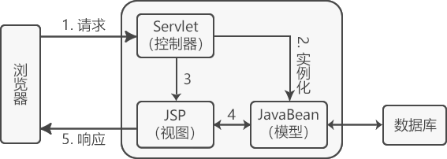

> Spring MVC学习笔记
> 
> http://c.biancheng.net/spring_mvc/controller-requestmapping.html
> 
> 2021/12/22 19:27:34 
#序章 Spring MVC框架背景
##0.1 Sping MVC的优点

1. Spring MVC 在 Model、View 和 Controller 方面提供了一个非常清晰的角色划分，这 3 个方面真正是各司其职，各负其责。

1. 灵活的配置功能，可以把类当作 Bean 通过 XML 进行配置。

1. 提供了大量的控制器接口和实现类，开发者可以使用 Spring 提供的控制器实现类，也可以自己实现控制器接口。
真正做到与 View 层的实现无关。

1. 不会强制开发者使用 JSP，可以根据项目需求使用 Velocity、FreeMarker 等技术。

1. 国际化支持

1. 面向接口编程

1. 与 Spring 框架无缝集成

##0.2 MVC 设计模式

MVC 设计模式各层一般指：

-  M（Model）指数据模型层

- V（View）指视图层

- C（Controller）指控制层。

使用 MVC 的目的是将 M 和 V 的实现代码分离，使同一个程序可以有不同的表现形式。其中，View 的定义比较清晰，就是用户界面

- 视图层（View）：负责格式化数据并把它们呈现给用户，包括数据展示、用户交互、数据验证、界面设计等功能。

- 控制层（Controller）：负责接收并转发请求，对请求进行处理后，指定视图并将响应结果发送给客户端。

- 数据模型层（Model）：模型对象拥有最多的处理任务，是应用程序的主体部分，它负责数据逻辑（业务规则）的处理和实现数据操作（即在数据库中存取数据）

SUN 公司推出 JSP 技术的同时，也推出了两种 Web 应用程序的开发模式。即 JSP+JavaBean 和 Servlet+JSP+JavaBean。

##0.3 JSP+JavaBean
JSP+JavaBean 中 JSP 用于处理用户请求，JavaBean 用于封装和处理数据。

该模式只有视图和模型，一般把控制器的功能交给视图来实现，适合业务流程比较简单的 Web 程序。

-  JSP 从 HTTP Request（请求）中获得所需的数据，并进行业务逻辑的处理，然后将结果通过 HTTP Response（响应）返回给浏览器。

- JSP+JavaBean 模式在一定程度上实现了 MVC，即 JSP 将控制层和视图合二为一，JavaBean 为模型层。

JSP+JavaBean 模式中 JSP 身兼数职，既要负责视图层的数据显示，又要负责业务流程的控制，结构较为混乱，并且也不是我们所希望的松耦合架构模式，所以当业务流程复杂的时候并不推荐使用

##0.4 Servlet+JSP+JavaBean
Servlet+JSP+JavaBean 中 Servlet 用于处理用户请求，JSP 用于数据显示，JavaBean 用于数据封装，适合复杂的 Web 程序

- 相比 JSP+JavaBean 模式来说，Servlet+JSP+JavaBean 模式将控制层单独划分出来负责业务流程的控制，接收请求，创建所需的 JavaBean 实例，并将处理后的数据返回视图层（JSP）进行界面数据展示。

- Servlet+JSP+JavaBean 模式的结构清晰，是一个松耦合架构模式，一般情况下，建议使用该模式。

##0.5 MVC优缺点 
任何一件事都有利有弊，下面来了解一下 MVC 的优缺点

 优点

- 多视图共享一个模型，大大提高了代码的可重用性

- MVC 三个模块相互独立，松耦合架构

- 控制器提高了应用程序的灵活性和可配置性

- 有利于软件工程化管理

- 我们通过 MVC 设计模式最终可以打造出一个松耦合+高可重用性+高可适用性的完美架构

缺点

- 原理复杂

- 增加了系统结构和实现的复杂性

- 视图对模型数据的低效率访问

- MVC 并不适合小型甚至中型规模的项目，花费大量时间将 MVC 应用到规模并不是很大的应用程序，通常得不偿失，所以对于 MVC 设计模式的使用要根据具体的应用场景来决定

##0.6 Spring MVC和Struts2的区别
###0.6.1 Spring MVC 基于方法开发，Struts2 基于类开发

1. 在使用 Spring MVC 框架进行开发时，会将 URL 请求路径与 Controller 类的某个方法进行绑定，请求参数作为该方法的形参。当用户请求该 URL 路径时， Spring MVC 会将 URL 信息与 Controller 类的某个方法进行映射，生成 Handler 对象，该对象中只包含了一个 method 方法。方法执行结束之后，形参数据也会被销毁。

1. 在使用 Struts2 框架进行开发时，Action 类中所有方法使用的请求参数都是 Action 类中的成员变量，随着方法变得越来越多，就很难分清楚 Action 中那么多的成员变量到底是给哪一个方法使用的，整个 Action 类会变得十分混乱。

###0.6.2 Spring MVC 可以进行单例开发，Struts2 无法使用单例

- Spring MVC 支持单例开发模式，而 Struts2 由于只能通过类的成员变量接受参数，所以无法使用单例模式，只能使用多例。

###0.6.3 Struts2 的处理速度要比 SpringMVC 慢

1. 原因是 Struts2 使用了 Struts 标签，Struts 标签由于设计原因，会出现加载数据慢的情况

1. 早期 Struts2 使用广泛，所以出现的漏洞也比较多，但是在新版本的 Struts2 中也修复了许多漏洞。Spring MVC 自诞生以来，几乎没有什么致命的漏洞 

1. Spring MVC 基于方法开发，这一点较接近 Service 开发，这也是 Spring MVC 近年来备受关注的原因之一。

----------

#第一章 Spirng MVC入门

----------

搭建步骤如下：

1. 创建 Web 应用并引入 JAR 包，本教程 Spring 使用版本为 5.2.3

1. Spring MVC 配置：在 web.xml 中配置 Servlet，创建 Spring MVC 的配置文件

1. 创建 Controller（处理请求的控制器）

1. 创建 View（本教程使用 JSP 作为视图）

1. 部署运行

##1.1 创建Web应用并引入JAR包
Maven 项目在 pom.xml 文件中添加以下内容：

    <!--测试-->
    <dependency>
        <groupId>junit</groupId>
        <artifactId>junit</artifactId>
        <version>4.11</version>
        <scope>test</scope>
    </dependency>
    <!--日志-->
    <dependency>
        <groupId>org.slf4j</groupId>
        <artifactId>slf4j-log4j12</artifactId>
        <version>1.7.21</version>
    </dependency>
    <!--J2EE-->
    <dependency>
        <groupId>javax.servlet</groupId>
        <artifactId>javax.servlet-api</artifactId>
        <version>3.1.0</version>
    </dependency>
    <dependency>
        <groupId>javax.servlet.jsp</groupId>
        <artifactId>jsp-api</artifactId>
        <version>2.2</version>
    </dependency>
    <dependency>
        <groupId>javax.servlet</groupId>
        <artifactId>jstl</artifactId>
        <version>1.2</version>
    </dependency>
    <!--mysql驱动包-->
    <dependency>
        <groupId>mysql</groupId>
        <artifactId>mysql-connector-java</artifactId>
        <version>5.1.35</version>
    </dependency>
    <!--springframework-->
    <dependency>
        <groupId>org.springframework</groupId>
        <artifactId>spring-web</artifactId>
        <version>5.2.3.RELEASE</version>
    </dependency>
    <dependency>
        <groupId>org.springframework</groupId>
        <artifactId>spring-webmvc</artifactId>
        <version>5.2.3.RELEASE</version>
    </dependency>
    <dependency>
        <groupId>org.springframework</groupId>
        <artifactId>spring-context</artifactId>
        <version>5.2.3.RELEASE</version>
    </dependency>
    <dependency>
        <groupId>org.springframework</groupId>
        <artifactId>spring-test</artifactId>
        <version>5.2.3.RELEASE</version>
    </dependency>
    <dependency>
        <groupId>org.springframework</groupId>
        <artifactId>spring-jdbc</artifactId>
        <version>5.2.3.RELEASE</version>
    </dependency>
    <dependency>
        <groupId>com.github.stefanbirkner</groupId>
        <artifactId>system-rules</artifactId>
        <version>1.16.1</version>
        <scope>test</scope>
    </dependency>
    <dependency>
        <groupId>org.aspectj</groupId>
        <artifactId>aspectjweaver</artifactId>
        <version>1.8.9</version>
    </dependency>
    <!--其他需要的包-->
    <dependency>
        <groupId>org.apache.commons</groupId>
        <artifactId>commons-lang3</artifactId>
        <version>3.4</version>
    </dependency>
    <dependency>
        <groupId>commons-fileupload</groupId>
        <artifactId>commons-fileupload</artifactId>
        <version>1.3.1</version>
    </dependency>

##1.2 Spring MVC配置

1. Spring MVC 是基于 Servlet 的，DispatcherServlet 是整个 Spring MVC 框架的核心，主要负责截获请求并将其分派给相应的处理器处理。

1. 首先要定义 DispatcherServlet。跟所有 Servlet 一样，用户必须在 web.xml 中进行配置。

###1.2.1 定义DispatcherServlet
Spring MVC 初始化时将在应用程序的 WEB-INF 目录下查找配置文件，该配置文件的命名规则是“servletName-servlet.xml”，例如 springmvc-servlet.xml

    <?xml version="1.0" encoding="UTF-8"?>
    <web-app xmlns:xsi="http://www.w3.org/2001/XMLSchema-instance"
        xmlns="http://java.sun.com/xml/ns/javaee" xmlns:web="http://java.sun.com/xml/ns/javaee/web-app_2_5.xsd"
        xsi:schemaLocation="http://java.sun.com/xml/ns/javaee http://java.sun.com/xml/ns/javaee/web-app_3_0.xsd"
        version="3.0">
        <display-name>springMVC</display-name>
        <!-- 部署 DispatcherServlet -->
        <servlet>
            <servlet-name>springmvc</servlet-name>
            <servlet-class>org.springframework.web.servlet.DispatcherServlet</servlet-class>
            <!-- 表示容器再启动时立即加载servlet -->
            <load-on-startup>1</load-on-startup>
        </servlet>
        <servlet-mapping>
            <servlet-name>springmvc</servlet-name>
            <!-- 处理所有URL -->
            <url-pattern>/</url-pattern>
        </servlet-mapping>
    </web-app>

###1.2.2 创建Spring MVC配置文件
在 WEB-INF 目录下创建 springmvc-servlet.xml 文件，如下所示：

    <?xml version="1.0" encoding="UTF-8"?>
    <beans xmlns="http://www.springframework.org/schema/beans"
           xmlns:xsi="http://www.w3.org/2001/XMLSchema-instance"
           xsi:schemaLocation="
            http://www.springframework.org/schema/beans
            http://www.springframework.org/schema/beans/spring-beans.xsd">
        <!-- LoginController控制器类，映射到"/login" -->
        <bean name="/login"
              class="net.biancheng.controller.LoginController"/>
        <!-- LoginController控制器类，映射到"/register" -->
        <bean name="/register"
              class="net.biancheng.controller.RegisterController"/>
    </beans>

#第二章 Spring MVC视图解析器（ViewResolver）
视图解析器（ViewResolver）是 Spring MVC 的重要组成部分，负责将逻辑视图名解析为具体的视图对象

##2.1 URLBasedViewResolver

1. UrlBasedViewResolver 是对 ViewResolver 的一种简单实现，主要提供了一种拼接 URL 的方式来解析视图。

1. UrlBasedViewResolver 通过 prefix 属性指定前缀，suffix 属性指定后缀。当 ModelAndView 对象返回具体的 View 名称时，它会将前缀 prefix 和后缀 suffix 与具体的视图名称拼接，得到一个视图资源文件的具体加载路径，从而加载真正的视图文件并反馈给用户。

1. 使用 UrlBasedViewResolver 除了要配置前缀和后缀属性之外，还需要配置“viewClass”，表示解析成哪种视图。示例代码如下

        <bean id="viewResolver" class="org.springframework.web.servlet.view.UrlBasedViewResolver">            
        <property name="viewClass" value="org.springframework.web.servlet.view.InternalResourceViewResolver"/> <!--不能省略-->
        <!--前缀-->
        <property name="prefix" value="/WEB-INF/jsp/"/>
        <!--后缀-->
        <property name="suffix" value=".jsp"/>  
     </bean>

上述视图解析器配置了前缀和后缀两个属性，这样缩短了 view 路径

另外，存放在 /WEB-INF/ 目录下的内容不能直接通过 request 请求得到，所以为了安全性考虑，通常把 jsp 文件放在 WEB-INF 目录下

##2.2 InternalResourceViewResolver

1. InternalResourceViewResolver 为“内部资源视图解析器”，是日常开发中最常用的视图解析器类型。

1. 它是 URLBasedViewResolver 的子类，拥有 URLBasedViewResolver 的一切特性。

1. InternalResourceViewResolver 能自动将返回的视图名称解析为 InternalResourceView 类型的对象

1. InternalResourceView 会把 Controller 处理器方法返回的模型属性都存放到对应的 request 属性中，然后通过 RequestDispatcher 在服务器端把请求 forword 重定向到目标 URL。

1. 使用 InternalResourceViewResolver 视图解析时，无需再单独指定 viewClass 属性。

           <bean id="viewResolver" class="org.springframework.web.servlet.view.InternalResourceViewResolver">
            <property name="viewClass" value="org.springframework.web.servlet.view.InternalResourceViewResolver"/> <!--可以省略-->
            <!--前缀-->
            <property name="prefix" value="/WEB-INF/jsp/"/>
            <!--后缀-->
            <property name="suffix" value=".jsp"/>  
         </bean>

##2.3 FreeMarkerViewResolver

1. FreeMarkerViewResolver 是 UrlBasedViewResolver 的子类，可以通过 prefix 属性指定前缀，通过 suffix 属性指定后缀。

1. FreeMarkerViewResolver 最终会解析逻辑视图配置，返回 freemarker 模板。不需要指定 viewClass 属性

        <bean class="org.springframework.web.servlet.view.freemarker.FreeMarkerViewResolver">
            <property name="prefix" value="fm_"/>
            <property name="suffix" value=".ftl"/>
        </bean>

1. 下面指定 FreeMarkerView 类型最终生成的实体视图（模板文件）的路径以及其他配置。需要给 FreeMarkerViewResolver 设置一个 FreeMarkerConfig 的 bean 对象来定义 FreeMarker 的配置信息：

        <bean class="org.springframework.web.servlet.view.freemarker.FreeMarkerConfigurer">
            <property name="templateLoaderPath" value="/WEB-INF/ftl" />
        </bean>

        定义了 templateLoaderPath 属性后，Spring 可以通过该属性找到 FreeMarker 模板文件的具体位置。

1. 当有模板位于不同的路径时，可以配置 templateLoaderPath 属性，来指定多个资源路径
然后定义一个 Controller，让其返回 ModelAndView，同时定义一些返回参数和视图信息。

        @Controller
        @RequestMapping("viewtest")
        public class ViewController {
            @RequestMapping("freemarker")
            public ModelAndView freemarker() {
                ModelAndView mv = new ModelAndView();
                mv.addObject("username", "BianChengBang");
                mv.setViewName("freemarker");
                return mv;
            }
        }

1. 当 FreeMarkerViewResolver 解析逻辑视图信息时，会生成一个 URL 为“前缀+视图名+后缀”（这里即“fm_freemarker.ftl”）的 FreeMarkerView 对象，

1. 然后通过 FreeMarkerConfigurer 的配置找到 templateLoaderPath 对应文本文件的路径，在该路径下找到该文本文件

1. 从而 FreeMarkerView 就可以利用该模板文件进行视图的渲染，并将 model 数据封装到即将要显示的页面上，最终展示给用户。

1. 在 /WEB-INF/ftl 文件夹下创建 fm_freemarker.ftl，代码如下。

        <html>
        <head>
        <title>FreeMarker</title>
        </head>
        <body>
            <b>Welcome!</b>
            <i>${username }</i>
        </body>
        </html>

----------

#第三章  MVC执行

----------

- Spring MVC 框架是高度可配置的，包含多种视图技术，例如 JSP、FreeMarker、Tiles、iText 和 POI。

- Spring MVC 框架并不关心使用的视图技术，也不会强迫开发者只使用 JSP

##3.1 MVC执行流程

SpringMVC 的执行流程如下。

1. 用户点击某个请求路径，发起一个 HTTP request 请求，该请求会被提交到 DispatcherServlet（前端控制器）；

1. 由 DispatcherServlet 请求一个或多个 HandlerMapping（处理器映射器），

1. HandlerMapping返回一个执行链（HandlerExecutionChain）。

1. DispatcherServlet 将执行链返回的 Handler 信息发送给 HandlerAdapter（处理器适配器）；

1. HandlerAdapter 根据 Handler 信息找到并执行相应的 Handler（常称为 Controller）；

1. Handler 执行完毕后会返回给 HandlerAdapter 一个 ModelAndView 对象（Spring MVC的底层对象，包括 
Model 数据模型和 View 视图信息）；

1. HandlerAdapter 接收到 ModelAndView 对象后，将其返回给 DispatcherServlet ；

1. DispatcherServlet 接收到 ModelAndView 对象后，会请求 ViewResolver（视图解析器）对视图进行解析；

1. ViewResolver 根据 View 信息匹配到相应的视图结果，并返回给 DispatcherServlet；

1. DispatcherServlet 接收到具体的 View 视图后，进行视图渲染，将 Model 中的模型数据填充到 View 视图中的 request 域，生成最终的 View（视图）；

1. 视图负责将结果显示到浏览器（客户端）。

##3.2 Spring MVC接口

Spring MVC 涉及到的各个组件的功能说明如下。

###3.2.1 DispatcherServlet

1. DispatcherServlet 是前端控制器，Spring MVC 的所有请求都要经过 DispatcherServlet 来统一分发。

1. DispatcherServlet 相当于一个转发器或中央处理器，控制整个流程的执行，对各个组件进行统一调度，以降低组件之间的耦合性，有利于组件之间的拓展

###3.2.2 HandlerMapping

- HandlerMapping 是处理器映射器，其作用是根据请求的 URL 路径，通过注解或者 XML 配置，寻找匹配的处理器（Handler）信息。

###3.2.3 HandlerAdapter

- HandlerAdapter 是处理器适配器，其作用是根据映射器找到的处理器（Handler）信息，按照特定规则执行相关的处理器（Handler）。

###3.2.4 Handler

- Handler 是处理器，和 Java Servlet 扮演的角色一致。其作用是执行相关的请求处理逻辑，并返回相应的数据和视图信息，将其封装至 ModelAndView 对象中。

###3.2.5 View Resolver

- View Resolver 是视图解析器，其作用是进行解析操作，通过 ModelAndView 对象中的 View 信息将逻辑视图名解析成真正的视图 View（如通过一个 JSP 路径返回一个真正的 JSP 页面）。

###3.2.6 View

- View 是视图，其本身是一个接口，实现类支持不同的 View 类型（JSP、FreeMarker、Excel 等）

----------
#第四章 @Controller和@RequestMapping注解
----------
使用基于注解的控制器具有以下 2 个优点：

1. 在基于注解的控制器类中可以编写多个处理方法，进而可以处理多个请求（动作），这就允许将相关的操作编写在同一个控制器类中，从而减少控制器类的数量，方便以后维护。

1. 基于注解的控制器不需要在配置文件中部署映射，仅需要使用 @RequestMapping 注解一个方法进行请求处理即可。

##4.1 @Controller注解
@Controller 注解用于声明某类的实例是一个控制器

    package net.biancheng.controller;
    import org.springframework.stereotype.Controller;
    @Controller
    public class IndexController {
        // 处理请求的方法
    }

Spring MVC 使用扫描机制找到应用中所有基于注解的控制器类，所以，为了让控制器类被 Spring MVC 框架扫描到，需要在配置文件中声明 spring-context，并使用 `<context:component-scan/>` 元素指定控制器类的基本包（请确保所有控制器类都在基本包及其子包下）。

例如，在 springmvcDemo 应用的配置文件 springmvc-servlet.xml 中添加以下代码：

    <!-- 使用扫描机制扫描控制器类，控制器类都在net.biancheng.controller包及其子包下 -->
    <context:component-scan base-package="net.biancheng.controller" />

##4.2 @RequestMapping注解

- 一个控制器内有多个处理请求的方法，每个方法负责不同的请求操作，而 @RequestMapping 就负责将请求映射到对应的控制器方法上。

- @RequestMapping 注解可用于类或方法上。用于类上，表示类中的所有响应请求的方法都以该地址作为父路径。

###4.2.1 value 属性
value 属性是 @RequestMapping 注解的默认属性，因此如果只有 value 属性时，可以省略该属性名，如果有其它属性，则必须写上 value 属性名称

        @RequestMapping(value="toUser")
        @RequestMapping("toUser")

value 属性支持通配符匹配

    如 @RequestMapping(value="toUser/*") 表示 http://localhost:8080/toUser/1 或 http://localhost:8080/toUser/hahaha 都能够正常访问

###4.2.2 path属性

1. path 属性和 value 属性都用来作为映射使用。即 @RequestMapping(value="toUser") 和 @RequestMapping(path="toUser") 都能访问 toUser() 方法。

1. path 属性支持通配符匹配，如 @RequestMapping(path="toUser/*") 表示 http://localhost:8080/toUser/1 或 http://localhost:8080/toUser/hahaha 都能够正常访问

###4.2.3 name属性

name属性相当于方法的注释，使方法更易理解。如 @RequestMapping(value = "toUser",name = "获取用户信息")

###4.2.4 method属性

method 属性用于表示该方法支持哪些 HTTP 请求。如果省略 method 属性，则说明该方法支持全部的 HTTP 请求

1. @RequestMapping(value = "toUser",method = RequestMethod.GET) 表示该方法只支持 GET 请求。也可指定多个 HTTP 请求

1. @RequestMapping(value = "toUser",method = {RequestMethod.GET,RequestMethod.POST})，说明该方法同时支持 GET 和 POST 请求。

###4.2.5 params属性

params 属性用于指定请求中规定的参数，代码如下

    @RequestMapping(value = "toUser",params = "type")
    public String toUser() {
        return "showUser";
    }

以上代码表示请求中必须包含 type 参数时才能执行该请求。即 http://localhost:8080/toUser?type=xxx 能够正常访问 toUser() 方法，而 http://localhost:8080/toUser 则不能正常访问 toUser() 方法。

    @RequestMapping(value = "toUser",params = "type=1")
    public String toUser() {
        return "showUser";
    }

以上代码表示请求中必须包含 type 参数，且 type 参数为 1 时才能够执行该请求。即 http://localhost:8080/toUser?type=1 能够正常访问 toUser() 方法，而 http://localhost:8080/toUser?type=2 则不能正常访问 toUser() 方法。

###4.2.6 header属性

header 属性表示请求中必须包含某些指定的 header 值。

@RequestMapping(value = "toUser",headers = "Referer=http://www.xxx.com") 表示请求的 header 中必须包含了指定的“Referer”请求头，以及值为“http://www.xxx.com”时，才能执行该请求。

###4.2.7 consumers属性

consumers 属性用于指定处理请求的提交内容类型（Content-Type），例如：application/json、text/html。如 
@RequestMapping(value = "toUser",consumes = "application/json")。

###4.2.8 produces属性

produces 属性用于指定返回的内容类型，返回的内容类型必须是 request 请求头（Accept）中所包含的类型。如 @RequestMapping(value = "toUser",produces = "application/json")。

除此之外，produces 属性还可以指定返回值的编码。如 @RequestMapping(value = "toUser",produces = "application/json,charset=utf-8")，表示返回 utf-8 编码。

使用 @RequestMapping 来完成映射，具体包括 4 个方面的信息项：请求 URL、请求参数、请求方法和请求头。

##4.3 通过请求URL进行映射
###4.3.1 方法级别注解

        package net.biancheng.controller;
        import org.springframework.stereotype.Controller;
        import org.springframework.web.bind.annotation.RequestMapping;
        @Controller
        public class IndexController {
            @RequestMapping(value = "/index/login")
            public String login() {
                return "login";
            }
            @RequestMapping(value = "/index/register")
            public String register() {
                return "register";
            }
        }

上述示例中有两个 RequestMapping 注解语句，它们都作用在处理方法上。在整个 Web 项目中，@RequestMapping 映射的请求信息必须保证全局唯一。

用户可以使用如下 URL 访问 login 方法（请求处理方法），在访问 login 方法之前需要事先在 /WEB-INF/jsp/ 目录下创建 login.jsp。
http://localhost:8080/springmvcDemo/index/login

###4.3.2 类级别注解

    import org.springframework.stereotype.Controller;
    import org.springframework.web.bind.annotation.RequestMapping;
    @Controller
    @RequestMapping("/index")
    public class IndexController {
        @RequestMapping("/login")
        public String login() {
            return "login";
        }
        @RequestMapping("/register")
        public String register() {
            return "register";
        }
    }

在类级别注解的情况下，控制器类中的所有方法都将映射为类级别的请求。用户可以使用如下 URL 访问 login 方法。
http://localhost:8080/springmvcDemo/index/login

###4.3.3 通过请求参数、请求方法进行映射

    package net.biancheng.controller;
    import org.springframework.stereotype.Controller;
    import org.springframework.web.bind.annotation.RequestMapping;
    @Controller
    public class IndexController {
        @RequestMapping(value = "/index/success" method=RequestMethod.GET, Params="username")
        public String success(@RequestParam String username) {
            
            return "index";
    }

##4.4 编写请求处理方法

在控制类中每个请求处理方法可以有多个不同类型的参数，以及一个多种类型的返回结果

###4.4.1 请求处理方法中常出现的参数类型

1. 如果需要在请求处理方法中使用 Servlet API 类型，那么可以将这些类型作为请求处理方法的参数类型
        
        package net.biancheng.controller;
        import javax.servlet.http.HttpSession;
        import org.springframework.stereotype.Controller;
        import org.springframework.web.bind.annotation.RequestMapping;
        @Controller
        @RequestMapping("/index")
        public class IndexController {
            @RequestMapping("/login")
            public String login(HttpSession session,HttpServletRequest request) {
                session.setAttribute("skey", "session范围的值");
                session.setAttribute("rkey", "request范围的值");
                return "login";
            }
        }

1. 除了 Servlet API 参数类型以外，还有输入输出流、表单实体类、注解类型、与 Spring 框架相关的类型等，
其中特别重要的类型是 org.springframework.ui.Model 类型，该类型是一个包含 Map 的 Spring MVC类型。在每次调用请求处理方法时 Spring MVC 都将创建 org.springframework.ui.Model 对象。Model 参数类型的示例代码如下：

        package net.biancheng.controller;
        import javax.servlet.http.HttpServletRequest;
        import javax.servlet.http.HttpSession;
        import org.springframework.stereotype.Controller;
        import org.springframework.ui.Model;
        import org.springframework.web.bind.annotation.RequestMapping;
        @Controller
        @RequestMapping("/index")
        public class IndexController {
            @RequestMapping("/register")
            public String register(Model model) {
                /*在视图中可以使用EL表达式${success}取出model中的值*/
                model.addAttribute("success", "注册成功");
                return "register";
            }
        }

###4.4.2 请求处理方法常见的返回类型

请求处理方法可以返回如下类型的对象：

- ModelAndView

- Model

- 包含模型属性的 Map

- View

- 代表逻辑视图名的 String

- void

- 其它任意Java类型

web.xml 代码如下：

        <?xml version="1.0" encoding="UTF-8"?>
        <web-app xmlns:xsi="http://www.w3.org/2001/XMLSchema-instance"
            xmlns="http://java.sun.com/xml/ns/javaee"
            xmlns:web="http://java.sun.com/xml/ns/javaee/web-app_2_5.xsd"
            xsi:schemaLocation="http://java.sun.com/xml/ns/javaee http://java.sun.com/xml/ns/javaee/web-app_3_0.xsd"
            version="3.0">
            <display-name>springMVC</display-name>
            <!-- 部署 DispatcherServlet -->
            <servlet>
                <servlet-name>springmvc</servlet-name>
                <servlet-class>org.springframework.web.servlet.DispatcherServlet</servlet-class>
                <init-param>
                    <param-name>contextConfigLocation</param-name>
                    <param-value>/WEB-INF/springmvc-servlet.xml</param-value>
                </init-param>
                <!-- 表示容器再启动时立即加载servlet -->
                <load-on-startup>1</load-on-startup>
            </servlet>
            <servlet-mapping>
                <servlet-name>springmvc</servlet-name>
                <!-- 处理所有URL -->
                <url-pattern>/</url-pattern>
            </servlet-mapping>
        </web-app>

springmvc-servlet.xml 配置文件代码如下:

        <?xml version="1.0" encoding="UTF-8"?>
        <beans xmlns="http://www.springframework.org/schema/beans"
            xmlns:xsi="http://www.w3.org/2001/XMLSchema-instance"
            xmlns:mvc="http://www.springframework.org/schema/mvc"
            xmlns:p="http://www.springframework.org/schema/p"
            xmlns:context="http://www.springframework.org/schema/context"
            xsi:schemaLocation="
                http://www.springframework.org/schema/beans
                http://www.springframework.org/schema/beans/spring-beans.xsd
                http://www.springframework.org/schema/context
                http://www.springframework.org/schema/context/spring-context.xsd
                http://www.springframework.org/schema/mvc
                http://www.springframework.org/schema/mvc/spring-mvc.xsd">
            <context:component-scan
                base-package="net.biancheng.controller" />
            <bean id="viewResolver"
                class="org.springframework.web.servlet.view.InternalResourceViewResolver">
                <!--前缀 -->
                <property name="prefix" value="/WEB-INF/jsp/" />
                <!--后缀 -->
                <property name="suffix" value=".jsp" />
            </bean>
        </beans>

----------
#第五章 Spring MVC传递参数
----------
 Controller 接收请求参数的方式有很多种，有的适合 get 请求方式，有的适合 post 请求方式，有的两者都适合。主要有以下几种方式：

- 通过实体 Bean 接收请求参数

- 通过处理方法的形参接收请求参数

- 通过 HttpServletRequest 接收请求参数

- 通过 @PathVariable 接收 URL 中的请求参数

- 通过 @RequestParam 接收请求参数

- 通过 @ModelAttribute 接收请求参数

##5.1 通过实体Bean接收请求参数
实体 Bean 接收请求参数适用于 get 和 post 提交请求方式。需要注意，Bean 的属性名称必须与请求参数名称相同:

        @RequestMapping("/login")
        public String login(User user, Model model) {
            if ("bianchengbang".equals(user.getName())
                    && "123456".equals(user.getPwd())) {
               
                model.addAttribute("message", "登录成功");
                return "main"; // 登录成功，跳转到 main.jsp
            } else {
                model.addAttribute("message", "用户名或密码错误");
                return "login";
            }
        }

##5.2 通过处理方法的形参接收请求参数
过处理方法的形参接收请求参数就是直接把表单参数写在控制器类相应方法的形参中，即形参名称与请求参数名称完全相同。该接收参数方式适用于 get 和 post 提交请求方式

    @RequestMapping("/login")
    public String login(String name, String pwd, Model model) {
        if ("bianchengbang".equals(user.getName())
                && "123456".equals(user.getPwd())) {
           
            model.addAttribute("message", "登录成功");
            return "main"; // 登录成功，跳转到 main.jsp
        } else {
            model.addAttribute("message", "用户名或密码错误");
            return "login";
        }
    }

##5.3 通过HttpServletRequest接收请求参数
通过 HttpServletRequest 接收请求参数适用于 get 和 post 提交请求方式

    @RequestMapping("/login")
    public String login(HttpServletRequest request, Model model) {
        String name = request.getParameter("name");
        String pwd = request.getParameter("pwd");
       
        if ("bianchengbang".equals(name)
                && "123456".equals(pwd)) {
           
            model.addAttribute("message", "登录成功");
            return "main"; // 登录成功，跳转到 main.jsp
        } else {
            model.addAttribute("message", "用户名或密码错误");
            return "login";
        }
    }

##5.4 通过@PathVariable接收URL中的请求参数
通过 @PathVariable 获取 URL 中的参数

    @RequestMapping("/login/{name}/{pwd}")
    public String login(@PathVariable String name, @PathVariable String pwd, Model model) {
       
        if ("bianchengbang".equals(name)
                && "123456".equals(pwd)) {
           
            model.addAttribute("message", "登录成功");
            return "main"; // 登录成功，跳转到 main.jsp
        } else {
            model.addAttribute("message", "用户名或密码错误");
            return "login";
        }
    }

在访问“http://localhost:8080/springMVCDemo02/user/register/bianchengbang/123456”路径时

上述代码会自动将 URL 中的模板变量 {name} 和 {pwd} 绑定到通过 @PathVariable 注解的同名参数上，即 name=bianchengbang、pwd=123456

##5.5 通过@RequestParam接收请求参数
在方法入参处使用 @RequestParam 注解指定其对应的请求参数。@RequestParam 有以下三个参数：

1. value：参数名

1. required：是否必须，默认为 true，表示请求中必须包含对应的参数名，若不存在将抛出异常

1. defaultValue：参数默认值

通过 @RequestParam 接收请求参数适用于 get 和 post 提交请求方式

    @RequestMapping("/login")
    public String login(@RequestParam String name, @RequestParam String pwd, Model model) {
       
        if ("bianchengbang".equals(name)
                && "123456".equals(pwd)) {
           
            model.addAttribute("message", "登录成功");
            return "main"; // 登录成功，跳转到 main.jsp
        } else {
            model.addAttribute("message", "用户名或密码错误");
            return "login";
        }
    }

该方式与“通过处理方法的形参接收请求参数”部分的区别如下：

1. 当请求参数与接收参数名不一致时，“通过处理方法的形参接收请求参数”不会报 404 错误，

1. 而“通过 @RequestParam 接收请求参数”会报 404 错误。

##5.6 通过@ModelAttribute接收请求参数
@ModelAttribute 注解用于将多个请求参数封装到一个实体对象中，从而简化数据绑定流程，而且自动暴露为模型数据，在视图页面展示时使用

而“通过实体 Bean 接收请求参数”中只是将多个请求参数封装到一个实体对象，并不能暴露为模型数据（需要使用 model.addAttribute 语句才能暴露为模型数据，数据绑定与模型数据展示后面会讲解）

通过 @ModelAttribute 注解接收请求参数适用于 get 和 post 提交请求方式

    @RequestMapping("/login")
    public String login(@ModelAttribute("user") User user, Model model) {
       
        if ("bianchengbang".equals(name)
                && "123456".equals(pwd)) {
           
            model.addAttribute("message", "登录成功");
            return "main"; // 登录成功，跳转到 main.jsp
        } else {
            model.addAttribute("message", "用户名或密码错误");
            return "login";
        }
    }

----------
#第六章 Spring MVC重定向和转发
----------

- Spring MVC 请求方式分为转发、重定向 2 种，分别使用 forward 和 redirect 关键字在 controller 层进行处理。

- 转发是将用户对当前处理的请求转发给另一个视图或处理请求，以前的 request 中存放的信息不会失效。

- 转发是服务器行为，重定向是客户端行为

##6.1 转发

1. 客户浏览器发送 http 请求，Web 服务器接受此请求，调用内部的一个方法在容器内部完成请求处理和转发动作，将目标资源发送给客户；

1. 在这里转发的路径必须是同一个 Web 容器下的 URL，其不能转向到其他的 Web 路径上，中间传递的是自己的容器内的 request。

1. 在客户浏览器的地址栏中显示的仍然是其第一次访问的路径，也就是说客户是感觉不到服务器做了转发的。转发行为是浏览器只做了一次访问请求。

##6.2 重定向过程

1. 客户浏览器发送 http 请求，Web 服务器接受后发送 302 状态码响应及对应新的 location 给客户浏览器，客户浏览器发现是 302 响应，则自动再发送一个新的 http 请求，请求 URL 是新的 location 地址，服务器根据此请求寻找资源并发送给客户。

1. 在这里 location 可以重定向到任意 URL，既然是浏览器重新发出了请求，那么就没有什么 request 传递的概念了。在客户浏览器的地址栏中显示的是其重定向的路径，客户可以观察到地址的变化。重定向行为是浏览器做了至少两次的访问请求。

1. 在 Spring MVC 框架中，不管是重定向或转发，都需要符合视图解析器的配置，如果直接转发到一个不需要 DispatcherServlet 的资源

    例如：

        return "forward:/html/my.html";

    则需要使用 mvc:resources 配置：

         <mvc:resources location="/html/" mapping="/html/**" />

----------
#第七章 Spring MVC @Autowired和@Service注解
----------
将依赖注入到 Spring MVC 控制器时需要用到 @Autowired 和 @Service 注解。

1. @Autowired 注解属于 org.springframework.beans.factory. annotation 包，可以对类成员变量、方法及构造函数进行标注，完成自动装配的工作。

1. @Service 注解属于 org.springframework.stereotype 包，会将标注类自动注册到 Spring 容器中

在配置文件中需要添加 <component-scan/> 元素来扫描依赖基本包：

    <context:component-scan base-package="net.biancheng.service"/>

1. 为了使类能被 Spring 扫描到，必须为其标注 @Service

1. springmvc-servlet.xml 代码如下。

        <?xml version="1.0" encoding="UTF-8"?>
        <beans xmlns="http://www.springframework.org/schema/beans"
            xmlns:xsi="http://www.w3.org/2001/XMLSchema-instance"
            xmlns:mvc="http://www.springframework.org/schema/mvc"
            xmlns:p="http://www.springframework.org/schema/p"
            xmlns:context="http://www.springframework.org/schema/context"
            xsi:schemaLocation="
                http://www.springframework.org/schema/beans
                http://www.springframework.org/schema/beans/spring-beans.xsd
                http://www.springframework.org/schema/context
                http://www.springframework.org/schema/context/spring-context.xsd
                http://www.springframework.org/schema/mvc
                http://www.springframework.org/schema/mvc/spring-mvc.xsd">
            <context:component-scan
                base-package="net.biancheng" />
            <mvc:annotation-driven />
            <bean id="viewResolver"
                class="org.springframework.web.servlet.view.InternalResourceViewResolver">
                <!--前缀 -->
                <property name="prefix" value="/WEB-INF/jsp/" />
                <!--后缀 -->
                <property name="suffix" value=".jsp" />
            </bean>
        </beans>

1. web.xml 代码如下

        <?xml version="1.0" encoding="UTF-8"?>
        <web-app xmlns:xsi="http://www.w3.org/2001/XMLSchema-instance"
            xmlns="http://java.sun.com/xml/ns/javaee"
            xmlns:web="http://java.sun.com/xml/ns/javaee/web-app_2_5.xsd"
            xsi:schemaLocation="http://java.sun.com/xml/ns/javaee http://java.sun.com/xml/ns/javaee/web-app_3_0.xsd"
            version="3.0">
            <display-name>springMVC</display-name>
            <!-- 部署 DispatcherServlet -->
            <servlet>
                <servlet-name>springmvc</servlet-name>
                <servlet-class>org.springframework.web.servlet.DispatcherServlet</servlet-class>
                <init-param>
                    <param-name>contextConfigLocation</param-name>
                    <param-value>/WEB-INF/springmvc-servlet.xml</param-value>
                </init-param>
                <!-- 表示容器再启动时立即加载servlet -->
                <load-on-startup>1</load-on-startup>
            </servlet>
            <servlet-mapping>
                <servlet-name>springmvc</servlet-name>
                <!-- 处理所有URL -->
                <url-pattern>/</url-pattern>
            </servlet-mapping>
        </web-app>

----------
#第八章 Spring MVC @ModelAttribute注解
----------
 Spring MVC 中非常重要的注解 @ModelAttribute，用来将请求参数绑定到 Model 对象。

在 Controller 中使用 @ModelAttribute 时，有以下几种应用情况。

1. 应用在方法上

1. 应用在方法的参数上

1. 应用在方法上，并且方法也使用了 @RequestMapping

需要注意的是，因为模型对象要先于 controller 方法之前创建，所以被 @ModelAttribute 注解的方法会在 Controller 每个方法执行之前都执行。因此一个 Controller 映射多个 URL 时，要谨慎使用

##8.1  应用在方法上

###8.1.1 应用在无返回值的方法

    @Controller
    public class ModelAttributeController {
        // 方法无返回值
        @ModelAttribute
        public void myModel(@RequestParam(required = false) String name, Model model) {
            model.addAttribute("name", name);
        }
        @RequestMapping(value = "/model")
        public String model() {
            return "index";
        }
    }

在请求 /model?name=%E7%BC%96%E7%A8%8B%E5%B8%AE 后，Spring MVC 会先执行 myModel 方法

将 name 的值存入到 Model 中。然后执行 model 方法，这样 name 的值就被带到了 model 方法中

将 myModel 和 model 方法合二为一后

    @RequestMapping(value = "/model")
    public String model(@RequestParam(required = false) String name, Model model) {
        model.addAttribute("name", name);
        return "index";
    }

###8.1.2  应用在有返回值的方法

    @Controller
    public class ModelAttributeController {
        // 方法有返回值
        @ModelAttribute("name")
        public String myModel(@RequestParam(required = false) String name) {
            return name;
        }
        @RequestMapping(value = "/model")
        public String model() {
            return "index";
        }
    }

访问地址和运行结果与示例 1 相同

对于以上情况，返回值对象 name 会被默认放到隐含的 Model 中，在 Model 中 key 为返回值首字母小写，value 为返回的值。等同于 `model.addAttribute("string", name)`

但正常情况下，程序中尽量不要出现 key 为 string、int、float 等这样数据类型的返回值。使用 @ModelAttribute 注解 value 属性可以自定义 key，代码如下。

    // 方法有返回值
    @ModelAttribute("name")
    public String myModel(@RequestParam(required = false) String name) {
        return name;
    }
等同于

    model.addAttribute("name", name);

##8.2 应用在方法的参数上
@ModelAttribute 注解在方法的参数上，调用方法时，模型的值会被注入。这在实际使用时非常简单，常用于将表单属性映射到模型对象

    @RequestMapping("/register")
    public String register(@ModelAttribute("user") UserForm user) {
        if ("zhangsan".equals(uname) && "123456".equals(upass)) {
            logger.info("成功");
            return "login";
        } else {
            logger.info("失败");
            return "register";
    }

上述代码中“@ModelAttribute("user") UserForm user”语句的功能有两个：

1. 将请求参数的输入封装到 user 对象中

1. 创建 UserForm 实例

以“user”为键值存储在 Model 对象中 和“model.addAttribute("user",user)”语句的功能一样。如果没有指定键值，即“@ModelAttribute UserForm user”，那么在创建 UserForm 实例时以“userForm”为键值存储在 Model 对象中，和“model.addAtttribute("userForm", user)”语句的功能一样

##8.3.3 ModelAttribute+RequestMapping

    @Controller
    public class ModelAttributeController {
        // @ModelAttribute和@RequestMapping同时放在方法上
        @RequestMapping(value = "/index")
        @ModelAttribute("name")
        public String model(@RequestParam(required = false) String name) {
            return name;
        }
    }

访问地址：http://localhost:8080/springmvcDemo2/index?name=%E7%BC%96%E7%A8%8B%E5%B8%AE

@ModelAttribute 和 @RequestMapping 注解同时应用在方法上时，有以下作用：

1. 方法的返回值会存入到 Model 对象中，key 为 ModelAttribute 的 value 属性值。

1. 方法的返回值不再是方法的访问路径，访问路径会变为 @RequestMapping 的 value 值，例如：@RequestMapping(value = "/index") 跳转的页面是 index.jsp 页面。

总而言之，@ModelAttribute 注解的使用方法有很多种，非常灵活，可以根据业务需求选择使用

###8.3.4 Model和ModelView的区别

Model：每次请求中都存在的默认参数，利用其 addAttribute() 方法即可将服务器的值传递到客户端页面中。

ModelAndView：包含 model 和 view 两部分，使用时需要自己实例化，利用 ModelMap 来传值，也可以设置 view 的名称

控制登录权限的方法有很多，例如拦截器、过滤器等

----------
#第九章 Spring MVC类型转换器（Converter）
----------
Spring MVC 框架的 Converter<S，T> 是一个可以将一种数据类型转换成另一种数据类型的接口，这里 S 表示源类型，T 表示目标类型

例如，用户输入的日期可能有许多种形式，如“December 25,2014”“12/25/2014”和“2014-12-25”，这些都表示同一个日期。

默认情况下，Spring 会期待用户输入的日期样式与当前语言区域的日期样式相同。例如，对于美国的用户而言，就是月/日/年的格式。如果希望 Spring 在将输入的日期字符串绑定到 LocalDate 时，使用不同的日期样式，则需要编写一个 Converter，才能将字符串转换成日期。

java.time.LocalDate 类是 Java 8 的一个新类型，用来替代 java.util.Date。还需使用新的 Date/Time API 来替换旧有的 Date 和 Calendar 类。

##9.1 内置的类型转换器

在 Spring MVC 框架中，对于常用的数据类型，开发者无须创建自己的类型转换器，因为 Spring MVC 框架有许多内置的类型转换器用于完成常用的类型转换。

Spring MVC 框架提供的内置类型转换包括以下几种类型:

|----|----|
|名称	|作用|
|StringToBooleanConverter|	String 到 boolean 类型转换
|ObjectToStringConverter|	Object 到 String 转换，调用 toString 方法转换
|StringToNumberConverterFactory|	String 到数字转换（例如 Integer、Long 等）
|NumberToNumberConverterFactory|	数字子类型（基本类型）到数字类型（包装类型）转换
|StringToCharacterConverter|	String 到 Character 转换，取字符串中的第一个字符
|NumberToCharacterConverter|	数字子类型到 Character 转换
|CharacterToNumberFactory|	Character 到数字子类型转换
|StringToEnumConverterFactory|	String 到枚举类型转换，通过 Enum.valueOf 将字符串转换为需要的枚举类型
|EnumToStringConverter|	枚举类型到 String 转换，返回枚举对象的 name 值
|StringToLocaleConverter|	String 到 java.util.Locale 转换
|PropertiesToStringConverter|	java.util.Properties 到 String 转换，默认通过 ISO-8859-1 解码
|StringToPropertiesConverter|	String 到 java.util.Properties 转换，默认使用 ISO-8859-1 编码

##9.2 集合、数组相关转换器
类型转换是在视图与控制器相互传递数据时发生的。

Spring MVC 框架对于基本类型（例如 int、long、float、double、boolean 以及 char 等）已经做好了基本类型转换

|----|----|
|名称|	作用|
|ArrayToCollectionConverter|	任意数组到任意集合（List、Set）转换
|CollectionToArrayConverter	|任意集合到任意数组转换
|ArrayToArrayConverter	|任意数组到任意数组转换
|CollectionToCollectionConverter|	集合之间的类型转换
|MapToMapConverter|	Map之间的类型转换
|ArrayToStringConverter|	任意数组到 String 转换
|StringToArrayConverter|	字符串到数组的转换，默认通过“，”分割，且去除字符串两边的空格（trim）
|ArrayToObjectConverter|	任意数组到 Object 的转换，如果目标类型和源类型兼容，直接返回源对象；否则返回数组的第一个元素并进行类型转换
|ObjectToArrayConverter	|Object 到单元素数组转换
|CollectionToStringConverter|	任意集合（List、Set）到 String 转换
|StringToCollectionConverter	|String 到集合（List、Set）转换，默认通过“，”分割，且去除字符串两边的空格（trim）
|CollectionToObjectConverter|	任意集合到任意 Object 的转换，如果目标类型和源类型兼容，直接返回源对象；否则返回集合的第一个元素并进行类型转换
|ObjectToCollectionConverter|	Object 到单元素集合的类型转换

##9.3 自定义类型转换器
如果想实现上述应用，需要做以下 5 件事：

1. 创建实体类

    在 net.biancheng.po 包下创建 User 实体类，代码如下
    
        package net.biancheng.po;
        public class User {
            private String name;
            private Integer age;
            private Double height;
            /**省略setter和getter方法*/
        }

1. 创建控制器类

        package net.biancheng.controller;
        import org.springframework.stereotype.Controller;
        import org.springframework.ui.Model;
        import org.springframework.web.bind.annotation.RequestMapping;
        import org.springframework.web.bind.annotation.RequestParam;
        import net.biancheng.po.User;
        @Controller
        public class ConverterController {
            @RequestMapping("/converter")
            public String myConverter(@RequestParam("user") User user, Model model) {
                model.addAttribute("user", user);
                return "showUser";
            }
        }

1. 创建自定义类型转换器类

        package net.biancheng.converter;
        import org.springframework.core.convert.converter.Converter;
        import org.springframework.stereotype.Component;
        import net.biancheng.po.User;
        @Component
        public class UserConverter implements Converter<String, User> {
            @Override
            public User convert(String source) {
                // 创建User实例
                User user = new User();
                // 以“，”分隔
                String stringvalues[] = source.split(",");
                if (stringvalues != null && stringvalues.length == 3) {
                    // 为user实例赋值
                    user.setName(stringvalues[0]);
                    user.setAge(Integer.parseInt(stringvalues[1]));
                    user.setHeight(Double.parseDouble(stringvalues[2]));
                    return user;
                } else {
                    throw new IllegalArgumentException(String.format("类型转换失败， 
                            需要格式'编程帮, 18,1.85',但格式是[% s ] ", source));
                }
            }
        }

1. 注册类型转换器
        
        <mvc:annotation-driven conversion-service="conversionService" />
        <!--注册类型转换器UserConverter -->
        <bean id="conversionService" class="org.springframework.context.support.ConversionServiceFactoryBean">
            <property name="converters">
                <list>
                    <bean class="net.biancheng.converter.UserConverter" />
                </list>
            </property>
        </bean>

1. 创建相关视图

        <%@ page language="java" contentType="text/html; charset=UTF-8"
            pageEncoding="UTF-8"%>
        <!DOCTYPE html PUBLIC "-//W3C//DTD HTML 4.01 Transitional//EN" "http://www.w3.org/TR/html4/loose.dtd">
        <html>
        <head>
        <meta http-equiv="Content-Type" content="text/html; charset=UTF-8">
        <title>添加用户</title>
        </head>
        <body>
            <form action="${pageContext.request.contextPath}/converter"
                method="post">
                请输入用户信息（格式为编程帮, 18,1.85）:
                <input type="text" name="user" />
                 
                <input type="submit" value="提交" />
            </form>
        </body>
        </html>

----------
#第十章 Spring MVC数据格式化（Formatter）
----------

- Spring MVC 框架的 Formatter<T> 与 Converter<S, T> 一样，也是一个可以将一种数据类型转换成另一种数据类型的接口。

- 不同的是，Formatter 的源类型必须是 String 类型，而 Converter 的源类型可以是任意数据类型。Formatter 更适合 Web 层，而 Converter 可以在任意层中。所以对于需要转换表单中的用户输入的情况，应该选择 Formatter，而不是 Converter。

- 在 Web 应用中由 HTTP 发送的请求数据到控制器中都是以 String 类型获取，因此在 Web 应用中选择 Formatter<T> 比选择 Converter<S, T> 更加合理

##10.1 内置的格式化转换器
Spring MVC 提供了几个内置的格式化转换器，具体如下

1. NumberFormatter：实现 Number 与 String 之间的解析与格式化。

1. CurrencyFormatter：实现 Number 与 String 之间的解析与格式化（带货币符号）。

1. PercentFormatter：实现 Number 与 String 之间的解析与格式化（带百分数符号）。

1. DateFormatter：实现 Date 与 String 之间的解析与格式化。

##10.2 自定义格式化转换器
自定义格式化转换器就是编写一个实现 org.springframework.format.Formatter 接口的 Java 类。该接口声明如下。

    public interface Formatter<T>

这里的 T 表示由字符串转换的目标数据类型。该接口有 parse 和 print 两个接口方法，自定义格式化转换器类必须覆盖它们。

        public T parse(String s, java.util.Locale locale)
        public String print(T object, java.util.Locale locale)

parse 方法的功能是利用指定的 Locale 将一个 String 类型转换成目标类型，print 方法与之相反，用于返回目标对象的字符串表示

示例：

1.  创建实体类

        创建 net.biancheng.po 包，并在该包中创建 User 实体类，代码如下。
        package net.biancheng.po;
        import java.util.Date;
        public class User {
            private String name;
            private Integer age;
            private Double height;
            private Date createDate;
            /**省略setter和getter方法*/
        }

2. 创建控制器类

        创建 net.biancheng.controller 包，并在该包中创建 FormatterController 控制器类，代码如下。
        package net.biancheng.controller;
        import org.springframework.stereotype.Controller;
        import org.springframework.ui.Model;
        import org.springframework.web.bind.annotation.RequestMapping;
        import net.biancheng.po.User;
        @Controller
        public class FormatterController {
            @RequestMapping("/formatter")
            public String myFormatter(User us, Model model) {
                model.addAttribute("user", us);
                return "showUser";
            }
        }

3. 创建自定义格式化转换器类

        创建 net.biancheng.formatter 包，并在该包中创建 MyFormatter 的自定义格式化转换器类，代码如下。
        package net.biancheng.formatter;
        import java.text.ParseException;
        import java.text.SimpleDateFormat;
        import java.util.Date;
        import java.util.Locale;
        import org.springframework.format.Formatter;
        import org.springframework.stereotype.Component;
        @Component
        public class MyFormatter implements Formatter<Date> {
            SimpleDateFormat dateFormat = new SimpleDateFormat("yyyy-MM-dd");
            public String print(Date object, Locale arg1) {
                return dateFormat.format(object);
            }
            public Date parse(String source, Locale arg1) throws ParseException {
                return dateFormat.parse(source); // Formatter只能对字符串转换
            }
        }

4. 注册格式化转换器
5. 
        在 springmvc-servlet.xml 配置文件中注册格式化转换器，具体代码如下：
        <!--注册MyFormatter -->
        <bean id="conversionService"
            class="org.springframework.format.support.FormattingConversionServiceFactoryBean">
            <property name="formatters">
                <set>
                    <bean class="net.biancheng.formatter.MyFormatter" />
                </set>
            </property>
        </bean>
        <mvc:annotation-driven conversion-service="conversionService" />

5. 创建相关视图

        创建添加用户页面 addUser.jsp，代码如下。
        纯文本复制
        <%@ page language="java" contentType="text/html; charset=UTF-8"
            pageEncoding="UTF-8"%>
        <!DOCTYPE html PUBLIC "-//W3C//DTD HTML 4.01 Transitional//EN" "http://www.w3.org/TR/html4/loose.dtd">
        <html>
        <head>
        <meta http-equiv="Content-Type" content="text/html; charset=UTF-8">
        <title>添加用户</title>
        </head>
        <body>
            <form action="${pageContext.request.contextPath}/formatter" method="post">
                用户名：<input type="text" name="name" />
                 
                年龄：<input type="text" name="age" />
                 
                身高：<input type="text" name="height" />
                 
                创建日期：<input type="text" name="createDate" />
                 
                <input type="submit" value="提交" />
            </form>
        </body>
        </html>

----------
#第十一章 Spring MVC表单标签库
----------

- 我们在进行 Spring MVC 项目开发时，一般会使用 EL 表达式和 JSTL 标签来完成页面视图的开发。

- 其实 Spring 也有自己的一套表单标签库，通过 Spring 表单标签，可以很容易地将模型数据中的命令对象绑定到 HTML 表单元素中。

- JSTL 标签的使用方法相同，在使用 Spring 表单标签之前，必须在 JSP 页面开头处声明 taglib 指令，指令代码如下。

    <%@ taglib prefix="fm" uri="http://www.springframework.org/tags/form"%>

##11.1 常用的 Spring 表单标签

|----|---|
|名称|	作用|
|form	|渲染表单元素
|input	|输入框组件标签，渲染` <input type="text"/>` 元素
|password	|密码框组件标签，渲染 `<input type="password"/>` 元素
|hidden|	隐藏框组件标签，渲染 `<input type="hidden"/>` 元素
|textarea|	多行输入框组件标签，渲染 textarea 元素
|checkbox|	复选框组件标签，渲染一个 `<input type="checkbox"/>` 元素
|checkboxes|	渲染多个 `<input type="checkbox"/>` 元素
|radiobutton|	单选框组件标签，渲染一个 `<input type="radio"/> `元素
|radiobuttons|	渲染多个 `<input type="radio"/>` 元素
|select|	下拉列表组件标签，渲染一个选择元素
|option|	渲染一个选项元素
|options|	渲染多个选项元素
|errors|	显示表单数据校验所对应的错误信息

以上标签基本都拥有以下属性：

- path：属性路径，表示表单对象属性，如 userName、userCode 等。

- cssClass：表单组件对应的 CSS 样式类名。

- cssErrorClass：当提交表单后报错（服务端错误），采用的 CSS 样式类。

- cssStyle：表单组件对应的 CSS 样式。

- htmlEscape：绑定的表单属性值是否要对 HTML 特殊字符进行转换，默认为 true。

##11.2 示例

创建 addUser.jsp，代码如下

    <%@ page language="java" contentType="text/html; charset=UTF-8"
        pageEncoding="UTF-8"%>
    <%@ taglib prefix="fm" uri="http://www.springframework.org/tags/form"%>
    <!DOCTYPE html PUBLIC "-//W3C//DTD HTML 4.01 Transitional//EN" "http://www.w3.org/TR/html4/loose.dtd">
    <html>
    <head>
    <meta http-equiv="Content-Type" content="text/html; charset=UTF-8">
    <title>添加用户</title>
    </head>
    <body>
        <fm:form method="post" modelAttribute="user" action="${pageContext.request.contextPath }/showuser">
            用户名：<fm:input path="name"/>
             
            年龄：<fm:input path="age"/>
             
            身高：<fm:input path="height"/>
             
            <input type="submit" value="保存" />
        </fm:form>
    </body>
    </html>

<fm:form> 标签的 modelAttribute 属性用于指定绑定的模型属性。默认从模型中尝试取名为“command”的表单对象，若不存在此表单对象，将会报错。所以一般情况下会指定 modelAttribute 属性。

此外，表单组件标签页拥有 HTML 标签的各种属性，如 id、onclick 等，都可以根据需要灵活使用

    <%@ page language="java" contentType="text/html; charset=UTF-8"
        pageEncoding="UTF-8"%>
    <!DOCTYPE html PUBLIC "-//W3C//DTD HTML 4.01 Transitional//EN" "http://www.w3.org/TR/html4/loose.dtd">
    <html>
    <head>
    <meta http-equiv="Content-Type" content="text/html; charset=UTF-8">
    <title>用户信息</title>
    </head>
    <body>
        您创建的用户信息如下：
         
        <!-- 使用EL表达式取出model中的user信息 -->
        用户名：${user.name }
          年龄：${user.age }
          身高：${user.height }
    </body>
    </html>

创建 UserController，代码如下。

        package net.biancheng.controller;
        import javax.servlet.http.HttpServletRequest;
        import javax.servlet.http.HttpSession;
        import org.springframework.stereotype.Controller;
        import org.springframework.web.bind.annotation.ModelAttribute;
        import org.springframework.web.bind.annotation.PathVariable;
        import org.springframework.web.bind.annotation.RequestMapping;
        import org.springframework.web.bind.annotation.RequestMethod;
        import net.biancheng.po.User;
        @Controller
        public class UserController {
            @RequestMapping(value = "/addUser", method = RequestMethod.GET)
            public String add(@ModelAttribute("user") User user) {
                return "addUser";
            }
            @RequestMapping(value = "/showuser", method = RequestMethod.POST)
            public String showuser(User user, HttpSession session, HttpServletRequest request) {
                return "showUser";
            }
        }

----------
#第十二章 Spring MVC JSON数据交互
----------
##12.1 JSON 概述
SON（JavaScript Object Notation, JS 对象标记）是一种轻量级的数据交换格式。

与 XML 一样，JSON 也是基于纯文本的数据格式。它有对象结构和数组结构两种数据结构。

###12.1.1 对象结构
对象结构以{开始、以}结束，中间部分由 0 个或多个以英文,分隔的 key/value 对构成，key 和 value 之间以英文:分隔。对象结构的语法结构如下：
{
    key1:value1,
    key2:value2,
    ...
}

其中，key 必须为 String 类型，value 可以是 String、Number、Object、Array 等数据类型。例如，一个 person 对象包含姓名、密码、年龄等信息，使用 JSON 的表示形式如下：
{
    "pname":"张三",
    "password":"123456",
    "page":40
}

###12.1.2 数组结构
数组结构以[开始、以]结束，中间部分由 0 个或多个以英文,分隔的值的列表组成。数组结构的语法结构如下：
{
    value1,
    value2,
    ...
}

上述两种（对象、数组）数据结构也可以分别组合构成更加复杂的数据结构。例如，一个 student 对象包含 sno、sname、hobby 和 college 对象，其 JSON 的表示形式如下：
{
    "sno":"201802228888",
    "sname":"张三",
    "hobby":["篮球","足球"]，
    "college":{
        "cname":"清华大学",
        "city":"北京"
    }
}

##12.2 JSON 数据转换
为实现浏览器与控制器类之间的 JSON 数据交互，Spring MVC 提供了 

MappingJackson2HttpMessageConverter 实现类默认处理 JSON 格式请求响应。该实现类利用 Jackson 开源包读写 JSON 数据，将 Java 对象转换为 JSON 对象和 XML 文档，同时也可以将 JSON 对象和 XML 文档转换为 Java 对象。

在使用注解开发时需要用到两个重要的 JSON 格式转换注解，分别是 @RequestBody 和 @ResponseBody。

1. @RequestBody：用于将请求体中的数据绑定到方法的形参中，该注解应用在方法的形参上。

1. @ResponseBody：用于直接返回 return 对象，该注解应用在方法上。

需要注意的是，在该处理方法上，除了通过 @RequestMapping 指定请求的 URL，还有一个 @ResponseBody 注解。该注解的作用是将标注该注解的处理方法的返回结果直接写入 HTTP Response Body（Response 对象的 body 数据区）中。一般情况下，@ResponseBody 都会在异步获取数据时使用，被其标注的处理方法返回的数据都将输出到响应流中，客户端获取并显示数据。

###12.2.1 各个JSON技术比较

早期 JSON 的组装和解析都是通过手动编写代码来实现的，这种方式效率不高，所以后来有许多的关于组装和解析 JSON 格式信息的工具类出现，如 json-lib、Jackson、Gson 和 FastJson 等，可以解决 JSON 交互的开发效率。

####12.2.1.1 json-lib

- json-lib 最早也是应用广泛的 JSON 解析工具，缺点是依赖很多的第三方包，如 commons-beanutils.jar、commons-collections-3.2.jar、commons-lang-2.6.jar、commons-logging-1.1.1.jar、ezmorph-1.0.6.jar 等。

- 对于复杂类型的转换，json-lib 在将 JSON 转换成 Bean 时还有缺陷，比如一个类里包含另一个类的 List 或者 Map 集合，json-lib 从 JSON 到 Bean 的转换就会出现问题。

所以 json-lib 在功能和性能上面都不能满足现在互联网化的需求。

####12.2.1.2 开源的Jackson

- 开源的 Jackson 是 Spring MVC 内置的 JSON 转换工具。相比 json-lib 框架，Jackson 所依赖 jar 文件较少，简单易用并且性能也要相对高些。并且 Jackson 社区相对比较活跃，更新速度也比较快。

- 但是 Jackson 对于复杂类型的 JSON 转换 Bean 会出现问题，一些集合 Map、List 的转换出现问题。而 Jackson 对于复杂类型的 Bean 转换 JSON，转换的 JSON 格式不是标准的 JSON 格式。

####12.2.1.3 Google的Gson

- Gson 是目前功能最全的 JSON 解析神器，Gson 当初是应 Google 公司内部需求由 Google 自行研发。自从在 2008 年 5 月公开发布第一版后，Gson 就已经被许多公司或用户应用。

- Gson 主要提供了 toJson 与 fromJson 两个转换函数，不需要依赖其它的 jar 文件，就能直接在 JDK 上运行。在使用这两个函数转换之前，需要先创建好对象的类型以及其成员才能成功的将 JSON 字符串转换为相对应的对象。

- 类里面只要有 get 和 set 方法，Gson 完全可以将复杂类型的 JSON 到 Bean 或 Bean 到 JSON 的转换，是 JSON 解析的神器。Gson 在功能上面无可挑剔，但性能比 FastJson 有所差距。

####12.2.1.4 阿里巴巴的FastJson

- FastJson 是用 Java 语言编写的高性能 JSON 处理器，由阿里巴巴公司开发。

- FastJson 不需要依赖其它的 jar 文件，就能直接在 JDK 上运行。

- FastJson 在复杂类型的 Bean 转换 JSON 上会出现一些问题，可能会出现引用的类型，导致 JSON 转换出错，需要制定引用。

- FastJson 采用独创的算法，将 parse 的速度提升到极致，超过所有 JSON 库。

综上 4 种 JSON 技术的比较，在项目选型的时候可以使用 Google 的 Gson 和阿里巴巴的 FastJson 两种并行使用，如果只是功能要求，没有性能要求，可以使用Google 的 Gson。如果有性能上面的要求可以使用 Gson 将 Bean 转换 JSON 确保数据的正确，使用 FastJson 将 JSON 转换 Bean

----------
#第十三章 Spring MVC拦截器（Interceptor）
----------

- 在系统中，经常需要在处理用户请求之前和之后执行一些行为，例如检测用户的权限，或者将请求的信息记录到日志中，即平时所说的“权限检测”及“日志记录”

- Spring MVC 提供了 Interceptor 拦截器机制，用于请求的预处理和后处理。

- Spring MVC 的拦截器（Interceptor）与 Java Servlet 的过滤器（Filter）类似，它主要用于拦截用户的请求并做相应的处理，通常应用在权限验证、记录请求信息的日志、判断用户是否登录等功能上

##13.1 拦截器的定义

在 Spring MVC 框架中定义一个拦截器需要对拦截器进行定义和配置，主要有以下 2 种方式。

1. 通过实现 HandlerInterceptor 接口或继承 HandlerInterceptor 接口的实现类（例如 HandlerInterceptorAdapter）来定义；

1. 通过实现 WebRequestInterceptor 接口或继承 WebRequestInterceptor 接口的实现类来定义

##13.2 拦截器的配置

        <!-- 配置拦截器 -->
        <mvc:interceptors>
            <!-- 配置一个全局拦截器，拦截所有请求 -->
            <bean class="net.biancheng.interceptor.TestInterceptor" /> 
            <mvc:interceptor>
                <!-- 配置拦截器作用的路径 -->
                <mvc:mapping path="/**" />
                <!-- 配置不需要拦截作用的路径 -->
                <mvc:exclude-mapping path="" />
                <!-- 定义<mvc:interceptor>元素中，表示匹配指定路径的请求才进行拦截 -->
                <bean class="net.biancheng.interceptor.Interceptor1" />
            </mvc:interceptor>
            <mvc:interceptor>
                <!-- 配置拦截器作用的路径 -->
                <mvc:mapping path="/gotoTest" />
                <!-- 定义在<mvc:interceptor>元素中，表示匹配指定路径的请求才进行拦截 -->
                <bean class="net.biancheng.interceptor.Interceptor2" />
            </mvc:interceptor>
        </mvc:interceptors>

在上述示例代码中，元素说明如下

1. <mvc:interceptors>：该元素用于配置一组拦截器。

1. <bean>：该元素是 <mvc:interceptors> 的子元素，用于定义全局拦截器，即拦截所有的请求。

1. <mvc:interceptor>：该元素用于定义指定路径的拦截器。

1. <mvc:mapping>：该元素是 <mvc:interceptor> 的子元素，用于配置拦截器作用的路径，该路径在其属性 path 中定义。path 的属性值为/**时，表示拦截所有路径，值为/gotoTest时，表示拦截所有以/gotoTest结尾的路径。如果在请求路径中包含不需要拦截的内容，可以通过 <mvc:exclude-mapping> 子元素进行配置

需要注意的是，<mvc:interceptor> 元素的子元素必须按照 <mvc:mapping.../>、<mvc:exclude-mapping.../>、<bean.../> 的顺序配置。

----------
#第十四章 Spring MVC数据校验
----------
Spring MVC 有以下两种方法可以验证输入：

1. 利用 Spring 自带的验证框架

1. 利用 JSR 303 实现

JSR 303 不需要编写验证器，它定义了一套可标注在成员变量、属性方法上的校验注解，如下表所示。

|----|----|
|名称|	说明|
|@Null|	被标注的元素必须为 null
|@NotNull|	被标注的元素必须不为 null
|@AssertTrue|	被标注的元素必须为 true
|@AssertFalse|	被标注的元素必须为 false
|@Min(value)|	被标注的元素必须是一个数字，其值必须大于等于指定的最小值
|@Max(value)|	被标注的元素必须是一个数字，其值必须小于等于指定的最大值
|@DecimalMax(value)|	被标注的元素必须是一个数字，其值必须大于等于指定的最大值
|@DecimalMin(value)	|被标注的元素必须是一个数字，其值必须小于等于指定的最小值
|@size|	被标注的元素的大小必须在指定的范围内
|@Digits（integer，fraction）|	被标注的元素必须是一个数字，其值必须在可接受的范围内；integer 指定整数精度，fraction 指定小数精度
|@Past|	被标注的元素必须是一个过去的日期
|@Future|	被标注的元素必须是一个将来的日期
|@Pattern(value)|	被标注的元素必须符合指定的正则表达式

----------
#第十五章 Spring MVC异常处理
----------
Spring MVC 有以下 3 种处理异常的方式：

1. 使用 Spring MVC 提供的简单异常处理器 SimpleMappingExceptionResolver。

1. 实现 Spring 的异常处理接口 HandlerExceptionResolver，自定义自己的异常处理器。

1. 使用 @ExceptionHandler 注解实现异常处理

##15.1 @ExceptionHandler

局部异常处理仅能处理指定 Controller 中的异常。

示例 1：下面使用 @ExceptionHandler 注解实现。定义一个处理过程中可能会存在异常情况的 testExceptionHandle 方法。

        @RequestMapping("/testExceptionHandle")
        public String testExceptionHandle(@RequestParam("i") Integer i) {
            System.out.println(10 / i);
            return "success";
        }

显然，当 i=0 时会产生算术运算异常。

下面在同一个类中定义处理异常的方法。

    @ExceptionHandler({ ArithmeticException.class })
    public String testArithmeticException(Exception e) {
        System.out.println("打印错误信息 ===> ArithmeticException:" + e);
        // 跳转到指定页面
        return "error";
    }

注意：该注解不是加在产生异常的方法上，而是加在处理异常的方法上

@ExceptionHandler 注解定义的方法优先级问题：例如发生的是 NullPointerException，但是声明的异常有 RuntimeException 和 Exception，这时候会根据异常的最近继承关系找到继承深度最浅的那个

@ExceptionHandler 注解方法，即标记了 RuntimeException 的方法。
被 @ExceptionHandler 标记为异常处理方法，不能在方法中设置别的形参。但是可以使用 ModelAndView 向前台传递数据。

使用局部异常处理，仅能处理某个 Controller 中的异常，若需要对所有异常进行统一处理，可使用以下两种方法

##15.2 HandlerExceptionResolver
Spring MVC 通过 HandlerExceptionResolver 处理程序异常，包括处理器异常、数据绑定异常以及控制器执行时发生的异常。HandlerExceptionResolver 仅有一个接口方法，源码如下

    public interface HandlerExceptionResolver {
        @Nullable
        ModelAndView resolveException(
                HttpServletRequest request, HttpServletResponse response, @Nullable Object handler, Exception ex);
    }

发生异常时，Spring MVC 会调用 resolveException() 方法，并转到 ModelAndView 对应的视图中，返回一个异常报告页面反馈给用户

##15.3 SimpleMappingExceptionResolver

全局异常处理可使用 SimpleMappingExceptionResolver 来实现。它将异常类名映射为视图名，即发生异常时使用对应的视图报告异常。

    <bean class="org.springframework.web.servlet.handler.SimpleMappingExceptionResolver">
        <!-- 定义默认的异常处理页面，当该异常类型注册时使用 -->
        <property name="defaultErrorView" value="error"></property>
        <!-- 定义异常处理页面用来获取异常信息的变量名，默认名为exception -->
        <property name="exceptionAttribute" value="ex"></property>
        <!-- 定义需要特殊处理的异常，用类名或完全路径名作为key，异常页名作为值 -->
        <property name="exceptionMappings">
            <props>
                <prop key="ArithmeticException">error</prop>
                <!-- 在这里还可以继续扩展对不同异常类型的处理 -->
            </props>
        </property>
    </bean>

----------
#第十六章 Spring MVC REST风格
----------
REST（Representational State Transfer）即表述性转移，是目前最流行的一种软件架构风格。它结构清晰、易于理解、有较好的扩展性。

Spring REST 风格可以简单理解为：使用 URL 表示资源时，每个资源都用一个独一无二的 URL 来表示，并使用 HTTP 方法表示操作，即准确描述服务器对资源的处理动作（GET、POST、PUT、DELETE），实现资源的增删改查

- GET：表示获取资源

- POST：表示新建资源

- PUT：表示更新资源

- DELETE：表示删除资源
        
        /userview.html?id=12    VS     /user/view/12
        /userdelete.html?id=12    VS     /user/delete/12
        /usermodify.html?id=12    VS     /user/modify/12

我们发现 REST 风格的 URL 中最明显的就是参数不再使用“?”传递。这种风格的 URL 可读性更好，使得项目架构清晰，最关键的是 Spring MVC 也提供对这种风格的支持

        package net.biancheng.controller;
        import org.springframework.stereotype.Controller;
        import org.springframework.web.bind.annotation.PathVariable;
        import org.springframework.web.bind.annotation.RequestMapping;
        import org.springframework.web.bind.annotation.RequestMethod;
        @Controller
        public class UserController {
            @RequestMapping("/torest")
            public String torest() {
                return "rest";
            }
            @RequestMapping(value = "/user/{id}", method = RequestMethod.GET)
            public String hello(@PathVariable Integer id) {
                System.out.println("test rest get:" + id);
                return "success";
            }
            @RequestMapping(value = "/user/{id}", method = RequestMethod.POST)
            public String hello() {
                System.out.println("test POST:");
                return "success";
            }
            @RequestMapping(value = "/user/{id}", method = RequestMethod.DELETE)
            public String helloDelete(@PathVariable Integer id) {
                System.out.println("test rest delete:" + id);
                return "success";
            }
            @RequestMapping(value = "/user/{id}", method = RequestMethod.PUT)
            public String helloPUt(@PathVariable Integer id) {
                System.out.println("test rest put:" + id);
                return "success";
            }
        }

----------
#第十七章 Spring MVC文件上传和下载
----------
