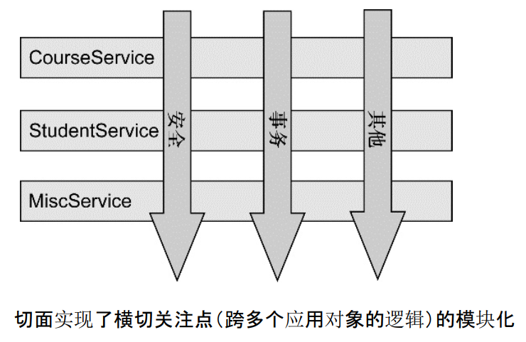

> 2021/11/29 19:54:52 
> Spring框架学习笔记

#第一章 动态代理模式
##1.1 JDK代理

###1.1.1 class文件简介及加载

1. Java编译器编译好Java文件之后，产生.class 文件在磁盘中。

1. 这种class文件是二进制文件，内容是只有JVM虚拟机能够识别的机器码。

2. JVM虚拟机读取字节码文件，取出二进制数据，加载到内存中，解析.class 文件内的信息，生成对应的 Class对象

        package samples;
        /**
         * 程序猿类
         */
        public class Programmer {
         
        	public void code()
        	{
        		System.out.println("I'm a Programmer,Just Coding.....");
        	}

        package samples;
        /**
         * 自定义一个类加载器，用于将字节码转换为class对象
         * @author louluan
         */
        public class MyClassLoader extends ClassLoader {
         
        	public Class<?> defineMyClass( byte[] b, int off, int len) 
        	{
        		return super.defineClass(b, off, len);
        	}
    	

##1.2 CGLIB代理
利用ASM（开源的Java字节码编辑库，操作字节码）开源包，将代理对象类的class文件加载进来，通过修改其字节码生成子类来处理：

    package com.sharpcj;
    
    import net.sf.cglib.proxy.MethodInterceptor;
    import net.sf.cglib.proxy.MethodProxy;
    
    import java.lang.reflect.Method;
    
    public class LeaderMethodInterceptor implements MethodInterceptor {
        @Override
        public Object intercept(Object o, Method method, Object[] objects, MethodProxy methodProxy) throws Throwable {
            if ("meeting".equals(method.getName())) {
                System.out.println("代理先准备会议材料...");
                return methodProxy.invokeSuper(o, objects);
            } else if ("evaluate".equals(method.getName())) {
                if(objects[0] instanceof String) {
                    if ("James".equals(objects[0])) {
                        System.out.println("James 犯过错误，所以考评分数较低...");
                        return 70;
                    }
                }
                return methodProxy.invokeSuper(o, objects);
            }
            return null;
        }
    }

##1.3 ASM代理

1. ASM 是一个 Java 字节码操控框架。它能够以二进制形式修改已有类或者动态生成类。

1. ASM 可以直接产生二进制 class 文件，也可以在类被加载入 Java 虚拟机之前动态改变类行为。

1. ASM 从类文件中读入信息后，能够改变类行为，分析类信息，甚至能够根据用户要求生成新类。

1. 不过ASM在创建class字节码的过程中，操纵的级别是底层JVM的汇编指令级别，这要求ASM使用者要对class组织结构和JVM汇编指令有一定的了解

        
        package com.samples;
        import java.io.PrintStream;
         
        public class Programmer {
         
        	public void code()
        	{
        		System.out.println("I'm a Programmer,Just Coding.....");
        	}

使用ASM框架提供了ClassWriter 接口，通过访问者模式进行动态创建class字节码，看下面的例子：

        package samples;
         
        import java.io.File;
        import java.io.FileOutputStream;
        import java.io.IOException;
         
        import org.objectweb.asm.ClassWriter;
        import org.objectweb.asm.MethodVisitor;
        import org.objectweb.asm.Opcodes;
        public class MyGenerator {
         
        	public static void main(String[] args) throws IOException {
         
        		System.out.println();
        		ClassWriter classWriter = new ClassWriter(0);
        		// 通过visit方法确定类的头部信息
        		classWriter.visit(Opcodes.V1_7,// java版本
        				Opcodes.ACC_PUBLIC,// 类修饰符
        				"Programmer", // 类的全限定名
        				null, "java/lang/Object", null);
        		
        		//创建构造函数
        		MethodVisitor mv = classWriter.visitMethod(Opcodes.ACC_PUBLIC, "<init>", "()V", null, null);
        		mv.visitCode();
        		mv.visitVarInsn(Opcodes.ALOAD, 0);
        		mv.visitMethodInsn(Opcodes.INVOKESPECIAL, "java/lang/Object", "<init>","()V");
        		mv.visitInsn(Opcodes.RETURN);
        		mv.visitMaxs(1, 1);
        		mv.visitEnd();
        		
        		// 定义code方法
        		MethodVisitor methodVisitor = classWriter.visitMethod(Opcodes.ACC_PUBLIC, "code", "()V",
        				null, null);
        		methodVisitor.visitCode();
        		methodVisitor.visitFieldInsn(Opcodes.GETSTATIC, "java/lang/System", "out",
        				"Ljava/io/PrintStream;");
        		methodVisitor.visitLdcInsn("I'm a Programmer,Just Coding.....");
        		methodVisitor.visitMethodInsn(Opcodes.INVOKEVIRTUAL, "java/io/PrintStream", "println",
        				"(Ljava/lang/String;)V");
        		methodVisitor.visitInsn(Opcodes.RETURN);
        		methodVisitor.visitMaxs(2, 2);
        		methodVisitor.visitEnd();
        		classWriter.visitEnd(); 
        		// 使classWriter类已经完成
        		// 将classWriter转换成字节数组写到文件里面去
        		byte[] data = classWriter.toByteArray();
        		File file = new File("D://Programmer.class");
        		FileOutputStream fout = new FileOutputStream(file);
        		fout.write(data);
        		fout.close();
        	}
        }

##1.4 Javassist代理

1. Javassist是一个开源的分析、编辑和创建Java字节码的类库。

1. 是由东京工业大学的数学和计算机科学系的 Shigeru Chiba （千叶 滋）所创建的。

1. 它已加入了开放源代码JBoss 应用服务器项目,通过使用Javassist对字节码操作为JBoss实现动态AOP框架。

1. javassist是jboss的一个子项目，其主要的优点，在于简单，而且快速。直接使用java编码的形式，而不需要了解虚拟机指令，就能动态改变类的结构，或者动态生成类。

        import javassist.ClassPool;
        import javassist.CtClass;
        import javassist.CtMethod;
        import javassist.CtNewMethod;
         
        public class MyGenerator {
         
        	public static void main(String[] args) throws Exception {
        		ClassPool pool = ClassPool.getDefault();
                //创建Programmer类		
        		CtClass cc= pool.makeClass("com.samples.Programmer");
        		//定义code方法
        		CtMethod method = CtNewMethod.make("public void code(){}", cc);
        		//插入方法代码
        		method.insertBefore("System.out.println(\"I'm a Programmer,Just Coding.....\");");
        		cc.addMethod(method);
        		//保存生成的字节码
        		cc.writeFile("d://temp");
        	}
        }
##1.5 静态代理的弊端

1. Proxy类通过编译器编译成class文件，当系统运行时，此class已经存在了。这种静态的代理模式固然在访问无法访问的资源，增强现有的接口业务功能方面有很大的优点，但是大量使用这种静态代理，会使我们系统内的类的规模增大，并且不易维护；

1. 由于Proxy和RealSubject的功能 本质上是相同的，Proxy只是起到了中介的作用，这种代理在系统中的存在，导致系统结构比较臃肿和松散

----------

#第二章 servlet url-pattern匹配规则 

----------

##2.1.基本规则

1. servlet容器中的匹配规则既不是简单的通配，也不是正则表达式，而是特定的规则。所以不要用通配符或者正则表达式的匹配规则来看待servlet的url-pattern。

1. Servlet 2.5开始，一个servlet可以使用多个url-pattern规则，<servlet-mapping>标签声明了与该servlet相应的匹配规则，每个<url-pattern>标签代表1个匹配规则；

1. 当servlet容器接收到浏览器发起的一个url请求后，容器会用url减去当前应用的上下文路径，以剩余的字符串作为servlet映射，假如url是http://localhost:8080/appDemo/index.html，其应用上下文是appDemo，容器会将http://localhost:8080/appDemo去掉，用剩下的/index.html部分拿来做servlet的映射匹配，url-pattern映射匹配过程是有优先顺序的

1. 而且当有一个servlet匹配成功以后，就不会去理会剩下的servlet

##2.2 四种匹配规则
###2.2.1 精确匹配
　<url-pattern>中配置的项必须与url完全精确匹配。

    <servlet-mapping>
        <servlet-name>MyServlet</servlet-name>
        <url-pattern>/user/users.html</url-pattern>
        <url-pattern>/index.html</url-pattern>
        <url-pattern>/user/addUser.action</url-pattern>
    </servlet-mapping>
　　当在浏览器中输入如下几种url时，都会被匹配到该servlet

    　　http://localhost:8080/appDemo/user/users.html
    　　http://localhost:8080/appDemo/index.html
    　　http://localhost:8080/appDemo/user/addUser.action

注意：

    http://localhost:8080/appDemo/user/addUser/ 
是非法的url，不会被当作

    http://localhost:8080/appDemo/user/addUser识别

另外上述url后面可以跟任意的查询条件，都会被匹配，如

    http://localhost:8080/appDemo/user/addUser?username=Tom&age=23

###2.2.2 路径匹配

　以“/”字符开头，并以“/*”结尾的字符串用于路径匹配

        <servlet-mapping>
            <servlet-name>MyServlet</servlet-name>
            <url-pattern>/user/*</url-pattern>
        </servlet-mapping>

　　路径以/user/开始，后面的路径可以任意。比如下面的url都会被匹配

    　　http://localhost:8080/appDemo/user/users.html
    　　http://localhost:8080/appDemo/user/addUser.action
    　　http://localhost:8080/appDemo/user/updateUser.actionl

###2.2.3 扩展名匹配
　　以“*.”开头的字符串被用于扩展名匹配

    <servlet-mapping>
        <servlet-name>MyServlet</servlet-name>
        <url-pattern>*.jsp</url-pattern>
        <url-pattern>*.action</url-pattern>
    </servlet-mapping>

则任何扩展名为jsp或action的url请求都会匹配，比如下面的url都会被匹配：
    
    　　http://localhost:8080/appDemo/user/users.jsp
    　　http://localhost:8080/appDemo/toHome.action

###2.2.4  缺省匹配
此为tomcat默认配置servlet

    <servlet-mapping>
        <servlet-name>MyServlet</servlet-name>
        <url-pattern>/</url-pattern>
    </servlet-mapping>

##2.3 匹配顺序
###2.3.1精确匹配

    servlet-mapping1：<url-pattern>/user/users.html</url-pattern>
    servlet-mapping2：<url-pattern>/*</url-pattern>

当一个请求http://localhost:8080/appDemo/user/users.html来的时候

servlet-mapping1匹配到，不再用servlet-mapping2匹配

###2.3.2 路径匹配
先最长路径匹配，再最短路径匹配

    servlet-mapping1：<url-pattern>/user/*</url-pattern>
    servlet-mapping2：<url-pattern>/*</url-pattern>

当一个请求http://localhost:8080/appDemo/user/users.html来的时候

servlet-mapping1匹配到，不再用servlet-mapping2匹配

###2.3.3 扩展名匹配

    servlet-mapping1：<url-pattern>/user/*</url-pattern>
    servlet-mapping2：<url-pattern>*.action</url-pattern>

当一个请求http://localhost:8080/appDemo/user/addUser.action来的时候

servlet-mapping1匹配到，不再用servlet-mapping2匹配

###2.2.4 缺省匹配

以上都找不到servlet，就用默认的servlet，配置为

    <url-pattern>/</url-pattern>

##2.4 注意事项
###2.4.1 路径匹配和扩展名匹配无法同时设置

- 匹配方法只有三种，要么是路径匹配（以“/”字符开头，并以“/*”结尾），要么是扩展名匹配（以“*.”开头），要么是精确匹配

- 三种匹配方法不能进行组合，不要想当然使用通配符或正则规则。

- 如<url-pattern>/user/*.action</url-pattern>是非法的

- 另外注意：<url-pattern>/aa/*/bb</url-pattern>是精确匹配，合法，这里的*不是通配的含义

###2.4.2  "/*"和"/"含义并不相同

- “/*”属于路径匹配，并且可以匹配所有request，由于路径匹配的优先级仅次于精确匹配，所以“/*”会覆盖所有的扩展名匹配，很多404错误均由此引起，所以这是一种特别恶劣的匹配模式，一般只用于filter的url-pattern

- “/”是servlet中特殊的匹配模式，切该模式有且仅有一个实例，优先级最低，不会覆盖其他任何url-pattern，只是会替换servlet容器的内建default servlet ，该模式同样会匹配所有request。

- 配置“/”后，一种可能的现象是myServlet会拦截诸如

        http://localhost:8080/appDemo/user/addUser.action
        http://localhost:8080/appDemo/user/updateUser

    的格式的请求，但是并不会拦截

        http://localhost:8080/appDemo/user/users.jsp
        http://localhost:8080/appDemo/index.jsp

    这是应为servlet容器有内置的“*.jsp”匹配器，而扩展名匹配的优先级高于缺省匹配，所以才会有上述现象

- Tomcat在%CATALINA_HOME%\conf\web.xml文件中配置了默认的Servlet

----------

#第三章 Spring
> https://www.w3cschool.cn/wkspring/

----------
##3.1 Spring概述

1. Spring 是最受欢迎的企业级 Java 应用程序开发框架，使用 Spring 框架创建性能好、易于测试、可重用的代码。

1. Spring 框架是一个开源的 Java 平台，它最初是由 Rod Johnson 编写的，并且于 2003 年 6 月首次在 Apache 2.0 许可下发布。

1. Spring 是轻量级的框架，其基础版本只有 2 MB 左右的大小。

1. Spring 框架的核心特性是可以用于开发任何 Java 应用程序，但是在 Java EE 平台上构建 web 应用程序是需要扩展的。 Spring 框架的目标是使 J2EE 开发变得更容易使用，通过启用基于 POJO 编程模型来促进良好的编程实践。

###3.1.1 Spring的优良特性

1. 非侵入式：基于Spring开发的应用中的对象可以不依赖于Spring的API

1. 控制反转：IOC——Inversion of Control，指的是将对象的创建权交给 Spring 去创建。使用 Spring 之前，对象的创建都是由我们自己在代码中new创建。而使用 Spring 之后。对象的创建都是给了 Spring 框架。

1. 依赖注入：DI——Dependency Injection，是指依赖的对象不需要手动调用 setXX 方法去设置，而是通过配置赋值。

1. 面向切面编程：Aspect Oriented Programming——AOP

1. 容器：Spring 是一个容器，因为它包含并且管理应用对象的生命周期

1. 组件化：Spring 实现了使用简单的组件配置组合成一个复杂的应用。在 Spring 中可以使用XML和Java注解组合这些对象。

1. 一站式：在 IOC 和 AOP 的基础上可以整合各种企业应用的开源框架和优秀的第三方类库（实际上 Spring 自身也提供了表现层的 SpringMVC 和持久层的 Spring JDBC）

###3.1.2 依赖注入（DI）

1. Spring 最认同的技术是控制反转的依赖注入（DI）模式。

1. 什么是依赖注入？让我们将这两个词分开来看一看。例如，类 A 依赖于类 B。第二部分，注入。所有这一切都意味着类 B 将通过 IoC 被注入到类 A 中。

1. 依赖注入可以以向构造函数传递参数的方式发生，或者通过使用 setter 方法

###3.1.3 面向切面的程序设计（AOP）：

1. Spring 框架的一个关键组件是面向切面的程序设计（AOP）框架。一个程序中跨越多个点的功能被称为横切关注点，这些横切关注点在概念上独立于应用程序的业务逻辑。有各种各样常见的很好的关于方面的例子，比如日志记录、声明性事务、安全性，和缓存等等。

1. 在 OOP 中模块化的关键单元是类，而在 AOP 中模块化的关键单元是方面。AOP 帮助你将横切关注点从它们所影响的对象中分离出来，然而依赖注入帮助你将你的应用程序对象从彼此中分离出来。

###3.1.4 Spring 体系结构

####3.1.4.1 核心容器
核心容器由 spring-core，spring-beans，spring-context，spring-context-support和spring-expression（SpEL，Spring 表达式语言，Spring Expression Language）等模块组成:

1. spring-core 模块提供了框架的基本组成部分，包括 IoC 和依赖注入功能。

1. spring-beans 模块提供 BeanFactory，工厂模式的微妙实现，它移除了编码式单例的需要，并且可以把配置和依赖从实际编码逻辑中解耦。

1. spring-context 模块建立在由 core和 beans 模块的基础上建立起来的，它以一种类似于 JNDI 注册的方式访问对象。Context 模块继承自 Bean 模块，并且添加了国际化（比如，使用资源束）、事件传播、资源加载和透明地创建上下文（比如，通过 Servelet 容器）等功能。Context 模块也支持 Java EE 的功能，比如 EJB、JMX 和远程调用等。ApplicationContext 接口是 Context 模块的焦点。

1. spring-context-support 提供了对第三方集成到 Spring 上下文的支持，比如缓存（EhCache, Guava, JCache）、邮件（JavaMail）、调度（CommonJ, Quartz）、模板引擎（FreeMarker, JasperReports, Velocity）等。

1. spring-expression 模块提供了强大的表达式语言，用于在运行时查询和操作对象图。它是 JSP2.1 规范中定义的统一表达式语言的扩展，支持 set 和 get 属性值、属性赋值、方法调用、访问数组集合及索引的内容、逻辑算术运算、命名变量、通过名字从 Spring IoC 容器检索对象，还支持列表的投影、选择以及聚合等。

####3.1.4.2 数据访问/集成
数据访问/集成层包括 JDBC，ORM，OXM，JMS 和事务处理模块，它们的细节如下：

（注：JDBC=Java Data Base Connectivity，ORM=Object Relational Mapping，OXM=Object XML Mapping，JMS=Java Message Service）

1. JDBC 模块提供了 JDBC 抽象层，它消除了冗长的 JDBC 编码和对数据库供应商特定错误代码的解析。

1. ORM 模块提供了对流行的对象关系映射 API 的集成，包括 JPA、JDO 和 Hibernate 等。通过此模块可以让这些 

1. ORM 框架和 spring的其它功能整合，比如前面提及的事务管理。

1. OXM 模块提供了对 OXM 实现的支持，比如 JAXB、Castor、XML Beans、JiBX、XStream 等。

1. JMS 模块包含生产（produce）和消费（consume）消息的功能。从 Spring 4.1 开始，集成了 spring-messaging 模块。

1. 事务模块为实现特殊接口类及所有的 POJO 支持编程式和声明式事务管理。（注：编程式事务需要自己写 beginTransaction()、commit()、rollback() 等事务管理方法，声明式事务是通过注解或配置由 spring 自动处理，编程式事务粒度更细）

####3.1.4.3 Web层
Web 层由 Web，Web-MVC，Web-Socket 和 Web-Portlet 组成，它们的细节如下：

1. Web 模块提供面向 web 的基本功能和面向 web 的应用上下文，比如多部分（multipart）文件上传功能、使用 Servlet 监听器初始化 IoC 容器等。它还包括 HTTP 客户端以及 Spring 远程调用中与 web 相关的部分。

1. Web-MVC 模块为 web 应用提供了模型视图控制（MVC）和 REST Web服务的实现。Spring 的 MVC 框架可以使领域模型代码和 web 表单完全地分离，且可以与 Spring 框架的其它所有功能进行集成。

1. Web-Socket 模块为 WebSocket-based 提供了支持，而且在 web 应用程序中提供了客户端和服务器端之间通信的两种方式。

1. Web-Portlet 模块提供了用于 Portlet 环境的 MVC 实现，并反映了 spring-webmvc 模块的功能。

####3.1.4.4 Test模块
Spring 支持 Junit 和 TestNG 测试框架，而且还额外提供了一些基于 Spring 的测试功能，比如在测试 Web 框架时，模拟 Http 请求的功能。

####3.1.4.5 更多支持

1. AOP 模块提供了面向方面（切面）的编程实现，允许你定义方法拦截器和切入点对代码进行干净地解耦，从而使实现功能的代码彻底的解耦出来。使用源码级的元数据，可以用类似于.Net属性的方式合并行为信息到代码中。

1. Aspects 模块提供了与 AspectJ 的集成，这是一个功能强大且成熟的面向切面编程（AOP）框架。

1. Instrumentation 模块在一定的应用服务器中提供了类 instrumentation 的支持和类加载器的实现。

1. Messaging 模块为 STOMP 提供了支持作为在应用程序中 WebSocket 子协议的使用。它也支持一个注解编程模型，它是为了选路和处理来自 WebSocket 客户端的 STOMP 信息。

##3.2 Spring IoC 容器
###3.2.1 IoC 容器概述

- Spring 容器是 Spring 框架的核心。

- 容器将创建对象，把它们连接在一起，配置它们，并管理他们的整个生命周期从创建到销毁，这些对象被称为 Spring Beans

- Spring 容器使用依赖注入（DI）来管理组成一个应用程序的组件。

- IOC 容器具有依赖注入功能的容器，它可以创建对象，IOC 容器负责实例化、定位、配置应用程序中的对象及建立这些对象间的依赖。

- 控制反转"是指new实例工作不由程序员来做而是交给Spring容器来做。

###3.2.2 IoC容器类型
Spring 提供了以下两种不同类型的容器：

|----|----|
|序号|	容器 & 描述|
|1|	Spring BeanFactory 容器 ：它是最简单的容器，给 DI 提供了基本的支持，它用org.springframework.beans.factory.BeanFactory 接口来定义。BeanFactory 或者相关的接口，如 BeanFactoryAware，InitializingBean，DisposableBean，在 Spring 中仍然存在具有大量的与 Spring 整合的第三方框架的反向兼容性的目的|
|2|	Spring ApplicationContext 容器，该容器添加了更多的企业特定的功能，例如从一个属性文件中解析文本信息的能力，发布应用程序事件给感兴趣的事件监听器的能力。该容器是由org.springframework.context.ApplicationContext 接口定义|

####3.2.2.1 BeanFactory 容器

1. 这是一个最简单的容器，它主要的功能是为依赖注入 （DI） 提供支持

1. BeanFactory 和相关的接口，比如BeanFactoryAware、DisposableBean、InitializingBean，仍旧保留在 Spring 中，主要目的是向后兼容已经存在的和那些 Spring 整合在一起的第三方框架。

1. 在资源宝贵的移动设备或者基于 applet 的应用当中， BeanFactory 会被优先选择。否则，一般使用的是 ApplicationContext，除非你有更好的理由选择 BeanFactory。

####3.2.2.2 ApplicationContext 容器

1. Application Context 是 BeanFactory 的子接口，也被称为 Spring 上下文。

1. Application Context 是 spring 中较高级的容器。和 BeanFactory 类似，它可以加载配置文件中定义的 bean，将所有的 bean 集中在一起，当有请求的时候分配 bean。

1. 最常被使用的 ApplicationContext 接口实现：

    (1).FileSystemXmlApplicationContext：

       该容器从 XML 文件中加载已被定义的 bean。在这里，你需要提供给构造器 XML 文件的完整路径。

    (2).ClassPathXmlApplicationContext：

    该容器从 XML 文件中加载已被定义的 bean。在这里，你不需要提供 XML 文件的完整路径，只需正确配置 CLASSPATH 环境变量即可，因为，容器会从 CLASSPATH 中搜索 bean 配置文件。

    (3).WebXmlApplicationContext：

    该容器会在一个 web 应用程序的范围内加载在 XML 文件中已被定义的 bean

###3.2.3 Spring Bean
####3.2.3.1 Bean定义

1. bean 是一个被实例化，组装，并通过 Spring IoC 容器所管理的对象

1. bean 是由用容器提供的配置元数据创建的

####3.2.3.2 Bean属性

|----|----|
|属性|	描述|
|class	|这个属性是强制性的，并且指定用来创建 bean 的 bean 类|
|name|	这个属性指定唯一的 bean 标识符。在基于 XML 的配置元数据中，你可以使用 ID 和/或 name 属性来指定 bean 标识符|
|scope|	这个属性指定由特定的 bean 定义创建的对象的作用域|
|constructor-arg	|它是用来注入依赖关系的|
|properties|	它是用来注入依赖关系的|
|autowiring mode|	它是用来注入依赖关系的|
|lazy-initialization mode|	延迟初始化的 bean 告诉 IoC 容器在它第一次被请求时，而不是在启动时去创建一个 bean 实例|
|initialization 方法|	在 bean 的所有必需的属性被容器设置之后，调用回调方法|
|destruction 方法|	当包含该 bean 的容器被销毁时，使用回调方法|

####3.2.3.3 Bean 与 Spring 容器的关系

####3.2.3.4 Spring 配置元数据
Spring IoC 容器完全由实际编写的配置元数据的格式解耦。有下面三个重要的方法把配置元数据提供给 Spring 容器：

1. 基于 XML 的配置文件:对于基于 XML 的配置，Spring 2.0 以后使用 Schema 的格式，使得不同类型的配置拥有了自己的命名空间，使配置文件更具扩展性。

1. 基于注解的配置

1. 基于 Java 的配置

配置文件中有不同的 bean 定义，包括延迟初始化，初始化方法和销毁方法的：

      <!-- A bean definition with lazy init set on -->
       <bean id="..." class="..." lazy-init="true">
           <!-- collaborators and configuration for this bean go here -->
       </bean>
    
       <!-- A bean definition with initialization method -->
       <bean id="..." class="..." init-method="...">
           <!-- collaborators and configuration for this bean go here -->
       </bean>
    
       <!-- A bean definition with destruction method -->
       <bean id="..." class="..." destroy-method="...">
           <!-- collaborators and configuration for this bean go here -->
       </bean>

###3.2.4 Bean 的作用域  
Spring 框架支持以下五个作用域，分别为 singleton、prototype、request、session 和 global session，5种作用域说明如下所示:

    |----|----|
    |作用域	|描述|
    |singleton	|在spring IoC容器仅存在一个Bean实例，Bean以单例方式存在，默认值|
    |prototype|	每次从容器中调用Bean时，都返回一个新的实例，即每次调用getBean()时，相当于执行newXxxBean()|
    |request	|每次HTTP请求都会创建一个新的Bean，该作用域仅适用于WebApplicationContext环境
    |session|	同一个HTTP Session共享一个Bean，不同Session使用不同的Bean，仅适用于WebApplicationContext环境
    |global-session|	一般用于Portlet应用环境，该作用域仅适用于WebApplicationContext环境

- 当在 Spring 中定义一个 bean 时，你必须声明该 bean 的作用域的选项。

- 如果你使用 web-aware ApplicationContext 时，其中后三个是可用的。 

####3.2.4.1 singleton 作用域

- singleton 是默认的作用域，也就是说，当定义 Bean 时，如果没有指定作用域配置项，则 Bean 的作用域被默认为 singleton。

- 当一个bean的作用域为 Singleton，那么 Spring IoC 容器中只会存在一个共享的 bean 实例，并且所有对 bean 的请求，只要 id 与该 bean 定义相匹配，则只会返回 bean 的同一实例。  

        <bean id="..." class="..." scope="singleton">
            <!-- collaborators and configuration for this bean go here -->
        </bean>

####3.2.4.2 prototype 作用域

- Prototype 作用域的 bean 会导致在每次对该 bean 请求（将其注入到另一个 bean 中，或者以程序的方式调用容器的 getBean() 方法）时都会创建一个新的 bean 实例。

- Prototype 是原型类型，它在我们创建容器的时候并没有实例化，而是当我们获取bean的时候才会去创建一个对象，而且我们每次获取到的对象都不是同一个对象。

- 根据经验，对有状态的 bean 应该使用 prototype 作用域，而对无状态的bean则应该使用 singleton 作用域。

        <bean id="..." class="..." scope="prototype">
           <!-- collaborators and configuration for this bean go here -->
        </bean>

###3.2.5  Bean 的生命周期

1. 初始化

1. 依赖注入

1. setBeanName

1. setBeanFactory

1. setApplicationContext

1. postProcessBeforeInitialization

1. init-method

1. afterPropertiesSet

1. postProcessAfterInitialization

1. 生存期

1. destory-method

1. destory

###3.2.6 Bean 定义继承

1. Spring Bean 定义的继承与 Java 类的继承无关，但是继承的概念是一样的。你可以定义一个父 bean 的定义作为模板和其他子 bean 就可以从父 bean 中继承所需的配置。

1. 当你使用基于 XML 的配置元数据时，通过使用父属性，指定父 bean 作为该属性的值来表明子 bean 的定义。

       <bean id="helloWorld" class="com.tutorialspoint.HelloWorld">
          <property name="message1" value="Hello World!"/>
          <property name="message2" value="Hello Second World!"/>
       </bean>
    
       <bean id="helloIndia" class="com.tutorialspoint.HelloIndia" parent="helloWorld">
          <property name="message1" value="Hello India!"/>
          <property name="message3" value="Namaste India!"/>
       </bean>

##3.3  Spring 依赖注入(DI)

1. Spring框架的核心功能之一就是通过依赖注入的方式来管理Bean之间的依赖关系。

1. 当编写一个复杂的 Java 应用程序时，应用程序类应该尽可能独立于其他 Java 类来增加这些类重用的可能性，并且在做单元测试时，测试独立于其他类的独立性。依赖注入（或有时称为布线）有助于把这些类粘合在一起，同时保持他们独立。

###3.3.1 基于构造函数的依赖注入
当容器调用带有一组参数的类构造函数时，基于构造函数的 DI 就完成了，其中每个参数代表一个对其他类的依赖

       <!-- Definition for textEditor bean -->
       <bean id="textEditor" class="com.tutorialspoint.TextEditor">
          <constructor-arg ref="spellChecker"/>
       </bean>
    
       <!-- Definition for spellChecker bean -->
       <bean id="spellChecker" class="com.tutorialspoint.SpellChecker">
       </bean>

如果你使用 type 属性显式的指定了构造函数参数的类型，容器也可以使用与简单类型匹配的类型。例如：

        <beans>
        
           <bean id="exampleBean" class="examples.ExampleBean">
              <constructor-arg type="int" value="2001"/>
              <constructor-arg type="java.lang.String" value="Zara"/>
           </bean>
        
        </beans>
最后并且也是最好的传递构造函数参数的方式，使用 index 属性来显式的指定构造函数参数的索引。下面是基于索引为 0 的例子，如下所示：

        <beans>
        
           <bean id="exampleBean" class="examples.ExampleBean">
              <constructor-arg index="0" value="2001"/>
              <constructor-arg index="1" value="Zara"/>
           </bean>
        
        </beans>

###3.3.2  基于设值函数（setter）的依赖注入
当容器调用一个无参的构造函数或一个无参的静态 factory 方法来初始化你的 bean 后，通过容器在你的 bean 上调用设值函数，基于设值函数的 DI 就完成了

          <!-- Definition for textEditor bean -->
           <bean id="textEditor" class="com.tutorialspoint.TextEditor">
              <property name="spellChecker" ref="spellChecker"/>
           </bean>

构造函数注入和基于设值函数注入中的 Beans.xml 文件的唯一区别就是在基于构造函数注入中，我们使用的是`〈bean〉`标签中的`〈constructor-arg〉`元素，而在基于设值函数的注入中，我们使用的是〈bean〉标签中的`〈property〉`元素

上述 XML 配置文件可以使用 p-namespace 以一种更简洁的方式重写，如下所示：

     <bean id="john-classic" class="com.example.Person"
          p:name="John Doe"
          p:spouse-ref="jane"/>
       </bean>

###3.3.3 注入内部 Beans
正如你所知道的 Java 内部类是在其他类的范围内被定义的，同理，inner beans 是在其他 bean 的范围内定义的 bean。因此`<property />`或`<constructor-arg />`元素中的`<bean />`元素称为内部bean

           <bean id="outerBean" class="...">
              <property name="target">
                 <bean id="innerBean" class="..."/>
              </property>
           </bean>

###3.3.4 注入集合
如果你想传递多个值，如 Java Collection 类型 List、Set、Map 和 Properties，应该怎么做呢。为了处理这种情况，Spring 提供了五种类型的集合的配置元素，如下所示：

|----|----|
|元素|	描述|
|`<list>`|	它有助于连线，如注入一列值，允许重复。
|`<set>`|	它有助于连线一组值，但不能重复。
|`<map>`|	它可以用来注入名称-值对的集合，其中名称和值可以是任何类型。
|`<props>`|	它可以用来注入名称-值对的集合，其中名称和值都是字符串类型。
|`<array>`|用于注入数组，数组元素可以不同|

##3.4  Beans 自动装配

1. Spring 容器可以在不使用`<constructor-arg>`和`<property> `元素的情况下自动装配相互协作的 bean 之间的关系，这有助于减少编写一个大的基于 Spring 的应用程序的 XML 配置的数量

1. 下列自动装配模式，它们可用于指示 Spring 容器为来使用自动装配进行依赖注入。

   你可以使用`<bean>`元素的 autowire 属性为一个 bean 定义指定自动装配模式:

    |----|----|
    |模式|	描述|
    |no|	这是默认的设置，它意味着没有自动装配，你应该使用显式的bean引用来连线。你不用为了连线做特殊的事。在依赖注入章节你已经看到这个了。
    |byName|	由属性名自动装配。Spring 容器看到在 XML 配置文件中 bean 的自动装配的属性设置为 byName。然后尝试匹配，并且将它的属性与在配置文件中被定义为相同名称的 beans 的属性进行连接。
    |byType|	由属性数据类型自动装配。Spring 容器看到在 XML 配置文件中 bean 的自动装配的属性设置为 byType。然后如果它的类型匹配配置文件中的一个确切的 bean 名称，它将尝试匹配和连接属性的类型。如果存在不止一个这样的 bean，则一个致命的异常将会被抛出。
    |constructor|	类似于 byType，但该类型适用于构造函数参数类型。如果在容器中没有一个构造函数参数类型的 bean，则一个致命错误将会发生。
    |autodetect（3.0版本不支持）|	Spring首先尝试通过 constructor 使用自动装配来连接，如果它不执行，Spring 尝试通过 byType 来自动装配。

自动装配的局限性：
   
    |----|----|
    |限制|	描述|
    |重写的可能性|	你可以使用总是重写自动装配的 `<constructor-arg>`和 `<property>` 设置来指定依赖关系。
    |原始数据类型|	你不能自动装配所谓的简单类型包括基本类型，字符串和类。
    |混乱的本质|	自动装配不如显式装配精确，所以如果可能的话尽可能使用显式装配|

###3.4.1 自动装配 byName

- 这种模式由属性名称指定自动装配。

- Spring 容器看作 beans，在 XML 配置文件中 beans 的 auto-wire 属性设置为 byName。然后，它尝试将它的属性与配置文件中定义为相同名称的 beans 进行匹配和连接。

- 如果找到匹配项，它将注入这些 beans，否则，它将抛出异常

           <!-- Definition for textEditor bean -->
           <bean id="textEditor" class="com.tutorialspoint.TextEditor" 
              autowire="byName">
              <property name="name" value="Generic Text Editor" />
           </bean>

###3.4.2 自动装配 byType

- 这种模式由属性类型指定自动装配。

- Spring 容器看作 beans，在 XML 配置文件中 beans 的 autowire 属性设置为 byType。然后，如果它的 type 恰好与配置文件中 beans 名称中的一个相匹配，它将尝试匹配和连接它的属性。

- 如果找到匹配项，它将注入这些 beans，否则，它将抛出异常

          <!-- Definition for textEditor bean -->
           <bean id="textEditor" class="com.tutorialspoint.TextEditor" 
              autowire="byType">
              <property name="name" value="Generic Text Editor" />
           </bean>
        
           <!-- Definition for spellChecker bean -->
           <bean id="SpellChecker" class="com.tutorialspoint.SpellChecker">
           </bean>

###3.4.3  由构造函数自动装配

- 这种模式与 byType 非常相似，但它应用于构造器参数。

- Spring 容器看作 beans，在 XML 配置文件中 beans 的 autowire 属性设置为 constructor。然后，它尝试把它的构造函数的参数与配置文件中 beans 名称中的一个进行匹配和连线。

- 如果找到匹配项，它会注入这些 bean，否则，它会抛出异常。

         <!-- Definition for textEditor bean -->
           <bean id="textEditor" class="com.tutorialspoint.TextEditor" 
              autowire="constructor">
              <constructor-arg value="Generic Text Editor"/>
           </bean>
        
           <!-- Definition for spellChecker bean -->
           <bean id="SpellChecker" class="com.tutorialspoint.SpellChecker">
           </bean>

##3.5 基于注解的配置

- 从 Spring 2.5 开始就可以使用注解来配置依赖注入。而不是采用 XML 来描述一个 bean 连线，你可以使用相关类，方法或字段声明的注解，将 bean 配置移动到组件类本身。

- 在 XML 注入之前进行注解注入，因此后者的配置将通过两种方式的属性连线被前者重写。

- 注解连线在默认情况下在 Spring 容器中不打开。
        
           <context:annotation-config/>
           <!-- bean definitions go here -->

一旦 被配置后，你就可以开始注解你的代码，表明 Spring 应该自动连接值到属性，方法和构造函数。让我们来看看几个重要的注解：

|----|----|
|注解 | 描述|
|@Required|@Required 注解应用于 bean 属性的 setter 方法。
|@Autowired|@Autowired 注解可以应用到 bean 属性的 setter 方法，非 setter 方法，构造函数和属性。
|@Qualifier|通过指定确切的将被连线的 bean，@Autowired 和 @Qualifier 注解可以用来删除混乱。
|JSR-250 Annotations|Spring 支持 JSR-250 的基础的注解，其中包括了 @Resource，@PostConstruct 和 @PreDestroy 注解|

###3.5.1 @Required 注解

1. @Required 注解应用于 bean 属性的 setter 方法，

1. 它表明受影响的 bean 属性在配置时必须放在 XML 配置文件中，否则容器就会抛出一个 BeanInitializationException 异常。

        package com.tutorialspoint;
        import org.springframework.beans.factory.annotation.Required;
        public class Student {
           private Integer age;
           private String name;
           @Required
           public void setAge(Integer age) {
              this.age = age;
           }
           public Integer getAge() {
              return age;
           }
           @Required
           public void setName(String name) {
              this.name = name;
           }
           public String getName() {
              return name;
           }
        }

         <!-- Definition for student bean -->
           <bean id="student" class="com.tutorialspoint.Student">
              <property name="name"  value="Zara" />
              <property name="age"  value="11"/>
           </bean>

###3.5.2 @Autowired 注解

1. 使用 Spring 开发时，进行配置主要有两种方式，一是 xml 的方式，二是 java config 的方式。

1. 在使用 java config 的过程当中，我们不可避免的会有各种各样的注解打交道，其中，我们使用最多的注解应该就是 @Autowired 注解了。这个注解的功能就是为我们注入一个定义好的 bean。

####3.5.2.1 @Autowired 注解的作用

1. 首先，我们从所属范围来看，事实上这个注解是属于 Spring 的容器配置的一个注解，与它同属容器配置的注解还有：@Required,@Primary, @Qualifier 等等。因此 @Autowired 注解是一个用于容器 ( container ) 配置的注解。

1. 其次，我们可以直接从字面意思来看，@autowired 注解来源于英文单词 autowire,这个单词的意思是自动装配的意思.这个词语本来的意思是指的一些工业上的用机器代替人口，自动将一些需要完成的组装任务，或者别的一些任务完成。而在 Spring 的世界当中，自动装配指的就是使用将 Spring 容器中的 bean 自动的和我们需要这个 bean 的类组装在一起。

#####3.5.2.2  @Autowired 注解用法

1. 将 @Autowired 注解应用于构造函数，如以下示例所示

        public class MovieRecommender {
         
            private final CustomerPreferenceDao customerPreferenceDao;
         
            @Autowired
            public MovieRecommender(CustomerPreferenceDao customerPreferenceDao) {
                this.customerPreferenceDao = customerPreferenceDao;
            }
         
            // ...
        }

1. 将 @Autowired 注解应用于 setter 方法

        public class SimpleMovieLister {
         
            private MovieFinder movieFinder;
         
            @Autowired
            public void setMovieFinder(MovieFinder movieFinder) {
                this.movieFinder = movieFinder;
            }
         
            // ...
        }

1. 将 @Autowired 注解应用于具有任意名称和多个参数的方法

        public class MovieRecommender {
         
            private MovieCatalog movieCatalog;
         
            private CustomerPreferenceDao customerPreferenceDao;
         
            @Autowired
            public void prepare(MovieCatalog movieCatalog,
                    CustomerPreferenceDao customerPreferenceDao) {
                this.movieCatalog = movieCatalog;
                this.customerPreferenceDao = customerPreferenceDao;
            }
         
            // ...
        }

1. 将 @Autowired 注解应用于字段，或者将其与构造函数混合，如以下示例所示

        public class MovieRecommender {
         
            private final CustomerPreferenceDao customerPreferenceDao;
         
            @Autowired
            private MovieCatalog movieCatalog;
         
            @Autowired
            public MovieRecommender(CustomerPreferenceDao customerPreferenceDao) {
                this.customerPreferenceDao = customerPreferenceDao;
            }
         
            // ...
        }

1. 除此之外，还有以下不太常见的几种方式

    将 @Autowired 注解添加到需要该类型数组的字段或方法，则 Spring 会从 ApplicationContext 中搜寻符合指定类型的所有 bean，如以下示例所示：

        public class MovieRecommender {
         
            @Autowired
            private MovieCatalog[] movieCatalogs;
         
            // ...
        }

    下面是 set 以及 map 的例子：

        public class MovieRecommender {
         
            private Set<MovieCatalog> movieCatalogs;
         
            @Autowired
            public void setMovieCatalogs(Set<MovieCatalog> movieCatalogs) {
                this.movieCatalogs = movieCatalogs;
            }
         
            // ...
        }
        public class MovieRecommender {
         
            private Map<String, MovieCatalog> movieCatalogs;
         
            @Autowired
            public void setMovieCatalogs(Map<String, MovieCatalog> movieCatalogs) {
                this.movieCatalogs = movieCatalogs;
            }
         
            // ...
        }

###3.5.3 @Qualifier 注解

1. 可能会有这样一种情况，当你创建多个具有相同类型的 bean 时，并且想要用一个属性只为它们其中的一个进行装配

1. 在这种情况下，你可以使用 @Qualifier 注解和 @Autowired 注解通过指定哪一个真正的 bean 将会被装配来消除混乱。

        package com.tutorialspoint;
        import org.springframework.beans.factory.annotation.Autowired;
        import org.springframework.beans.factory.annotation.Qualifier;
        public class Profile {
           @Autowired
           @Qualifier("student1")
           private Student student;
           public Profile(){
              System.out.println("Inside Profile constructor." );
           }
           public void printAge() {
              System.out.println("Age : " + student.getAge() );
           }
           public void printName() {
              System.out.println("Name : " + student.getName() );
           }
        }
        
           <context:annotation-config/>
        
           <!-- Definition for profile bean -->
           <bean id="profile" class="com.tutorialspoint.Profile">
           </bean>
        
           <!-- Definition for student1 bean -->
           <bean id="student1" class="com.tutorialspoint.Student">
              <property name="name"  value="Zara" />
              <property name="age"  value="11"/>
           </bean>
        
           <!-- Definition for student2 bean -->
           <bean id="student2" class="com.tutorialspoint.Student">
              <property name="name"  value="Nuha" />
              <property name="age"  value="2"/>
           </bean>

###3.5.4 JSR-250 注释 
Spring还使用基于 JSR-250 注释，它包括 @PostConstruct， @PreDestroy 和 @Resource 注释。因为你已经有了其他的选择，尽管这些注释并不是真正所需要的

####3.5.4.1 @PostConstruct 和 @PreDestroy 注释

1. 为了定义一个 bean 的安装和卸载，我们使用 init-method 和/或 destroy-method 参数简单的声明一下 。init-method 属性指定了一个方法，该方法在 bean 的实例化阶段会立即被调用。同样地，destroy-method 指定了一个方法，该方法只在一个 bean 从容器中删除之前被调用。

1. 可以使用 @PostConstruct 注释作为初始化回调函数的一个替代，@PreDestroy 注释作为销毁回调函数的一个替代

        package com.tutorialspoint;
        import javax.annotation.*;
        public class HelloWorld {
           private String message;
           public void setMessage(String message){
              this.message  = message;
           }
           public String getMessage(){
              System.out.println("Your Message : " + message);
              return message;
           }
           @PostConstruct
           public void init(){
              System.out.println("Bean is going through init.");
           }
           @PreDestroy
           public void destroy(){
              System.out.println("Bean will destroy now.");
           }
        }

           <context:annotation-config/>
        
           <bean id="helloWorld" 
               class="com.tutorialspoint.HelloWorld"
               init-method="init" destroy-method="destroy">
               <property name="message" value="Hello World!"/>
           </bean>

####3.5.4.2 @Resource 注释

- 可以在字段中或者 setter 方法中使用 @Resource 注释，它和在 Java EE 5 中的运作是一样的。

- @Resource 注释使用一个 ‘name’ 属性，该属性以一个 bean 名称的形式被注入。你可以说，它遵循 by-name 自动连接语义
        
        package com.tutorialspoint;
        import javax.annotation.Resource;
        public class TextEditor {
           private SpellChecker spellChecker;
           @Resource(name= "spellChecker")
           public void setSpellChecker( SpellChecker spellChecker ){
              this.spellChecker = spellChecker;
           }
           public SpellChecker getSpellChecker(){
              return spellChecker;
           }
           public void spellCheck(){
              spellChecker.checkSpelling();
           }
        }

如果没有明确地指定一个 ‘name’，默认名称源于字段名或者 setter 方法。在字段的情况下，它使用的是字段名；在一个 setter 方法情况下，它使用的是 bean 属性名称

###3.5.5 基于 Java 的配置
基于 Java 的配置选项，可以使你在不用配置 XML 的情况下编写大多数的 Spring，但是一些有帮助的基于 Java 的注解，解释如下：

####3.5.5.1  @Configuration 和 @Bean 注解

- 带有 @Configuration 的注解类表示这个类可以使用 Spring IoC 容器作为 bean 定义的来源。@Bean 注解告诉 Spring

- 一个带有 @Bean 的注解方法将返回一个对象，该对象应该被注册为在 Spring 应用程序上下文中的 bean

        package com.tutorialspoint;
        import org.springframework.context.annotation.*;
        @Configuration
        public class HelloWorldConfig {
           @Bean 
           public HelloWorld helloWorld(){
              return new HelloWorld();
           }
        }

上面的代码将等同于下面的 XML 配置：
    
        <beans>
           <bean id="helloWorld" class="com.tutorialspoint.HelloWorld" />
        </beans>

####3.5.5.2 @Import 注解

@import 注解允许从另一个配置类中加载 @Bean 定义。考虑 ConfigA 类，如下所示：

        @Configuration
        public class ConfigA {
           @Bean
           public A a() {
              return new A(); 
           }
        }

        @Configuration
        @Import(ConfigA.class)
        public class ConfigB {
           @Bean
           public B b() {
              return new B(); 
           }
        }

####3.5.5.3 生命周期回调

@Bean 注解支持指定任意的初始化和销毁的回调方法，就像在 bean 元素中 Spring 的 XML 的初始化方法和销毁方法的属性,注解@Bean提供的配置项如下：

|-----|-----|
|配置|描述|
|value|同name|
|name|Bean在注册中心的注册名称|
|autowire|指定Bean的装配方式，Spring5.1后不再推荐使用|
|autowireCandidate|默认为true，从Spring5.1开始使用，设置是否是依赖注入的候选项|
|initMethod|自定义初始化方法|
|destroyMethod|自定义销毁方法|

- @Bean 注解支持指定任意的初始化和销毁的回调方法：

        public class Foo {
           public void init() {
              // initialization logic
           }
           public void cleanup() {
              // destruction logic
           }
        }
        
        @Configuration
        public class AppConfig {
           @Bean(initMethod = "init", destroyMethod = "cleanup" )
           public Foo foo() {
              return new Foo();
           }
        }

- 指定 Bean 的范围：默认范围是单实例，但是你可以重写带有 @Scope 注解的该方法，如下所示：

        @Configuration
        public class AppConfig {
           @Bean
           @Scope("prototype")
           public Foo foo() {
              return new Foo();
           }
        }

####3.5.5.4 其他注解

- @ComponentScan 在设置类上使用

- @Primary   在被依赖bean上使用

- @Qualifier  在有依赖的bean处使用

- @Profile 切换运行环境

- @ProperitySource 加载属性文件

- @Condition  根据一个实现Condition类中matches的类，判断是否创建对应的bean

###3.5.6 事件处理
 

- Spring 的核心是 ApplicationContext，它负责管理 beans 的完整生命周期。

- 当加载 beans 时，ApplicationContext 发布某些类型的事件

- 由于 Spring 的事件处理是单线程的，所以如果一个事件被发布，直至并且除非所有的接收者得到的该消息，该进程被阻塞并且流程将不会继续。因此，如果事件处理被使用，在设计应用程序时应注意。

 Spring 提供了以下的标准事件：

    |----|----|
    |Spring 内置事件 | 描述|
    |ContextRefreshedEvent|ApplicationContext 被初始化或刷新时，该事件被发布。这也可以在 ConfigurableApplicationContext 接口中使用 refresh() 方法来发生|	
    |ContextStartedEvent|当使用 ConfigurableApplicationContext 接口中的 start() 方法启动 ApplicationContext 时，该事件被发布。你可以调查你的数据库，或者你可以在接受到这个事件后重启任何停止的应用程序。|
    |ContextStoppedEvent|当使用 ConfigurableApplicationContext 接口中的 stop() 方法停止 ApplicationContext 时，发布这个事件。你可以在接受到这个事件后做必要的清理的工作。
    |ContextClosedEvent|当使用 ConfigurableApplicationContext 接口中的 close() 方法关闭 ApplicationContext 时，该事件被发布。一个已关闭的上下文到达生命周期末端；它不能被刷新或重启。
    |RequestHandledEvent|这是一个 web-specific 事件，告诉所有 bean HTTP 请求已经被服务。

####3.5.6.1 监听上下文事件
为了监听上下文事件，一个 bean 应该实现只有一个方法 onApplicationEvent() 的 ApplicationListener 接口

下面是一个示例：

1.  HelloWorld.java 文件的内容：

        package com.tutorialspoint;
        public class HelloWorld {
           private String message;
           public void setMessage(String message){
              this.message  = message;
           }
           public void getMessage(){
              System.out.println("Your Message : " + message);
           }
        }

1. CStartEventHandler.java 文件的内容：

        package com.tutorialspoint;
        import org.springframework.context.ApplicationListener;
        import org.springframework.context.event.ContextStartedEvent;
        public class CStartEventHandler 
           implements ApplicationListener<ContextStartedEvent>{
           public void onApplicationEvent(ContextStartedEvent event) {
              System.out.println("ContextStartedEvent Received");
           }
        }

1.  CStopEventHandler.java 文件的内容：

        package com.tutorialspoint;
        import org.springframework.context.ApplicationListener;
        import org.springframework.context.event.ContextStoppedEvent;
        public class CStopEventHandler 
           implements ApplicationListener<ContextStoppedEvent>{
           public void onApplicationEvent(ContextStoppedEvent event) {
              System.out.println("ContextStoppedEvent Received");
           }
        }

1.  MainApp.java 文件的内容：

        package com.tutorialspoint;
        
        import org.springframework.context.ConfigurableApplicationContext;
        import org.springframework.context.support.ClassPathXmlApplicationContext;
        
        public class MainApp {
           public static void main(String[] args) {
              ConfigurableApplicationContext context = 
              new ClassPathXmlApplicationContext("Beans.xml");
        
              // Let us raise a start event.
              context.start();
        
              HelloWorld obj = (HelloWorld) context.getBean("helloWorld");
        
              obj.getMessage();
        
              // Let us raise a stop event.
              context.stop();
           }
        }

1. 配置文件 Beans.xml 文件：

        <?xml version="1.0" encoding="UTF-8"?>
        
        <beans xmlns="http://www.springframework.org/schema/beans"
            xmlns:xsi="http://www.w3.org/2001/XMLSchema-instance"
            xsi:schemaLocation="http://www.springframework.org/schema/beans
            http://www.springframework.org/schema/beans/spring-beans-3.0.xsd">
        
           <bean id="helloWorld" class="com.tutorialspoint.HelloWorld">
              <property name="message" value="Hello World!"/>
           </bean>
        
           <bean id="cStartEventHandler" 
                 class="com.tutorialspoint.CStartEventHandler"/>
        
           <bean id="cStopEventHandler" 
                 class="com.tutorialspoint.CStopEventHandler"/>
        
        </beans>

1. 如果你的应用程序一切都正常，将输出以下消息：

        ContextStartedEvent Received
        Your Message : Hello World!
        ContextStoppedEvent Received

###3.5.7 自定义事件
按照下列说明来编写，发布和处理自定义 Spring 事件：

|----|----|
|步骤|	描述|
|1	|创建一个名称为 SpringExample 的项目，并且在创建项目的 src 文件夹中创建一个包 com.tutorialspoint。
|2	|使用 Add External JARs 选项，添加所需的 Spring 库，解释见 Spring Hello World Example 章节。
|3|	通过扩展 ApplicationEvent,创建一个事件类 CustomEvent。这个类必须定义一个默认的构造函数，它应该从 ApplicationEvent 类中继承的构造函数。
|4|	一旦定义事件类，你可以从任何类中发布它，假定 EventClassPublisher 实现了 ApplicationEventPublisherAware。你还需要在 XML 配置文件中声明这个类作为一个 bean，之所以容器可以识别 bean 作为事件发布者，是因为它实现了 ApplicationEventPublisherAware 接口。
|5|	发布的事件可以在一个类中被处理，假定 EventClassHandler 实现了 ApplicationListener 接口，而且实现了自定义事件的 onApplicationEvent 方法。
|6|	在 src 文件夹中创建 bean 的配置文件 Beans.xml 和 MainApp 类，它可以作为一个 Spring 应用程序来运行。
|7|	最后一步是创建的所有 Java 文件和 Bean 配置文件的内容，并运行应用程序，解释如下所示。

代码如下：

1.  CustomEvent.java 文件的内容：
        
        package com.tutorialspoint;
        import org.springframework.context.ApplicationEvent;
        public class CustomEvent extends ApplicationEvent{ 
           public CustomEvent(Object source) {
              super(source);
           }
           public String toString(){
              return "My Custom Event";
           }
        }

1. CustomEventPublisher.java 文件的内容：
        
        package com.tutorialspoint;
        import org.springframework.context.ApplicationEventPublisher;
        import org.springframework.context.ApplicationEventPublisherAware;
        public class CustomEventPublisher 
           implements ApplicationEventPublisherAware {
           private ApplicationEventPublisher publisher;
           public void setApplicationEventPublisher
                      (ApplicationEventPublisher publisher){
              this.publisher = publisher;
           }
           public void publish() {
              CustomEvent ce = new CustomEvent(this);
              publisher.publishEvent(ce);
           }
        }

1.  CustomEventHandler.java 文件的内容：

        package com.tutorialspoint;
        import org.springframework.context.ApplicationListener;
        public class CustomEventHandler 
           implements ApplicationListener<CustomEvent>{
           public void onApplicationEvent(CustomEvent event) {
              System.out.println(event.toString());
           }
        }

1.  MainApp.java 文件的内容：

        package com.tutorialspoint;
        import org.springframework.context.ConfigurableApplicationContext;
        import org.springframework.context.support.ClassPathXmlApplicationContext;
        public class MainApp {
           public static void main(String[] args) {
              ConfigurableApplicationContext context = 
              new ClassPathXmlApplicationContext("Beans.xml");    
              CustomEventPublisher cvp = 
              (CustomEventPublisher) context.getBean("customEventPublisher");
              cvp.publish();  
              cvp.publish();
           }
        }

1. 配置文件 Beans.xml：

        <?xml version="1.0" encoding="UTF-8"?>
        
        <beans xmlns="http://www.springframework.org/schema/beans"
            xmlns:xsi="http://www.w3.org/2001/XMLSchema-instance"
            xsi:schemaLocation="http://www.springframework.org/schema/beans
            http://www.springframework.org/schema/beans/spring-beans-3.0.xsd">
        
           <bean id="customEventHandler" 
              class="com.tutorialspoint.CustomEventHandler"/>
        
           <bean id="customEventPublisher" 
              class="com.tutorialspoint.CustomEventPublisher"/>
        
        </beans>

1. 如果你的应用程序一切都正常，将输出以下信息：

        My Custom Event
        My Custom Event

###3.5.8 @Configuration 和 @Component 区别
####3.5.8.1 定义区别
@Configuration 注解：

    @Target(ElementType.TYPE)
    @Retention(RetentionPolicy.RUNTIME)
    @Documented
    @Component
    public @interface Configuration {
        String value() default "";
    }

从定义来看， @Configuration 注解本质上还是 @Component，因此 <context:component-scan/> 或者 @ComponentScan 都能处理@Configuration 注解的类。

@Configuration 标记的类必须符合下面的要求：

- 配置类必须以类的形式提供（不能是工厂方法返回的实例），允许通过生成子类在运行时增强（cglib 动态代理）。

- 配置类不能是 final 类（没法动态代理）。

- 配置注解通常为了通过 @Bean 注解生成 Spring 容器管理的类，

- 配置类必须是非本地的（即不能在方法中声明，不能是 private）。

- 任何嵌套配置类都必须声明为static。

- @Bean 方法可能不会反过来创建进一步的配置类（也就是返回的 bean 如果带有 @Configuration，也不会被特殊处理，只会作为普通的 bean）。

####3.5.8.2 加载过程

- Spring 容器在启动时，会加载默认的一些 PostPRocessor，其中就有 ConfigurationClassPostProcessor，这个后置处理程序专门处理带有 @Configuration 注解的类

- 这个程序会在 bean 定义加载完成后，在 bean 初始化前进行处理。主要处理的过程就是使用 cglib 动态代理增强类，而且是对其中带有 @Bean 注解的方法进行处理。

在 ConfigurationClassPostProcessor 中的 postProcessBeanFactory 方法中调用了下面的方法：

        /**
         * Post-processes a BeanFactory in search of Configuration class BeanDefinitions;
         * any candidates are then enhanced by a {@link ConfigurationClassEnhancer}.
         * Candidate status is determined by BeanDefinition attribute metadata.
         * @see ConfigurationClassEnhancer
         */
        public void enhanceConfigurationClasses(ConfigurableListableBeanFactory beanFactory) {
            Map<String, AbstractBeanDefinition> configBeanDefs = new LinkedHashMap<String, AbstractBeanDefinition>();
            for (String beanName : beanFactory.getBeanDefinitionNames()) {
                BeanDefinition beanDef = beanFactory.getBeanDefinition(beanName);
                if (ConfigurationClassUtils.isFullConfigurationClass(beanDef)) {
                    //省略部分代码
                    configBeanDefs.put(beanName, (AbstractBeanDefinition) beanDef);
                }
            }
            if (configBeanDefs.isEmpty()) {
                // nothing to enhance -> return immediately
                return;
            }
            ConfigurationClassEnhancer enhancer = new ConfigurationClassEnhancer();
            for (Map.Entry<String, AbstractBeanDefinition> entry : configBeanDefs.entrySet()) {
                AbstractBeanDefinition beanDef = entry.getValue();
                // If a @Configuration class gets proxied, always proxy the target class
                beanDef.setAttribute(AutoProxyUtils.PRESERVE_TARGET_CLASS_ATTRIBUTE, Boolean.TRUE);
                try {
                    // Set enhanced subclass of the user-specified bean class
                    Class<?> configClass = beanDef.resolveBeanClass(this.beanClassLoader);
                    Class<?> enhancedClass = enhancer.enhance(configClass, this.beanClassLoader);
                    if (configClass != enhancedClass) {
                        //省略部分代码
                        beanDef.setBeanClass(enhancedClass);
                    }
                }
                catch (Throwable ex) {
                    throw new IllegalStateException(
                      "Cannot load configuration class: " + beanDef.getBeanClassName(), ex);
                }
            }
        }

在方法的第一次循环中，查找到所有带有 @Configuration 注解的 bean 定义，然后在第二个 for 循环中，通过下面的方法对类进行增强：
    
    Class<?> enhancedClass = enhancer.enhance(configClass, this.beanClassLoader);

然后使用增强后的类替换了原有的 beanClass：

    beanDef.setBeanClass(enhancedClass);

###3.5.9 Spring EL表达式

举例：

        //表达式解析器
        ExpressionParser parser = new SpelExpressionParser();
        // 设置表达式
        Expression exp = parser.parseExpression("'hello world'");
        String str = (String) exp.getValue();
        System.out.println(str);
        //通过EL访问普通方法
        exp = parser.parseExpression("'hello world'.charAt(0)");
        char ch = (Character) exp.getValue();
        System.out.println(ch);
        //通过EL访问的getter方法
        exp = parser.parseExpression("'hello world'.bytes");
        byte[] bytes = (byte[]) exp.getValue();
        System.out.println(new String(bytes));
        //通过EL访问属性，相当于"hello world".getBytes().length
        exp = parser.parseExpression("'hello world'.bytes.length");
        int length = (Integer) exp.getValue();
        System.out.println(length);
        exp = parser.parseExpression("new String('abc')");
        String abc = (String) exp.getValue();
        System.out.println(abc);
        
因为这些表达式的可读性不高，且不能用表达式去处理复杂的问题

为了更好地满足用户的需求，Spring EL 还支持变量的解析：

EvaluationContext使用了它的实现类StandardEvaluationContext，进行了实例化，在构造方法中将角色对象传递给它了，那么估值内容就会基于这个类进行解析。所以后面表达式的setValue和getValue方法都把这个估值内容传递进去，这样就能够读/写根节点的内容了

     //表达式解析器
        ExpressionParser parser = new SpelExpressionParser();
        //创建角色对象
        Role2 role = new Role2(1L, "role_name", "11");
        Expression exp = parser.parseExpression("note");
        EvaluationContext ctx = new StandardEvaluationContext(role);
        //相当于从role中获取备注信息
        String note =exp.getValue(ctx,String.class);
        System.out.println(note);
        //变量环境类，并且将角色对象role作为其根节点
        //变量环境类操作根节点
        parser.parseExpression("note").setValue(ctx, "new_note");
        //获取备注，这里的String.class指明，我们希望返回的是一个字符串
        note = parser.parseExpression("note").getValue(ctx, String.class);
        System.out.println(note);
        //调用getRoleName方法
        String roleName = parser.parseExpression("getRoleName()").getValue(ctx, String.class);
        System.out.println(roleName);
        //新增环境变量
        List<String> list = new ArrayList<String>();
        list.add("note");
        list.add("note");
        //给变量环境增加变量
        ctx.setVariable("list", list);
        //通过表达式去读/写环境变量的值
        parser.parseExpression("#list[1]").setValue(ctx, "update_value2");
        System.out.println(parser.parseExpression("#list[1]").getValue(ctx));
        System.out.println(role.toString());

Bean的属性和方法

　　使用注解的方式需要用到注解@Value，在属性文件的读取中使用的是“$”，而在Spring EL中则使用“#”。下面以角色类为例进行讨论，我们可以这样初始化它的属性，如代码清单所示。
　　代码清单：使用Spring EL初始化角色类

        import org.springframework.beans.factory.annotation.Value;
        import org.springframework.stereotype.Component;
        
        @Component("role2")
        public class Role2 {
        
        //赋值long型
        @Value("#{2}")
        private Long id;
        //字符串赋值
        @Value("#{'role_name_2'}")
        private String roleName;
        //字符串赋值
        @Value("#{'note_2'}")
        private String note;
        }

        @Component("elBean")
        public class ElBean {
        
        //通过beanName获取bean，然后注入
        @Value("#{role2}")
        private Role2 role2;
        
        //获取bean的属性id
        @Value("#{role2.id}")
        private Long id;
        
        //调用bean的getNote方法，获取角色名称
        // @Value("#{role.getNote().toString()}")
        @Value("#{role2.getNote()?.toString()}")
        private String note;
        
        @Value("#{T(Math).PI}")
        private double pi;
        
        @Value("#{T(Math).random()}")
        private double random;
        
        @Value("#{role.id+1}")
        private int num;
        }

使用类的静态常量和方法

　　有时候我们可能希望使用一些静态方法和常量，比如圆周率π，而在Java中就是Math类的PI常量了，需要注入它十分简单，在ElBean中如同下面一样操作就可以了：

    　　@Value("#{T(Math).PI}")
    　　private double pi;

　　这里的Math代表的是java.lang.*包下的Math类。当在Java代码中使用该包是不需要先使用import关键字引入的，对于Spring EL也是如此。如果在Spring中使用一个非该包的内容，那么要给出该类的全限定名，需要写成类似这样：

    　　@Value("#{T(java.lang.Math).PI}")
    　　private double pi;

　　同样，有时候使用Math类的静态方法去生产随机数（0到1之间的随机双精度数字），这个时候就需要使用它的random方法了，比如：

    　　@Value("#{T(Math).random()}")
    　　private double random;

　　这样就可以通过调用类的静态方法加载对应的数据了。

Spring EL运算

　　上面讨论了如何获取值，除此之外Spring EL还可以进行运算，比如在ElBean上增加一个数字num，其值默认为要求是角色编号（id）+1，那么我们就可以写成：
    
    　　@Value("#{role.id+1}")
    　　private int num;

　　有时候“+”运算符也可以运用在字符串的连接上，比如下面的这个字段，把角色对象中的属性roleName和note相连：

    　　@Value("#{role.roleName + role.note}")
    　　private String str;

　　这样就能够得到一个角色名称和备注相连接的字符串。比较两个值是否相等，比如角色id是否为1，角色名称是否为"role_name_001"。数字和字符串都可以使用“eq”或者“==”进行相等比较。除此之外，还有大于、小于等数学运算，比如：

    　　@Value("#{role.id == 1}")
    　　private boolean equalNum;
    　　@Value("#{role.note eq 'note_1'}")
    　　private boolean eqaulString;
    　　@Value("#{role.id > 2}")
    　　private boolean greater;
    　　@Value("#{role.id < 2}")
    　　private boolean less;

　　在Java中，也许你会怀念三目运算：

    　　@Value("#{role.id > 1 ? 5 : 1}")
    　　private int max;
    　　@Value("#{role.note?: 'hello'}")
    　　private String defaultString;

##3.6  AOP

###3.6.1 AOP介绍

- Spring 框架的一个关键组件是面向切面的编程(AOP)框架。

- 面向切面的编程需要把程序逻辑分解成不同的部分称为所谓的关注点。

- 跨一个应用程序的多个点的功能被称为横切关注点，这些横切关注点在概念上独立于应用程序的业务逻辑。

- 在软件开发过程中有各种各样的很好的切面的例子，如日志记录、审计、声明式事务、安全性和缓存等。

- 在 OOP 中，关键单元模块度是类，而在 AOP 中单元模块度是切面。依赖注入帮助你对应用程序对象相互解耦合，AOP 可以帮助你从它们所影响的对象中对横切关注点解耦。AOP 像是编程语言的触发物，如 Perl，.NET，Java 或者其他语言。

- Spring AOP 模块提供拦截器来拦截一个应用程序，例如，当执行一个方法时，你可以在方法执行之前或之后添加额外的功能

###3.6.2 AOP术语
|----|----|
|项|	描述|
|Aspect|	一个模块具有一组提供横切需求的 APIs。例如，一个日志模块为了记录日志将被 AOP 方面调用。应用程序可以拥有任意数量的方面，这取决于需求|
|Join point|	在你的应用程序中它代表一个点，你可以在插件 AOP 方面。你也能说，它是在实际的应用程序中，其中一个操作将使用 Spring AOP 框架|
|Advice|	这是实际行动之前或之后执行的方法。这是在程序执行期间通过 Spring AOP 框架实际被调用的代码
|Pointcut|	这是一组一个或多个连接点，通知应该被执行。你可以使用表达式或模式指定切入点正如我们将在 AOP 的例子中看到的
|Introduction|	引用允许你添加新方法或属性到现有的类中
|Target object|	被一个或者多个方面所通知的对象，这个对象永远是一个被代理对象。也称为被通知对象。
|Weaving|	Weaving 把方面连接到其它的应用程序类型或者对象上，并创建一个被通知的对象。这些可以在编译时，类加载时和运行时完成

###3.6.3 AOP 实现分类
按照 AOP 框架修改源代码的时机，可以将其分为两类：

静态 AOP 实现， AOP 框架在编译阶段对程序源代码进行修改，生成了静态的 AOP 代理类（生成的 *.class 文件已经被改掉了，需要使用特定的编译器），比如 AspectJ。

动态 AOP 实现， AOP 框架在运行阶段对动态生成代理对象（在内存中以 JDK 动态代理，或 CGlib 动态地生成 AOP 代理类），如 SpringAOP

###3.6.4 通知的类型
通知的类型
Spring 方面可以使用下面提到的五种通知工作：

|----|----|
|通知|	描述|
|before前置通知|	在一个方法执行之前，执行通知|
|after后置通知|	在一个方法执行之后，不考虑其结果，执行通知|
|after-returning返回后通知|	在一个方法执行之后，只有在方法成功完成时，才能执行通知|
|after-throwing抛出异常后通知|	在一个方法执行之后，只有在方法退出抛出异常时，才能执行通知|
|around环绕通知|	在建议方法调用之前和之后，执行通知|

###3.6.5 简单例子

用 Spring AOP 来实现这个需求只需下面几个步骤：

1. 既然用到 Spring AOP, 首先在 build.gralde 文件中引入相关依赖：

    dependencies {
        compile 'org.springframework:spring-context:5.0.6.RELEASE'
        compile 'org.springframework:spring-aspects:5.0.6.RELEASE'
    }

1. 定义一个切面类，BuyAspectJ.java

    package com.sharpcj.aopdemo.test1;
    
    import org.aspectj.lang.annotation.Aspect;
    import org.aspectj.lang.annotation.Before;
    import org.springframework.stereotype.Component;
    
    @Aspect
    @Component
    public class BuyAspectJ {
        @Before("execution(* com.sharpcj.aopdemo.test1.IBuy.buy(..))")
        public void haha(){
            System.out.println("男孩女孩都买自己喜欢的东西");
        }
    }

    这个类，我们使用了注解 @Component 表明它将作为一个Spring Bean 被装配，使用注解 @Aspect 表示它是一个切面。

    类中只有一个方法 haha 我们使用 @Before 这个注解，表示他将在方法执行之前执行

    参数("execution(* com.sharpcj.aopdemo.test1.IBuy.buy(..))") 声明了切点，表明在该切面的切点是com.sharpcj.aopdemo.test1.Ibuy这个接口中的buy方法

1. 在配置文件中启用AOP切面功能

        package com.sharpcj.aopdemo;
        
        import org.springframework.context.annotation.ComponentScan;
        import org.springframework.context.annotation.Configuration;
        import org.springframework.context.annotation.EnableAspectJAutoProxy;
        
        @Configuration
        @ComponentScan(basePackageClasses = {com.sharpcj.aopdemo.test1.IBuy.class})
        @EnableAspectJAutoProxy(proxyTargetClass = true)
        public class AppConfig {
        }

    我们在配置文件类增加了@EnableAspectJAutoProxy注解，启用了 AOP 功能，参数proxyTargetClass的值设为了 true 。默认值是 false
    
###3.6.6 通过注解配置 Spring AOP
####3.6.6.1 通过注解声明切点指示器

Spring AOP 所支持的 AspectJ 切点指示器:

在spring中尝试使用AspectJ其他指示器时，将会抛出IllegalArgumentException异常

只有execution指示器是唯一的执行匹配，而其他的指示器都是用于限制匹配的。

execution指示器是我们在编写切点定义时最主要使用的指示器，在此基础上，我们使用其他指示器来限制所匹配的切点。

下图的切点表达式表示当Instrument的play方法执行时会触发通知:

1. 方法表达式以 * 号开始，标识我们不关心方法的返回值类型

1. 多个匹配之间我们可以使用链接符 &&、||、！来表示 “且”、“或”、“非”的关系。

1. 在使用 XML 文件配置时，这些符号有特殊的含义，所以我们使用 “and”、“or”、“not”来表示

####3.6.6.2 通过注解声明 5 种通知类型

下面修改切面类：

    package com.sharpcj.aopdemo.test1;
    
    import org.aspectj.lang.ProceedingJoinPoint;
    import org.aspectj.lang.annotation.*;
    import org.springframework.stereotype.Component;
    
    @Aspect
    @Component
    public class BuyAspectJ {
        @Before("execution(* com.sharpcj.aopdemo.test1.IBuy.buy(..))")
        public void hehe() {
            System.out.println("before ...");
        }
    
        @After("execution(* com.sharpcj.aopdemo.test1.IBuy.buy(..))")
        public void haha() {
            System.out.println("After ...");
        }
    
        @AfterReturning("execution(* com.sharpcj.aopdemo.test1.IBuy.buy(..))")
        public void xixi() {
            System.out.println("AfterReturning ...");
        }
    
        @Around("execution(* com.sharpcj.aopdemo.test1.IBuy.buy(..))")
        public void xxx(ProceedingJoinPoint pj) {
            try {
                System.out.println("Around aaa ...");
                pj.proceed();
                System.out.println("Around bbb ...");
            } catch (Throwable throwable) {
                throwable.printStackTrace();
            }
        }
    
    }

指的注意的是 @Around 修饰的环绕通知类型，是将整个目标方法封装起来了，在使用时，我们传入了 ProceedingJoinPoint 类型的参数，这个对象是必须要有的，并且需要调用 ProceedingJoinPoint 的 proceed() 方法。 如果没有调用 该方法，

####3.6.6.3 通过注解声明切点表达式:

对于频繁出现的相同的表达式，我们可以使用 @Pointcut注解声明切点表达式，然后使用表达式，修改代码如下：
    
    package com.sharpcj.aopdemo.test1;
    
    import org.aspectj.lang.ProceedingJoinPoint;
    import org.aspectj.lang.annotation.*;
    import org.springframework.stereotype.Component;
    
    @Aspect
    @Component
    public class BuyAspectJ {
    
        @Pointcut("execution(* com.sharpcj.aopdemo.test1.IBuy.buy(..))")
        public void point(){}
    
        @Before("point()")
        public void hehe() {
            System.out.println("before ...");
        }
    
        @After("point()")
        public void haha() {
            System.out.println("After ...");
        }
    
        @AfterReturning("point()")
        public void xixi() {
            System.out.println("AfterReturning ...");
        }
    
        @Around("point()")
        public void xxx(ProceedingJoinPoint pj) {
            try {
                System.out.println("Around aaa ...");
                pj.proceed();
                System.out.println("Around bbb ...");
            } catch (Throwable throwable) {
                throwable.printStackTrace();
            }
        }
    }

程序运行结果没有变化

这里，我们使用
    
    @Pointcut("execution(* com.sharpcj.aopdemo.test1.IBuy.buy(..))")
    public void point(){}

声明了一个切点表达式，该方法 point 的内容并不重要，方法名也不重要，实际上它只是作为一个标识，供通知使用。

####3.6.6.4 通过注解处理通知中的参数

- 当不关心方法返回值的时候，我们在编写切点指示器的时候使用了 * 

- 当不关心方法参数的时候，我们使用了 ..。现在如果我们需要传入参数

- 并且有返回值的时候，则需要使用对应的类型。

- 在编写通知的时候，我们也需要声明对应的返回值类型和参数类型。

- 下面我们给接口增加一个参数，表示购买所花的金钱。通过AOP 增强处理，如果女孩买衣服超过了 68 元，就可以赠送一双袜子

更改代码如下：

     @Pointcut("execution(String com.sharpcj.aopdemo.test1.IBuy.buy(double)) && args(price) && bean(girl)")
        public void gif(double price) {
        }
    
        @Around("gif(price)")
        public String hehe(ProceedingJoinPoint pj, double price){
            try {
                pj.proceed();
                if (price > 68) {
                    System.out.println("女孩买衣服超过了68元，赠送一双袜子");
                    return "衣服和袜子";
                }
            } catch (Throwable throwable) {
                throwable.printStackTrace();
            }
            return "衣服";
        }

####3.6.6.5 通过注解配置织入的方式
在配置文件中，我们用注解 @EnableAspectJAutoProxy() 启用Spring AOP 的时候，我们给参数 proxyTargetClass 赋值为 true,默认为 false

这个时候运行程序，程序抛出异常：

这是一个强制类型转换异常

- 这跟Spring AOP 动态代理的机制有关，这个 proxyTargetClass 参数决定了代理的机制。

- 当这个参数为 false 时，通过jdk的基于接口的方式进行织入，这时候代理生成的是一个接口对象，将这个接口对象强制转换为实现该接口的一个类，自然就抛出了上述类型转换异常。

- proxyTargetClass 为 true，则会使用 cglib 的动态代理方式。这种方式的缺点是拓展类的方法被final修饰时，无法进行织入。

####3.6.6.6 通过 XML 配置文件声明切面
下面先列出 XML 中声明 AOP 的常用元素：

我们依然可以使用 <aop:aspectj-autoproxy> 元素，他能够自动代理AspectJ注解的通知类

在XML配置文件中，切点指示器表达式与通过注解配置的写法基本一致，XML文件中需要使用 “and”、“or”、“not”来表示 “且”、“或”、“非”的关系

1. 这里分别定义了一个切面，里面包含四种类型的通知:

        <?xml version="1.0" encoding="UTF-8"?>
        <beans xmlns="http://www.springframework.org/schema/beans"
               xmlns:xsi="http://www.w3.org/2001/XMLSchema-instance" xmlns:aop="http://www.springframework.org/schema/aop"
               xsi:schemaLocation="http://www.springframework.org/schema/beans http://www.springframework.org/schema/beans/spring-beans.xsd http://www.springframework.org/schema/aop http://www.springframework.org/schema/aop/spring-aop.xsd">
        
            <bean id="boy" class="com.sharpcj.aopdemo.test2.Boy"></bean>
            <bean id="girl" class="com.sharpcj.aopdemo.test2.Girl"></bean>
            <bean id="buyAspectJ" class="com.sharpcj.aopdemo.test2.BuyAspectJ"></bean>
        
            <aop:config proxy-target-class="true">
                <aop:aspect id="qiemian" ref="buyAspectJ">
                    <aop:before pointcut="execution(* com.sharpcj.aopdemo.test2.IBuy.buy(..))" method="hehe"/>
                    <aop:after pointcut="execution(* com.sharpcj.aopdemo.test2.IBuy.buy(..))" method="haha"/>
                    <aop:after-returning pointcut="execution(* com.sharpcj.aopdemo.test2.IBuy.buy(..))" method="xixi"/>
                    <aop:around pointcut="execution(* com.sharpcj.aopdemo.test2.IBuy.buy(..))" method="xxx"/>
                </aop:aspect>
            </aop:config>
        </beans>

1. 对于频繁重复使用的切点表达式，我们也可以声明成切点：

            <?xml version="1.0" encoding="UTF-8"?>
        <beans xmlns="http://www.springframework.org/schema/beans"
               xmlns:xsi="http://www.w3.org/2001/XMLSchema-instance" xmlns:aop="http://www.springframework.org/schema/aop"
               xsi:schemaLocation="http://www.springframework.org/schema/beans http://www.springframework.org/schema/beans/spring-beans.xsd http://www.springframework.org/schema/aop http://www.springframework.org/schema/aop/spring-aop.xsd">
        
            <bean id="boy" class="com.sharpcj.aopdemo.test2.Boy"></bean>
            <bean id="girl" class="com.sharpcj.aopdemo.test2.Girl"></bean>
            <bean id="buyAspectJ" class="com.sharpcj.aopdemo.test2.BuyAspectJ"></bean>
        
            <aop:config proxy-target-class="true">
                <aop:pointcut id="apoint" expression="execution(* com.sharpcj.aopdemo.test2.IBuy.buy(..))"/>
                <aop:aspect id="qiemian" ref="buyAspectJ">
                    <aop:before pointcut-ref="apoint" method="hehe"/>
                    <aop:after pointcut-ref="apoint" method="haha"/>
                    <aop:after-returning pointcut-ref="apoint" method="xixi"/>
                    <aop:around pointcut-ref="apoint" method="xxx"/>
                </aop:aspect>
            </aop:config>
        </beans>

1. Xml文件配置为通知传递参数

            <?xml version="1.0" encoding="UTF-8"?>
        <beans xmlns="http://www.springframework.org/schema/beans"
               xmlns:xsi="http://www.w3.org/2001/XMLSchema-instance" xmlns:aop="http://www.springframework.org/schema/aop"
               xsi:schemaLocation="http://www.springframework.org/schema/beans http://www.springframework.org/schema/beans/spring-beans.xsd http://www.springframework.org/schema/aop http://www.springframework.org/schema/aop/spring-aop.xsd">
        
            <bean id="boy" class="com.sharpcj.aopdemo.test2.Boy"></bean>
            <bean id="girl" class="com.sharpcj.aopdemo.test2.Girl"></bean>
            <bean id="buyAspectJ" class="com.sharpcj.aopdemo.test2.BuyAspectJ"></bean>
        
            <aop:config proxy-target-class="true">
                <aop:pointcut id="apoint" expression="execution(String com.sharpcj.aopdemo.test2.IBuy.buy(double)) and args(price) and bean(girl)"/>
                <aop:aspect id="qiemian" ref="buyAspectJ">
                    <aop:around pointcut-ref="apoint" method="hehe"/>
                </aop:aspect>
            </aop:config>
        </beans>

1. Xml 文件配置织入的方式

        同注解配置类似,
        CGlib 代理方式：
        
        <aop:config proxy-target-class="true"> </aop:config>
        
        JDK 代理方式：
        
        <aop:config proxy-target-class="false"> </aop:config> 

##3.7 Spring 和数据库编程

---------

##第四章 SpringMVC

----------
##4.1

----------

#第五章  Redis

----------
##5.1

----------

#第六章 Shiro
> 2021/12/3 10:54:37 
> https://www.w3cschool.cn/shiro/xgj31if4.html

----------
##6.1
----------

#第七章 Spring Security

----------
##7.1

----------

#第八章 JWT令牌
> https://cloud.tencent.com/developer/article/1460770
##8.1 JWT认证规则
优点
"""
1) 服务器不要存储token，token交给每一个客户端自己存储，服务器压力小
2）服务器存储的是 签发和校验token 两段算法，签发认证的效率高
3）算法完成各集群服务器同步成本低，路由项目完成集群部署（适应高并发）
"""
格式
"""
1) jwt token采用三段式：头部.载荷.签名
2）每一部分都是一个json字典加密形参的字符串
3）头部和载荷采用的是base64可逆加密（前台后台都可以解密）
4）签名采用hash256不可逆加密（后台校验采用碰撞校验）
5）各部分字典的内容：
    头部：基础信息 - 公司信息、项目组信息、可逆加密采用的算法
    载荷：有用但非私密的信息 - 用户可公开信息、过期时间
    签名：头部+载荷+秘钥 不可逆加密后的结果
    注：服务器jwt签名加密秘钥一定不能泄露
    
签发token：固定的头部信息加密.当前的登陆用户与过期时间加密.头部+载荷+秘钥生成不可逆加密
校验token：头部可校验也可以不校验，载荷校验出用户与过期时间，头部+载荷+秘钥完成碰撞检测校验token是否被篡改
"""
----------
##8.1

----------

#Spring Boot

----------
##

----------

#Spring Cloud

----------
##

