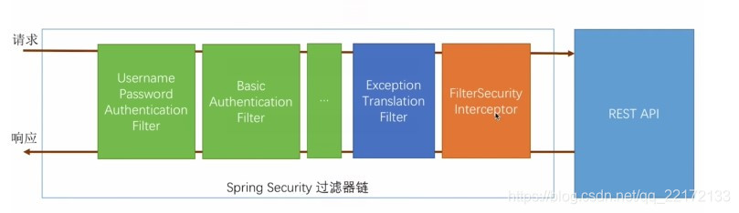
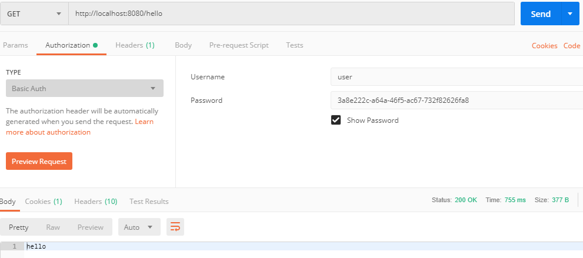

>Spring Security学习笔记
>
>2022/1/3 14:52:20 
>
>https://www.w3cschool.cn/springsecurity/cdz11ihv.html
>
>https://www.bookstack.cn/read/spring-security-tutorial/README.md

#序章 Spring Security概述
##0.1 Spring Security 简介

- Spring Security为基于 Java EE 的企业软件应用程序提供全面的安全服务。特别是使用 Spring Framework 构建的项目，可以更好的使用 Spring Security 来加快构建的速度。

- Spring Security 的出现有有很多原因，但主要是基于 Java EE 的 Servlet 规范或 EJB 规范的缺乏对企业应用的安全性方面的支持。而使用 Spring Security 克服了这些问题，并带来了数十个其他有用的可自定义的安全功能。

- Spring Security，这是一种基于 Spring AOP 和 Servlet 过滤器的安全框架。它提供全面的安全性解决方案，同时在 Web 请求级和方法调用级处理身份确认和授权

##0.2 两个主要领域

应用程序安全性的两个主要领域是：

1. 认证（authentication）：“认证”是建立主体 （principal）的过程。主体通常是指可以在您的应用程序中执行操作的用户、设备或其他系统；

1. 授权（authorization）：或称为“访问控制（access-control），“授权”是指决定是否允许主体在应用程序中执行操作。为了到达需要授权决定的点，认证过程已经建立了主体的身份。这些概念是常见的，并不是特定于 Spring Security。

##0.3 认证模型
在认证级别，Spring Security 支持各种各样的认证模型（其中加*是指由第三方提供，Spring Security 来集成）:

- HTTP BASIC 认证头（基于IETF RFC的标准）

- HTTP Digest 认证头（基于IETF RFC的标准）

- HTTP X.509 客户端证书交换（基于IETF RFC的标准）

- LDAP（一种非常常见的跨平台身份验证需求，特别是在大型环境中）

- 基于表单的身份验证（用于简单的用户界面需求）

- OpenID 身份验证

- 基于预先建立的请求头的验证（例如Computer Associates Siteminder）

- Jasig Central Authentication Service，也称为CAS，这是一个流行的开源单点登录系统

- 远程方法调用（RMI）和HttpInvoker（Spring远程协议）的透明认证上下文传播

- 自动“remember-me”身份验证（所以您可以勾选一个框，以避免在预定时间段内重新验证）

- 匿名身份验证（允许每个未经身份验证的调用，来自动承担特定的安全身份）

- Run-as 身份验证（如果一个调用应使用不同的安全身份继续运行，这是有用的）

- Java认证和授权服务（Java Authentication and Authorization Service，JAAS）

- Java EE 容器认证（因此，如果需要，仍然可以使用容器管理身份验证）

- Kerberos

- Java Open Source Single Sign-On（JOSSO）*

- OpenNMS Network Management Platform *

- AppFuse *

- AndroMDA *

- Mule ESB *

- Direct Web Request （DWR）*

- Grails *

- Tapestry *

- JTrac *

- Jasypt *

- Roller *

- Elastic Path *

- Atlassian人群*

- 自己创建的认证系统

不考虑认证机制，Spring Security提供了一组深入的授权功能。有三个主要领域：

1. 对 Web 请求进行授权

1. 授权某个方法是否可以被调用

1. 授权访问单个领域对象实例

##0.4 Spring Security 的安装

1. 使用 Maven 的最少依赖如下所示：

        <dependencies>
            ......
            <dependency>
                <groupId>org.springframework.security</groupId>
                <artifactId>spring-security-web</artifactId>
                <version>4.2.2.RELEASE</version>
            </dependency>
            <dependency>
                <groupId>org.springframework.security</groupId>
                <artifactId>spring-security-config</artifactId>
                <version>4.2.2.RELEASE</version>
            </dependency>
            ......
        </dependencies>

1. 使用 Gradle 的最少依赖如下所示：

        dependencies {
             ......
            compile 'org.springframework.security:spring-security-web:4.2.2.RELEASE'
            compile 'org.springframework.security:spring-security-config:4.2.2.RELEASE'
            ......
        }

##0.5 模块

自 Spring 3 开始，Spring Security 将代码划分到不同的 jar 中，这使得不同的功能模块和第三方依赖显得更加清晰。

###0.5.1 Core  spring-security-core.jar

包含核心的 authentication 和 authorization 的类和接口、远程支持和基础配置API。

任何使用 Spring Security 的应用都需要引入这个 jar。支持本地应用、远程客户端、方法级别的安全和 JDBC 用户配置。主要包含的顶级包为为：

- org.springframework.security.core：核心

- org.springframework.security.access：访问，即 authorization 的作用

- org.springframework.security.authentication：认证

- org.springframework.security.provisioning：配置

###0.5.2 Remoting  spring-security-remoting.jar

提供与 Spring Remoting 整合的支持，你并不需要这个除非你需要使用 Spring Remoting 写一个远程客户端。主包为： 

- org.springframework.security.remoting

###0.5.3 Web  spring-security-web.jar

包含 filter 和相关 Web安全的基础代码。如果我们需要使用 Spring Security 进行 Web 安全认证和基于URL的访问控制。主包为： 

- org.springframework.security.web

###0.5.4 Config  spring-security-config.jar

包含安全命名空间解析代码和 Java 配置代码。 如果您使用 Spring Security XML 命名空间进行配置或 Spring Security 的 Java 配置支持，则需要它。 主包为：

-  org.springframework.security.config。

我们不应该在代码中直接使用这个jar中的类。

###0.5.5 LDAP  spring-security-ldap.jar

LDAP 认证和配置代码。如果你需要进行 LDAP 认证或者管理 LDAP 用户实体。顶级包为： 

- org.springframework.security.ldap

###0.5.6 ACL  spring-security-acl.jar

特定领域对象的ACL(访问控制列表)实现。使用其可以对特定对象的实例进行一些安全配置。顶级包为： 

- org.springframework.security.acls

###0.5.7 CAS  spring-security-cas.jar

Spring Security CAS 客户端集成。如果你需要使用一个单点登录服务器进行 Spring Security Web 安全认证，需要引入。顶级包为： 

- org.springframework.security.cas

###0.5.8 OpenID - spring-security-openid.jar

OpenId Web 认证支持。基于一个外部 OpenId 服务器对用户进行验证。顶级包为： 

- org.springframework.security.openid

需要使用 OpenID4Java.

一般情况下，spring-security-core和spring-security-config都会引入，在 Web 开发中，我们通常还会引入spring-security-web。

###0.5.9 Test  spring-security-test.jar

用于测试 Spring Security。在开发环境中，我们通常需要添加该包

##0.6 源码

Spring Security 的源码托管于https://github.com/spring-projects/spring-security

----------
#第一章 Spring Security 入门
----------
##1.1 Spring Security简介

Spring Security是为基于Spring的应用程序提供声明式安全保护的安全性框架，它提供了完整的安全性解决方案，能够在web请求级别和方法调用级别处理身份证验证和授权。

因为基于Spring框架，所以Spring Security充分利用了依赖注入和面向切面的技术。

Spring Security主要是从两个方面解决安全性问题：

1. web请求级别：使用Servlet规范中的过滤器（Filter）保护Web请求并限制URL级别的访问。

1. 方法调用级别：使用Spring AOP保护方法调用，确保具有适当权限的用户才能访问安全保护的方法。

spring security 的核心功能主要包括：

1. 认证 （你是谁）

1. 授权 （你能干什么）

1. 攻击防护 （防止伪造身份）

其核心就是一组过滤器链，项目启动后将会自动配置。

最核心的就是 Basic Authentication Filter 用来认证用户的身份，一个在spring security中一种过滤器处理一种认证方式。

##1.2 开启Spring Security
###1.2.1 导入依赖

pom.xml 中的 Spring Security 依赖：
        
        <dependency>
            <groupId>org.springframework.boot</groupId>
            <artifactId>spring-boot-starter-security</artifactId>
        </dependency>

只要加入依赖，项目的所有接口都会被自动保护起来。

###1.2.2 创建Controller
创建一个TestController，对外提供一个/hello服务：

    @RestController
    public class TestController {
        @GetMapping("/hello")
        public String hello() {
            return "hello spring security";
        }
    } 

###1.2.3 新建App入口
    @SpringBootApplication
    public class App {
        public static void main(String[] args){
            SpringApplication.run(App.class,args);
        }
    }

###1.2.4 访问 /hello ，需要登录之后才能访问。

访问 /hello ，需要登录之后才能访问

当用户从浏览器发送请求访问 /hello 接口时，服务端会返回 302 响应码，让客户端重定向到 /login 页面，用户在 /login 页面登录，登陆成功之后，就会自动跳转到 /hello 接口。

另外，也可以使用 POSTMAN 来发送请求，使用 POSTMAN 发送请求时，可以将用户信息放在请求头中（这样可以避免重定向到登录页面）：

通过以上两种不同的登录方式，可以看出，Spring Security 支持两种不同的认证方式：

1. 可以通过 form 表单来认证

1. 可以通过 HttpBasic 来认证

###1.2.5 用户配置
默认情况下，登录的用户名是 user ，密码则是项目启动时随机生成的字符串，可以从启动的控制台日志中看到默认密码

这个随机生成的密码，每次启动时都会变。对登录的用户名/密码进行配置，有三种不同的方式：

1. 在 application.properties 中进行配置

1. 通过 Java 代码配置在内存中

1. 通过 Java 从数据库中加载

####1.2.5.1 配置文件配置用户名/密码
可以直接在 application.properties 文件中配置用户的基本信息：
    
    spring.security.user.name=javaboy
    spring.security.user.password=123

配置完成后，重启项目，就可以使用这里配置的用户名/密码登录了

####1.2.5.2  Java 配置用户名/密码

在 Java 代码中配置用户名密码，首先需要我们创建一个 Spring Security 的配置类，集成自 WebSecurityConfigurerAdapter 类，如下：

        @Configuration
        public class SecurityConfig extends WebSecurityConfigurerAdapter {
            @Override
            protected void configure(AuthenticationManagerBuilder auth) throws Exception {
                //下面这两行配置表示在内存中配置了两个用户
                auth.inMemoryAuthentication()
                        .withUser("javaboy").roles("admin").password("$2a$10$OR3VSksVAmCzc.7WeaRPR.t0wyCsIj24k0Bne8iKWV1o.V9wsP8Xe")
                        .and()
                        .withUser("lisi").roles("user").password("$2a$10$p1H8iWa8I4.CA.7Z8bwLjes91ZpY.rYREGHQEInNtAp4NzL6PLKxi");
            }
            @Bean
            PasswordEncoder passwordEncoder() {
                return new BCryptPasswordEncoder();
            }
        }

这里我们在 configure 方法中配置了两个用户，用户的密码都是加密之后的字符串(明文是 123)，从 Spring5 开始，强制要求密码要加密，如果非不想加密，可以使用一个过期的 PasswordEncoder 的实例 NoOpPasswordEncoder，但是不建议这么做，毕竟不安全。

Spring Security 中提供了 BCryptPasswordEncoder 密码编码工具，可以非常方便的实现密码的加密加盐，相同明文加密出来的结果总是不同，这样就不需要用户去额外保存盐的字段了，这一点比 Shiro 要方便很多。

